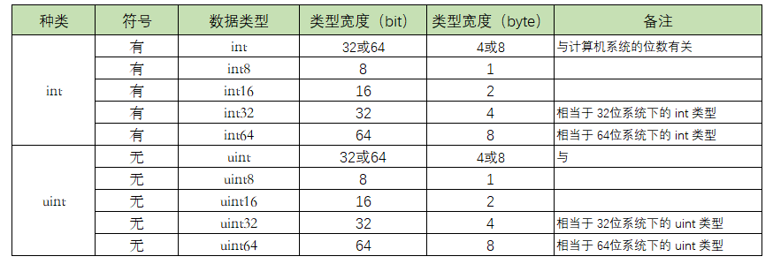
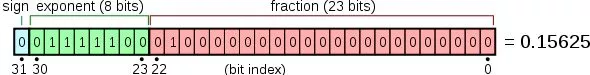
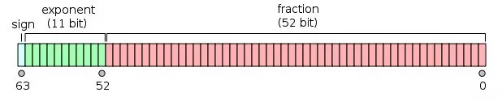

<!-- START doctoc generated TOC please keep comment here to allow auto update -->
<!-- DON'T EDIT THIS SECTION, INSTEAD RE-RUN doctoc TO UPDATE -->
**Table of Contents**  *generated with [DocToc](https://github.com/thlorenz/doctoc)*

- [GoLang极速入门](#golang%E6%9E%81%E9%80%9F%E5%85%A5%E9%97%A8)
  - [变量定义](#%E5%8F%98%E9%87%8F%E5%AE%9A%E4%B9%89)
    - [第一种 ：一行一个变量，静态语言最基本常用的方式](#%E7%AC%AC%E4%B8%80%E7%A7%8D-%E4%B8%80%E8%A1%8C%E4%B8%80%E4%B8%AA%E5%8F%98%E9%87%8F%E9%9D%99%E6%80%81%E8%AF%AD%E8%A8%80%E6%9C%80%E5%9F%BA%E6%9C%AC%E5%B8%B8%E7%94%A8%E7%9A%84%E6%96%B9%E5%BC%8F)
    - [第二种：多个变量一起声明，声明组](#%E7%AC%AC%E4%BA%8C%E7%A7%8D%E5%A4%9A%E4%B8%AA%E5%8F%98%E9%87%8F%E4%B8%80%E8%B5%B7%E5%A3%B0%E6%98%8E%E5%A3%B0%E6%98%8E%E7%BB%84)
    - [第三种：短声明，只能在函数内](#%E7%AC%AC%E4%B8%89%E7%A7%8D%E7%9F%AD%E5%A3%B0%E6%98%8E%E5%8F%AA%E8%83%BD%E5%9C%A8%E5%87%BD%E6%95%B0%E5%86%85)
    - [第四种：一行声明和初始化多个变量](#%E7%AC%AC%E5%9B%9B%E7%A7%8D%E4%B8%80%E8%A1%8C%E5%A3%B0%E6%98%8E%E5%92%8C%E5%88%9D%E5%A7%8B%E5%8C%96%E5%A4%9A%E4%B8%AA%E5%8F%98%E9%87%8F)
    - [第五种：通过 new 创建指针变量](#%E7%AC%AC%E4%BA%94%E7%A7%8D%E9%80%9A%E8%BF%87-new-%E5%88%9B%E5%BB%BA%E6%8C%87%E9%92%88%E5%8F%98%E9%87%8F)
    - [第六种：make 函数创建 slice、map 或 chan 类型变量](#%E7%AC%AC%E5%85%AD%E7%A7%8Dmake-%E5%87%BD%E6%95%B0%E5%88%9B%E5%BB%BA-slicemap-%E6%88%96-chan-%E7%B1%BB%E5%9E%8B%E5%8F%98%E9%87%8F)
  - [数据类型：整型与浮点型](#%E6%95%B0%E6%8D%AE%E7%B1%BB%E5%9E%8B%E6%95%B4%E5%9E%8B%E4%B8%8E%E6%B5%AE%E7%82%B9%E5%9E%8B)
    - [整型](#%E6%95%B4%E5%9E%8B)
    - [浮点型](#%E6%B5%AE%E7%82%B9%E5%9E%8B)
  - [数据类型：byte、rune与string](#%E6%95%B0%E6%8D%AE%E7%B1%BB%E5%9E%8Bbyterune%E4%B8%8Estring)
    - [byte 与 rune](#byte-%E4%B8%8E-rune)
    - [字符串](#%E5%AD%97%E7%AC%A6%E4%B8%B2)
  - [数据类型：数组与切片](#%E6%95%B0%E6%8D%AE%E7%B1%BB%E5%9E%8B%E6%95%B0%E7%BB%84%E4%B8%8E%E5%88%87%E7%89%87)
    - [数组](#%E6%95%B0%E7%BB%84)
    - [切片](#%E5%88%87%E7%89%87)
  - [数据类型：字典与布尔类型](#%E6%95%B0%E6%8D%AE%E7%B1%BB%E5%9E%8B%E5%AD%97%E5%85%B8%E4%B8%8E%E5%B8%83%E5%B0%94%E7%B1%BB%E5%9E%8B)
    - [字典](#%E5%AD%97%E5%85%B8)
    - [声明初始化字典](#%E5%A3%B0%E6%98%8E%E5%88%9D%E5%A7%8B%E5%8C%96%E5%AD%97%E5%85%B8)
    - [字典的相关操作](#%E5%AD%97%E5%85%B8%E7%9A%84%E7%9B%B8%E5%85%B3%E6%93%8D%E4%BD%9C)
      - [添加元素](#%E6%B7%BB%E5%8A%A0%E5%85%83%E7%B4%A0)
      - [更新元素](#%E6%9B%B4%E6%96%B0%E5%85%83%E7%B4%A0)
      - [读取元素](#%E8%AF%BB%E5%8F%96%E5%85%83%E7%B4%A0)
      - [删除元素](#%E5%88%A0%E9%99%A4%E5%85%83%E7%B4%A0)
      - [判断 `key` 是否存在](#%E5%88%A4%E6%96%AD-key-%E6%98%AF%E5%90%A6%E5%AD%98%E5%9C%A8)
      - [循环字典](#%E5%BE%AA%E7%8E%AF%E5%AD%97%E5%85%B8)
    - [布尔类型](#%E5%B8%83%E5%B0%94%E7%B1%BB%E5%9E%8B)
  - [数据类型：指针](#%E6%95%B0%E6%8D%AE%E7%B1%BB%E5%9E%8B%E6%8C%87%E9%92%88)
    - [什么是指针](#%E4%BB%80%E4%B9%88%E6%98%AF%E6%8C%87%E9%92%88)
    - [指针的创建](#%E6%8C%87%E9%92%88%E7%9A%84%E5%88%9B%E5%BB%BA)
    - [指针的类型](#%E6%8C%87%E9%92%88%E7%9A%84%E7%B1%BB%E5%9E%8B)
    - [指针的零值](#%E6%8C%87%E9%92%88%E7%9A%84%E9%9B%B6%E5%80%BC)
    - [指针与切片](#%E6%8C%87%E9%92%88%E4%B8%8E%E5%88%87%E7%89%87)

<!-- END doctoc generated TOC please keep comment here to allow auto update -->

# GoLang极速入门
## 变量定义

如果你是`Python`、`PHP` 或 `Ruby` 等动态语言开发者，也许会不太理解声明这个过程，在动态语言中，基本是直接拿来就用，也不用声明类型啥的。但 `Go` 语言是和 `C` 一样的静态类型语言，编译时会检查变量的类型，所以变量必须有具体的类型。

变量在使用前，需要先声明。声明会有类型或推导出类型，这就约定了该变量只能赋该类型的值。（接口是另外一种形式）

声明或定义一般有以下六种方法，其中前面两种也可用于常量，只要替换关键字 `var -> const` 即可。

### 第一种 ：一行一个变量，静态语言最基本常用的方式

```go
var <name> <type>
```

其中 `var` 是关键字（固定不变），`name` 是变量名，`type` 是类型。`Node/JS` 开发者，对于 `type` 外，其他应该挺熟悉的。

使用 `var` ，虽然只指定了类型，但是 `Go` 会所有类型都有默认值，比如 `string` 类型会初始化为空字符串，`int` 类型会初始化为 `0`，`float` 会初始化为 `0.0`，`bool` 会初始化为 `false`，引用和指针类型就初始化为 `nil` 等。

若要在声明时，顺便也初始化，可以这样写

```go
var name sting = "Go编程时光发布在Go语言中文网"
```

以上例子的完整代码如下（为了不写重复性的代码，后续不再贴完整代码，只贴关键代码）

```go
package main

import "fmt"

func main()  {
    var name string = "Go编程时光发布在Go语言中文网"
    fmt.Println(name)
}
```

从右值（等号右边的值，`rvalue`）来看，明显是个 `string` 类型。因此也可以将其简化为

```go
var name = "Go编程时光发布在Go语言中文网"
```

这叫做**类型推导**。

若你的右值带有小数点，在不指定类型的情况下，编译器会将你的这个变量声明为 `float64`。如果你不需要这么高的精度可以指定类型：

```go
var rate float32 0.89
```

### 第二种：多个变量一起声明，声明组

声明多个变量，除了可以按照上面写成多行之外，还可以写成下面这样

```go
var (
    name string
    age int
    gender string
)
```

### 第三种：短声明，只能在函数内

使用 `:=` （推导声明写法或短类型声明法：编译器会自动根据右值类型推断出左值的对应类型。），可以声明一个变量，并对其进行（显式）初始化。

```go
name := "Go编程时光发布在Go语言中文网"

// 等价于
var name string = "Go编程时光发布在Go语言中文网"

// 等价于
var name = "Go编程时光发布在Go语言中文网"
```

但这种方法有个限制就是，只能用于函数内部

### 第四种：一行声明和初始化多个变量

```go
name, age := "Go编程时光发布在Go语言中文网", 28
```

这种方法，也经常用于变量的交换。之前常见的面试题，如何不用中间变量交换两个整数变量，在 `Go` 中直接搞定。

```go
var a int = 100
var b int = 200
b, a = a, b
```

### 第五种：通过 new 创建指针变量

先简单介绍下指针的相关内容。

一般变量分为两种 普通变量 和 指针变量

普通变量，存放的是数据本身，而指针变量存放的是数据的地址。

如下代码，`age` 是一个普通变量，存放的内容是 `28`，而 `ptr` 是 存放变量 `age` 值的内存地址：`0xc000010098`

```go
package main

import "fmt"

func main()  {
    var age int = 28
    var ptr = &age  // &后面接变量名，表示取出该变量的内存地址
    fmt.Println("age: ", age)
    fmt.Println("ptr: ", ptr)
}

// age:  28
// ptr:  0xc000010098
```

而这里要说的 `new` 函数，是 `Go` 里的一个内建函数。

使用表达式 `new(Type)` 将创建一个 `Type` 类型的匿名变量，初始化为 `Type` 类型的零值，然后返回变量地址，返回的指针类型为 `*Type`。

```go
package main

import "fmt"

func main()  {
    ptr := new(int)
    fmt.Println("ptr address: ", ptr)
    fmt.Println("ptr value: ", *ptr)  // * 后面接指针变量，表示从内存地址中取出值
}

// ptr address:  0xc000010098
// ptr value:  0
```

用 `new` 创建变量和普通变量声明语句方式创建变量没有什么区别，除了不需要声明一个临时变量的名字外，我们还可以在表达式中使用 `new(Type)` 。换言之，`new` 函数类似是一种语法糖，而不是一个新的基础概念。

如下两种写法，可以说是等价的

```go
// 使用 new
func newInt() *int {
    return new(int)
}

// 使用传统的方式
func newInt() *int {
    var dummy int
    return &dummy
}
```

### 第六种：make 函数创建 slice、map 或 chan 类型变量

```go
var slice = make([]int, 8)
var m = make(map[string]int)
var c = make(chan int)
```

`slice`、`map` 和 `chan` 是 `Go` 中的引用类型，它们的创建和初始化，一般使用 `make`。特别的，`chan` 只能用 `make`。`slice` 和 `map` 还可以简单的方式：

```go
slice := []int{0, 0}
m := map[string]int{}
```


以上不管哪种方法，变量/常量都只能声明一次，声明多次，编译就会报错。

但也有例外，这就要说到一个特殊变量：匿名变量，也称作占位符，或者空白标识符，用下划线表示。

匿名变量，优点有三：

- 不分配内存，不占用内存空间

- 不需要你为命名无用的变量名而纠结

- 多次声明不会有任何问题

通常我们用匿名接收 必须接收，但是又不会用到的值，可以理解为垃圾桶。

```go
func GetData() (int, int) {
    return 100, 200
}
func main(){
    a, _ := GetData()
    _, b := GetData()
    fmt.Println(a, b)
}
```

## 数据类型：整型与浮点型

###  整型

`Go` 语言中，整数类型可以再细分成 `10` 个类型，为了方便大家学习，我将这些类型整理成一张表格。



`int` 和 `uint` 的区别就在于一个 `u`，有 `u` 说明是无符号，没有 `u` 代表有符号。

解释这个符号的区别

以 `int8` 和 `uint8` 举例，`8` 代表 `8` 个`bit`，能表示的数值个数有 `2^8 = 256`。

`uint8` 是无符号，能表示的都是正数，`0-255`，刚好 `256` 个数。

`int8` 是有符号，既可以正数，也可以负数，那怎么办？对半分呗，`-128-127`，也刚好 `256` 个数。

`int8` `int16` `int32` `int64` 这几个类型的最后都有一个数值，这表明了它们能表示的数值个数是固定的。

而 `int` 没有并没有指定它的位数，说明它的大小，是可以变化的，那根据什么变化呢？

当你在32位的系统下，`int` 和 `uint` 都占用4个字节，也就是32位。

若你在64位的系统下，`int` 和 `uint` 都占用8个字节，也就是64位。

出于这个原因，在某些场景下，你应当避免使用 `int` 和 `uint` ，而使用更加精确的 `int32` 和 `int64`，比如在二进制传输、读写文件的结构描述（为了保持文件的结构不会受到不同编译目标平台字节长度的影响）

不同进制的表示方法

出于习惯，在初始化数据类型为整形的变量时，我们会使用10进制的表示法，因为它最直观，比如这样，表示整数10.

```go
var num int = 10
```

不过，你要清楚，你一样可以使用其他进制来表示一个整数，这里以比较常用的2进制、8进制和16进制举例。

2进制：以 `0b` 或 `0B` 为前缀

```go
var num01 int = 0b1100
```

8进制：以 `0o` 或者 `0O` 为前缀

```go
var num02 int = 0o14
```

16进制：以 `0x` 为前缀

```go
var num03 int = 0xC
```

下面用一段代码分别使用二进制、8进制、16进制来表示 10 进制的数值：12

```go
package main

import (
    "fmt"
)

func main() {
    var num01 int = 0b1100
    var num02 int = 0o14
    var num03 int = 0xC

    fmt.Printf("2进制数 %b 表示的是: %d \n", num01, num01)
    fmt.Printf("8进制数 %o 表示的是: %d \n", num02, num02)
    fmt.Printf("16进制数 %X 表示的是: %d \n", num03, num03)
}

// 2进制数 1100 表示的是: 12 
// 8进制数 14 表示的是: 12 
// 16进制数 C 表示的是: 12 
```

以上代码用过了 `fmt` 包的格式化功能，你可以参考这里去看上面的代码

- `%b`    表示为二进制
- `%c`    该值对应的 `unicode` 码值
- `%d`    表示为十进制
- `%o`    表示为八进制
- `%q`    该值对应的单引号括起来的 `go` 语法字符字面值，必要时会采用安全的转义表示
- `%x`    表示为十六进制，使用 `a`- `f`
- `%X`    表示为十六进制，使用 `A` - `F`
- `%U`    表示为 `Unicode` 格式：U+1234，等价于"U+%04X"

### 浮点型

浮点数类型的值一般由整数部分、小数点“.”和小数部分组成。

其中，整数部分和小数部分均由10进制表示法表示。不过还有另一种表示方法。那就是在其中加入指数部分。指数部分由“E”或“e”以及一个带正负号的10进制数组成。比如，3.7E-2表示浮点数0.037。又比如，3.7E+1表示浮点数37。

有时候，浮点数类型值的表示也可以被简化。比如，37.0可以被简化为37。又比如，0.037可以被简化为.037。

有一点需要注意，在 `Go` 语言里，浮点数的相关部分只能由10进制表示法表示，而不能由8进制表示法或16进制表示法表示。比如，03.7表示的一定是浮点数3.7。

`Go`语言中提供了两种精度的浮点数 `float32` 和 `float64`。

`float32`，也即我们常说的单精度，存储占用4个字节，也即4*8=32位，其中1位用来符号，8位用来指数，剩下的23位表示尾数



`float64`，也即我们熟悉的双精度，存储占用8个字节，也即8*8=64位，其中1位用来符号，11位用来指数，剩下的52位表示尾数



那么精度是什么意思？有效位有多少位？

精度主要取决于尾数部分的位数。

对于 `float32`（单精度）来说，表示尾数的为23位，除去全部为0的情况以外，最小为2^-23，约等于1.19*10^-7，所以float小数部分只能精确到后面6位，加上小数点前的一位，即有效数字为7位。

同理 `float64`（单精度）的尾数部分为 52位，最小为2^-52，约为2.22*10^-16，所以精确到小数点后15位，加上小数点前的一位，有效位数为16位。

通过以上，可以总结出以下几点：

1. `float32` 和 `float64` 可以表示的数值很多

浮点数类型的取值范围可以从很微小到很巨大。浮点数取值范围的极限值可以在 `math` 包中找到：

常量 `math.MaxFloat32` 表示 `float32` 能取到的最大数值，大约是 3.4e38；

常量 `math.MaxFloat64` 表示 `float64` 能取到的最大数值，大约是 1.8e308；

`float32` 和 `float64` 能表示的最小值分别为 1.4e-45 和 4.9e-324。

2. 数值很大但精度有限

人家虽然能表示的数值很大，但精度位却没有那么大。

`float32` 的精度只能提供大约6个十进制数（表示后科学计数法后，小数点后6位）的精度

`float64` 的精度能提供大约15个十进制数（表示后科学计数法后，小数点后15位）的精度

这里的精度是什么意思呢？

比如 10000018这个数，用 `float32` 的类型来表示的话，由于其有效位是7位，将10000018 表示成科学计数法，就是 1.0000018 * 10^7，能精确到小数点后面6位。

此时用科学计数法表示后，小数点后有7位，刚刚满足我们的精度要求，意思是什么呢？此时你对这个数进行+1或者-1等数学运算，都能保证计算结果是精确的

```go
package main

import "fmt"

var myfloat float32 = 10000018

func main()  {
    fmt.Println("myfloat: ", myfloat)
    fmt.Println("myfloat: ", myfloat+1)
}

// myfloat:  1.0000018e+07
// myfloat:  1.0000019e+07
```

上面举了一个刚好满足精度要求数据的临界情况，为了做对比，下面也举一个刚好不满足精度要求的例子。只要给这个数值多加一位数就行了。

换成 100000187，同样使用 `float32`类型，表示成科学计数法，由于精度有限，表示的时候小数点后面7位是准确的，但若是对其进行数学运算，由于第八位无法表示，所以运算后第七位的值，就会变得不精确。

这里我们写个代码来验证一下，按照我们的理解下面 `myfloat01 = 100000182` ，对其+5 操作后，应该等于 `myfloat02 = 100000187`，

```go
import "fmt"

var myfloat01 float32 = 100000182
var myfloat02 float32 = 100000187

func main() {
    fmt.Println("myfloat: ", myfloat01)
    fmt.Println("myfloat: ", myfloat01+5)
    fmt.Println(myfloat02 == myfloat01+5)
}
```

但是由于其类型是 `float32`，精度不足，导致最后比较的结果是不相等（从小数点后第七位开始不精确）

```go
// myfloat:  1.00000184e+08
// myfloat:  1.0000019e+08
// false
```

由于精度的问题，就会出现这种很怪异的现象，`myfloat == myfloat +1` 会返回 `true` 。

## 数据类型：byte、rune与string

### byte 与 rune

`byte`，占用1个节字，就 8 个比特位，所以它和 `uint8` 类型本质上没有区别，它表示的是 `ACSII` 表中的一个字符。

如下这段代码，分别定义了 `byte` 类型和 `uint8` 类型的变量 `a` 和 `b`

```go
import "fmt"

func main() {
    var a byte = 65 
    // 8进制写法: var c byte = '\101'     其中 \ 是固定前缀
    // 16进制写法: var c byte = '\x41'    其中 \x 是固定前缀

    var b uint8 = 66
    fmt.Printf("a 的值: %c \nb 的值: %c", a, b)
    // 或者使用 string 函数
    // fmt.Println("a 的值: ", string(a)," \nb 的值: ", string(b))
}
```

在 `ASCII` 表中，由于字母 `A` 的 `ASCII` 的编号为 65 ，字母 `B` 的 `ASCII` 编号为 66，所以上面的代码也可以写成这样

```go
import "fmt"

func main() {
    var a byte = 'A'
    var b uint8 = 'B'
    fmt.Printf("a 的值: %c \nb 的值: %c", a, b)
}
```

他们的输出结果都是一样的。

`rune`，占用4个字节，共32位比特位，所以它和 `uint32` 本质上也没有区别。它表示的是一个 `Unicode` 字符（`Unicode` 是一个可以表示世界范围内的绝大部分字符的编码规范）。

```go
import (
    "fmt"
    "unsafe"
)

func main() {
    var a byte = 'A'
    var b rune = 'B'
    fmt.Printf("a 占用 %d 个字节数\nb 占用 %d 个字节数", unsafe.Sizeof(a), unsafe.Sizeof(b))
}

// a 占用 1 个字节数
// b 占用 4 个字节数
```

由于 `byte` 类型能表示的值是有限，只有 2^8=256 个。所以如果你想表示中文的话，你只能使用 `rune` 类型。

```go
var name rune = '中'
```

或许你已经发现，上面我们在定义字符时，不管是 `byte` 还是 `rune` ，我都是使用单引号，而没使用双引号。

对于从 `Python` 转过来的人，这里一定要注意了，在 `Go` 中单引号与双引号并不是等价的。

单引号用来表示字符，在上面的例子里，如果你使用双引号，就意味着你要定义一个字符串，赋值时与前面声明的前面会不一致，这样在编译的时候就会出错。

```bash
cannot use "A" (type string) as type byte in assignment
```

上面我说了，`byte` 和 `uint8` 没有区别，`rune` 和 `uint32` 没有区别，那为什么还要多出 `byte` 和 `rune` 类型呢？多乱呀。

理由很简单，因为 `uint8` 和 `uint32` ，直观上让人以为这是一个数值，但是实际上，它也可以表示一个字符，所以为了消除这种直观错觉，就诞生了 `byte` 和 `rune` 这两个别名类型。

### 字符串

字符串，可以说是大家很熟悉的数据类型之一。定义方法很简单

```go
var mystr string = "hello"
```

上面说的 `byte` 和 `rune` 都是字符类型，若多个字符放在一起，就组成了字符串，也就是这里要说的 `string` 类型。

比如 `hello` ，对照 `ASCII` 编码表，每个字母对应的编号是：104,101,108,108,111

```go
import (
    "fmt"
)

func main() {
    var mystr01 sting = "hello"
    var mystr02 [5]byte = [5]byte{104, 101, 108, 108, 111}
    fmt.Printf("mystr01: %s\n", mystr01)
    fmt.Printf("mystr02: %s", mystr02)
}
```

输出如下，`mystr01` 和 `mystr02` 输出一样，说明了 `string` 的本质，其实是一个 `byte` 数组

```go
// mystr01: hello
// mystr02: hello
```

通过以上学习，我们知道字符分为 `byte` 和 `rune`，占用的大小不同。

这里来考一下大家，hello,中国 占用几个字节？

要回答这个问题，你得知道 `Go` 语言的 `string` 是用 `uft-8` 进行编码的，英文字母占用一个字节，而中文字母占用3个字节，所以 hello,中国 的长度为 5+1+（3＊2)= 12个字节。

```go
import (
    "fmt"
)

func main() {
    var country string = "hello,中国"
    fmt.Println(len(country))
}
// 输出 12
```

## 数据类型：数组与切片

### 数组

数组是一个由固定长度的特定类型元素组成的序列，一个数组可以由零个或多个元素组成。因为数组的长度是固定的，所以在 `Go` 语言中很少直接使用数组。

声明数组，并给该数组里的每个元素赋值（索引值的最小有效值和其他大多数语言一样是 0，不是1）

```go
// [3] 里的3 表示该数组的元素个数 
var arr [3]int
arr[0] = 1
arr[1] = 2
arr[2] = 3
```

声明并直接初始化数组

```go
// 第一种方法
var arr [3]int = [3]int{1,2,3}

// 第二种方法
arr := [3]int{1,2,3}
```

上面的 3 表示数组的元素个数 ，万一你哪天想往该数组中增加元素，你得对应修改这个数字，为了避免这种硬编码，你可以这样写，使用 `...` 让 `Go` 语言自己根据实际情况来分配空间。

```go
arr := [...]int{1,2,3}
```

`[3]int` 和 `[4]int` 虽然都是数组，但他们却是不同的类型，使用 `fmt` 的 `%T` 可以查得，如果使用 `==` 来比较，答案会是 `false`

```go
import (
    "fmt"
)

func main() {
    arr01 := [...]int{1, 2, 3}
    arr02 := [...]int{1, 2, 3, 4}
    fmt.Printf("%d 的类型是: %T\n", arr01, arr01)
    fmt.Printf("%d 的类型是: %T", arr02, arr02)
}

// [1 2 3] 的类型是: [3]int
// [1 2 3 4] 的类型是: [4]int
```

如果你觉得每次写 `[3]int` 有点麻烦，你可以为 `[3]int` 定义一个类型字面量，也就是别名类型。

使用 `type` 关键字可以定义一个类型字面量，后面只要你想定义一个容器大小为3，元素类型为 `int` 的数组 ，都可以使用这个别名类型。

```go
import (
    "fmt"
)

func main() {
    type arr3 [3]int

    myarr := arr3{1,2,3}
    fmt.Printf("%d 的类型是: %T", myarr, myarr)
}

// [1 2 3] 的类型是: main.arr3
```

### 切片

切片（`Slice`）与数组一样，也是可以容纳若干类型相同的元素的容器。与数组不同的是，无法通过切片类型来确定其值的长度。每个切片值都会将数组作为其底层数据结构。我们也把这样的数组称为切片的底层数组。

切片是对数组的一个连续片段的引用，所以切片是一个引用类型，这个片段可以是整个数组，也可以是由起始和终止索引标识的一些项的子集，需要注意的是，终止索引标识的项不包括在切片内（意思是这是个左闭右开的区间）

```go
import (
    "fmt"
)

func main() {
    myarr := [...]int{1, 2, 3}
    fmt.Printf("%d 的类型是: %T", myarr[0:2], myarr[0:2])
}

// [1 2] 的类型是: []int
```

切片的构造，有三种方式

1、对数组进行片段截取（上面例子已经展示：`myarr[0:2]`，0是索引起始值，2是索引终止值，区间左闭右开）

从头声明赋值（例子如下）

```go
// 声明字符串切片
var strList []string

// 声明整型切片
var numList []int

// 声明一个空切片
var numListEmpty = []int{}
```

2、使用 `make` 函数构造，`make` 函数的格式：`make( []Type, size, cap )`

这个函数刚好指出了，一个切片具备的三个属性：类型（`Type`），长度（`size`），容量（`cap`）

```go
import (
   "fmt"
)

func main() {
   a := make([]int, 2)
   b := make([]int, 2, 10)
   fmt.Println(a, b)
   fmt.Println(len(a), len(b))
   fmt.Println(cap(a), cap(b))
}

// [0 0] [0 0]
// 2 2
// 2 10
```

由于切片是引用类型，所以你不对它进行赋值的话，它的零值（默认值）是 `nil`

```go
var myarr []int
fmt.Println(myarr == nil)
// true
```

数组与切片有相同点，它们都是可以容纳若干类型相同的元素的容器

也有不同点，数组的容器大小固定，而切片本身是引用类型，它更像是 `Python` 中的 `list` ，我们可以对它 `append` 进行元素的添加。

```go
import (
    "fmt"
)

func main() {
    myarr := []int{1}
    // 追加一个元素
    myarr = append(myarr, 2)
    // 追加多个元素
    myarr = append(myarr, 3, 4)
    // 追加一个切片, ... 表示解包，不能省略
    myarr = append(myarr, []int{7, 8}...)
    // 在第一个位置插入元素
    myarr = append([]int{0}, myarr...)
    // 在中间插入一个切片(两个元素)
    myarr = append(myarr[:5], append([]int{5,6}, myarr[5:]...)...)
    fmt.Println(myarr)
}

// [0 1 2 3 4 5 6 7 8]
```

## 数据类型：字典与布尔类型

### 字典

字典（`Map` 类型），是由若干个 `key:value` 这样的键值对映射组合在一起的数据结构。

它是哈希表的一个实现，这就要求它的每个映射里的`key`，都是唯一的，可以使用 `==` 和 `!=` 来进行判等操作，换句话说就是 `key` 必须是可哈希的。

什么叫可哈希的？简单来说，一个不可变对象，都可以用一个哈希值来唯一表示，这样的不可变对象，比如字符串类型的对象（可以说除了切片、 字典，函数之外的其他内建类型都算）。

意思就是，你的 `key` 不能是切片，不能是字典，不能是函数。

字典由 `key` 和 `value` 组成，它们各自有各自的类型。

在声明字典时，必须指定好你的 `key` 和 `value` 是什么类型的，然后使用 `map` 关键字来告诉 `Go` 这是一个字典。

```go
map[KEY_TYPE]VALUE_TYPE
```

### 声明初始化字典

三种声明并初始化字典的方法

```go
// 第一种方法
var scores map[string]int = map[string]int{"english": 80, "chinese": 85}

// 第二种方法
scores := map[string]int{"english": 80, "chinese": 85}

// 第三种方法
scores := make(map[string]int)

// scores["english"] = 80
// scores["chinese"] = 85
```

要注意的是，第一种方法如果拆分成多步（声明、初始化、再赋值），和其他两种有很大的不一样了，相对会比较麻烦（具体请看注释）。

```go
import "fmt"

func main() {
    // 声明一个名为 score 的字典
    var scores map[string]int

    // 未初始化的 score 的零值为nil，无法直接进行赋值
    if scores == nil {
        // 需要使用 make 函数先对其初始化
        scores = make(map[string]int)
    }

    // 经过初始化后，就可以直接赋值
    scores["chinese"] = 90
    fmt.Println(scores)
}
```

### 字典的相关操作

#### 添加元素

```go
scores["math"] = 95
```

#### 更新元素

若 `key` 已存在，则直接更新 `value`

```go
scores["math"] = 100
```

#### 读取元素

直接使用 `[key]` 即可 ，如果 `key` 不存在，也不报错，会返回其 `value-type` 的零值。

```go
fmt.Println(scores["math"])
```

#### 删除元素

使用 `delete` 函数，如果 `key` 不存在，`delete` 函数会静默处理，不会报错。

```go
delete(scores, "math")
```

当访问一个不存在的 `key` 时，并不会直接报错，而是会返回这个 `value` 的零值，如果 `value` 的类型是 `int`，就返回0。

```go
package main

import "fmt"

func main() {
    scores := make(map[string]int)
    fmt.Println(scores["english"]) // 输出 0
}
```

#### 判断 `key` 是否存在

当 `key` 不存在，会返回 `value-type` 的零值 ，所以你不能通过返回的结果是否是零值来判断对应的 `key` 是否存在，因为 `key` 对应的 `value` 值可能恰好就是零值。

其实字典的下标读取可以返回两个值，使用第二个返回值都表示对应的 `key` 是否存在，若存在 `ok` 为 `true`，若不存在，则 `ok` 为 `false`

```go
import "fmt"

func main() {
    scores := map[string]int{"english": 80, "chinese": 85}
    math, ok := scores["math"]
    if ok {
        fmt.Printf("math 的值是: %d", math)
    } else {
        fmt.Println("math 不存在")
    }
}
```

我们将上面的代码再优化一下

```go
import "fmt"

func main() {
    scores := map[string]int{"english": 80, "chinese": 85}
    if math, ok := scores["math"]; ok {
        fmt.Printf("math 的值是: %d", math)
    } else {
        fmt.Println("math 不存在")
    }
}
```

#### 循环字典

`Go` 语言中没有提供类似 `Python` 的  `keys()` 和 `values()` 这样方便的函数，想要获取，你得自己循环。

循环还分三种

- 获取 `key` 和 `value`

```go
import "fmt"

func main() {
    scores := map[string]int{"english": 80, "chinese": 85}

    for subject, score := range scores {
        fmt.Printf("key: %s, value: %d\n", subject, scores)
    }
}
```

- 只获取 `key`，这里注意不用占用符。

```go
import "fmt"

func main() {
    scores := map[string]int{"english": 80, "chinese": 85}

    for subject := range scores {
        fmt.Printf("key: %s\n", subject)
    }
}
```

- 只获取 `value`，用一个占位符替代。

```go
import "fmt"

func main() {
    scores := map[string]int{"english": 80, "chinese": 85}

    for _, score := range scores {
        fmt.Printf("value: %d\n", score)
    }
}
```

### 布尔类型

关于布尔值，无非就两个值：`true` 和 `false`。只是这两个值，在不同的语言里可能不同。

在 `Go` 中，真值用 `true` 表示，不但不与 1 相等，并且更加严格，不同类型无法进行比较，而假值用 `false` 表示，同样与 0 无法比较。

`Go` 中确实不如 `Python` 那样灵活，`bool` 与 `int` 不能直接转换，如果要转换，需要你自己实现函数。

`bool` 转 `int`

```go
func bool2int(b bool) int {
    if b {
        return 1
    }
    return 0
}
```

`int` 转 `bool`

```go
func int2bool(i int) bool { 
    return i != 0 
}
```

在 `Go` 中使用 `!` 符号取反值

```go
import "fmt"

var male bool = true
func main()  {
    fmt.Println( !male == false)
    // 或者
    fmt.Println( male != false)
}

// output: true
```

在 `Go` 语言中，则使用 `&&` 表示且，用 `||` 表示或，并且有短路行为（即左边表达式已经可以确认整个表达式的值，那么右边将不会再被求值。

```go
import "fmt"

var age int = 15
var gender string = "male"
func main()  {
    //  && 两边的表达式都会执行
    fmt.Println( age > 18 && gender == "male")
    // gender == "male" 并不会执行
    fmt.Println( age > 18 || gender == "male")
}

// output: false
// output: true
```

## 数据类型：指针

### 什么是指针

当我们定义一个变量 `name`

```go
var name string = "Go编程时光"
```

此时，`name` 是变量名，它只是编程语言中方便程序员编写和理解代码的一个标签。

当我们访问这个标签时，机算机会返回给我们它指向的内存地址里存储的值：`Go编程时光`。

出于某些需要，我们会将这个内存地址赋值给另一个变量名，通常叫做 `ptr`（`pointer` 的简写），而这个变量，我们称之为指针变量。

换句话说，指针变量（一个标签）的值是指针，也就是内存地址。

根据变量指向的值，是否是内存地址，我把变量分为两种：

- 普通变量：存数据值本身

- 指针变量：存值的内存地址

### 指针的创建

指针创建有三种方法

- 第一种方法: 先定义对应的变量，再通过变量取得内存地址，创建指针

```go
// 定义普通变量
aint := 1
// 定义指针变量
ptr := &aint
```

- 第二种方法: 先创建指针，分配好内存后，再给指针指向的内存地址写入对应的值。

```go
// 创建指针
astr := new(string)
// 给指针赋值
*astr = "Go编程时光"
```

- 第三种方法: 先声明一个指针变量，再从其他变量取得内存地址赋值给它

```go
aint := 1
var bint *int  // 声明一个指针
bint = &aint   // 初始化
```

上面的三段代码中，指针的操作都离不开这两个符号：

`&` ：从一个普通变量中取得内存地址

`*` ：当 `*` 在赋值操作值的右边，是从一个指针变量中取得变量值，当 `*` 在赋值操作值的左边，是指该指针指向的变量

通过下面这段代码，你可以熟悉这两个符号的用法

```go
package main

import "fmt"

func main() {
    aint := 1     // 定义普通变量
    ptr := &aint  // 定义指针变量
    fmt.Println("普通变量存储的是：", aint)
    fmt.Println("普通变量存储的是：", *ptr)
    fmt.Println("指针变量存储的是：", &aint)
    fmt.Println("指针变量存储的是：", ptr)
}

// 普通变量存储的是：1
// 普通变量存储的是：1
// 指针变量存储的是： 0xc0000100a0
// 指针变量存储的是： 0xc0000100a0
```

要想打印指针指向的内存地址，方法有两种

```go
// 第一种
fmt.Printf("%p", ptr)

// 第二种
fmt.Println(ptr)
```

### 指针的类型

我们知道字符串的类型是 `string`，整型是 `int`，那么指针如何表示呢？

写段代码试验一下就知道了

```go
package main

import "fmt"

func main() {
    astr := "hello"
    aint := 1
    abool := false
    arune := 'a'
    afloat := 1.2

    fmt.Printf("astr 指针类型是：%T\n", &astr)
    fmt.Printf("aint 指针类型是：%T\n", &aint)
    fmt.Printf("abool 指针类型是：%T\n", &abool)
    fmt.Printf("arune 指针类型是：%T\n", &arune)
    fmt.Printf("afloat 指针类型是：%T\n", &afloat)
}

// astr 指针类型是：*string
// aint 指针类型是：*int
// abool 指针类型是：*bool
// arune 指针类型是：*int32
// afloat 指针类型是：*float64
```
可以发现用 `*+` 所指向变量值的数据类型，就是对应的指针类型。

所以若我们定义一个只接收指针类型的参数的函数，可以这么写

```go
func mytest(ptr *int)  {
    fmt.Println(*ptr)
}
```

### 指针的零值

当指针声明后，没有进行初始化，其零值是 `nil`。

```go
func main() {  
    a := 25
    var b *int  // 声明一个指针

    if b == nil {
        fmt.Println(b)
        b = &a  // 初始化：将a的内存地址给b
        fmt.Println(b)
    }
}

// <nil>
// 0xc0000100a0
```

### 指针与切片

切片与指针一样，都是引用类型。

如果我们想通过一个函数改变一个数组的值，有两种方法

- 将这个数组的切片做为参数传给函数

- 将这个数组的指针做为参数传给函数

尽管二者都可以实现我们的目的，但是按照 `Go` 语言的使用习惯，建议使用第一种方法，因为第一种方法，写出来的代码会更加简洁，易读。具体你可以参数下面两种方法的代码实现

```go
// 使用切片
func modify(sls []int) {  
    sls[0] = 90
}

func main() {  
    a := [3]int{89, 90, 91}
    modify(a[:])
    fmt.Println(a)
}
```

```go
// 使用指针
func modify(arr *[3]int) {  
    (*arr)[0] = 90
}

func main() {  
    a := [3]int{89, 90, 91}
    modify(&a)
    fmt.Println(a)
}
```