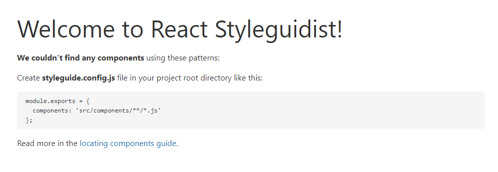

<!-- START doctoc generated TOC please keep comment here to allow auto update -->
<!-- DON'T EDIT THIS SECTION, INSTEAD RE-RUN doctoc TO UPDATE -->
**Table of Contents**  *generated with [DocToc](https://github.com/thlorenz/doctoc)*

- [使用 React 构建自己的代码库](#%E4%BD%BF%E7%94%A8-react-%E6%9E%84%E5%BB%BA%E8%87%AA%E5%B7%B1%E7%9A%84%E4%BB%A3%E7%A0%81%E5%BA%93)
  - [建立本地开发项目](#%E5%BB%BA%E7%AB%8B%E6%9C%AC%E5%9C%B0%E5%BC%80%E5%8F%91%E9%A1%B9%E7%9B%AE)
    - [准备](#%E5%87%86%E5%A4%87)
    - [使用 Styleguidist](#%E4%BD%BF%E7%94%A8-styleguidist)
  - [对代码库进行测试](#%E5%AF%B9%E4%BB%A3%E7%A0%81%E5%BA%93%E8%BF%9B%E8%A1%8C%E6%B5%8B%E8%AF%95)
  - [发布到 NPM](#%E5%8F%91%E5%B8%83%E5%88%B0-npm)
  - [自动部署与文档](#%E8%87%AA%E5%8A%A8%E9%83%A8%E7%BD%B2%E4%B8%8E%E6%96%87%E6%A1%A3)

<!-- END doctoc generated TOC please keep comment here to allow auto update -->

# 使用 React 构建自己的代码库

> 使用React进行开发，我们时常会希望把公共的组件分离出来（与项目分离）,并实现该组件在其他项目中进行复用，类似于 Ant Design 这样的UI组件库

我们将使用到以下工具和三方库：

- `React`和`Emotion` 用于基础组件创建和样式定义
- `Styleguidist` 用于实时开发和生成文档
- `Jest`和`React Testing` 用于测试
- `Rollup`和`Babel` 用于发布到 `NPM`
- `Travis CI` 用于部署

## 建立本地开发项目

### 准备

首先我们应该先创建项目目录并初始化

```bash
mkdir react-components-library && cd react-components-library
npm init -y
```

组件库依赖了 `React` 和 `Emotion`，所以我们要安装它们并添加为 `peerDependencies`，`peerDependencies` 就是将该项目的依赖列为公共依赖，也就是这部分声明的库会被安装到 `node_moudules` 中

接着我们来安装这些核心的依赖

```bash
npm install --save-dev react react-dom @emotion/core @emotion/styled
```

我们需要手动来更新 `package.json`，它应该像下面的示例这样：

```json
{
  "name": "react-componnets-library",
  "version": "1.0.0",
  "description": "",
  "main": "index.js",
  "scripts": {
    "test": "echo \"Error: no test specified\" && exit 1"
  },
  "keywords": [],
  "author": "",
  "license": "ISC",
  "peerDependencies": {
    "@emotion/core": "10.x",
    "@emotion/styled": "10.x",
    "react": "^16.x",
    "react-dom": "^16.x"
  },
  "devDependencies": {
    "@emotion/core": "^10.0.28",
    "@emotion/styled": "^10.0.27",
    "react": "^16.13.1",
    "react-dom": "^16.13.1"
  }
}
```

### 使用 Styleguidist

添加 `Styleguidist`，它可以在我们开发时提供实时预览的功能

```bash
npm install --save-dev react-styleguidist webpack
```

同时，我们还需要安装 `Babel` 的一些核心包，来让 `Styleguidist` 工作，并为 `Babel` 和 `Styleguidist` 创建配置文件

运行下面的命令安装 `Babel` 所需要的软件包

```bash
npm install --save-dev babel-loader @babel/core @babel/preset-env @babel/preset-react
```

接下来在项目根目录下添加 `.babelrc` 配置文件，

```json
{
    "presets": ["@babel/preset-env", "@babel/preset-react"]
}
```

最后我们创建 `Styleguidist` 的配置文件，它看上去像 `Webpack` 的一个配置实例，以便使我们的 `Babel` 配置正确加载组件

创建 `styleguide.config.js`

```js
module.exports = {
  webpackConfig: {
    module: {
      rules: [
        {
          test: /\.jsx?$/,
          exclude: /node_modules/,
          loader: "babel-loader"
        }
      ]
    }
  }
}
```

现在准备启动实时开发服务器！

将 ”start”: “styleguidist server” 脚本添加到 `package.json` 并运行 `npm start`。

输入`http://localhost:6060`，您应该会看到类似以下内容的信息：



## 对代码库进行测试

## 发布到 NPM

## 自动部署与文档