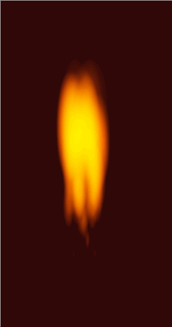

## 使用CSS实现火焰效果

效果：



源码如下：

```html
<!DOCTYPE html>
<html lang="en">
  <head>
    <meta charset="UTF-8" />
    <meta name="viewport" content="width=device-width, initial-scale=1.0" />
    <title>Document</title>
    <style>
      body {
        background-color: #300808;
        margin: 0;
      }

      .fire {
        font-size: 4px;
        filter: blur(0.02em);
        -webkit-filter: blur(0.02em);
        margin: 3em auto 0 auto;
        position: relative;
        width: 7em;
        height: 12em;
      }

      .particle {
        animation: rise 1s ease-in infinite;
        background-image: radial-gradient(#ff5000 20%, rgba(255, 80, 0, 0) 70%);
        border-radius: 50%;
        mix-blend-mode: screen;
        opacity: 0;
        position: absolute;
        bottom: 0;
        width: 2em;
        height: 8em;
      }

      .particle:nth-of-type(1) {
        animation-delay: 0.7208096856s;
        left: calc((100% - 5em) * 0);
      }

      .particle:nth-of-type(2) {
        animation-delay: 0.2052334407s;
        left: calc((100% - 5em) * 0.02);
      }

      .particle:nth-of-type(3) {
        animation-delay: 0.1584225511s;
        left: calc((100% - 5em) * 0.04);
      }

      .particle:nth-of-type(4) {
        animation-delay: 0.2252538632s;
        left: calc((100% - 5em) * 0.06);
      }

      .particle:nth-of-type(5) {
        animation-delay: 0.8228456882s;
        left: calc((100% - 5em) * 0.08);
      }

      .particle:nth-of-type(6) {
        animation-delay: 0.9513389331s;
        left: calc((100% - 5em) * 0.1);
      }

      .particle:nth-of-type(7) {
        animation-delay: 0.0045302061s;
        left: calc((100% - 5em) * 0.12);
      }

      .particle:nth-of-type(8) {
        animation-delay: 0.3745531506s;
        left: calc((100% - 5em) * 0.14);
      }

      .particle:nth-of-type(9) {
        animation-delay: 0.5001303794s;
        left: calc((100% - 5em) * 0.16);
      }

      .particle:nth-of-type(10) {
        animation-delay: 0.2145723409s;
        left: calc((100% - 5em) * 0.18);
      }

      .particle:nth-of-type(11) {
        animation-delay: 0.1640796s;
        left: calc((100% - 5em) * 0.2);
      }

      .particle:nth-of-type(12) {
        animation-delay: 0.4388376113s;
        left: calc((100% - 5em) * 0.22);
      }

      .particle:nth-of-type(13) {
        animation-delay: 0.406614378s;
        left: calc((100% - 5em) * 0.24);
      }

      .particle:nth-of-type(14) {
        animation-delay: 0.0266881389s;
        left: calc((100% - 5em) * 0.26);
      }

      .particle:nth-of-type(15) {
        animation-delay: 0.7417294055s;
        left: calc((100% - 5em) * 0.28);
      }

      .particle:nth-of-type(16) {
        animation-delay: 0.8069581056s;
        left: calc((100% - 5em) * 0.3);
      }

      .particle:nth-of-type(17) {
        animation-delay: 0.4062426934s;
        left: calc((100% - 5em) * 0.32);
      }

      .particle:nth-of-type(18) {
        animation-delay: 0.7875574499s;
        left: calc((100% - 5em) * 0.34);
      }

      .particle:nth-of-type(19) {
        animation-delay: 0.8085331006s;
        left: calc((100% - 5em) * 0.36);
      }

      .particle:nth-of-type(20) {
        animation-delay: 0.7939417681s;
        left: calc((100% - 5em) * 0.38);
      }

      .particle:nth-of-type(21) {
        animation-delay: 0.8586347558s;
        left: calc((100% - 5em) * 0.4);
      }

      .particle:nth-of-type(22) {
        animation-delay: 0.6580866326s;
        left: calc((100% - 5em) * 0.42);
      }

      .particle:nth-of-type(23) {
        animation-delay: 0.2582787543s;
        left: calc((100% - 5em) * 0.44);
      }

      .particle:nth-of-type(24) {
        animation-delay: 0.4546863064s;
        left: calc((100% - 5em) * 0.46);
      }

      .particle:nth-of-type(25) {
        animation-delay: 0.0621584023s;
        left: calc((100% - 5em) * 0.48);
      }

      .particle:nth-of-type(26) {
        animation-delay: 0.1198582937s;
        left: calc((100% - 5em) * 0.5);
      }

      .particle:nth-of-type(27) {
        animation-delay: 0.6318222681s;
        left: calc((100% - 5em) * 0.52);
      }

      .particle:nth-of-type(28) {
        animation-delay: 0.4311636637s;
        left: calc((100% - 5em) * 0.54);
      }

      .particle:nth-of-type(29) {
        animation-delay: 0.7253537641s;
        left: calc((100% - 5em) * 0.56);
      }

      .particle:nth-of-type(30) {
        animation-delay: 0.216566022s;
        left: calc((100% - 5em) * 0.58);
      }

      .particle:nth-of-type(31) {
        animation-delay: 0.1963939613s;
        left: calc((100% - 5em) * 0.6);
      }

      .particle:nth-of-type(32) {
        animation-delay: 0.5609832069s;
        left: calc((100% - 5em) * 0.62);
      }

      .particle:nth-of-type(33) {
        animation-delay: 0.4003916852s;
        left: calc((100% - 5em) * 0.64);
      }

      .particle:nth-of-type(34) {
        animation-delay: 0.329244581s;
        left: calc((100% - 5em) * 0.66);
      }

      .particle:nth-of-type(35) {
        animation-delay: 0.0706120651s;
        left: calc((100% - 5em) * 0.68);
      }

      .particle:nth-of-type(36) {
        animation-delay: 0.1363531585s;
        left: calc((100% - 5em) * 0.7);
      }

      .particle:nth-of-type(37) {
        animation-delay: 0.421911623s;
        left: calc((100% - 5em) * 0.72);
      }

      .particle:nth-of-type(38) {
        animation-delay: 0.7854818502s;
        left: calc((100% - 5em) * 0.74);
      }

      .particle:nth-of-type(39) {
        animation-delay: 0.902895199s;
        left: calc((100% - 5em) * 0.76);
      }

      .particle:nth-of-type(40) {
        animation-delay: 0.7045275923s;
        left: calc((100% - 5em) * 0.78);
      }

      .particle:nth-of-type(41) {
        animation-delay: 0.8147044625s;
        left: calc((100% - 5em) * 0.8);
      }

      .particle:nth-of-type(42) {
        animation-delay: 0.9185669397s;
        left: calc((100% - 5em) * 0.82);
      }

      .particle:nth-of-type(43) {
        animation-delay: 0.4102878848s;
        left: calc((100% - 5em) * 0.84);
      }

      .particle:nth-of-type(44) {
        animation-delay: 0.5051320087s;
        left: calc((100% - 5em) * 0.86);
      }

      .particle:nth-of-type(45) {
        animation-delay: 0.8745723059s;
        left: calc((100% - 5em) * 0.88);
      }

      .particle:nth-of-type(46) {
        animation-delay: 0.3992404423s;
        left: calc((100% - 5em) * 0.9);
      }

      .particle:nth-of-type(47) {
        animation-delay: 0.7560614385s;
        left: calc((100% - 5em) * 0.92);
      }

      .particle:nth-of-type(48) {
        animation-delay: 0.0359591654s;
        left: calc((100% - 5em) * 0.94);
      }

      .particle:nth-of-type(49) {
        animation-delay: 0.8367614077s;
        left: calc((100% - 5em) * 0.96);
      }

      .particle:nth-of-type(50) {
        animation-delay: 0.0821416357s;
        left: calc((100% - 5em) * 0.98);
      }

      @keyframes rise {
        from {
          opacity: 0;
          transform: translateY(0) scale(1);
        }
        25% {
          opacity: 1;
        }
        to {
          opacity: 0;
          transform: translateY(10em) scale(0);
        }
      }
    </style>
  </head>
  <body>
    <div class="fire">
      <div class="particle"></div>
      <div class="particle"></div>
      <div class="particle"></div>
      <div class="particle"></div>
      <div class="particle"></div>
      <div class="particle"></div>
      <div class="particle"></div>
      <div class="particle"></div>
      <div class="particle"></div>
      <div class="particle"></div>
      <div class="particle"></div>
      <div class="particle"></div>
      <div class="particle"></div>
      <div class="particle"></div>
      <div class="particle"></div>
      <div class="particle"></div>
      <div class="particle"></div>
      <div class="particle"></div>
      <div class="particle"></div>
      <div class="particle"></div>
      <div class="particle"></div>
      <div class="particle"></div>
      <div class="particle"></div>
      <div class="particle"></div>
      <div class="particle"></div>
      <div class="particle"></div>
      <div class="particle"></div>
      <div class="particle"></div>
      <div class="particle"></div>
      <div class="particle"></div>
      <div class="particle"></div>
      <div class="particle"></div>
      <div class="particle"></div>
      <div class="particle"></div>
      <div class="particle"></div>
      <div class="particle"></div>
      <div class="particle"></div>
      <div class="particle"></div>
      <div class="particle"></div>
      <div class="particle"></div>
      <div class="particle"></div>
      <div class="particle"></div>
      <div class="particle"></div>
      <div class="particle"></div>
      <div class="particle"></div>
      <div class="particle"></div>
      <div class="particle"></div>
      <div class="particle"></div>
      <div class="particle"></div>
      <div class="particle"></div>
    </div>
  </body>
</html>

```