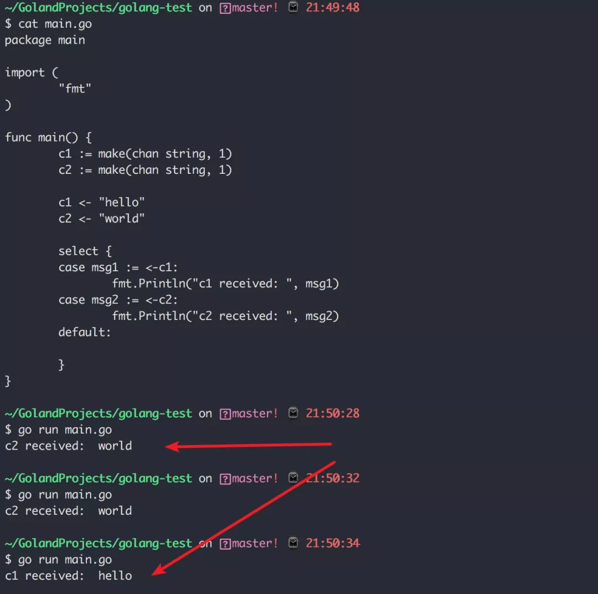

# 理解Go语言的 select 用法

今天要学习一个跟 `switch-case` 很像，但还有点个人特色的 `select-case`, 跟 `switch-case` 相比，`select-case` 用法比较单一，它仅能用于 信道/通道 的相关操作。

```go
select {
    case 表达式1:
        <code>
    case 表达式2:
        <code>
    default:
        <code>
}
```

接下来，我们来看几个例子帮助理解这个 `select` 的模型。

## 最简单的例子

先创建两个信道，并在 `select` 前往 `c2` 发送数据

```go
package main

import (
    "fmt"
)

func main() {
    c1 := make(chan string, 1)
    c2 := make(chan string, 1)

    c2 <- "hello"

    select {
    case msg1 := <-c1:
      fmt.Println("c1 received: ", msg1)
    case msg2 := <-c2:
      fmt.Println("c2 received: ", msg2)
    default:
      fmt.Println("No data received.")
    }
}
```

在运行 `select` 时，会运行所有（如果有机会的话）的 `case` 表达式，只要有一个信道有接收到数据，那么 `select` 就结束，所以输出如下

```go
c2 received:  hello
```

## 避免造成死锁

`select` 在执行过程中，必须命中其中的某一分支。

如果在遍历完所有的 `case` 后，若没有命中（命中：也许这样描述不太准确，我本意是想说可以执行信道的操作语句）任何一个 `case` 表达式，就会进入 `default` 里的代码分支。

但如果你没有写 `default` 分支，`select` 就会阻塞，直到有某个 `case` 可以命中，而如果一直没有命中，`select` 就会抛出 `deadlock` 的错误，就像下面这样子。

```go
package main

import (
    "fmt"
)

func main() {
    c1 := make(chan string, 1)
    c2 := make(chan string, 1)

    // c2 <- "hello"

    select {
    case msg1 := <-c1:
        fmt.Println("c1 received: ", msg1)
    case msg2 := <-c2:
        fmt.Println("c2 received: ", msg2)
        // default:
        //  fmt.Println("No data received.")
    }
}
```

运行后输出如下

```go
fatal error: all goroutines are asleep - deadlock!

goroutine 1 [select]:
main.main()
        /Users/MING/GolandProjects/golang-test/main.go:13 +0x10f
exit status 2
```

解决这个问题的方法有两种

一个是，在 `select` 的时候，也写好 `default` 分支代码，尽管你 `default` 下没有写任何代码。

```go
package main

import (
    "fmt"
)

func main() {
    c1 := make(chan string, 1)
    c2 := make(chan string, 1)

  // c2 <- "hello"

    select {
    case msg1 := <-c1:
        fmt.Println("c1 received: ", msg1)
    case msg2 := <-c2:
        fmt.Println("c2 received: ", msg2)
    default:

    }
}
```

另一个是，让其中某一个信道可以接收到数据

```go
package main

import (
    "fmt"
    "time"
)

func main() {
    c1 := make(chan string, 1)
    c2 := make(chan string, 1)

  // 开启一个协程，可以发送数据到信道
    go func() {
        time.Sleep(time.Second * 1)
        c2 <- "hello"
    }()

    select {
    case msg1 := <-c1:
        fmt.Println("c1 received: ", msg1)
    case msg2 := <-c2:
        fmt.Println("c2 received: ", msg2)
    }
}
```

## select 随机性

之前学过 `switch` 的时候，知道了 `switch` 里的 `case` 是顺序执行的，但在 `select` 里却不是。

通过下面这个例子的执行结果就可以看出



## select 的超时

当 `case` 里的信道始终没有接收到数据时，而且也没有 `default` 语句时，`select` 整体就会阻塞，但是有时我们并不希望 `select` 一直阻塞下去，这时候就可以手动设置一个超时时间。

```go
package main

import (
    "fmt"
    "time"
)

func makeTimeout(ch chan bool, t int) {
    time.Sleep(time.Second * time.Duration(t))
    ch <- true
}

func main() {
    c1 := make(chan string, 1)
    c2 := make(chan string, 1)
    timeout := make(chan bool, 1)

    go makeTimeout(timeout, 2)

    select {
    case msg1 := <-c1:
        fmt.Println("c1 received: ", msg1)
    case msg2 := <-c2:
        fmt.Println("c2 received: ", msg2)
    case <-timeout:
        fmt.Println("Timeout, exit.")
    }
}
```

输出如下

```go
Timeout, exit.
```

## 读取/写入都可以

上面例子里的 `case`，好像都只从信道中读取数据，但实际上，`select` 里的 `case` 表达式只要求你是对信道的操作即可，不管你是往信道写入数据，还是从信道读出数据。

```go
package main

import (
    "fmt"
)

func main() {
    c1 := make(chan int, 2)

    c1 <- 2
    select {
    case c1 <- 4:
        fmt.Println("c1 received: ", <-c1)
        fmt.Println("c1 received: ", <-c1)
    default:
        fmt.Println("channel blocking")
    }
}
```

输出如下

```go
// c1 received:  2
// c1 received:  4
```

## 总结一下

`select` 与 `switch` 原理很相似，但它的使用场景更特殊，学习了本篇文章，你需要知道如下几点区别：

- `select` 只能用于 `channel` 的操作(写入/读出)，而 `switch` 则更通用一些；

- `select` 的 `case` 是随机的，而 `switch` 里的 `case` 是顺序执行；

- `select` 要注意避免出现死锁，同时也可以自行实现超时机制；

- `select` 里没有类似 `switch` 里的 `fallthrough` 的用法；

- `select` 不能像 `switch` 一样接函数或其他表达式。