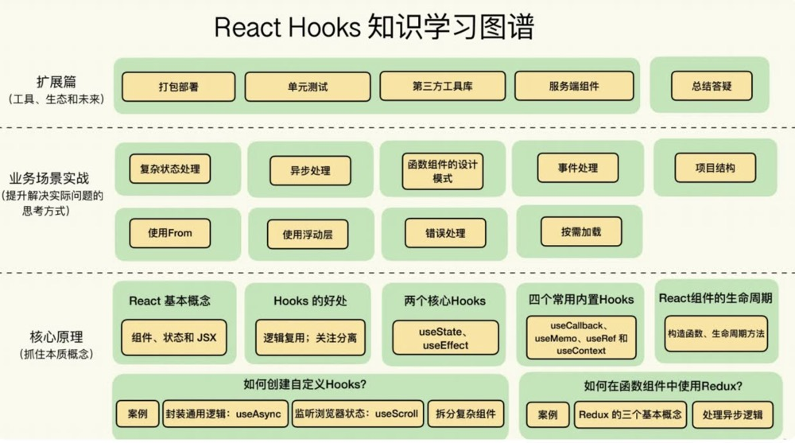

<!--
 * @Author: your name
 * @Date: 2022-01-04 22:51:36
 * @LastEditTime: 2022-01-04 23:14:43
 * @LastEditors: Please set LastEditors
 * @Description: 打开koroFileHeader查看配置 进行设置: https://github.com/OBKoro1/koro1FileHeader/wiki/%E9%85%8D%E7%BD%AE
 * @FilePath: /blog/front-end/React Hooks原理剖析.md
-->

# React Hooks 原理剖析

> React 拥有两个非常颠覆式的创新，一个是虚拟 DOM， 一个是 JSX

在 `Hooks` 出现之前，业务逻辑的重用可以说是 `React` 开发的一大痛点和难点。比如，你需要在组件中去监听窗口大小的变化，以便在布局上做调整。那么我们就得在类组件的不同生命周期中做事件监听的绑定和解绑。

引入 `Hooks` 的概念之后，函数组件就具备了状态管理、生命周期管理等能力，几乎可以实现原来的 `Class` 组件具有的所有能力。 函数组件结合 `Hooks` 带来的简洁的写法，以及直观的逻辑重用能力，让函数组件成为了 `React` 中的一等公民。

从 `Class` 组件到函数组件的转变，不仅仅是一个写法的区别，更是整个开发思路的转变。而我们只有学会用 `Hooks` 的角度去思考问题



## 创建 React 应用

`React` 的中文含义是“反应”或“响应”，它描述了 `React` 这样一个前端框架的核心原理：当数据发生变化时，`UI` 能够自动把变化反映出来。

### 理解 React 的基本概念

`React` 其实就是 组件、状态和 `JSX`。

#### 使用组件的方式描述 UI

在 `React` 中，所有的 `UI` 都是通过组件去描述和组织的。可以认为，`React` 中所有的元素都是组件

```jsx
function CommentBox() {
  return (
    <div>
      <CommentHeader />
      <CommentList />
      <CommentForm />
    </div>
  );
}
```

#### 使用 state 和 props 管理状态

在函数组件中，我们可以使用 `useState` 这样一个 `Hook` 来保存状态，那么状态在发生变化时，也会让 `UI` 自动发生变化。

```jsx
import React from "react";

export default function Counter() {
  const [count, setCount] = useState(0);
  return (
    <div>
      <button onClick={() => setCount(count + 1)}>{count}</button>
    </div>
  );
}
```

而组件之间的交互，就由 `props` 来完成.

```jsx
import React from "react";

function CountLabel({ count }) {
  // 子组件用于显示颜色
  const color = count > 10 ? "red" : "blue";
  return <span style={{ color }}>{count}</span>;
}

export default function Counter() {
  // 定义了 count 这个 state
  const [count, setCount] = useState(0);
  return (
    <div>
      <button onClick={() => setCount(count + 1)}>
        <CountLabel count={count} />
      </button>
    </div>
  );
}
```

`JSX` 并不是一个新的模板语言，而可以认为是一个语法糖

```js
React.createElement(
  "div",
  null,
  React.createElement(
    "button",
    {
      onClick: function onClick() {
        return setCount(count + 1);
      },
    },
    React.createElement(CountLabel, { count: count })
  )
);
```

`JSX` 的部分我们是用 `JavaScript` 的方式去实现的，并且用到了 `React.createElement` 这样一个 API，它的作用就是创建一个组件的实例。
