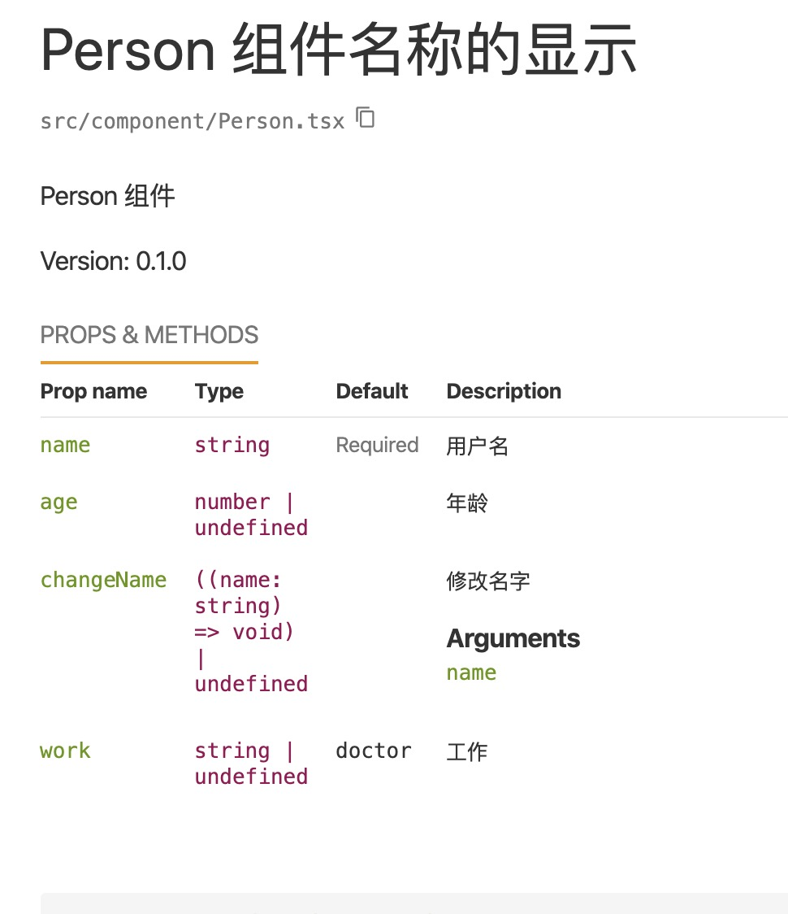
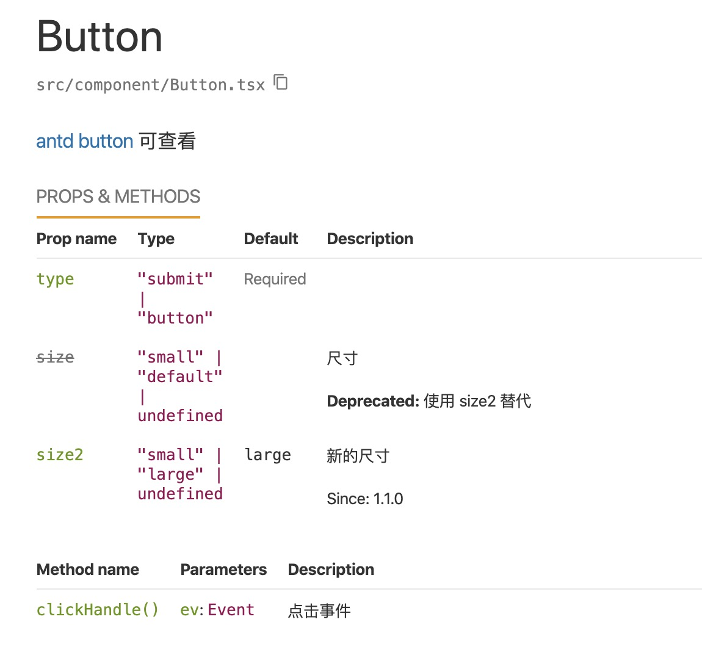

# 使用 React-Styleguidist 生成文档

## 安装

```bash
npm i -D react-styleguidist

// or

yarn add -D react-styleguidist
```

## typescript 支持

```bash
npm i -D react-docgen-typescript
```

## 配置

在根文件夹下创建 `styleguide.config.js` 文件

可以使用如下的配置

```js
const path = require('path')

const packagePath = path.resolve(
    __dirname,
    'package.json'
)
const packageFile = require(packagePath)

module.exports = {
    // webpack 路径,可以用项目里的,也可以用webpack-blocks创建
    webpackConfig: require('./config/webpack.config'), 
    components: 'src/component/**.tsx', // 写入对应目录的文档
    propsParser: require('react-docgen-typescript').withCustomConfig(
        './tsconfig.json'
    ).parse, // 用来支持 tsx
    verbose: true, // 打印详细信息
    updateDocs(docs, file) {
        if (docs.doclets.version) {
            const version = packageFile.version

            docs.doclets.version = version
            docs.tags.version[0].description = version
        }

        return docs
    }, // 在使用 @version 时 使用 package.json 的 version
    version: packageFile.version, // 同上 使用 package.json 的 version
    usageMode: 'expand', // 自动打开文档的缩放
    pagePerSection: true, // 是否每页一个组件显示
    title: "文档名" // 文档名
}
```

## 编写注释

例子 1:

```js
import React from 'react';

interface IProps {
  /**
   * 用户名
   */
  name: string
  /**
   * 年龄
   */
  age?: number
  /**
   * 工作
   * @default doctor
   */
  work?: string
  /**
   * 修改名字
   * @param name
   */
  changeName?: (name: string) => void
}

/**
 * Person 组件
 * @version package.json
 * @visibleName Person 组件名称的显示
 */
function Person(props: IProps) {
  return <div>Person</div>
}

export default Person;
```

添加使用用例:

```js
import Person from './Person';
    <Person name="grewer"/>
```



例子 2:

```js
import React from 'react';

interface IProps {
  type: 'submit' | 'button'

  /**
   * 尺寸
   * @deprecated 使用 size2 替代
   */
  size?: 'small' | 'default'

  /**
   * 新的尺寸
   * @since 1.1.0
   * @default large
   */
  size2?: 'small' | 'large'
}

/**
 * @link [antd button](https://ant.design/components/button-cn/) 可查看
 */
class Button extends React.Component<IProps, any> {
  static config = {
    desc: "这是 static 属性"
  }

  /**
   * 点击事件
   * @public
   */
  clickHandle = (ev: Event) => {
    console.log('!')
  }

  render(): React.ReactElement<any, string | React.JSXElementConstructor<any>> | string | number | {} | React.ReactNodeArray | React.ReactPortal | boolean | null | undefined {
    return <div>{this.props.children}</div>
  }
}

export default Button;
```



结果
使用如下命令,可以创建一个 web 服务,在线修改文档:

```bash
styleguidist server
```

使用如下命令,可以将文档项目打包

```bash
styleguidist build
```

如果库正好在 `GitHub` 上面,可是开通 `GitHub Pages` 功能,将文档包提交进 `GitHub`;

参考： !(React-Styleguidist)[https://react-styleguidist.js.org]