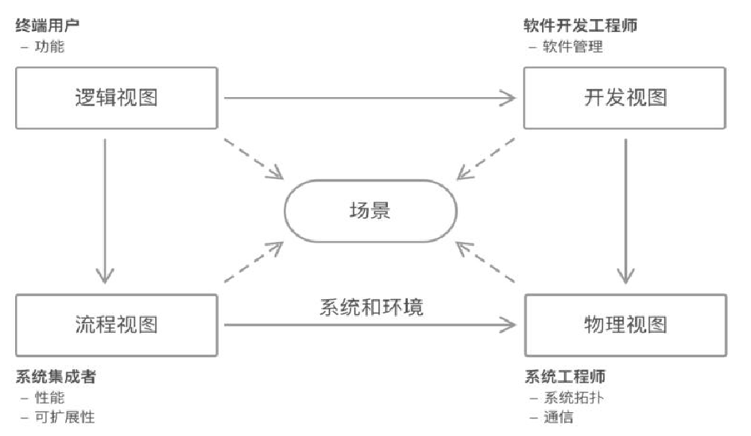
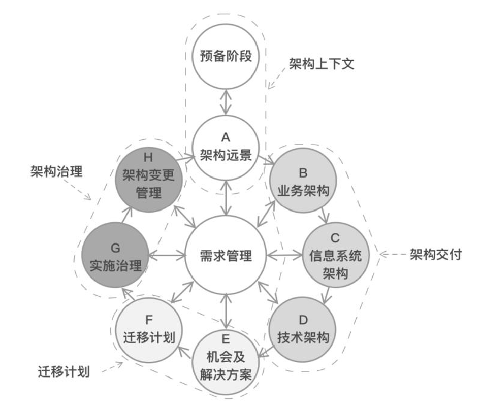

# 前端架构杂谈(一)

## 前言

架构，在前端会更复杂——涉及领域更广。前端在实现的过程中，除了考虑代码的可用性、性能、模型构建、组件复用等问题，还有前端特有的平台设定、浏览器兼容、交互设计、用户体验等相关的问题。而在“大前端”的背景之下，还需要深入移动端设计、桌面应用、物联网等相关的领域。

Web 前端应用越来越复杂，使得架构在前端设计与开发也越来越受关注。规范、原则、模式、架构，是我们在前端架构中需要关注的内容

## 前端架构

### 什么是软件架构

对于软件架构，不同的人有不同的理解，不同的组织有不同的定义。如维基百科上说：

> 软件架构是指软件系统的高级结构，以及创建这种结构和系统的约束。每个结构包括软件元素、元素之间的关系，以及元素和关系的属性。软件系统的架构是一种隐喻，类似于建筑物的体系结构。它作为系统和开发项目的蓝图，列出了设计团队必须执行的任务。

我们期望的软件架构，应该是贯穿在它被应用的生命周期里的，应该包含以下的内容：

- 系统间关系。明确地指出该系统与其他系统之间的关系，是调用关系，还是依赖关系等。

- 系统内关系。系统内各子系统之间的关系，如前端应用与后端应用，以怎样的方式通信，需要怎样的通信机制。

- 应用内架构。包含应用相关的框架、组件，并清楚地表示出它们之间的关系。

- 规范和原则。用于指导项目中的开发人员，编写出符合需求的代码，以构建出设计中的架构。

### 架构设计

架构设计并非只是一个技术工作，它包含了一系列复杂的工作，其范围包括软件工程、开发实践、业务交付等相关的领域

相应的步骤如下：

（1）收集利益相关者的需求。倾听业务人员、项目负责人等相关者的需求，进行用户访谈，收集相关的需求。

（2）与相应的技术人员（如开发人员、测试人员）讨论，了解架构上的潜在限制。

（3）寻找潜在的可行性技术方案。

（4）整理出功能列表中的功能性需求和跨功能性需求。

（5）找出会严重影响开发的风险点。

（6）和技术委员会、利益相关者反复确认方案（可选）。

（7）对架构设计进行概念证明。

（8）细化架构的部分实施细节。

（9）结合技术和业务，进行需求排期。

### 架构模式

在日常的开发中，架构模式和方法都有相应的参考价值，但它们都有各自的场景，并不适合直接套用。架构风格便是架构模式的展现形式，它是描述某一特定应用领域中系统组织方式的惯用模式。

在日常的开发中，常见的架构风格有：

- 分层风格。这是最常见的架构风格，它将系统按照水平切分的方式分成多个层。一个系统由多层组成，每层由多个模块组成。每一层为上层提供服务，并使用下层提供的功能。如：`OSI` 七层模型、`TCP/IP` 五层模型等

- `MVC` 架构风格。这种风格应用得相当广泛，它强调职责分离，将软件系统分为三个基本部分：模型（Model）、视图（View）和控制器（Controller）。由视图和控制器一起完成用户界面的功能，并设计一套变更机制，来保证用户界面与模型的一致性。

- 发布-订阅风格。这种风格又可以称为基于事件的架构风格，它是一种一对多的关系，一个对象状态发生改变时，所有订阅它的对象都会得到通知。这种架构风格带来的最大好处是，代码上的解耦。

- 管理和过滤器。这是一种适合于处理数据流的架构模式，它将每个步骤都封装在一个过滤器组件中，数据通过相邻过滤器之间的管道传输。最典型的管道-过滤器架构是 `UNIX shell` 的设计, 前端框架的 `Angular`，也直接内置了管理（`Pipe`）系统

### 架构设计方法

现在，我们已经拥有一系列架构设计的方法。这些架构的开发方法和开发流程，也和架构开发的模式有关。但是由于这些设计方法往往是为了解决复杂的问题而存在的，因而对于一般的项目来说，充满大量冗余的步骤，并不很实用

在这里，我们将简单地介绍一下 `4+1` 视图法及 `TOGAF`，它们侧重于从系统的角度来考虑问题

#### 架构开发方法：4+1 视图法

每个项目都会有一张系统架构图，里面包含了系统的主要层级之间的关系，以及一些第三方系统之间的关系。

- 逻辑视图（`Logical View`）：在设计期的模块、接口划分，职责及协作方式等。

- 流程视图（`Process View`）：在运行期运行的数据同步，如在微前端中的数据流、控制流等

- 开发视图（`Development View`）：在开发期的框架、库、技术选型及其对应的编译。

- 物理视图（`Physical View`）：又称为部署视图。在部署期与持续交付相关的技术决策。

- 场景（`Scenarios`），又称为用例视图，它使用一组用例或场景来说明架构

`4+1` 视图法的设计流程其实就是架构人员根据需求创建相应的逻辑架构，开发人员进行详细设计，架构人员和开发人员根据需求设计物理架构，再由开发人员根据物理架构进行对应的详细设计。

#### 架构开发方法：TOGAF 及 ADM

针对大型的企业架构来说，可以采用 `TOGAF`（`The Open Group Architecture Framework`，开放组体系结构框架）的标准化方式来设计企业架构，最新版本为 `9.2` 版本，该版本将企业架构分为如下 4 个架构域（`Architecture Domains`）。

- 业务架构（`Business Architecture`）：定义业务战略、治理方法和关键业务流程。

- 应用架构（`Application Architecture`）：为将要部署的各个应用程序提供蓝图，并展示它们的交互及与核心业务流程的关系。

- 数据架构（`Data Architecture`）：描述了一个组织的逻辑、物理数据资产及数据管理资源的架构。

- 技术架构（`Technology Architecture`）：定义了支持部署业务、数据和应用程序服务所需的逻辑软件和硬件功能，它包含了 `IT` 基础设施、中间件、网络、通信、处理和标准。

此外，还有一套架构开发方法叫作 `ADM`，用于创建企业级架构。`ADM` 一共分为 `8` 个阶段

下面对 8 个阶段进行解释：

- A.架构愿景。设定项目的范围、约束和期望。

- B.业务架构。开发业务架构，用于支持设定的架构愿景。

- C.信息系统架构。开发信息系统架构，用于支持设定的架构愿景。

- D.技术架构。开发技术架构，用于支持设定的架构愿景。

- E.机会及解决方案。为前几个阶段定义的架构进行初步实施计划和交付工具的识别。

- F.迁移计划。通过最终确定的详细实施和迁移计划，阐述如何从基准体系结构迁移到目标体系结构。

- G.实施治理。准备和发布架构契约，并对实施的架构进行监督，以确保实施项目符合架构的要求。

- H.架构变更管理。对架构变更进行持续的监控。

#### 其他部分

现有的架构设计方法针对的都是大中型的后台应用——它们需要大量的领域建模、复杂的部署流程和服务调用关系。与后台一起设计架构的过程中，便会整合出前端所需要的内容。

前端架构可以通过层次设计的方式来进行，即由顶至底进行一层一层的技术决策，再由底至顶逐层验证方案的可行性。

#### 架构产出物

架构文档，将为团队开发打下基础。在进入开发阶段时，作为一个普通的开发人员希望得到的内容如下:

- 架构图：它包含了系统的整体架构

- 迭代计划：按照业务和技术的要求，按时间顺序排列出项目的实施计划

- 技术栈及选型：确定项目中使用的语言、框架、库等相关的技术栈，以及相应的依赖等。

- 示例代码：在这些代码中展示架构的风格及相应的设计规范。

- 测试策略：明确项目的测试类型、测试流程，以及相应的人员在哪些层级进行测试。

- 部署方式：定义应用的部署方式及相应的部署方案。

持续集成方案：描述系统的各个模块之间（如前后端）如何集成，以及采用怎样的时间和频率来集成相关的模块。

### 架构设计原则

不同的人在设计架构时会出现不同的风格, 总结三个设计原则，如下

- 不多也不少：不做多余的设计，也不缺少关键的部分。

- 演进式：不断地演进以使架构适应当前的环境。

- 持续性：长期的架构改进比什么都重要。
