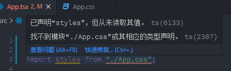
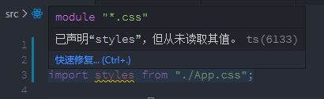
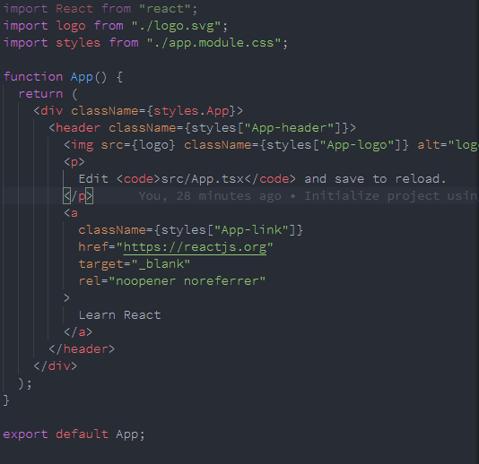
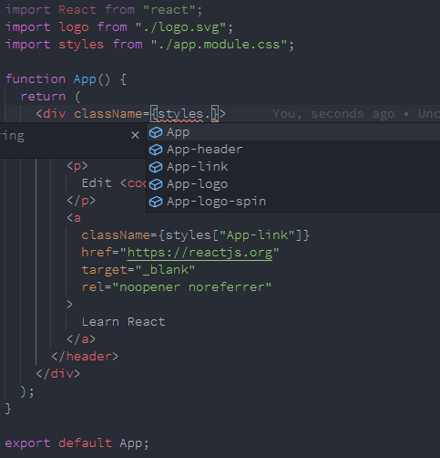

# 解决 css in js 中遇到的找不到 css 类型的问题

当我们使用 `create-react-app` 创建项目时，脚手架默认使用 `css` 的方式是直接导入 `css` 文件，像这样：

```js
import "./App.css";
```

当我们需要使用 css in js 的时候，会报错：



根据提示，我们需要使用 `*.d.ts` 的文件来声明其文件类型，文件名任意，我们在根目录下创建 `typing.d.ts` 文件，并写入声明

```js
declare module "\*.css" {
  const css: { [key: string]: string };
  export default css;
}
```

现在，报错不存在了，我们就可以像访问对象一样访问 `css` 属性



我们既然使用了 css in js 的方式，当然也要将 `css`（或其他 `css` 前置处理器，如：`less`，`scss`）命名为类似 `*.module.css`

接着替换原来的样式类声明方式，如下：



现在有个问题是，当我们使用对象形式访问 `css` 样式时，并没有任何提示，我们来解决这个问题

我们需要安装一个开发时依赖：`typescript-plugin-css-modules`，它可以解析 `css` 样式对象，并提供相应的提示

先安装它

```bash
yarn add typescript-plugin-css-modules -D
```

接着需要在 `tsconfig.js` 中配置它

如果编辑器使用的 `vscode`，当然，大多数都使用的这个编辑器，我们还需要对编辑器做一些配置

在项目的根目录下创建 `.vscode` 的文件夹，然后在此文件夹下创建文件 `settings.json`，并在文件中输入以下内容：

```js
{
  "typescript.tsdk": "node_modules/typescript/lib",
  "typescript.enablePromptUseWorkspaceTsdk": true,
}
```

此时，你的编辑器可能会有一些提示，请点击 `Allow` 或中文的允许所有

OK，所有配置进行完毕，现在我们在代码中引入 `css module` 对象时，就会提示当前 `module` 对象中所有的 `css` 属性



另外，使用了 css in js 的方式，在编写 `css` 时候请使用小驼峰的命令规则，如：` appHeader``、appLogoSpin ` 等
