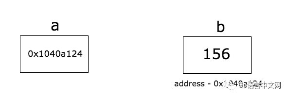
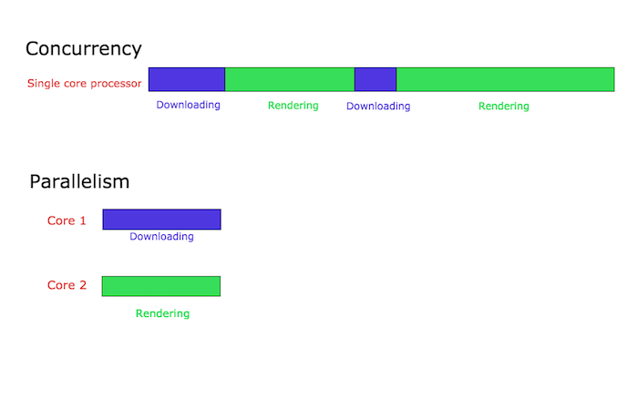
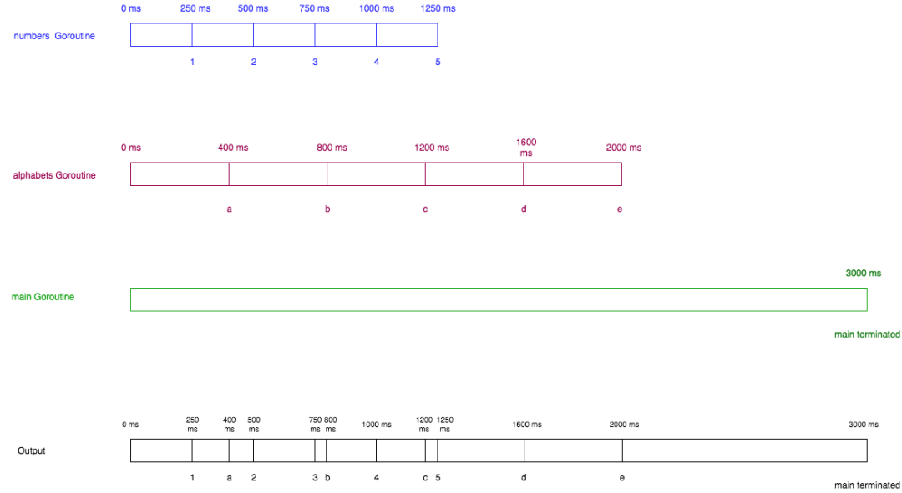
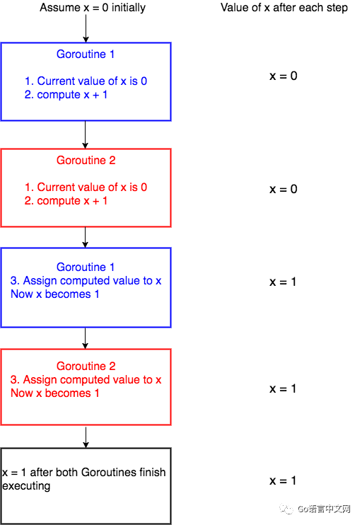
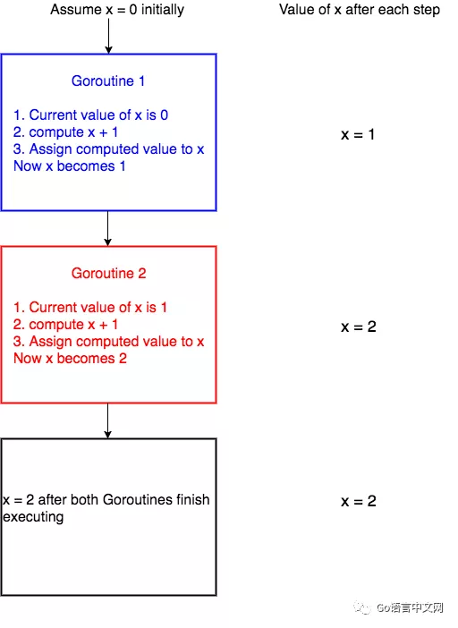

<!-- START doctoc generated TOC please keep comment here to allow auto update -->
<!-- DON'T EDIT THIS SECTION, INSTEAD RE-RUN doctoc TO UPDATE -->
**Table of Contents**  *generated with [DocToc](https://github.com/thlorenz/doctoc)*

- [Golang经典入门](#golang%E7%BB%8F%E5%85%B8%E5%85%A5%E9%97%A8)
  - [介绍、安装和 Hello World](#%E4%BB%8B%E7%BB%8D%E5%AE%89%E8%A3%85%E5%92%8C-hello-world)
    - [Golang 是什么](#golang-%E6%98%AF%E4%BB%80%E4%B9%88)
    - [为何选择 Golang](#%E4%B8%BA%E4%BD%95%E9%80%89%E6%8B%A9-golang)
    - [安装](#%E5%AE%89%E8%A3%85)
      - [Mac OS](#mac-os)
      - [Windows](#windows)
      - [Linux](#linux)
    - [第一个 Go 程序](#%E7%AC%AC%E4%B8%80%E4%B8%AA-go-%E7%A8%8B%E5%BA%8F)
      - [运行 Go 程序](#%E8%BF%90%E8%A1%8C-go-%E7%A8%8B%E5%BA%8F)
      - [简述 hello world 程序](#%E7%AE%80%E8%BF%B0-hello-world-%E7%A8%8B%E5%BA%8F)
  - [变量](#%E5%8F%98%E9%87%8F)
    - [变量是什么](#%E5%8F%98%E9%87%8F%E6%98%AF%E4%BB%80%E4%B9%88)
    - [声明单个变量](#%E5%A3%B0%E6%98%8E%E5%8D%95%E4%B8%AA%E5%8F%98%E9%87%8F)
    - [声明变量并初始化](#%E5%A3%B0%E6%98%8E%E5%8F%98%E9%87%8F%E5%B9%B6%E5%88%9D%E5%A7%8B%E5%8C%96)
    - [类型推断（Type Inference）](#%E7%B1%BB%E5%9E%8B%E6%8E%A8%E6%96%ADtype-inference)
    - [声明多个变量](#%E5%A3%B0%E6%98%8E%E5%A4%9A%E4%B8%AA%E5%8F%98%E9%87%8F)
    - [简短声明](#%E7%AE%80%E7%9F%AD%E5%A3%B0%E6%98%8E)
  - [常量](#%E5%B8%B8%E9%87%8F)
    - [定义](#%E5%AE%9A%E4%B9%89)
    - [字符串常量](#%E5%AD%97%E7%AC%A6%E4%B8%B2%E5%B8%B8%E9%87%8F)
    - [布尔常量](#%E5%B8%83%E5%B0%94%E5%B8%B8%E9%87%8F)
    - [数字常量](#%E6%95%B0%E5%AD%97%E5%B8%B8%E9%87%8F)
    - [数字表达式](#%E6%95%B0%E5%AD%97%E8%A1%A8%E8%BE%BE%E5%BC%8F)
  - [类型](#%E7%B1%BB%E5%9E%8B)
    - [bool](#bool)
    - [有符号整型](#%E6%9C%89%E7%AC%A6%E5%8F%B7%E6%95%B4%E5%9E%8B)
    - [无符号整型](#%E6%97%A0%E7%AC%A6%E5%8F%B7%E6%95%B4%E5%9E%8B)
    - [浮点型](#%E6%B5%AE%E7%82%B9%E5%9E%8B)
    - [复数类型](#%E5%A4%8D%E6%95%B0%E7%B1%BB%E5%9E%8B)
    - [其他数字类型](#%E5%85%B6%E4%BB%96%E6%95%B0%E5%AD%97%E7%B1%BB%E5%9E%8B)
    - [string 类型](#string-%E7%B1%BB%E5%9E%8B)
    - [类型转换](#%E7%B1%BB%E5%9E%8B%E8%BD%AC%E6%8D%A2)
  - [函数](#%E5%87%BD%E6%95%B0)
    - [函数是什么？](#%E5%87%BD%E6%95%B0%E6%98%AF%E4%BB%80%E4%B9%88)
    - [函数的声明](#%E5%87%BD%E6%95%B0%E7%9A%84%E5%A3%B0%E6%98%8E)
    - [示例函数](#%E7%A4%BA%E4%BE%8B%E5%87%BD%E6%95%B0)
    - [多返回值](#%E5%A4%9A%E8%BF%94%E5%9B%9E%E5%80%BC)
    - [命名返回值](#%E5%91%BD%E5%90%8D%E8%BF%94%E5%9B%9E%E5%80%BC)
    - [空白符](#%E7%A9%BA%E7%99%BD%E7%AC%A6)
  - [包](#%E5%8C%85)
    - [什么是包，为什么使用包？](#%E4%BB%80%E4%B9%88%E6%98%AF%E5%8C%85%E4%B8%BA%E4%BB%80%E4%B9%88%E4%BD%BF%E7%94%A8%E5%8C%85)
    - [main 函数和 main 包](#main-%E5%87%BD%E6%95%B0%E5%92%8C-main-%E5%8C%85)
    - [创建自定义的包](#%E5%88%9B%E5%BB%BA%E8%87%AA%E5%AE%9A%E4%B9%89%E7%9A%84%E5%8C%85)
    - [导入自定义包](#%E5%AF%BC%E5%85%A5%E8%87%AA%E5%AE%9A%E4%B9%89%E5%8C%85)
    - [导出名字（Exported Names）](#%E5%AF%BC%E5%87%BA%E5%90%8D%E5%AD%97exported-names)
    - [init 函数](#init-%E5%87%BD%E6%95%B0)
    - [使用空白标识符（Blank Identifier）](#%E4%BD%BF%E7%94%A8%E7%A9%BA%E7%99%BD%E6%A0%87%E8%AF%86%E7%AC%A6blank-identifier)
  - [if-else 语句](#if-else-%E8%AF%AD%E5%8F%A5)
    - [`if` 是条件语句](#if-%E6%98%AF%E6%9D%A1%E4%BB%B6%E8%AF%AD%E5%8F%A5)
    - [一个注意点](#%E4%B8%80%E4%B8%AA%E6%B3%A8%E6%84%8F%E7%82%B9)
  - [循环](#%E5%BE%AA%E7%8E%AF)
    - [for 循环语法](#for-%E5%BE%AA%E7%8E%AF%E8%AF%AD%E6%B3%95)
    - [例子](#%E4%BE%8B%E5%AD%90)
    - [break](#break)
    - [continue](#continue)
    - [更多例子](#%E6%9B%B4%E5%A4%9A%E4%BE%8B%E5%AD%90)
    - [无限循环](#%E6%97%A0%E9%99%90%E5%BE%AA%E7%8E%AF)
  - [switch 语句](#switch-%E8%AF%AD%E5%8F%A5)
    - [默认情况（Default Case）](#%E9%BB%98%E8%AE%A4%E6%83%85%E5%86%B5default-case)
    - [多表达式判断](#%E5%A4%9A%E8%A1%A8%E8%BE%BE%E5%BC%8F%E5%88%A4%E6%96%AD)
    - [无表达式的 switch](#%E6%97%A0%E8%A1%A8%E8%BE%BE%E5%BC%8F%E7%9A%84-switch)
    - [Fallthrough 语句](#fallthrough-%E8%AF%AD%E5%8F%A5)
  - [数组和切片](#%E6%95%B0%E7%BB%84%E5%92%8C%E5%88%87%E7%89%87)
    - [数组](#%E6%95%B0%E7%BB%84)
      - [数组的声明](#%E6%95%B0%E7%BB%84%E7%9A%84%E5%A3%B0%E6%98%8E)
      - [数组是值类型](#%E6%95%B0%E7%BB%84%E6%98%AF%E5%80%BC%E7%B1%BB%E5%9E%8B)
      - [数组的长度](#%E6%95%B0%E7%BB%84%E7%9A%84%E9%95%BF%E5%BA%A6)
      - [使用 range 迭代数组](#%E4%BD%BF%E7%94%A8-range-%E8%BF%AD%E4%BB%A3%E6%95%B0%E7%BB%84)
      - [多维数组](#%E5%A4%9A%E7%BB%B4%E6%95%B0%E7%BB%84)
    - [切片](#%E5%88%87%E7%89%87)
      - [创建一个切片](#%E5%88%9B%E5%BB%BA%E4%B8%80%E4%B8%AA%E5%88%87%E7%89%87)
      - [切片的修改](#%E5%88%87%E7%89%87%E7%9A%84%E4%BF%AE%E6%94%B9)
      - [切片的长度和容量](#%E5%88%87%E7%89%87%E7%9A%84%E9%95%BF%E5%BA%A6%E5%92%8C%E5%AE%B9%E9%87%8F)
      - [使用 make 创建一个切片](#%E4%BD%BF%E7%94%A8-make-%E5%88%9B%E5%BB%BA%E4%B8%80%E4%B8%AA%E5%88%87%E7%89%87)
      - [追加切片元素](#%E8%BF%BD%E5%8A%A0%E5%88%87%E7%89%87%E5%85%83%E7%B4%A0)
      - [切片的函数传递](#%E5%88%87%E7%89%87%E7%9A%84%E5%87%BD%E6%95%B0%E4%BC%A0%E9%80%92)
      - [多维切片](#%E5%A4%9A%E7%BB%B4%E5%88%87%E7%89%87)
      - [内存优化](#%E5%86%85%E5%AD%98%E4%BC%98%E5%8C%96)
  - [可变参数函数](#%E5%8F%AF%E5%8F%98%E5%8F%82%E6%95%B0%E5%87%BD%E6%95%B0)
    - [什么是可变参数函数](#%E4%BB%80%E4%B9%88%E6%98%AF%E5%8F%AF%E5%8F%98%E5%8F%82%E6%95%B0%E5%87%BD%E6%95%B0)
    - [语法](#%E8%AF%AD%E6%B3%95)
    - [通过一些例子理解可变参数函数如何工作](#%E9%80%9A%E8%BF%87%E4%B8%80%E4%BA%9B%E4%BE%8B%E5%AD%90%E7%90%86%E8%A7%A3%E5%8F%AF%E5%8F%98%E5%8F%82%E6%95%B0%E5%87%BD%E6%95%B0%E5%A6%82%E4%BD%95%E5%B7%A5%E4%BD%9C)
    - [给可变参数函数传入切片](#%E7%BB%99%E5%8F%AF%E5%8F%98%E5%8F%82%E6%95%B0%E5%87%BD%E6%95%B0%E4%BC%A0%E5%85%A5%E5%88%87%E7%89%87)
    - [不直观的错误](#%E4%B8%8D%E7%9B%B4%E8%A7%82%E7%9A%84%E9%94%99%E8%AF%AF)
  - [Maps](#maps)
    - [什么是 map ？](#%E4%BB%80%E4%B9%88%E6%98%AF-map-)
    - [如何创建 map ？](#%E5%A6%82%E4%BD%95%E5%88%9B%E5%BB%BA-map-)
    - [给 map 添加元素](#%E7%BB%99-map-%E6%B7%BB%E5%8A%A0%E5%85%83%E7%B4%A0)
    - [获取 map 中的元素](#%E8%8E%B7%E5%8F%96-map-%E4%B8%AD%E7%9A%84%E5%85%83%E7%B4%A0)
    - [删除 map 中的元素](#%E5%88%A0%E9%99%A4-map-%E4%B8%AD%E7%9A%84%E5%85%83%E7%B4%A0)
    - [获取 map 的长度](#%E8%8E%B7%E5%8F%96-map-%E7%9A%84%E9%95%BF%E5%BA%A6)
    - [Map 是引用类型](#map-%E6%98%AF%E5%BC%95%E7%94%A8%E7%B1%BB%E5%9E%8B)
    - [Map 的相等性](#map-%E7%9A%84%E7%9B%B8%E7%AD%89%E6%80%A7)
  - [字符串](#%E5%AD%97%E7%AC%A6%E4%B8%B2)
    - [什么是字符串？](#%E4%BB%80%E4%B9%88%E6%98%AF%E5%AD%97%E7%AC%A6%E4%B8%B2)
    - [单独获取字符串的每一个字节](#%E5%8D%95%E7%8B%AC%E8%8E%B7%E5%8F%96%E5%AD%97%E7%AC%A6%E4%B8%B2%E7%9A%84%E6%AF%8F%E4%B8%80%E4%B8%AA%E5%AD%97%E8%8A%82)
    - [rune](#rune)
    - [字符串的 for range 循环](#%E5%AD%97%E7%AC%A6%E4%B8%B2%E7%9A%84-for-range-%E5%BE%AA%E7%8E%AF)
    - [用字节切片构造字符串](#%E7%94%A8%E5%AD%97%E8%8A%82%E5%88%87%E7%89%87%E6%9E%84%E9%80%A0%E5%AD%97%E7%AC%A6%E4%B8%B2)
    - [用 rune 切片构造字符串](#%E7%94%A8-rune-%E5%88%87%E7%89%87%E6%9E%84%E9%80%A0%E5%AD%97%E7%AC%A6%E4%B8%B2)
    - [字符串的长度](#%E5%AD%97%E7%AC%A6%E4%B8%B2%E7%9A%84%E9%95%BF%E5%BA%A6)
    - [字符串是不可变的](#%E5%AD%97%E7%AC%A6%E4%B8%B2%E6%98%AF%E4%B8%8D%E5%8F%AF%E5%8F%98%E7%9A%84)
  - [指针](#%E6%8C%87%E9%92%88)
    - [什么是指针？](#%E4%BB%80%E4%B9%88%E6%98%AF%E6%8C%87%E9%92%88)
    - [指针的声明](#%E6%8C%87%E9%92%88%E7%9A%84%E5%A3%B0%E6%98%8E)
    - [指针的零值（Zero Value）](#%E6%8C%87%E9%92%88%E7%9A%84%E9%9B%B6%E5%80%BCzero-value)
    - [指针的解引用](#%E6%8C%87%E9%92%88%E7%9A%84%E8%A7%A3%E5%BC%95%E7%94%A8)
    - [向函数传递指针参数](#%E5%90%91%E5%87%BD%E6%95%B0%E4%BC%A0%E9%80%92%E6%8C%87%E9%92%88%E5%8F%82%E6%95%B0)
    - [不要向函数传递数组的指针，而应该使用切片](#%E4%B8%8D%E8%A6%81%E5%90%91%E5%87%BD%E6%95%B0%E4%BC%A0%E9%80%92%E6%95%B0%E7%BB%84%E7%9A%84%E6%8C%87%E9%92%88%E8%80%8C%E5%BA%94%E8%AF%A5%E4%BD%BF%E7%94%A8%E5%88%87%E7%89%87)
    - [Go 不支持指针运算](#go-%E4%B8%8D%E6%94%AF%E6%8C%81%E6%8C%87%E9%92%88%E8%BF%90%E7%AE%97)
  - [结构体](#%E7%BB%93%E6%9E%84%E4%BD%93)
    - [什么是结构体？](#%E4%BB%80%E4%B9%88%E6%98%AF%E7%BB%93%E6%9E%84%E4%BD%93)
    - [结构体的声明](#%E7%BB%93%E6%9E%84%E4%BD%93%E7%9A%84%E5%A3%B0%E6%98%8E)
    - [创建命名的结构体](#%E5%88%9B%E5%BB%BA%E5%91%BD%E5%90%8D%E7%9A%84%E7%BB%93%E6%9E%84%E4%BD%93)
    - [创建匿名结构体](#%E5%88%9B%E5%BB%BA%E5%8C%BF%E5%90%8D%E7%BB%93%E6%9E%84%E4%BD%93)
    - [结构体的零值（Zero Value）](#%E7%BB%93%E6%9E%84%E4%BD%93%E7%9A%84%E9%9B%B6%E5%80%BCzero-value)
    - [访问结构体的字段](#%E8%AE%BF%E9%97%AE%E7%BB%93%E6%9E%84%E4%BD%93%E7%9A%84%E5%AD%97%E6%AE%B5)
    - [结构体的指针](#%E7%BB%93%E6%9E%84%E4%BD%93%E7%9A%84%E6%8C%87%E9%92%88)
    - [匿名字段](#%E5%8C%BF%E5%90%8D%E5%AD%97%E6%AE%B5)
    - [嵌套结构体（Nested Structs）](#%E5%B5%8C%E5%A5%97%E7%BB%93%E6%9E%84%E4%BD%93nested-structs)
    - [提升字段（Promoted Fields）](#%E6%8F%90%E5%8D%87%E5%AD%97%E6%AE%B5promoted-fields)
    - [导出结构体和字段](#%E5%AF%BC%E5%87%BA%E7%BB%93%E6%9E%84%E4%BD%93%E5%92%8C%E5%AD%97%E6%AE%B5)
    - [结构体相等性（Structs Equality）](#%E7%BB%93%E6%9E%84%E4%BD%93%E7%9B%B8%E7%AD%89%E6%80%A7structs-equality)
  - [方法](#%E6%96%B9%E6%B3%95)
    - [什么是方法？](#%E4%BB%80%E4%B9%88%E6%98%AF%E6%96%B9%E6%B3%95)
    - [方法示例](#%E6%96%B9%E6%B3%95%E7%A4%BA%E4%BE%8B)
    - [为什么我们已经有函数了还需要方法呢？](#%E4%B8%BA%E4%BB%80%E4%B9%88%E6%88%91%E4%BB%AC%E5%B7%B2%E7%BB%8F%E6%9C%89%E5%87%BD%E6%95%B0%E4%BA%86%E8%BF%98%E9%9C%80%E8%A6%81%E6%96%B9%E6%B3%95%E5%91%A2)
    - [指针接收器与值接收器](#%E6%8C%87%E9%92%88%E6%8E%A5%E6%94%B6%E5%99%A8%E4%B8%8E%E5%80%BC%E6%8E%A5%E6%94%B6%E5%99%A8)
    - [那么什么时候使用指针接收器，什么时候使用值接收器？](#%E9%82%A3%E4%B9%88%E4%BB%80%E4%B9%88%E6%97%B6%E5%80%99%E4%BD%BF%E7%94%A8%E6%8C%87%E9%92%88%E6%8E%A5%E6%94%B6%E5%99%A8%E4%BB%80%E4%B9%88%E6%97%B6%E5%80%99%E4%BD%BF%E7%94%A8%E5%80%BC%E6%8E%A5%E6%94%B6%E5%99%A8)
    - [匿名字段的方法](#%E5%8C%BF%E5%90%8D%E5%AD%97%E6%AE%B5%E7%9A%84%E6%96%B9%E6%B3%95)
    - [在方法中使用值接收器 与 在函数中使用值参数](#%E5%9C%A8%E6%96%B9%E6%B3%95%E4%B8%AD%E4%BD%BF%E7%94%A8%E5%80%BC%E6%8E%A5%E6%94%B6%E5%99%A8-%E4%B8%8E-%E5%9C%A8%E5%87%BD%E6%95%B0%E4%B8%AD%E4%BD%BF%E7%94%A8%E5%80%BC%E5%8F%82%E6%95%B0)
    - [在方法中使用指针接收器 与 在函数中使用指针参数](#%E5%9C%A8%E6%96%B9%E6%B3%95%E4%B8%AD%E4%BD%BF%E7%94%A8%E6%8C%87%E9%92%88%E6%8E%A5%E6%94%B6%E5%99%A8-%E4%B8%8E-%E5%9C%A8%E5%87%BD%E6%95%B0%E4%B8%AD%E4%BD%BF%E7%94%A8%E6%8C%87%E9%92%88%E5%8F%82%E6%95%B0)
    - [在非结构体上的方法](#%E5%9C%A8%E9%9D%9E%E7%BB%93%E6%9E%84%E4%BD%93%E4%B8%8A%E7%9A%84%E6%96%B9%E6%B3%95)
  - [接口（一）](#%E6%8E%A5%E5%8F%A3%E4%B8%80)
    - [什么是接口？](#%E4%BB%80%E4%B9%88%E6%98%AF%E6%8E%A5%E5%8F%A3)
    - [接口的声明与实现](#%E6%8E%A5%E5%8F%A3%E7%9A%84%E5%A3%B0%E6%98%8E%E4%B8%8E%E5%AE%9E%E7%8E%B0)
    - [接口的实际用途](#%E6%8E%A5%E5%8F%A3%E7%9A%84%E5%AE%9E%E9%99%85%E7%94%A8%E9%80%94)
    - [接口的内部表示](#%E6%8E%A5%E5%8F%A3%E7%9A%84%E5%86%85%E9%83%A8%E8%A1%A8%E7%A4%BA)
    - [空接口](#%E7%A9%BA%E6%8E%A5%E5%8F%A3)
    - [类型断言](#%E7%B1%BB%E5%9E%8B%E6%96%AD%E8%A8%80)
    - [类型选择（Type Switch）](#%E7%B1%BB%E5%9E%8B%E9%80%89%E6%8B%A9type-switch)
  - [接口（二）](#%E6%8E%A5%E5%8F%A3%E4%BA%8C)
    - [实现接口：指针接受者与值接受者](#%E5%AE%9E%E7%8E%B0%E6%8E%A5%E5%8F%A3%E6%8C%87%E9%92%88%E6%8E%A5%E5%8F%97%E8%80%85%E4%B8%8E%E5%80%BC%E6%8E%A5%E5%8F%97%E8%80%85)
    - [实现多个接口](#%E5%AE%9E%E7%8E%B0%E5%A4%9A%E4%B8%AA%E6%8E%A5%E5%8F%A3)
    - [接口的嵌套](#%E6%8E%A5%E5%8F%A3%E7%9A%84%E5%B5%8C%E5%A5%97)
    - [接口的零值](#%E6%8E%A5%E5%8F%A3%E7%9A%84%E9%9B%B6%E5%80%BC)
  - [并发](#%E5%B9%B6%E5%8F%91)
    - [并发是什么？](#%E5%B9%B6%E5%8F%91%E6%98%AF%E4%BB%80%E4%B9%88)
    - [并行是什么？并行和并发有何区别？](#%E5%B9%B6%E8%A1%8C%E6%98%AF%E4%BB%80%E4%B9%88%E5%B9%B6%E8%A1%8C%E5%92%8C%E5%B9%B6%E5%8F%91%E6%9C%89%E4%BD%95%E5%8C%BA%E5%88%AB)
    - [从技术上看并发和并行](#%E4%BB%8E%E6%8A%80%E6%9C%AF%E4%B8%8A%E7%9C%8B%E5%B9%B6%E5%8F%91%E5%92%8C%E5%B9%B6%E8%A1%8C)
    - [Go 对并发的支持](#go-%E5%AF%B9%E5%B9%B6%E5%8F%91%E7%9A%84%E6%94%AF%E6%8C%81)
  - [协程](#%E5%8D%8F%E7%A8%8B)
    - [Go 协程是什么？](#go-%E5%8D%8F%E7%A8%8B%E6%98%AF%E4%BB%80%E4%B9%88)
    - [Go 协程相比于线程的优势](#go-%E5%8D%8F%E7%A8%8B%E7%9B%B8%E6%AF%94%E4%BA%8E%E7%BA%BF%E7%A8%8B%E7%9A%84%E4%BC%98%E5%8A%BF)
    - [如何启动一个 Go 协程？](#%E5%A6%82%E4%BD%95%E5%90%AF%E5%8A%A8%E4%B8%80%E4%B8%AA-go-%E5%8D%8F%E7%A8%8B)
    - [启动多个 Go 协程](#%E5%90%AF%E5%8A%A8%E5%A4%9A%E4%B8%AA-go-%E5%8D%8F%E7%A8%8B)
  - [Channel](#channel)
    - [什么是信道？](#%E4%BB%80%E4%B9%88%E6%98%AF%E4%BF%A1%E9%81%93)
    - [信道的声明](#%E4%BF%A1%E9%81%93%E7%9A%84%E5%A3%B0%E6%98%8E)
    - [通过信道进行发送和接收](#%E9%80%9A%E8%BF%87%E4%BF%A1%E9%81%93%E8%BF%9B%E8%A1%8C%E5%8F%91%E9%80%81%E5%92%8C%E6%8E%A5%E6%94%B6)
    - [发送与接收默认是阻塞的](#%E5%8F%91%E9%80%81%E4%B8%8E%E6%8E%A5%E6%94%B6%E9%BB%98%E8%AE%A4%E6%98%AF%E9%98%BB%E5%A1%9E%E7%9A%84)
    - [信道的另一个示例](#%E4%BF%A1%E9%81%93%E7%9A%84%E5%8F%A6%E4%B8%80%E4%B8%AA%E7%A4%BA%E4%BE%8B)
    - [死锁](#%E6%AD%BB%E9%94%81)
    - [单向信道](#%E5%8D%95%E5%90%91%E4%BF%A1%E9%81%93)
    - [关闭信道和使用 for range 遍历信道](#%E5%85%B3%E9%97%AD%E4%BF%A1%E9%81%93%E5%92%8C%E4%BD%BF%E7%94%A8-for-range-%E9%81%8D%E5%8E%86%E4%BF%A1%E9%81%93)
  - [缓冲信道和工作池](#%E7%BC%93%E5%86%B2%E4%BF%A1%E9%81%93%E5%92%8C%E5%B7%A5%E4%BD%9C%E6%B1%A0)
    - [什么是缓冲信道？](#%E4%BB%80%E4%B9%88%E6%98%AF%E7%BC%93%E5%86%B2%E4%BF%A1%E9%81%93)
    - [死锁1](#%E6%AD%BB%E9%94%811)
    - [长度 vs 容量](#%E9%95%BF%E5%BA%A6-vs-%E5%AE%B9%E9%87%8F)
    - [WaitGroup](#waitgroup)
    - [工作池的实现](#%E5%B7%A5%E4%BD%9C%E6%B1%A0%E7%9A%84%E5%AE%9E%E7%8E%B0)
  - [Select](#select)
    - [什么是 select？](#%E4%BB%80%E4%B9%88%E6%98%AF-select)
    - [select 的应用](#select-%E7%9A%84%E5%BA%94%E7%94%A8)
    - [默认情况](#%E9%BB%98%E8%AE%A4%E6%83%85%E5%86%B5)
    - [死锁与默认情况](#%E6%AD%BB%E9%94%81%E4%B8%8E%E9%BB%98%E8%AE%A4%E6%83%85%E5%86%B5)
    - [随机选取](#%E9%9A%8F%E6%9C%BA%E9%80%89%E5%8F%96)
    - [空 `select`](#%E7%A9%BA-select)
  - [Mutex](#mutex)
    - [临界区](#%E4%B8%B4%E7%95%8C%E5%8C%BA)
    - [Mutex是什么](#mutex%E6%98%AF%E4%BB%80%E4%B9%88)
    - [含有竞态条件的程序](#%E5%90%AB%E6%9C%89%E7%AB%9E%E6%80%81%E6%9D%A1%E4%BB%B6%E7%9A%84%E7%A8%8B%E5%BA%8F)
    - [使用 Mutex](#%E4%BD%BF%E7%94%A8-mutex)
    - [使用信道处理竞态条件](#%E4%BD%BF%E7%94%A8%E4%BF%A1%E9%81%93%E5%A4%84%E7%90%86%E7%AB%9E%E6%80%81%E6%9D%A1%E4%BB%B6)
    - [Mutex vs 信道](#mutex-vs-%E4%BF%A1%E9%81%93)
  - [结构体取代类](#%E7%BB%93%E6%9E%84%E4%BD%93%E5%8F%96%E4%BB%A3%E7%B1%BB)
    - [Go 支持面向对象吗？](#go-%E6%94%AF%E6%8C%81%E9%9D%A2%E5%90%91%E5%AF%B9%E8%B1%A1%E5%90%97)
    - [使用结构体，而非类](#%E4%BD%BF%E7%94%A8%E7%BB%93%E6%9E%84%E4%BD%93%E8%80%8C%E9%9D%9E%E7%B1%BB)
    - [使用 New() 函数，而非构造器](#%E4%BD%BF%E7%94%A8-new-%E5%87%BD%E6%95%B0%E8%80%8C%E9%9D%9E%E6%9E%84%E9%80%A0%E5%99%A8)
  - [组合取代继承](#%E7%BB%84%E5%90%88%E5%8F%96%E4%BB%A3%E7%BB%A7%E6%89%BF)
    - [通过嵌套结构体进行组合](#%E9%80%9A%E8%BF%87%E5%B5%8C%E5%A5%97%E7%BB%93%E6%9E%84%E4%BD%93%E8%BF%9B%E8%A1%8C%E7%BB%84%E5%90%88)
    - [结构体切片的嵌套](#%E7%BB%93%E6%9E%84%E4%BD%93%E5%88%87%E7%89%87%E7%9A%84%E5%B5%8C%E5%A5%97)
  - [多态](#%E5%A4%9A%E6%80%81)
    - [使用接口实现多态](#%E4%BD%BF%E7%94%A8%E6%8E%A5%E5%8F%A3%E5%AE%9E%E7%8E%B0%E5%A4%9A%E6%80%81)
    - [新增收益流](#%E6%96%B0%E5%A2%9E%E6%94%B6%E7%9B%8A%E6%B5%81)
  - [Defer](#defer)
    - [什么是 defer？](#%E4%BB%80%E4%B9%88%E6%98%AF-defer)
    - [延迟方法](#%E5%BB%B6%E8%BF%9F%E6%96%B9%E6%B3%95)
    - [实参取值（Arguments Evaluation）](#%E5%AE%9E%E5%8F%82%E5%8F%96%E5%80%BCarguments-evaluation)
    - [defer 栈](#defer-%E6%A0%88)
    - [defer 的实际应用](#defer-%E7%9A%84%E5%AE%9E%E9%99%85%E5%BA%94%E7%94%A8)
  - [错误处理](#%E9%94%99%E8%AF%AF%E5%A4%84%E7%90%86)
    - [什么是错误？](#%E4%BB%80%E4%B9%88%E6%98%AF%E9%94%99%E8%AF%AF)
    - [示例](#%E7%A4%BA%E4%BE%8B)
    - [错误类型的表示](#%E9%94%99%E8%AF%AF%E7%B1%BB%E5%9E%8B%E7%9A%84%E8%A1%A8%E7%A4%BA)
    - [从错误获取更多信息的不同方法](#%E4%BB%8E%E9%94%99%E8%AF%AF%E8%8E%B7%E5%8F%96%E6%9B%B4%E5%A4%9A%E4%BF%A1%E6%81%AF%E7%9A%84%E4%B8%8D%E5%90%8C%E6%96%B9%E6%B3%95)
      - [1. 断言底层结构体类型，使用结构体字段获取更多信息](#1-%E6%96%AD%E8%A8%80%E5%BA%95%E5%B1%82%E7%BB%93%E6%9E%84%E4%BD%93%E7%B1%BB%E5%9E%8B%E4%BD%BF%E7%94%A8%E7%BB%93%E6%9E%84%E4%BD%93%E5%AD%97%E6%AE%B5%E8%8E%B7%E5%8F%96%E6%9B%B4%E5%A4%9A%E4%BF%A1%E6%81%AF)
      - [2. 断言底层结构体类型，调用方法获取更多信息](#2-%E6%96%AD%E8%A8%80%E5%BA%95%E5%B1%82%E7%BB%93%E6%9E%84%E4%BD%93%E7%B1%BB%E5%9E%8B%E8%B0%83%E7%94%A8%E6%96%B9%E6%B3%95%E8%8E%B7%E5%8F%96%E6%9B%B4%E5%A4%9A%E4%BF%A1%E6%81%AF)
      - [3. 直接比较](#3-%E7%9B%B4%E6%8E%A5%E6%AF%94%E8%BE%83)
    - [不可忽略错误](#%E4%B8%8D%E5%8F%AF%E5%BF%BD%E7%95%A5%E9%94%99%E8%AF%AF)
  - [自定义错误](#%E8%87%AA%E5%AE%9A%E4%B9%89%E9%94%99%E8%AF%AF)
    - [使用 New 函数创建自定义错误](#%E4%BD%BF%E7%94%A8-new-%E5%87%BD%E6%95%B0%E5%88%9B%E5%BB%BA%E8%87%AA%E5%AE%9A%E4%B9%89%E9%94%99%E8%AF%AF)
    - [使用 Errorf 给错误添加更多信息](#%E4%BD%BF%E7%94%A8-errorf-%E7%BB%99%E9%94%99%E8%AF%AF%E6%B7%BB%E5%8A%A0%E6%9B%B4%E5%A4%9A%E4%BF%A1%E6%81%AF)
    - [使用结构体类型和字段提供错误的更多信息](#%E4%BD%BF%E7%94%A8%E7%BB%93%E6%9E%84%E4%BD%93%E7%B1%BB%E5%9E%8B%E5%92%8C%E5%AD%97%E6%AE%B5%E6%8F%90%E4%BE%9B%E9%94%99%E8%AF%AF%E7%9A%84%E6%9B%B4%E5%A4%9A%E4%BF%A1%E6%81%AF)
    - [使用结构体类型的方法来提供错误的更多信息](#%E4%BD%BF%E7%94%A8%E7%BB%93%E6%9E%84%E4%BD%93%E7%B1%BB%E5%9E%8B%E7%9A%84%E6%96%B9%E6%B3%95%E6%9D%A5%E6%8F%90%E4%BE%9B%E9%94%99%E8%AF%AF%E7%9A%84%E6%9B%B4%E5%A4%9A%E4%BF%A1%E6%81%AF)
  - [什么是 panic？](#%E4%BB%80%E4%B9%88%E6%98%AF-panic)
    - [什么时候应该使用 panic？](#%E4%BB%80%E4%B9%88%E6%97%B6%E5%80%99%E5%BA%94%E8%AF%A5%E4%BD%BF%E7%94%A8-panic)
    - [panic 示例](#panic-%E7%A4%BA%E4%BE%8B)
    - [发生 panic 时的 defer](#%E5%8F%91%E7%94%9F-panic-%E6%97%B6%E7%9A%84-defer)
    - [recover](#recover)
    - [panic，recover 和 Go 协程](#panicrecover-%E5%92%8C-go-%E5%8D%8F%E7%A8%8B)
    - [运行时 panic](#%E8%BF%90%E8%A1%8C%E6%97%B6-panic)
    - [恢复后获得堆栈跟踪](#%E6%81%A2%E5%A4%8D%E5%90%8E%E8%8E%B7%E5%BE%97%E5%A0%86%E6%A0%88%E8%B7%9F%E8%B8%AA)
  - [什么是头等函数？](#%E4%BB%80%E4%B9%88%E6%98%AF%E5%A4%B4%E7%AD%89%E5%87%BD%E6%95%B0)
    - [匿名函数](#%E5%8C%BF%E5%90%8D%E5%87%BD%E6%95%B0)
    - [用户自定义的函数类型](#%E7%94%A8%E6%88%B7%E8%87%AA%E5%AE%9A%E4%B9%89%E7%9A%84%E5%87%BD%E6%95%B0%E7%B1%BB%E5%9E%8B)
    - [高阶函数](#%E9%AB%98%E9%98%B6%E5%87%BD%E6%95%B0)
      - [把函数作为参数，传递给其它函数](#%E6%8A%8A%E5%87%BD%E6%95%B0%E4%BD%9C%E4%B8%BA%E5%8F%82%E6%95%B0%E4%BC%A0%E9%80%92%E7%BB%99%E5%85%B6%E5%AE%83%E5%87%BD%E6%95%B0)
      - [在其它函数中返回函数](#%E5%9C%A8%E5%85%B6%E5%AE%83%E5%87%BD%E6%95%B0%E4%B8%AD%E8%BF%94%E5%9B%9E%E5%87%BD%E6%95%B0)
    - [闭包](#%E9%97%AD%E5%8C%85)
    - [头等函数的实际用途](#%E5%A4%B4%E7%AD%89%E5%87%BD%E6%95%B0%E7%9A%84%E5%AE%9E%E9%99%85%E7%94%A8%E9%80%94)
  - [反射](#%E5%8F%8D%E5%B0%84)
    - [什么是反射？](#%E4%BB%80%E4%B9%88%E6%98%AF%E5%8F%8D%E5%B0%84)
    - [为何需要检查变量，确定变量的类型？](#%E4%B8%BA%E4%BD%95%E9%9C%80%E8%A6%81%E6%A3%80%E6%9F%A5%E5%8F%98%E9%87%8F%E7%A1%AE%E5%AE%9A%E5%8F%98%E9%87%8F%E7%9A%84%E7%B1%BB%E5%9E%8B)
    - [reflect 包](#reflect-%E5%8C%85)
      - [reflect.Type 和 reflect.Value](#reflecttype-%E5%92%8C-reflectvalue)
      - [relfect.Kind](#relfectkind)
      - [NumField() 和 Field() 方法](#numfield-%E5%92%8C-field-%E6%96%B9%E6%B3%95)
      - [Int() 和 String() 方法](#int-%E5%92%8C-string-%E6%96%B9%E6%B3%95)
    - [完整的程序](#%E5%AE%8C%E6%95%B4%E7%9A%84%E7%A8%8B%E5%BA%8F)
    - [我们应该使用反射吗？](#%E6%88%91%E4%BB%AC%E5%BA%94%E8%AF%A5%E4%BD%BF%E7%94%A8%E5%8F%8D%E5%B0%84%E5%90%97)
  - [读取文件](#%E8%AF%BB%E5%8F%96%E6%96%87%E4%BB%B6)
    - [将整个文件读取到内存](#%E5%B0%86%E6%95%B4%E4%B8%AA%E6%96%87%E4%BB%B6%E8%AF%BB%E5%8F%96%E5%88%B0%E5%86%85%E5%AD%98)
    - [分块读取文件](#%E5%88%86%E5%9D%97%E8%AF%BB%E5%8F%96%E6%96%87%E4%BB%B6)
    - [逐行读取文件](#%E9%80%90%E8%A1%8C%E8%AF%BB%E5%8F%96%E6%96%87%E4%BB%B6)
  - [将字符串写入文件](#%E5%B0%86%E5%AD%97%E7%AC%A6%E4%B8%B2%E5%86%99%E5%85%A5%E6%96%87%E4%BB%B6)
    - [将字节写入文件](#%E5%B0%86%E5%AD%97%E8%8A%82%E5%86%99%E5%85%A5%E6%96%87%E4%BB%B6)
    - [将字符串一行一行的写入文件](#%E5%B0%86%E5%AD%97%E7%AC%A6%E4%B8%B2%E4%B8%80%E8%A1%8C%E4%B8%80%E8%A1%8C%E7%9A%84%E5%86%99%E5%85%A5%E6%96%87%E4%BB%B6)
    - [追加到文件](#%E8%BF%BD%E5%8A%A0%E5%88%B0%E6%96%87%E4%BB%B6)
    - [并发写文件](#%E5%B9%B6%E5%8F%91%E5%86%99%E6%96%87%E4%BB%B6)

<!-- END doctoc generated TOC please keep comment here to allow auto update -->

# Golang经典入门

## 介绍、安装和 Hello World

### Golang 是什么

`Go` 亦称为 `Golang` (译注：按照 `Rob Pike` 说法，语言叫做 `Go`，`Golang` 只是官方网站的网址)，是由谷歌开发的一个开源的编译型的静态语言。

`Golang` 的主要关注点是使得高可用性和可扩展性的 `Web` 应用的开发变得简便容易。（译注：`Go` 的定位是系统编程语言，只是对 `Web` 开发支持较好）

### 为何选择 Golang

既然有很多其他编程语言可以做同样的工作，如 `Python`，`Ruby`，`Nodejs` 等，为什么要选择 `Golang` 作为服务端编程语言？

以下是我使用 `Go` 语言时发现的一些优点：

- 并发是语言的一部分（译注：并非通过标准库实现），所以编写多线程程序会是一件很容易的事。后续教程将会讨论到，并发是通过 `Goroutines` 和 `channels` 机制实现的。

- `Golang` 是一种编译型语言。源代码会编译为二进制机器码。而在解释型语言中没有这个过程，如 `Nodejs` 中的 `JavaScript`。

- 语言规范十分简洁。所有规范都在一个页面展示，你甚至都可以用它来编写你自己的编译器呢 :)

- `Go` 编译器支持静态链接。所有 `Go` 代码都可以静态链接为一个大的二进制文件（译注：相对现在的磁盘空间，其实根本不大），并可以轻松部署到云服务器，而不必担心各种依赖性。

### 安装

`Golang` 支持三个平台：`Mac`，`Windows` 和 `Linux`（译注：不只是这三个，也支持其他主流平台）。你可以在 <a href="https://golang.org/dl/" target="_blank">https://golang.org/dl/</a> 中下载相应平台的二进制文件。（译注：因为众所周知的原因，如果下载不了，请到 <a href="https://studygolang.com/dl" target="_blank">https://studygolang.com/dl</a> ）

#### Mac OS

在 <a href="https://golang.org/dl/" target="_blank">https://golang.org/dl/</a> 下载安装程序。双击开始安装并且遵循安装提示，会将 `Golang` 安装到 `/usr/local/go` 目录下，同时 `/usr/local/go/bin` 文件夹也会被添加到 `PATH` 环境变量中。

#### Windows

在 <a href="https://golang.org/dl/" target="_blank">https://golang.org/dl/</a> 下载 MSI 安装程序。双击开始安装并且遵循安装提示，会将 `Golang` 安装到 `C:\Go` 目录下，同时 `c:\Go\bin` 目录也会被添加到你的 `PATH` 环境变量中。

#### Linux

在 <a href="https://golang.org/dl/" target="_blank">https://golang.org/dl/</a> 下载 `tar` 文件，并解压到 `/usr/local`。
请添加 `/usr/local/go/bin` 到 `PATH` 环境变量中。`Go` 就已经成功安装在 `Linux` 上了。

### 第一个 Go 程序

现在已经 `Go1.15.x` 了，自然使用 `Go` 模块，而不是之前的 `GOPATH`。

在你的系统任意目录下创建一个目录 `hello`

接着创建 `helloworld.go` 文件，在里面保存下面的程序。

```go
package main

import "fmt"

func main() {
    fmt.Println("Hello World")
}
```

#### 运行 Go 程序

运行 Go 程序有多种方式，我们下面依次介绍。

- 使用 `go run` 命令 - 在命令提示符旁，输入 `go run helloworld.go`。在控制台上会看见 `Hello World` 的输出。

- 使用 `go install` 命令 - 运行 `go install hello`，接着可以用 `$GOPATH/bin/hello` 来运行该程序。

- 使用 `go playground`。尽管它有自身的限制，但该方法对于运行简单的程序非常方便

#### 简述 hello world 程序

下面就是我们刚写下的 `hello world` 程序。

```go
package main //1

import "fmt" //2

func main() { //3
 fmt.Println("Hello World") //4
}
```

现在简单介绍每一行大概都做了些什么，在以后的教程中还会深入探讨每个部分。

- `package main` - 每一个 `Go` 文件都应该在开头进行 `package name` 的声明（译注：只有可执行程序的包名应当为 `main`）。包（`Packages`）用于代码的封装与重用，这里的包名称是 `main`。

- `import "fmt"` - 我们引入了 `fmt` 包，用于在 `main` 函数里面打印文本到标准输出。

- `func main()` - `main` 是一个特殊的函数。整个程序就是从 `main` 函数开始运行的。`main` 函数必须放置在 `main` 包中。`{` 和 `}` 分别表示 `main` 函数的开始和结束部分。

- `fmt.Println("Hello World")` - `fmt` 包中的 `Println` 函数用于把文本写入标准输出。

## 变量

### 变量是什么

变量指定了某存储单元（`Memory Location`）的名称，该存储单元会存储特定类型的值。在 `Go` 中，有多种语法用于声明变量。

### 声明单个变量

`var name type` 是声明单个变量的语法。

```go
package main

import "fmt"

func main() {
    var age int // 变量声明
    fmt.Println("my age is", age)
}
```

语句 `var age int` 声明了一个 `int` 类型的变量，名字为 `age`。我们还没有给该变量赋值。如果变量未被赋值，`Go` 会自动地将其初始化，赋值该变量类型的零值（`Zero Value`）。本例中 `age` 就被赋值为 0。如果你运行该程序，你会看到如下输出：

```go
my age is 0
```

变量可以赋值为本类型的任何值。上一程序中的 `age` 可以赋值为任何整型值（`Integer Value`）。

```go
package main

import "fmt"

func main() {
    var age int // 变量声明
    fmt.Println("my age is", age)
    age = 29 // 赋值
    fmt.Println("my age is", age)
    age = 54 // 赋值
    fmt.Println("my new age is", age)
}
```

上面的程序会有如下输出：

```go
// my age is  0
// my age is 29
// my new age is 54
```

### 声明变量并初始化

声明变量的同时可以给定初始值。

`var name type = initialvalue` 的语法用于声明变量并初始化。

```go
package main

import "fmt"

func main() {
    var age int = 29 // 声明变量并初始化

    fmt.Println("my age is", age)
}
```

在上面的程序中，`age` 是具有初始值 29 的 `int` 类型变量。如果你运行上面的程序，你可以看见下面的输出，证实 `age` 已经被初始化为 29。

```go
my age is 29
```

### 类型推断（Type Inference）

如果变量有初始值，那么 `Go` 能够自动推断具有初始值的变量的类型。因此，如果变量有初始值，就可以在变量声明中省略 `type`。

如果变量声明的语法是 `var name = initialvalue`，`Go` 能够根据初始值自动推断变量的类型。

在下面的例子中，你可以看到在第 6 行，我们省略了变量 `age` 的 `int` 类型，`Go` 依然推断出了它是 `int` 类型。

```go
package main

import "fmt"

func main() {
    var age = 29 // 可以推断类型

    fmt.Println("my age is", age)
}
```

### 声明多个变量

`Go` 能够通过一条语句声明多个变量。

声明多个变量的语法是 `var name1, name2 type = initialvalue1, initialvalue2`。

```go
package main

import "fmt"

func main() {
    var width, height int = 100, 50 // 声明多个变量

    fmt.Println("width is", width, "height is", heigh)
}
```

上述程序将在标准输出打印 `width is 100 height is 50`。

你可能已经想到，如果 `width` 和 `height` 省略了初始化，它们的初始值将赋值为 0。

```go
package main

import "fmt"

func main() {
    var width, height int
    fmt.Println("width is", width, "height is", height)
    width = 100
    height = 50
    fmt.Println("new width is", width, "new height is ", height)
}
```

上面的程序将会打印：

```go
// width is 0 height is 0
// new width is 100 new height is  50
```

在有些情况下，我们可能会想要在一个语句中声明不同类型的变量。其语法如下：

```go
var (
    name1 = initialvalue1,
    name2 = initialvalue2
)
```

使用上述语法，下面的程序声明不同类型的变量。

```go
package main

import "fmt"

func main() {
    var (
        name   = "naveen"
        age    = 29
        height int
    )
    fmt.Println("my name is", name, ", age is", age, "and height is", height)
}
```

这里我们声明了 `string` 类型的 `name`、`int` 类型的 `age` 和 `height`（我们将会在下一教程中讨论 `golang` 所支持的变量类型）。运行上面的程序会产生输出 `my name is naveen , age is 29 and height is 0`。

### 简短声明

`Go` 也支持一种声明变量的简洁形式，称为简短声明（`Short Hand Declaration`），该声明使用了 `:=` 操作符。

声明变量的简短语法是 `name := initialvalue`。

```go
package main

import "fmt"

func main() {
    name, age := "naveen", 29 // 简短声明

    fmt.Println("my name is", name, "age is", age)
}
```

运行上面的程序，可以看到输出为 `my name is naveen age is 29`。

简短声明要求 `:=` 操作符左边的所有变量都有初始值。下面程序将会抛出错误 `cannot assign 1 values to 2 variables`，这是因为 `age` 没有被赋值。

```go
package main

import "fmt"

func main() {
    name, age := "naveen" //error

    fmt.Println("my name is", name, "age is", age)
}
```

简短声明的语法要求 `:=` 操作符的左边至少有一个变量是尚未声明的。考虑下面的程序：

```go
package main

import "fmt"

func main() {
    a, b := 20, 30 // 声明变量a和b
    fmt.Println("a is", a, "b is", b)
    b, c := 40, 50 // b已经声明，但c尚未声明
    fmt.Println("b is", b, "c is", c)
    b, c = 80, 90 // 给已经声明的变量b和c赋新值
    fmt.Println("changed b is", b, "c is", c)
}
```

在上面程序中的第 8 行，由于 `b` 已经被声明，而 `c` 尚未声明，因此运行成功并且输出：

```go
// a is 20 b is 30
// b is 40 c is 50
// changed b is 80 c is 90
```

但是如果我们运行下面的程序:

```go
package main

import "fmt"

func main() {
    a, b := 20, 30 // 声明a和b
    fmt.Println("a is", a, "b is", b)
    a, b := 40, 50 // 错误，没有尚未声明的变量
}
```

上面运行后会抛出 `no new variables on left side of :=` 的错误，这是因为 `a` 和 `b` 的变量已经声明过了，`:=` 的左边并没有尚未声明的变量。

变量也可以在运行时进行赋值。考虑下面的程序：

```go
package main

import (
    "fmt"
    "math"
)

func main() {
    a, b := 145.8, 543.8
    c := math.Min(a, b)
    fmt.Println("minimum value is ", c)
}
```

在上面的程序中，`c` 的值是运行过程中计算得到的，即 `a` 和 `b` 的最小值。上述程序会打印：

```go
// minimum value is  145.8
```

由于 `Go` 是强类型（`Strongly Typed`）语言，因此不允许某一类型的变量赋值为其他类型的值。下面的程序会抛出错误 `cannot use "naveen" (type string) as type int in assignment`，这是因为 `age` 本来声明为 `int` 类型，而我们却尝试给它赋字符串类型的值。

```go
package main

func main() {
    age := 29      // age是int类型
    age = "naveen" // 错误，尝试赋值一个字符串给int类型变量
}
```

## 常量

### 定义

在 `Go` 语言中，术语"常量"用于表示固定的值。比如 `5` 、`-89`、 `I love Go`、`67.89` 等等。

看看下面的代码:

```go
var a int = 50
var b string = "I love Go"
```

在上面的代码中，变量 `a` 和 `b` 分别被赋值为常量 `50` 和 `I love GO`。关键字 `const` 被用于表示常量，比如 `50` 和 `I love Go`。即使在上面的代码中我们没有明确的使用关键字 `const`，但是在 `Go` 的内部，它们是常量。

顾名思义，常量不能再重新赋值为其他的值。因此下面的程序将不能正常工作，它将出现一个编译错误: `cannot assign to a.`。

```go
package main

func main() {
    const a = 55 // 允许
    a = 89       // 不允许重新赋值
}
```

常量的值会在编译的时候确定。因为函数调用发生在运行时，所以不能将函数的返回值赋值给常量。

```go
package main

import (
    "fmt"
    "math"
)

func main() {
    fmt.Println("Hello, playground")
    var a = math.Sqrt(4)   // 允许
    const b = math.Sqrt(4) // 不允许
}
```

在上面的程序中，因为 `a` 是变量，因此我们可以将函数 `math.Sqrt(4)` 的返回值赋值给它（我们将在单独的地方详细讨论函数）。

`b` 是一个常量，它的值需要在编译的时候就确定。函数 `math.Sqrt(4)` 只会在运行的时候计算，因此 `const b = math.Sqrt(4)` 将会抛出错误 `error main.go:11: const initializer math.Sqrt(4) is not a constant)`

### 字符串常量

双引号中的任何值都是 `Go` 中的字符串常量。例如像 `Hello World` 或 `Sam` 等字符串在 `Go` 中都是常量。

什么类型的字符串属于常量？答案是他们是无类型的。

像 `Hello World` 这样的字符串常量没有任何类型。

```go
const hello = "Hello World"
```

上面的例子，我们把 `Hello World` 分配给常量 `hello`。现在常量 `hello` 有类型吗？答案是没有。常量仍然没有类型。

`Go` 是一门强类型语言，所有的变量必须有明确的类型。那么, 下面的程序是如何将无类型的常量 `Sam` 赋值给变量 `name` 的呢？

```go
package main

import (
    "fmt"
)

func main() {
    var name = "Sam"
    fmt.Printf("type %T value %v", name, name)

}
```

答案是无类型的常量有一个与它们相关联的默认类型，并且当且仅当一行代码需要时才提供它。在声明中 `var name = "Sam"` ， `name` 需要一个类型，它从字符串常量 `Sam` 的默认类型中获取。

有没有办法创建一个带类型的常量？答案是可以的。以下代码创建一个有类型常量。

```go
const typedhello string = "Hello World"
```

上面代码中， `typedhello` 就是一个 `string` 类型的常量。

`Go` 是一个强类型的语言，在分配过程中混合类型是不允许的。让我们通过以下程序看看这句话是什么意思。

```go
package main

func main() {
    var defaultName = "Sam" // 允许
    type myString string
    var customName myString = "Sam" // 允许
    customName = defaultName // 不允许
}
```

在上面的代码中，我们首先创建一个变量 `defaultName` 并分配一个常量 `Sam` 。常量 `Sam` 的默认类型是 `string` ，所以在赋值后 `defaultName` 是 `string` 类型的。

下一行，我们将创建一个新类型 `myString`，它是 `string` 的别名。

然后我们创建一个 `myString` 的变量 `customName` 并且给他赋值一个常量 `Sam` 。因为常量 `Sam` 是无类型的，它可以分配给任何字符串变量。因此这个赋值是允许的，`customName` 的类型是 `myString`。

现在，我们有一个类型为 `string` 的变量 `defaultName` 和另一个类型为 `myString` 的变量 `customName`。即使我们知道这个 `myString` 是 `string` 类型的别名。`Go` 的类型策略不允许将一种类型的变量赋值给另一种类型的变量。因此将 `defaultName` 赋值给 `customName` 是不允许的，编译器会抛出一个错误 `main.go:7:20: cannot use defaultName (type string) as type myString in assignmen`。

### 布尔常量

布尔常量和字符串常量没有什么不同。他们是两个无类型的常量 `true` 和 `false`。字符串常量的规则适用于布尔常量，所以在这里我们不再重复。以下是解释布尔常量的简单程序。

```go
package main

func main() {
    const trueConst = true
    type myBool bool
    var defaultBool = trueConst // 允许
    var customBool myBool = trueConst // 允许
    defaultBool = customBool // 不允许
}
```

### 数字常量

数字常量包含整数、浮点数和复数的常量。数字常量中有一些微妙之处。

让我们看一些例子来说清楚。

```go
package main

import (
    "fmt"
)

func main() {
    const a = 5
    var intVar int = a
    var int32Var int32 = a
    var float64Var float64 = a
    var complex64Var complex64 = a
    fmt.Println("intVar",intVar, "\nint32Var", int32Var, "\nfloat64Var", float64Var, "\ncomplex64Var",complex64Var)
}
```

上面的程序，常量 `a` 是没有类型的，它的值是 5 。您可能想知道 `a` 的默认类型是什么，如果它确实有一个的话, 那么我们如何将它分配给不同类型的变量。答案在于 `a` 的语法。下面的程序将使事情更加清晰。

```go
package main

import (
    "fmt"
)

func main() {
    var i = 5
    var f = 5.6
    var c = 5 + 6i
    fmt.Printf("i's type %T, f's type %T, c's type %T", i, f, c)

}
```

在上面的程序中，每个变量的类型由数字常量的语法决定。`5` 在语法中是整数， `5.6` 是浮点数，`5+6i` 的语法是复数。当我们运行上面的程序，它会打印出 `i's type int, f's type float64, c's type complex128`。

现在我希望下面的程序能够正确的工作。

```go
package main

import (
    "fmt"
)

func main() {
    const a = 5
    var intVar int = a
    var int32Var int32 = a
    var float64Var float64 = a
    var complex64Var complex64 = a
    fmt.Println("intVar",intVar, "\nint32Var", int32Var, "\nfloat64Var", float64Var, "\ncomplex64Var",complex64Var)
}
```

在这个程序中， `a` 的值是 `5` ，`a` 的语法是通用的（它可以代表一个浮点数、整数甚至是一个没有虚部的复数），因此可以将其分配给任何兼容的类型。这些常量的默认类型可以被认为是根据上下文在运行中生成的。`var intVar int = a` 要求 `a` 是 `int`，所以它变成一个 `int` 常量。`var complex64Var complex64 = a` 要求 `a` 是 `complex64`，因此它变成一个复数类型。很简单的:)。

### 数字表达式

数字常量可以在表达式中自由混合和匹配，只有当它们被分配给变量或者在需要类型的代码中的任何地方使用时，才需要类型。

```go
package main

import (
    "fmt"
)

func main() {
    var a = 5.9/8
    fmt.Printf("a's type %T value %v",a, a)
}
```

在上面的程序中， `5.9` 在语法中是浮点型，`8` 是整型，`5.9/8` 是允许的，因为两个都是数字常量。除法的结果是 `0.7375` 是一个浮点型，所以 `a` 的类型是浮点型。这个程序的输出结果是: `a's type float64 value 0.7375`。

## 类型

下面是 `Go` 支持的基本类型：

- `bool`
- 数字类型
  - `int8`, `int16`, `int32`, `int64`, `int`
  - `uint8`, `uint16`, `uint32`, `uint64`, `uint`
  - `float32`, `float64`
  - `complex64`, `complex128`
  - `byte`
  - `rune`
- string

### bool

`bool` 类型表示一个布尔值，值为 `true` 或者 `false`。

```go
package main

import "fmt"

func main() {
    a := true
    b := false
    fmt.Println("a:", a, "b:", b)
    c := a && b
    fmt.Println("c:", c)
    d := a || b
    fmt.Println("d:", d)
}
```

在上面的程序中，`a` 赋值为 `true`，`b` 赋值为 `false`。

`c` 赋值为 `a && b`。仅当 `a` 和 `b` 都为 `true` 时，操作符 `&&` 才返回 `true`。因此，在这里 `c` 为 `false`。

当 `a` 或者 `b` 为 `true` 时，操作符 `||` 返回 `true`。在这里，由于 `a` 为 `true`，因此 `d` 也为 `true`。我们将得到程序的输出如下。

```go
a: true b: false
c: false
d: true
```

### 有符号整型

- `int8`：表示 8 位有符号整型大小：8 位范围：-128 ～ 127

- `int16`：表示 16 位有符号整型大小：16 位范围：-32768 ～ 32767

- `int32`：表示 32 位有符号整型大小：32 位范围：-2147483648 ～ 2147483647

- `int64`：表示 64 位有符号整型大小：64 位范围：-9223372036854775808 ～ 9223372036854775807

- `int`：根据不同的底层平台（`Underlying Platform`），表示 32 或 64 位整型。除非对整型的大小有特定的需求，否则你通常应该使用 `int` 表示整型。大小：在 32 位系统下是 32 位，而在 64 位系统下是 64 位。范围：在 32 位系统下是 -2147483648 ～ 2147483647，而在 64 位系统是 -9223372036854775808 ～ 9223372036854775807。

```go
package main

import "fmt"

func main() {
    var a int = 89
    b := 95
    fmt.Println("value of a is", a, "and b is", b)
}
```

上面程序会输出 `value of a is 89 and b is 95`。

在上述程序中，`a` 是 `int` 类型，而 `b` 的类型通过赋值（95）推断得出。上面我们提到，`int` 类型的大小在 32 位系统下是 32 位，而在 64 位系统下是 64 位。接下来我们会证实这种说法。

在 `Printf` 方法中，使用 `%T` 格式说明符（`Format Specifier`），可以打印出变量的类型。`Go` 的 `unsafe` 包提供了一个 `Sizeof` 函数，该函数接收变量并返回它的字节大小。`unsafe` 包应该小心使用，因为使用 `unsafe` 包可能会带来可移植性问题。不过出于本教程的目的，我们是可以使用的。

下面程序会输出变量 `a` 和 `b` 的类型和大小。格式说明符 `%T` 用于打印类型，而 `%d` 用于打印字节大小。

```go
package main

import (
    "fmt"
    "unsafe"
)

func main() {
    var a int = 89
    b := 95
    fmt.Println("value of a is", a, "and b is", b)
    fmt.Printf("type of a is %T, size of a is %d", a, unsafe.Sizeof(a)) // a 的类型和大小
    fmt.Printf("\ntype of b is %T, size of b is %d", b, unsafe.Sizeof(b)) // b 的类型和大小
}
```

以上程序会输出：

```go
// value of a is 89 and b is 95
// type of a is int, size of a is 4
// type of b is int, size of b is 4
```

从上面的输出，我们可以推断出 `a` 和 `b` 为 `int` 类型，且大小都是 32 位（4 字节）。如果你在 64 位系统上运行上面的代码，会有不同的输出。在 64 位系统下，`a` 和 `b` 会占用 64 位（8 字节）的大小。

### 无符号整型

- `uint8`：表示 8 位无符号整型大小：8 位范围：0 ～ 255

- `uint16`：表示 16 位无符号整型大小：16 位范围：0 ～ 65535

- `uint32`：表示 32 位无符号整型大小：32 位范围：0 ～ 4294967295

- `uint64`：表示 64 位无符号整型大小：64 位范围：0 ～ 18446744073709551615

- `uint`：根据不同的底层平台，表示 32 或 64 位无符号整型。大小：在 32 位系统下是 32 位，而在 64 位系统下是 64 位。范围：在 32 位系统下是 0 ～ 4294967295，而在 64 位系统是 0 ～ 18446744073709551615。

### 浮点型

- `float32`：32 位浮点数

- `float64`：64 位浮点数

下面一个简单程序演示了整型和浮点型的运用。

```go
package main

import (
    "fmt"
)

func main() {
    a, b := 5.67, 8.97
    fmt.Printf("type of a %T b %T\n", a, b)
    sum := a + b
    diff := a - b
    fmt.Println("sum", sum, "diff", diff)

    no1, no2 := 56, 89
    fmt.Println("sum", no1+no2, "diff", no1-no2)
}
```

`a` 和 `b` 的类型根据赋值推断得出。在这里，`a` 和 `b` 的类型为 `float64`（`float64` 是浮点数的默认类型）。我们把 `a` 和 `b` 的和赋值给变量 `sum`，把 `b` 和 `a` 的差赋值给 `diff`，接下来打印 `sum` 和 `diff`。`no1` 和 `no2` 也进行了相同的计算。上述程序将会输出：

```go
// type of a float64 b float64
// sum 14.64 diff -3.3000000000000007
// sum 145 diff -33
```

### 复数类型

- `complex64`：实部和虚部都是 `float32` 类型的的复数。

- `complex128`：实部和虚部都是 `float64` 类型的的复数。

内建函数 `complex` 用于创建一个包含实部和虚部的复数。`complex` 函数的定义如下：

```go
func complex(r, i FloatType) ComplexType
```

该函数的参数分别是实部和虚部，并返回一个复数类型。实部和虚部应该是相同类型，也就是 `float32` 或 `float64`。如果实部和虚部都是 `float32` 类型，则函数会返回一个 `complex64` 类型的复数。如果实部和虚部都是 `float64` 类型，则函数会返回一个 `complex128` 类型的复数。

还可以使用简短语法来创建复数：

```go
c := 6 + 7i
```

下面我们编写一个简单的程序来理解复数。

```go
package main

import (
    "fmt"
)

func main() {
    c1 := complex(5, 7)
    c2 := 8 + 27i
    cadd := c1 + c2
    fmt.Println("sum:", cadd)
    cmul := c1 * c2
    fmt.Println("product:", cmul)
}
```

在上面的程序里，`c1` 和 `c2` 是两个复数。`c1` 的实部为 5，虚部为 7。`c2` 的实部为 8，虚部为 27。`c1` 和 `c2` 的和赋值给 `cadd` ，而 `c1` 和 `c2` 的乘积赋值给 `cmul`。该程序将输出：

```go
// sum: (13+34i)
// product: (-149+191i)
```

### 其他数字类型

`byte` 是 `uint8` 的别名。`rune` 是 `int32` 的别名。

在学习字符串的时候，我们会详细讨论 `byte` 和 `rune`。

### string 类型

在 `Golang` 中，字符串是字节的集合。如果你现在还不理解这个定义，也没有关系。我们可以暂且认为一个字符串就是由很多字符组成的。我们后面会在一个教程中深入学习字符串。

下面编写一个使用字符串的程序。

```go
package main

import (
    "fmt"
)

func main() {
    first := "Naveen"
    last := "Ramanathan"
    name := first +" "+ last
    fmt.Println("My name is",name)
}
```

上面程序中，`first` 赋值为字符串 `"Naveen"`，`last` 赋值为字符串 `"Ramanathan"`。`+` 操作符可以用于拼接字符串。我们拼接了 `first`、空格和 `last`，并将其赋值给 `name`。上述程序将打印输出 `My name is Naveen Ramanathan`。

还有许多应用于字符串上面的操作，我们将会在一个单独的教程里看见它们。

### 类型转换

`Go` 有着非常严格的强类型特征。`Go` 没有自动类型提升或类型转换。我们通过一个例子说明这意味着什么。

```go
package main

import (
    "fmt"
)

func main() {
    i := 55      //int
    j := 67.8    //float64
    sum := i + j //不允许 int + float64
    fmt.Println(sum)
}
```

上面的代码在 `C` 语言中是完全合法的，然而在 `Go` 中，却是行不通的。`i` 的类型是 `int` ，而 `j` 的类型是 `float64` ，我们正试图把两个不同类型的数相加，`Go` 不允许这样的操作。如果运行程序，你会得到 `main.go:10: invalid operation: i + j (mismatched types int and float64)`

要修复这个错误，`i` 和 `j` 应该是相同的类型。在这里，我们把 `j` 转换为 `int` 类型。把 `v` 转换为 `T` 类型的语法是 `T(v)`。

```go
package main

import (
    "fmt"
)

func main() {
    i := 55      //int
    j := 67.8    //float64
    sum := i + int(j) //j is converted to int
    fmt.Println(sum)
}
```

现在，当你运行上面的程序时，会看见输出 122。

赋值的情况也是如此。把一个变量赋值给另一个不同类型的变量，需要显式的类型转换。下面程序说明了这一点。

```go
package main

import (
    "fmt"
)

func main() {
    i := 10
    var j float64 = float64(i) // 若没有显式转换，该语句会报错
    fmt.Println("j", j)
}
```

在第 9 行，`i` 转换为 `float64` 类型，接下来赋值给 `j`。如果不进行类型转换，当你试图把 `i` 赋值给 `j` 时，编译器会抛出错误。

## 函数

### 函数是什么？

函数是一块执行特定任务的代码。一个函数是在输入源基础上，通过执行一系列的算法，生成预期的输出。

### 函数的声明

在 `Go` 语言中，函数声明通用语法如下：

```go
func functionname(parametername type) returntype {
    // 函数体（具体实现的功能）
}
```

函数的声明以关键词 `func` 开始，后面紧跟自定义的函数名 `functionname` (函数名)。函数的参数列表定义在 `(` 和 `)` 之间，返回值的类型则定义在之后的 `returntype` (返回值类型)处。声明一个参数的语法采用 参数名 参数类型 的方式，任意多个参数采用类似 (`parameter1 type, parameter2 type`) 即(`参数1 参数1的类型, 参数2 参数2的类型`)的形式指定。之后包含在 `{` 和 `}` 之间的代码，就是函数体。

函数中的参数列表和返回值并非是必须的，所以下面这个函数的声明也是有效的

```go
func functionname() {
 // 译注: 表示这个函数不需要输入参数，且没有返回值
}
```

### 示例函数

我们以写一个计算商品价格的函数为例，输入参数是单件商品的价格和商品的个数，两者的乘积为商品总价，作为函数的输出值。

```go
func calculateBill(price int, no int) int {
    var totalPrice = price * no // 商品总价 = 商品单价 * 数量
    return totalPrice // 返回总价
}
```

上述函数有两个整型的输入 `price` 和 `no`，返回值 `totalPrice` 为 `price` 和 `no` 的乘积，也是整数类型。

如果有连续若干个参数，它们的类型一致，那么我们无须一一罗列，只需在最后一个参数后添加该类型。 例如，`price int, no int` 可以简写为 `price, no int`，所以示例函数也可写成

```go
func calculateBill(price, no int) int {
    var totalPrice = price * no
    return totalPrice
}
```

现在我们已经定义了一个函数，我们要在代码中尝试着调用它。调用函数的语法为 `functionname(parameters)`。调用示例函数的方法如下：

```go
calculateBill(10, 5)
```

完成了示例函数声明和调用后，我们就能写出一个完整的程序，并把商品总价打印在控制台上：

```go
package main

import (
    "fmt"
)

func calculateBill(price, no int) int {
    var totalPrice = price * no
    return totalPrice
}
func main() {
    price, no := 90, 6 // 定义 price 和 no,默认类型为 int
    totalPrice := calculateBill(price, no)
    fmt.Println("Total price is", totalPrice) // 打印到控制台上
}
```

该程序在控制台上打印的结果为

```go
// Total price is 540
```

### 多返回值

`Go` 语言支持一个函数可以有多个返回值。我们来写个以矩形的长和宽为输入参数，计算并返回矩形面积和周长的函数 `rectProps`。矩形的面积是长度和宽度的乘积, 周长是长度和宽度之和的两倍。即：

面积 = 长 _宽
周长 = 2_ ( 长 + 宽 )

```go
package main

import (
    "fmt"
)

func rectProps(length, width float64)(float64, float64) {
    var area = length * width
    var perimeter = (length + width) * 2
    return area, perimeter
}

func main() {
    area, perimeter := rectProps(10.8, 5.6)
    fmt.Printf("Area %f Perimeter %f", area, perimeter)
}
```

如果一个函数有多个返回值，那么这些返回值必须用 ( 和 ) 括起来。`func rectProps(length, width float64)(float64, float64)` 示例函数有两个 `float64` 类型的输入参数 `length` 和 `width`，并返回两个 `float64` 类型的值。该程序在控制台上打印结果为

```go
// Area 60.480000 Perimeter 32.800000
```

### 命名返回值

从函数中可以返回一个命名值。一旦命名了返回值，可以认为这些值在函数第一行就被声明为变量了。

上面的 `rectProps` 函数也可用这个方式写成：

```go
func rectProps(length, width float64)(area, perimeter float64) {
    area = length * width
    perimeter = (length + width) * 2
    return // 不需要明确指定返回值，默认返回 area, perimeter 的值
}
```

请注意, 函数中的 `return` 语句没有显式返回任何值。由于 `area` 和 `perimeter` 在函数声明中指定为返回值, 因此当遇到 `return` 语句时, 它们将自动从函数返回。

### 空白符

`_` 在 `Go` 中被用作空白符，可以用作表示任何类型的任何值。

我们继续以 `rectProps` 函数为例，该函数计算的是面积和周长。假使我们只需要计算面积，而并不关心周长的计算结果，该怎么调用这个函数呢？这时，空白符 `_` 就上场了。

下面的程序我们只用到了函数 `rectProps` 的一个返回值 `area`

```go
package main

import (
    "fmt"
)

func rectProps(length, width float64) (float64, float64) {
    var area = length * width
    var perimeter = (length + width) * 2
    return area, perimeter
}

func main() {
    area, _ := rectProps(10.8, 5.6) // 返回值周长被丢弃
    fmt.Printf("Area %f ", area)
}
```

在程序的 `area, _ := rectProps(10.8, 5.6)` 这一行，我们看到空白符 `_` 用来跳过不要的计算结果。

## 包

### 什么是包，为什么使用包？

到目前为止，我们看到的 `Go` 程序都只有一个文件，文件里包含一个 `main` 函数和几个其他的函数。在实际中，这种把所有源代码编写在一个文件的方法并不好用。以这种方式编写，代码的重用和维护都会很困难。而包（`Package`）解决了这样的问题。

包用于组织 `Go` 源代码，提供了更好的可重用性与可读性。由于包提供了代码的封装，因此使得 `Go` 应用程序易于维护。

例如，假如我们正在开发一个 `Go` 图像处理程序，它提供了图像的裁剪、锐化、模糊和彩色增强等功能。一种组织程序的方式就是根据不同的特性，把代码放到不同的包中。比如裁剪可以是一个单独的包，而锐化是另一个包。这种方式的优点是，由于彩色增强可能需要一些锐化的功能，因此彩色增强的代码只需要简单地导入（我们会在随后讨论）锐化功能的包，就可以使用锐化的功能了。这样的方式使得代码易于重用。

我们会逐步构建一个计算矩形的面积和对角线的应用程序。

通过这个程序，我们会更好地理解包。

### main 函数和 main 包

所有可执行的 `Go` 程序都必须包含一个 `main` 函数。这个函数是程序运行的入口。`main` 函数应该放置于 `main` 包中。

`package packagename` 这行代码指定了某一源文件属于一个包。它应该放在每一个源文件的第一行。

下面开始为我们的程序创建一个 `main` 函数和 `main` 包。在 `Go` 工作区内的 `src` 文件夹中创建一个文件夹，命名为 `geometry`。在 `geometry` 文件夹中创建一个 `geometry.go` 文件。

在 `geometry.go` 中编写下面代码。

```go
// geometry.go
package main

import "fmt"

func main() {
    fmt.Println("Geometrical shape properties")
}
```

`package main` 这一行指定该文件属于 `main` 包。`import "packagename"` 语句用于导入一个已存在的包。在这里我们导入了 `fmt` 包，包内含有 `Println` 方法。接下来是 `main` 函数，它会打印 `Geometrical shape properties`。

键入 `go install geometry`，编译上述程序。该命令会在 `geometry` 文件夹内搜索拥有 `main` 函数的文件。在这里，它找到了 `geometry.go`。接下来，它编译并产生一个名为 `geometry` （在 `windows` 下是 `geometry.exe`）的二进制文件，该二进制文件放置于工作区的 `bin` 文件夹。现在，工作区的目录结构会是这样：

```bash
src
    geometry
        gemometry.go
bin
    geometry
```

键入 `workspacepath/bin/geometry`，运行该程序。请用你自己的 `Go` 工作区来替换 `workspacepath`。这个命令会执行 `bin` 文件夹里的 `geometry` 二进制文件。你应该会输出 `Geometrical shape properties`。

### 创建自定义的包

我们将组织代码，使得所有与矩形有关的功能都放入 `rectangle` 包中。

我们会创建一个自定义包 `rectangle`，它有一个计算矩形的面积和对角线的函数。

属于某一个包的源文件都应该放置于一个单独命名的文件夹里。按照 `Go` 的惯例，应该用包名命名该文件夹。

因此，我们在 `geometry` 文件夹中，创建一个命名为 `rectangle` 的文件夹。在 `rectangle` 文件夹中，所有文件都会以 `package rectangle` 作为开头，因为它们都属于 `rectangle` 包。

在我们之前创建的 `rectangle` 文件夹中，再创建一个名为 `rectprops.go` 的文件，添加下列代码。

```go
// rectprops.go
package rectangle

import "math"

func Area(len, wid float64) float64 {
    area := len * wid
    return area
}

func Diagonal(len, wid float64) float64 {
    diagonal := math.Sqrt((len * len) + (wid * wid))
    return diagonal
}
```

在上面的代码中，我们创建了两个函数用于计算 `Area` 和 `Diagonal`。矩形的面积是长和宽的乘积。矩形的对角线是长与宽平方和的平方根。`math` 包下面的 `Sqrt` 函数用于计算平方根。

注意到函数 `Area` 和 `Diagonal` 都是以大写字母开头的。这是有必要的，我们将会很快解释为什么需要这样做。

### 导入自定义包

为了使用自定义包，我们必须要先导入它。导入自定义包的语法为 `import path`。我们必须指定自定义包相对于工作区内 `src` 文件夹的相对路径。我们目前的文件夹结构是：

```bash
src
    geometry
        geometry.go
        rectangle
            rectprops.go
```

`import "geometry/rectangle"` 这一行会导入 `rectangle` 包。

在 `geometry.go` 里面添加下面的代码：

```go
// geometry.go
package main

import (
    "fmt"
    "geometry/rectangle" // 导入自定义包
)

func main() {
    var rectLen, rectWidth float64 = 6, 7
    fmt.Println("Geometrical shape properties")
    /*Area function of rectangle package used*/
    fmt.Printf("area of rectangle %.2f\n", rectangle.Area(rectLen, rectWidth))
    /*Diagonal function of rectangle package used*/
    fmt.Printf("diagonal of the rectangle %.2f ", rectangle.Diagonal(rectLen, rectWidth))
}
```

上面的代码导入了 `rectangle` 包，并调用了里面的 `Area` 和 `Diagonal` 函数，得到矩形的面积和对角线。`Printf` 内的格式说明符 `%.2f` 会将浮点数截断到小数点两位。应用程序的输出为：

```go
// Geometrical shape properties
// area of rectangle 42.00
// diagonal of the rectangle 9.22
```

### 导出名字（Exported Names）

我们将 `rectangle` 包中的函数 `Area` 和 `Diagonal` 首字母大写。在 `Go` 中这具有特殊意义。在 `Go` 中，任何以大写字母开头的变量或者函数都是被导出的名字。其它包只能访问被导出的函数和变量。在这里，我们需要在 `main` 包中访问 `Area` 和 `Diagonal` 函数，因此会将它们的首字母大写。

在 `rectprops.go` 中，如果函数名从 `Area(len, wid float64)` 变为 `area(len, wid float64)`，并且在 `geometry.go` 中， `rectangle.Area(rectLen, rectWidth)` 变为 `rectangle.area(rectLen, rectWidth)`， 则该程序运行时，编译器会抛出错误 `geometry.go:11: cannot refer to unexported name rectangle.area`。因为如果想在包外访问一个函数，它应该首字母大写。

### init 函数

所有包都可以包含一个 `init` 函数。`init` 函数不应该有任何返回值类型和参数，在我们的代码中也不能显式地调用它。`init` 函数的形式如下：

```go
func init() {
}
```

`init` 函数可用于执行初始化任务，也可用于在开始执行之前验证程序的正确性。

包的初始化顺序如下：

- 首先初始化包级别（`Package Level`）的变量

- 紧接着调用 `init` 函数。包可以有多个 `init` 函数（在一个文件或分布于多个文件中），它们按照编译器解析它们的顺序进行调用。

如果一个包导入了另一个包，会先初始化被导入的包。

尽管一个包可能会被导入多次，但是它只会被初始化一次。

为了理解 `init` 函数，我们接下来对程序做了一些修改。

首先在 `rectprops.go` 文件中添加了一个 `init` 函数。

```go
// rectprops.go
package rectangle

import "math"
import "fmt"

/*
 * init function added
 */
func init() {
    fmt.Println("rectangle package initialized")
}
func Area(len, wid float64) float64 {
    area := len * wid
    return area
}

func Diagonal(len, wid float64) float64 {
    diagonal := math.Sqrt((len * len) + (wid * wid))
    return diagonal
}
```

我们添加了一个简单的 `init` 函数，它仅打印 `rectangle package initialized`。

现在我们来修改 `main` 包。我们知道矩形的长和宽都应该大于 0，我们将在 `geometry.go` 中使用 `init` 函数和包级别的变量来检查矩形的长和宽。

修改 `geometry.go` 文件如下所示：

```go
// geometry.go
package main

import (
    "fmt"
    "geometry/rectangle" // 导入自定义包
    "log"
)
/*
 * 1. 包级别变量
*/
var rectLen, rectWidth float64 = 6, 7

/*
*2. init 函数会检查长和宽是否大于0
*/
func init() {
    println("main package initialized")
    if rectLen < 0 {
        log.Fatal("length is less than zero")
    }
    if rectWidth < 0 {
        log.Fatal("width is less than zero")
    }
}

func main() {
    fmt.Println("Geometrical shape properties")
    fmt.Printf("area of rectangle %.2f\n", rectangle.Area(rectLen, rectWidth))
    fmt.Printf("diagonal of the rectangle %.2f ",rectangle.Diagonal(rectLen, rectWidth))
}
```

我们对 `geometry.go` 做了如下修改：

- 变量 `rectLen` 和 `rectWidth` 从 `main` 函数级别移到了包级别。

- 添加了 `init` 函数。当 `rectLen` 或 `rectWidth` 小于 0 时，`init` 函数使用 `log.Fatal` 函数打印一条日志，并终止了程序。

`main` 包的初始化顺序为：

- 首先初始化被导入的包。因此，首先初始化了 `rectangle` 包。

- 接着初始化了包级别的变量 `rectLen` 和 `rectWidth`。

- 调用 `init` 函数。

- 最后调用 `main` 函数。

当运行该程序时，会有如下输出。

```go
// rectangle package initialized
// main package initialized
// Geometrical shape properties
// area of rectangle 42.00
// diagonal of the rectangle 9.22
```

果然，程序会首先调用 `rectangle` 包的 `init` 函数，然后，会初始化包级别的变量 `rectLen` 和 `rectWidth`。接着调用 `main` 包里的 `init` 函数，该函数检查 `rectLen` 和 `rectWidth` 是否小于 0，如果条件为真，则终止程序。我们会在单独的教程里深入学习 `if` 语句。现在你可以认为 `if rectLen < 0` 能够检查 `rectLen` 是否小于 0，并且如果是，则终止程序。`rectWidth` 条件的编写也是类似的。在这里两个条件都为假，因此程序继续执行。最后调用了 `main` 函数。

让我们接着稍微修改这个程序来学习使用 `init` 函数。

将 `geometry.go` 中的 `var rectLen, rectWidth float64 = 6, 7` 改为 `var rectLen, rectWidth float64 = -6, 7`。我们把 `rectLen` 初始化为负数。

现在当运行程序时，会得到：

```go
// rectangle package initialized
// main package initialized
// 2017/04/04 00:28:20 length is less than zero
```

像往常一样， 会首先初始化 `rectangle` 包，然后是 `main` 包中的包级别的变量 `rectLen` 和 `rectWidth`。`rectLen` 为负数，因此当运行 `init` 函数时，程序在打印 `length is less than zero` 后终止。

### 使用空白标识符（Blank Identifier）

导入了包，却不在代码中使用它，这在 `Go` 中是非法的。当这么做时，编译器是会报错的。其原因是为了避免导入过多未使用的包，从而导致编译时间显著增加。将 `geometry.go` 中的代码替换为如下代码：

```go
// geometry.go
package main

import (
    "geometry/rectangle" // 导入自定的包
)
func main() {

}
```

上面的程序将会抛出错误 `geometry.go:6: imported and not used: "geometry/rectangle"`。

然而，在程序开发的活跃阶段，又常常会先导入包，而暂不使用它。遇到这种情况就可以使用空白标识符 `_` 。

下面的代码可以避免上述程序的错误：

```go
package main

import (
    "geometry/rectangle"
)

var _ = rectangle.Area // 错误屏蔽器

func main() {

}
```

`var _ = rectangle.Area` 这一行屏蔽了错误。我们应该了解这些错误屏蔽器（`Error Silencer`）的动态，在程序开发结束时就移除它们，包括那些还没有使用过的包。由此建议在 `import` 语句下面的包级别范围中写上错误屏蔽器。

有时候我们导入一个包，只是为了确保它进行了初始化，而无需使用包中的任何函数或变量。例如，我们或许需要确保调用了 `rectangle` 包的 `init` 函数，而不需要在代码中使用它。这种情况也可以使用空白标识符，如下所示。

```go
package main

import (
    _ "geometry/rectangle"
)
func main() {

}
```

运行上面的程序，会输出 `rectangle package initialized`。尽管在所有代码里，我们都没有使用这个包，但还是成功初始化了它。

## if-else 语句

### `if` 是条件语句

`if` 语句的语法是:

```go
if condition {
}
```

如果 `condition` 为真，则执行 `{` 和 `}` 之间的代码。

不同于其他语言，例如 `C` 语言，`Go` 语言里的 `{ }` 是必要的，即使在 `{ }` 之间只有一条语句。

`if` 语句还有可选的 `else if` 和 `else` 部分。

```go
if condition {
} else if condition {
} else {
}
```

`if-else` 语句之间可以有任意数量的 `else if`。条件判断顺序是从上到下。如果 `if` 或 `else if` 条件判断的结果为真，则执行相应的代码块。如果没有条件为真，则 `else` 代码块被执行。

让我们编写一个简单的程序来检测一个数字是奇数还是偶数。

```go
package main

import (
    "fmt"
)

func main() {
    num := 10
    if num % 2 == 0 { //checks if number is even
        fmt.Println("the number is even")
    }  else {
        fmt.Println("the number is odd")
    }
}
```

`if num％2 == 0` 语句检测 `num` 取 `2` 的余数是否为零。如果是为零则打印输出 "the number is even"，如果不为零则打印输出 "the number is odd"。在上面的这个程序中，打印输出的是 the number is even。

`if` 还有另外一种形式，它包含一个 `statement` 可选语句部分，该组件在条件判断之前运行。它的语法是

```go
if statement; condition {
}
```

让我们重写程序，使用上面的语法来查找数字是偶数还是奇数。

```go
package main

import (
    "fmt"
)

func main() {
    if num := 10; num % 2 == 0 { //checks if number is even
        fmt.Println(num,"is even")
    }  else {
        fmt.Println(num,"is odd")
    }
}
```

在上面的程序中，`num` 在 `if` 语句中进行初始化，`num` 只能从 `if` 和 `else` 中访问。也就是说 `num` 的范围仅限于 `if else` 代码块。如果我们试图从其他外部的 `if` 或者 `else` 访问 `num` , 编译器会不通过。

让我们再写一个使用 `else if` 的程序。

```go
package main

import (
    "fmt"
)

func main() {
    num := 99
    if num <= 50 {
        fmt.Println("number is less than or equal to 50")
    } else if num >= 51 && num <= 100 {
        fmt.Println("number is between 51 and 100")
    } else {
        fmt.Println("number is greater than 100")
    }

}
```

在上面的程序中，如果 `else if num >= 51 && num <= 100` 为真，程序将输出 `number is between 51 and 100`。

### 一个注意点

`else` 语句应该在 `if` 语句的大括号 `}` 之后的同一行中。如果不是，编译器会不通过。

让我们通过以下程序来理解它。

```go
package main

import (
    "fmt"
)

func main() {
    num := 10
    if num % 2 == 0 { //checks if number is even
        fmt.Println("the number is even")
    }
    else {
        fmt.Println("the number is odd")
    }
}
```

在上面的程序中，`else` 语句不是从 `if` 语句结束后的 `}` 同一行开始。而是从下一行开始。这是不允许的。如果运行这个程序，编译器会输出错误，

```go
// main.go:12:5: syntax error: unexpected else, expecting }
```

出错的原因是 `Go` 语言的分号是自动插入。你可以在这里阅读分号插入规则 <https://golang.org/ref/spec#Semicolons>

在 `Go` 语言规则中，它指定在 `}` 之后插入一个分号，如果这是该行的最终标记。因此，在 `if` 语句后面的 `}` 会自动插入一个分号。

实际上我们的程序变成了

```go
if num%2 == 0 {
      fmt.Println("the number is even")
};  //semicolon inserted by Go
else {
      fmt.Println("the number is odd")
}
```

分号插入之后。从上面代码片段可以看出第三行插入了分号。

由于 `if{…} else {…}` 是一个单独的语句，它的中间不应该出现分号。因此，需要将 `else` 语句放置在 `}` 之后处于同一行中。

我已经重写了程序，将 `else` 语句移动到 `if` 语句结束后 `}` 的后面，以防止分号的自动插入。

```go
package main

import (
    "fmt"
)

func main() {
    num := 10
    if num%2 == 0 { //checks if number is even
        fmt.Println("the number is even")
    } else {
        fmt.Println("the number is odd")
    }
}
```

## 循环

> 循环语句是用来重复执行某一段代码。

`for` 是 `Go` 语言唯一的循环语句。`Go` 语言中并没有其他语言比如 `C` 语言中的 `while` 和 `do while` 循环。

### for 循环语法

```go
for initialisation; condition; post {
}
```

初始化语句只执行一次。循环初始化后，将检查循环条件。如果条件的计算结果为 `true` ，则 `{}` 内的循环体将执行，接着执行 `post` 语句。`post` 语句将在每次成功循环迭代后执行。在执行 `post` 语句后，条件将被再次检查。如果为 `true`, 则循环将继续执行, 否则 `for` 循环将终止。（译注：这是典型的 `for` 循环三个表达式，第一个为初始化表达式或赋值语句；第二个为循环条件判定表达式；第三个为循环变量修正表达式，即此处的 `post` ）

这三个组成部分，即初始化，条件和 `post` 都是可选的。让我们看一个例子来更好地理解循环。

### 例子

让我们用 `for` 循环写一个打印出从 1 到 10 的程序。

```go
package main

import (
    "fmt"
)

func main() {
    for i := 1; i <= 10; i++ {
        fmt.Printf(" %d",i)
    }
}
```

在上面的程序中，`i` 变量被初始化为 1。条件语句会检查 `i` 是否小于 10。如果条件成立，`i` 就会被打印出来，否则循环就会终止。循环语句会在每一次循环完成后自增 1。一旦 `i` 变得比 10 要大，循环中止。

在 `for` 循环中声明的变量只能在循环体内访问，因此 `i` 不能够在循环体外访问。

### break

`break` 语句用于在完成正常执行之前突然终止 `for` 循环，之后程序将会在 `for` 循环下一行代码开始执行。

让我们写一个从 1 打印到 5 并且使用 `break` 跳出循环的程序。

```go
package main

import (
    "fmt"
)

func main() {
    for i := 1; i <= 10; i++ {
        if i > 5 {
            break //loop is terminated if i > 5
        }
        fmt.Printf("%d ", i)
    }
    fmt.Printf("\nline after for loop")
}
```

在上面的程序中，在循环过程中 `i` 的值会被判断。如果 `i` 的值大于 5 然后 `break` 语句就会执行，循环就会被终止。打印语句会在 `for` 循环结束后执行，上面程序会输出为

```go
// 1 2 3 4 5
// line after for loop
```

### continue

`continue` 语句用来跳出 `for` 循环中当前循环。在 `continue` 语句后的所有的 `for` 循环语句都不会在本次循环中执行。循环体会在一下次循环中继续执行。

让我们写一个打印出 1 到 10 并且使用 `continue` 的程序。

```go
package main

import (
    "fmt"
)

func main() {
    for i := 1; i <= 10; i++ {
        if i%2 == 0 {
            continue
        }
        fmt.Printf("%d ", i)
    }
}
```

在上面的程序中，这行代码 `if i%2==0` 会判断 `i` 除以 `2` 的余数是不是 `0`，如果是 `0`，这个数字就是偶数然后执行 `continue` 语句，从而控制程序进入下一个循环。因此在 `continue` 后面的打印语句不会被调用而程序会进入一下个循环。上面程序会输出 1 3 5 7 9。

### 更多例子

让我们写更多的代码来演示 `for` 循环的多样性吧

下面这个程序打印出从 0 到 10 所有的偶数。

```go
package main

import (
    "fmt"
)

func main() {
    i := 0
    for ;i <= 10; { // initialisation and post are omitted
        fmt.Printf("%d ", i)
        i += 2
    }
}
```

正如我们已经知道的那样，`for` 循环的三部分，初始化语句、条件语句、`post` 语句都是可选的。在上面的程序中，初始化语句和 `post` 语句都被省略了。`i` 在 `for` 循环外被初始化成了 0。只要 `i<=10` 循环就会被执行。在循环中，`i` 以 2 的增量自增。上面的程序会输出 0 2 4 6 8 10。

上面程序中 `for` 循环中的分号也可以省略。这个格式的 `for` 循环可以看作是二选一的 `for while` 循环。上面的程序可以被重写成：

```go
package main

import (
    "fmt"
)

func main() {
    i := 0
    for i <= 10 { //semicolons are ommitted and only condition is present
        fmt.Printf("%d ", i)
        i += 2
    }
}
```

在 `for` 循环中可以声明和操作多个变量。让我们写一个使用声明多个变量来打印下面序列的程序。

```go
// 10 * 1 = 10
// 11 * 2 = 22
// 12 * 3 = 36
// 13 * 4 = 52
// 14 * 5 = 70
// 15 * 6 = 90
// 16 * 7 = 112
// 17 * 8 = 136
// 18 * 9 = 162
// 19 * 10 = 190
```

```go
package main

import (
    "fmt"
)

func main() {
    for no, i := 10, 1; i <= 10 && no <= 19; i, no = i+1, no+1 { //multiple initialisation and increment
        fmt.Printf("%d * %d = %d\n", no, i, no*i)
    }

}
```

在上面的程序中 `no` 和 `i` 被声明然后分别被初始化为 10 和 1 。在每一次循环结束后 `no` 和 `i` 都自增 1 。布尔型操作符 `&&` 被用来确保 `i` 小于等于 10 并且 `no` 小于等于 19 。

### 无限循环

无限循环的语法是：

```go
for {
}
```

下一个程序就会一直打印 `Hello World` 不会停止。

```go
package main

import "fmt"

func main() {
    for {
        fmt.Println("Hello World")
    }
}
```

这里还有一个 `range` 结构，它可以被用来在 `for` 循环中操作数组对象。当我们学习数组时我们会补充这方面内容。

## switch 语句

`switch` 是一个条件语句，用于将表达式的值与可能匹配的选项列表进行比较，并根据匹配情况执行相应的代码块。它可以被认为是替代多个 `if else` 子句的常用方式。

看代码比文字更容易理解。让我们从一个简单的例子开始，它将把一个手指的编号作为输入，然后输出该手指对应的名字。比如 0 是拇指，1 是食指等等。

```go
package main

import (
    "fmt"
)

func main() {
    finger := 4
    switch finger {
    case 1:
        fmt.Println("Thumb")
    case 2:
        fmt.Println("Index")
    case 3:
        fmt.Println("Middle")
    case 4:
        fmt.Println("Ring")
    case 5:
        fmt.Println("Pinky")

    }
}
```

在上述程序中，`switch finger` 将 `finger` 的值与每个 `case` 语句进行比较。通过从上到下对每一个值进行对比，并执行与选项值匹配的第一个逻辑。在上述样例中， `finger` 值为 4，因此打印的结果是 `Ring` 。

在选项列表中，`case` 不允许出现重复项。如果您尝试运行下面的程序，编译器会报这样的错误: `main.go：18：2：在tmp / sandbox887814166 / main.go：16：7`

```go
package main

import (
    "fmt"
)

func main() {
    finger := 4
    switch finger {
    case 1:
        fmt.Println("Thumb")
    case 2:
        fmt.Println("Index")
    case 3:
        fmt.Println("Middle")
    case 4:
        fmt.Println("Ring")
    case 4://重复项
        fmt.Println("Another Ring")
    case 5:
        fmt.Println("Pinky")

    }
}
```

### 默认情况（Default Case）

我们每个人一只手只有 5 个手指。如果我们输入了不正确的手指编号会发生什么？这个时候就应该是属于默认情况。当其他情况都不匹配时，将运行默认情况。

```go
package main

import (
    "fmt"
)

func main() {
    switch finger := 8; finger {
    case 1:
        fmt.Println("Thumb")
    case 2:
        fmt.Println("Index")
    case 3:
        fmt.Println("Middle")
    case 4:
        fmt.Println("Ring")
    case 5:
        fmt.Println("Pinky")
    default: // 默认情况
        fmt.Println("incorrect finger number")
    }
}
```

在上述程序中 `finger` 的值是 8，它不符合其中任何情况，因此会打印 `incorrect finger number`。`default` 不一定只能出现在 `switch` 语句的最后，它可以放在 `switch` 语句的任何地方。

您可能也注意到我们稍微改变了 `finger` 变量的声明方式。`finger` 声明在了 `switch` 语句内。在表达式求值之前，`switch` 可以选择先执行一个语句。在这行 `switch finger：= 8; finger` 中， 先声明了 `finger` 变量，随即在表达式中使用了它。在这里，`finger` 变量的作用域仅限于这个 `switch` 内。

### 多表达式判断

通过用逗号分隔，可以在一个 `case` 中包含多个表达式。

```go
package main

import (
    "fmt"
)

func main() {
    letter := "i"
    switch letter {
    case "a", "e", "i", "o", "u": // 一个选项多个表达式
        fmt.Println("vowel")
    default:
        fmt.Println("not a vowel")
    }
}
```

在 `case "a","e","i","o","u":` 这一行中，列举了所有的元音。只要匹配该项，则将输出 `vowel`。

### 无表达式的 switch

在 `switch` 语句中，表达式是可选的，可以被省略。如果省略表达式，则表示这个 `switch` 语句等同于 `switch true`，并且每个 `case` 表达式都被认定为有效，相应的代码块也会被执行。

```go
package main

import (
    "fmt"
)

func main() {
    num := 75
    switch { // 表达式被省略了
    case num >= 0 && num <= 50:
        fmt.Println("num is greater than 0 and less than 50")
    case num >= 51 && num <= 100:
        fmt.Println("num is greater than 51 and less than 100")
    case num >= 101:
        fmt.Println("num is greater than 100")
    }

}
```

在上述代码中，`switch` 中缺少表达式，因此默认它为 `true`，`true` 值会和每一个 `case` 的求值结果进行匹配。`case num >= 51 && <= 100:` 为 `true`，所以程序输出 `num is greater than 51 and less than 100`。这种类型的 `switch` 语句可以替代多个 `if else` 子句。

### Fallthrough 语句

在 `Go` 中，每执行完一个 `case` 后，会从 `switch` 语句中跳出来，不再做后续 `case` 的判断和执行。使用 `fallthrough` 语句可以在已经执行完成的 `case` 之后，把控制权转移到下一个 `case` 的执行代码中。

让我们写一个程序来理解 `fallthrough`。我们的程序将检查输入的数字是否小于 50、100 或 200。例如我们输入 75，程序将输出 `75 is lesser than 100` 和 `75 is lesser than 200`。我们用 `fallthrough` 来实现了这个功能。

```go
package main

import (
    "fmt"
)

func number() int {
    num := 15 * 5
    return num
}

func main() {

    switch num := number(); { // num is not a constant
    case num < 50:
        fmt.Printf("%d is lesser than 50\n", num)
        fallthrough
    case num < 100:
        fmt.Printf("%d is lesser than 100\n", num)
        fallthrough
    case num < 200:
        fmt.Printf("%d is lesser than 200", num)
    }

}
```

`switch` 和 `case` 的表达式不一定是常量。它们也可以在运行过程中通过计算得到。在上面的程序中，`num` 被初始化为函数 `number()` 的返回值。程序运行到 `switch` 中时，会计算出 `case` 的值。`case num < 100：` 的结果为 `true`，所以程序输出 `75 is lesser than 100`。当执行到下一句 `fallthrough` 时，程序控制直接跳转到下一个 `case` 的第一个执行逻辑中，所以打印出 `75 is lesser than 200`。最后这个程序的输出会是

```go
// 75 is lesser than 100
// 75 is lesser than 200
```

`fallthrough` 语句应该是 `case` 子句的最后一个语句。如果它出现在了 `case` 语句的中间，编译器将会报错：`fallthrough statement out of place`

## 数组和切片

### 数组

数组是同一类型元素的集合。例如，整数集合 `5, 8, 9, 79, 76` 形成一个数组。`Go` 语言中不允许混合不同类型的元素，例如包含字符串和整数的数组。（译者注：当然，如果是 `interface{}` 类型数组，可以包含任意类型）

#### 数组的声明

一个数组的表示形式为 `[n]T`。`n` 表示数组中元素的数量，`T` 代表每个元素的类型。元素的数量 `n` 也是该类型的一部分（稍后我们将详细讨论这一点）

可以使用不同的方式来声明数组，让我们一个一个的来看。

```go
package main

import (
    "fmt"
)

func main() {
    var a [3]int //int array with length 3
    fmt.Println(a)
}
```

`var a[3]int` 声明了一个长度为 3 的整型数组。数组中的所有元素都被自动赋值为数组类型的零值。 在这种情况下，`a` 是一个整型数组，因此 `a` 的所有元素都被赋值为 0，即 `int` 型的零值。运行上述程序将 输出 `[0 0 0]`。

数组的索引从 0 开始到 `length - 1` 结束。让我们给上面的数组赋值。

```go
package main

import (
    "fmt"
)

func main() {
    var a [3]int //int array with length 3
    a[0] = 12 // array index starts at 0
    a[1] = 78
    a[2] = 50
    fmt.Println(a)
}
```

`a[0]` 将值赋给数组的第一个元素。该程序将 输出 `[12 78 50]`。

让我们使用 简略声明 来创建相同的数组。

```go
package main

import (
    "fmt"
)

func main() {
    a := [3]int{12, 78, 50} // short hand declaration to create array
    fmt.Println(a)
}
```

上面的程序将会打印相同的 输出 `[12 78 50]`。

在简略声明中，不需要将数组中所有的元素赋值。

```go
package main

import (
    "fmt"
)

func main() {
    a := [3]int{12}
    fmt.Println(a)
}
```

在上述程序中的第 8 行 `a := [3]int{12}` 声明一个长度为 3 的数组，但只提供了一个值 12，剩下的 2 个元素自动赋值为 0。这个程序将输出 `[12 0 0]`。

你甚至可以忽略声明数组的长度，并用 `...` 代替，让编译器为你自动计算长度，这在下面的程序中实现。

```go
package main

import (
    "fmt"
)

func main() {
    a := [...]int{12, 78, 50} // ... makes the compiler determine the length
    fmt.Println(a)
}
```

数组的大小是类型的一部分。因此 `[5]int` 和 `[25]int` 是不同类型。数组不能调整大小，不要担心这个限制，因为 `slices` 的存在能解决这个问题。

```go
package main

func main() {
    a := [3]int{5, 78, 8}
    var b [5]int
    b = a // not possible since [3]int and [5]int are distinct types
}
```

在上述程序的第 6 行中, 我们试图将类型 `[3]int` 的变量赋给类型为 `[5]int` 的变量，这是不允许的，因此编译器将抛出错误 `main.go:6: cannot use a (type [3]int) as type [5]int in assignment`。

#### 数组是值类型

`Go` 中的数组是值类型而不是引用类型。这意味着当数组赋值给一个新的变量时，该变量会得到一个原始数组的一个副本。如果对新变量进行更改，则不会影响原始数组。

```go
package main

import "fmt"

func main() {
    a := [...]string{"USA", "China", "India", "Germany", "France"}
    b := a // a copy of a is assigned to b
    b[0] = "Singapore"
    fmt.Println("a is ", a)
    fmt.Println("b is ", b)
}
```

在上述程序的第 7 行，`a` 的副本被赋给 `b`。在第 8 行中，`b` 的第一个元素改为 `Singapore`。这不会在原始数组 `a` 中反映出来。该程序将 输出,

```go
// a is [USA China India Germany France]
// b is [Singapore China India Germany France]
```

同样，当数组作为参数传递给函数时，它们是按值传递，而原始数组保持不变。

```go
package main

import "fmt"

func changeLocal(num [5]int) {
    num[0] = 55
    fmt.Println("inside function ", num)
}
func main() {
    num := [...]int{5, 6, 7, 8, 8}
    fmt.Println("before passing to function ", num)
    changeLocal(num) //num is passed by value
    fmt.Println("after passing to function ", num)
}
```

在上述程序的 13 行中, 数组 `num` 实际上是通过值传递给函数 `changeLocal`，数组不会因为函数调用而改变。这个程序将输出,

```go
// before passing to function  [5 6 7 8 8]
// inside function  [55 6 7 8 8]
// after passing to function  [5 6 7 8 8]
```

#### 数组的长度

通过将数组作为参数传递给 `len` 函数，可以得到数组的长度。

```go
package main

import "fmt"

func main() {
    a := [...]float64{67.7, 89.8, 21, 78}
    fmt.Println("length of a is",len(a))
}
```

上面的程序输出为 `length of a is 4`。

#### 使用 range 迭代数组

`for` 循环可用于遍历数组中的元素。

```go
package main

import "fmt"

func main() {
    a := [...]float64{67.7, 89.8, 21, 78}
    for i := 0; i < len(a); i++ { // looping from 0 to the length of the array
        fmt.Printf("%d th element of a is %.2f\n", i, a[i])
    }
}
```

上面的程序使用 `for` 循环遍历数组中的元素，从索引 0 到 `length of the array - 1`。这个程序运行后打印出，

```go
// 0 th element of a is 67.70
// 1 th element of a is 89.80
// 2 th element of a is 21.00
// 3 th element of a is 78.00
```

`Go` 提供了一种更好、更简洁的方法，通过使用 `for` 循环的 `range` 方法来遍历数组。`range` 返回索引和该索引处的值。让我们使用 `range` 重写上面的代码。我们还可以获取数组中所有元素的总和。

```go
package main

import "fmt"

func main() {
    a := [...]float64{67.7, 89.8, 21, 78}
    sum := float64(0)
    for i, v := range a {//range returns both the index and value
        fmt.Printf("%d the element of a is %.2f\n", i, v)
        sum += v
    }
    fmt.Println("\nsum of all elements of a",sum)
}
```

上述程序的第 8 行 `for i, v := range a` 利用的是 `for` 循环 `range` 方式。它将返回索引和该索引处的值。我们打印这些值，并计算数组 `a` 中所有元素的总和。程序的 输出是，

```go
// 0 the element of a is 67.70
// 1 the element of a is 89.80
// 2 the element of a is 21.00
// 3 the element of a is 78.00

// sum of all elements of a 256.5
```

如果你只需要值并希望忽略索引，则可以通过用 `_` 空白标识符替换索引来执行。

```go
for _, v := range a { // ignores index
}
```

上面的 `for` 循环忽略索引，同样值也可以被忽略。

#### 多维数组

到目前为止我们创建的数组都是一维的，`Go` 语言可以创建多维数组。

```go
package main

import (
    "fmt"
)

func printarray(a [3][2]string) {
    for _, v1 := range a {
        for _, v2 := range v1 {
            fmt.Printf("%s ", v2)
        }
        fmt.Printf("\n")
    }
}

func main() {
    a := [3][2]string{
        {"lion", "tiger"},
        {"cat", "dog"},
        {"pigeon", "peacock"}, // this comma is necessary. The compiler will complain if you omit this comma
    }
    printarray(a)
    var b [3][2]string
    b[0][0] = "apple"
    b[0][1] = "samsung"
    b[1][0] = "microsoft"
    b[1][1] = "google"
    b[2][0] = "AT&T"
    b[2][1] = "T-Mobile"
    fmt.Printf("\n")
    printarray(b)
}
```

在上述程序的第 17 行，用简略语法声明一个二维字符串数组 `a` 。20 行末尾的逗号是必需的。这是因为根据 `Go` 语言的规则自动插入分号。至于为什么这是必要的，如果你想了解更多，请阅读<https://golang.org/doc/effective_go.html#semicolons[13>]。

另外一个二维数组 `b` 在 23 行声明，字符串通过每个索引一个一个添加。这是另一种初始化二维数组的方法。

第 7 行的 `printarray` 函数使用两个 `range` 循环来打印二维数组的内容。上述程序的 输出是

```go
// lion tiger
// cat dog
// pigeon peacock

// apple samsung
// microsoft google
// AT&T T-Mobile
```

这就是数组，尽管数组看上去似乎足够灵活，但是它们具有固定长度的限制，不可能增加数组的长度。这就要用到 切片 了。事实上，在 `Go` 中，切片比传统数组更常见。

### 切片

切片是由数组建立的一种方便、灵活且功能强大的包装（`Wrapper`）。切片本身不拥有任何数据。它们只是对现有数组的引用。

#### 创建一个切片

带有 `T` 类型元素的切片由 `[]T` 表示

```go
package main

import (
    "fmt"
)

func main() {
    a := [5]int{76, 77, 78, 79, 80}
    var b []int = a[1:4] // creates a slice from a[1] to a[3]
    fmt.Println(b)
}
```

使用语法 `a[start:end]` 创建一个从 `a` 数组索引 `start` 开始到 `end - 1` 结束的切片。因此，在上述程序的第 9 行中, `a[1:4]` 从索引 1 到 3 创建了 `a` 数组的一个切片表示。因此, 切片 `b` 的值为 `[77 78 79]`。

让我们看看另一种创建切片的方法。

```go
package main

import (
    "fmt"
)

func main() {
    c := []int{6, 7, 8} // creates and array and returns a slice reference
    fmt.Println(c)
}
```

在上述程序的第 9 行，`c：= [] int {6，7，8}` 创建一个有 3 个整型元素的数组，并返回一个存储在 `c` 中的切片引用。

#### 切片的修改

切片自己不拥有任何数据。它只是底层数组的一种表示。对切片所做的任何修改都会反映在底层数组中。

```go
package main

import (
    "fmt"
)

func main() {
    darr := [...]int{57, 89, 90, 82, 100, 78, 67, 69, 59}
    dslice := darr[2:5]
    fmt.Println("array before", darr)
    for i := range dslice {
        dslice[i]++
    }
    fmt.Println("array after", darr)
}
```

在上述程序的第 9 行，我们根据数组索引 2,3,4 创建一个切片 `dslice`。`for` 循环将这些索引中的值逐个递增。当我们使用 `for` 循环打印数组时，我们可以看到对切片的更改反映在数组中。该程序的输出是

```go
// array before [57 89 90 82 100 78 67 69 59]
// array after [57 89 91 83 101 78 67 69 59]
```

当多个切片共用相同的底层数组时，每个切片所做的更改将反映在数组中。

```go
package main

import (
    "fmt"
)

func main() {
    numa := [3]int{78, 79 ,80}
    nums1 := numa[:] // creates a slice which contains all elements of the array
    nums2 := numa[:]
    fmt.Println("array before change 1", numa)
    nums1[0] = 100
    fmt.Println("array after modification to slice nums1", numa)
    nums2[1] = 101
    fmt.Println("array after modification to slice nums2", numa)
}
```

在 9 行中，`numa [:]` 缺少开始和结束值。开始和结束的默认值分别为 0 和 `len (numa)`。两个切片 `nums1` 和 `nums2` 共享相同的数组。该程序的输出是

```go
// array before change 1 [78 79 80]
// array after modification to slice nums1 [100 79 80]
// array after modification to slice nums2 [100 101 80]
```

从输出中可以清楚地看出，当切片共享同一个数组时，每个所做的修改都会反映在数组中。

#### 切片的长度和容量

切片的长度是切片中的元素数。切片的容量是从创建切片索引开始的底层数组中元素数。

让我们写一段代码来更好地理解这点。

```go
package main

import (
    "fmt"
)

func main() {
    fruitarray := [...]string{"apple", "orange", "grape", "mango", "water melon", "pine apple", "chikoo"}
    fruitslice := fruitarray[1:3]
    fmt.Printf("length of slice %d capacity %d", len(fruitslice), cap(fruitslice)) // length of is 2 and capacity is 6
}
```

在上面的程序中，`fruitslice` 是从 `fruitarray` 的索引 1 和 2 创建的。因此，`fruitlice` 的长度为 2。

`fruitarray` 的长度是 7。`fruiteslice` 是从 `fruitarray` 的索引 1 创建的。因此, `fruitslice` 的容量是从 `fruitarray` 索引为 1 开始，也就是说从 `orange` 开始，该值是 6。因此, `fruitslice` 的容量为 6。该程序[19]输出切片的 `**长度为 2 容量为 6 **`。

切片可以重置其容量。任何超出这一点将导致程序运行时抛出错误。

```go
package main

import (
    "fmt"
)

func main() {
    fruitarray := [...]string{"apple", "orange", "grape", "mango", "water melon", "pine apple", "chikoo"}
    fruitslice := fruitarray[1:3]
    fmt.Printf("length of slice %d capacity %d\n", len(fruitslice), cap(fruitslice)) // length of is 2 and capacity is 6
    fruitslice = fruitslice[:cap(fruitslice)] // re-slicing furitslice till its capacity
    fmt.Println("After re-slicing length is",len(fruitslice), "and capacity is",cap(fruitslice))
}
```

在上述程序的第 11 行中，`fruitslice` 的容量是重置的。以上程序输出为，

```go
// length of slice 2 capacity 6
// After re-slicing length is 6 and capacity is 6
```

#### 使用 make 创建一个切片

`func make（[]T，len，cap）[]T` 通过传递类型，长度和容量来创建切片。容量是可选参数, 默认值为切片长度。`make` 函数创建一个数组，并返回引用该数组的切片。

```go
package main

import (
    "fmt"
)

func main() {
    i := make([]int, 5, 5)
    fmt.Println(i)
}
```

使用 `make` 创建切片时默认情况下这些值为零。上述程序的输出为 `[0 0 0 0 0]`。

#### 追加切片元素

正如我们已经知道数组的长度是固定的，它的长度不能增加。切片是动态的，使用 `append` 可以将新元素追加到切片上。`append` 函数的定义是 `func append（s[]T，x ... T）[]T`。

`x ... T` 在函数定义中表示该函数接受参数 `x` 的个数是可变的。这些类型的函数被称为可变函数[22]。

有一个问题可能会困扰你。如果切片由数组支持，并且数组本身的长度是固定的，那么切片如何具有动态长度。以及内部发生了什么，当新的元素被添加到切片时，会创建一个新的数组。现有数组的元素被复制到这个新数组中，并返回这个新数组的新切片引用。现在新切片的容量是旧切片的两倍。很酷吧 :)。下面的程序会让你清晰理解。

```go
package main

import (
    "fmt"
)

func main() {
    cars := []string{"Ferrari", "Honda", "Ford"}
    fmt.Println("cars:", cars, "has old length", len(cars), "and capacity", cap(cars)) // capacity of cars is 3
    cars = append(cars, "Toyota")
    fmt.Println("cars:", cars, "has new length", len(cars), "and capacity", cap(cars)) // capacity of cars is doubled to 6
}
```

在上述程序中，`cars` 的容量最初是 3。在第 10 行，我们给 `cars` 添加了一个新的元素，并把 `append(cars, "Toyota")` 返回的切片赋值给 `cars`。现在 `cars` 的容量翻了一番，变成了 6。上述程序的输出是

```go
// cars: [Ferrari Honda Ford] has old length 3 and capacity 3
// cars: [Ferrari Honda Ford Toyota] has new length 4 and capacity 6
```

切片类型的零值为 `nil`。一个 `nil` 切片的长度和容量为 0。可以使用 `append` 函数将值追加到 `nil` 切片。

```go
package main

import (
    "fmt"
)

func main() {
    var names []string //zero value of a slice is nil
    if names == nil {
        fmt.Println("slice is nil going to append")
        names = append(names, "John", "Sebastian", "Vinay")
        fmt.Println("names contents:",names)
    }
}
```

在上面的程序 `names` 是 `nil`，我们已经添加 3 个字符串给 `names`。该程序的输出是

```go
// slice is nil going to append
// names contents: [John Sebastian Vinay]
```

也可以使用 `...` 运算符将一个切片添加到另一个切片。你可以在可变参数函数[25]教程中了解有关此运算符的更多信息。

```go
package main

import (
    "fmt"
)

func main() {
    veggies := []string{"potatoes", "tomatoes", "brinjal"}
    fruits := []string{"oranges", "apples"}
    food := append(veggies, fruits...)
    fmt.Println("food:",food)
}
```

在上述程序的第 10 行，`food` 是通过 `append(veggies, fruits...)` 创建。程序的输出为 `food: [potatoes tomatoes brinjal oranges apples]`。

#### 切片的函数传递

我们可以认为，切片在内部可由一个结构体类型表示。这是它的表现形式，

```go
type slice struct {
    Length        int
    Capacity      int
    ZerothElement *byte
}
```

切片包含长度、容量和指向数组第零个元素的指针。当切片传递给函数时，即使它通过值传递，指针变量也将引用相同的底层数组。因此，当切片作为参数传递给函数时，函数内所做的更改也会在函数外可见。让我们写一个程序来检查这点。

```go
package main

import (
    "fmt"
)

func subtactOne(numbers []int) {
    for i := range numbers {
        numbers[i] -= 2
    }
}
func main() {
    nos := []int{8, 7, 6}
    fmt.Println("slice before function call", nos)
    subtactOne(nos)                               // function modifies the slice
    fmt.Println("slice after function call", nos) // modifications are visible outside
}
```

上述程序的行号 17 中，调用函数将切片中的每个元素递减 2。在函数调用后打印切片时，这些更改是可见的。如果你还记得，这是不同于数组的，对于函数中一个数组的变化在函数外是不可见的。上述程序[28]的输出是，

```go
// array before function call [8 7 6]
// array after function call [6 5 4]
```

#### 多维切片

类似于数组，切片可以有多个维度。

```go
package main

import (
    "fmt"
)

func main() {
     pls := [][]string {
            {"C", "C++"},
            {"JavaScript"},
            {"Go", "Rust"},
            }
    for _, v1 := range pls {
        for _, v2 := range v1 {
            fmt.Printf("%s ", v2)
        }
        fmt.Printf("\n")
    }
}
```

程序的输出为，

```go
// C C++
// JavaScript
// Go Rust
```

#### 内存优化

切片持有对底层数组的引用。只要切片在内存中，数组就不能被垃圾回收。在内存管理方面，这是需要注意的。让我们假设我们有一个非常大的数组，我们只想处理它的一小部分。然后，我们由这个数组创建一个切片，并开始处理切片。这里需要重点注意的是，在切片引用时数组仍然存在内存中。

一种解决方法是使用 `copy` 函数 `func copy(dst，src[]T)int` 来生成一个切片的副本。这样我们可以使用新的切片，原始数组可以被垃圾回收。

```go
package main

import (
    "fmt"
)

func countries() []string {
    countries := []string{"USA", "Singapore", "Germany", "India", "Australia"}
    neededCountries := countries[:len(countries)-2]
    countriesCpy := make([]string, len(neededCountries))
    copy(countriesCpy, neededCountries) //copies neededCountries to countriesCpy
    return countriesCpy
}
func main() {
    countriesNeeded := countries()
    fmt.Println(countriesNeeded)
}
```

在上述程序的第 9 行，`neededCountries := countries[:len(countries)-2` 创建一个去掉尾部 2 个元素的切片 `countries`，在上述程序的 11 行，将 `neededCountries` 复制到 `countriesCpy` 同时在函数的下一行返回 `countriesCpy`。现在 `countries` 数组可以被垃圾回收, 因为 `neededCountries` 不再被引用。

## 可变参数函数

### 什么是可变参数函数

可变参数函数是一种参数个数可变的函数。

### 语法

如果函数最后一个参数被记作 `...T`，这时函数可以接受任意个 `T` 类型参数作为最后一个参数。

请注意只有函数的最后一个参数才允许是可变的。

### 通过一些例子理解可变参数函数如何工作

你是否曾经想过 `append` 函数是如何将任意个参数值加入到切片中的。这样 `append` 函数可以接受不同数量的参数。

```go
func append(slice []Type, elems ...Type) []Type
```

上面是 `append` 函数的定义。在定义中 `elems` 是可变参数。这样 `append` 函数可以接受可变化的参数。

让我们创建一个我们自己的可变参数函数。我们将写一段简单的程序，在输入的整数列表里查找某个整数是否存在。

```go
package main

import (
 "fmt"
)

func find(num int, nums ...int) {
    fmt.Printf("type of nums is %T\n", nums)
    found := false
    for i, v := range nums {
        if v == num {
            fmt.Println(num, "found at index", i, "in", nums)
            found = true
        }
    }

    if !found {
        fmt.Println(num, "not found in ", nums)
    }

    fmt.Printf("\n")
}

func main() {
    find(89, 89, 90, 95)
    find(45, 56, 67, 45, 90, 109)
    find(78, 38, 56, 98)
    find(87)
}
```

在上面程序中 `func find(num int, nums ...int)` 中的 `nums` 可接受任意数量的参数。在 `find` 函数中，参数 `nums` 相当于一个整型切片。

可变参数函数的工作原理是把可变参数转换为一个新的切片。以上面程序中的第 22 行为例，`find` 函数中的可变参数是 89，90，95 。`find` 函数接受一个 `int` 类型的可变参数。因此这三个参数被编译器转换为一个 `int` 类型切片 `int []int{89, 90, 95}` 然后被传入 `find` 函数。

在第 10 行， `for` 循环遍历 `nums` 切片,如果 `num` 在切片中，则打印 `num` 的位置。如果 `num` 不在切片中,则打印提示未找到该数字。

上面代码的输出值如下,

```go
// type of nums is []int
// 89 found at index 0 in [89 90 95]
//
// type of nums is []int
// 45 found at index 2 in [56 67 45 90 109]
//
// type of nums is []int
// 78 not found in  [38 56 98]
//
// type of nums is []int
// 87 not found in  []
```

在上面程序的第 25 行，`find` 函数仅有一个参数。我们没有给可变参数 `nums ...int` 传入任何参数。这也是合法的，在这种情况下 `nums` 是一个长度和容量为 0 的 `nil` 切片。

### 给可变参数函数传入切片

下面例子中，我们给可变参数函数传入一个切片，看看会发生什么。

```go
package main

import (
    "fmt"
)

func find(num int, nums ...int) {
    fmt.Printf("type of nums is %T\n", nums)
    found := false
    for i, v := range nums {
        if v == num {
            fmt.Println(num, "found at index", i, "in", nums)
            found = true
        }
    }

    if !found {
        fmt.Println(num, "not found in ", nums)
    }

    fmt.Printf("\n")
}

func main() {
    nums := []int{89, 90, 95}
    find(89, nums)
}
```

在第 23 行中，我们将一个切片传给一个可变参数函数。

这种情况下无法通过编译，编译器报出错误 `main.go:23: cannot use nums (type []int) as type int in argument to find` 。

为什么无法工作呢？原因很直接，`find` 函数的说明如下，

```go
func find(num int, nums ...int)
```

由可变参数函数的定义可知，`nums ...int` 意味它可以接受 `int` 类型的可变参数。

在上面程序的第 23 行，`nums` 作为可变参数传入 `find` 函数。前面我们知道，这些可变参数参数会被转换为 `int` 类型切片然后在传入 `find` 函数中。但是在这里 `nums` 已经是一个 `int` 类型切片，编译器试图在 `nums` 基础上再创建一个切片，像下面这样

```go
find(89, []int{nums})
```

这里之所以会失败是因为 `nums` 是一个 `[]int` 类型而不是 `int` 类型。

那么有没有办法给可变参数函数传入切片参数呢？答案是肯定的。

有一个可以直接将切片传入可变参数函数的语法糖，你可以在在切片后加上 `...` 后缀。如果这样做，切片将直接传入函数，不再创建新的切片

在上面的程序中，如果你将第 23 行的 `find(89, nums)` 替换为 `find(89, nums...)` ，程序将成功编译并有如下输出

```go
// type of nums is []int
// 89 found at index 0 in [89 90 95]
```

下面是完整的程序供您参考。

```go
package main

import (
    "fmt"
)

func find(num int, nums ...int) {
    fmt.Printf("type of nums is %T\n", nums)
    found := false
    for i, v := range nums {
        if v == num {
            fmt.Println(num, "found at index", i, "in", nums)
            found = true
        }
    }

    if !found {
        fmt.Println(num, "not found in ", nums)
    }

    fmt.Printf("\n")
}

func main() {
    nums := []int{89, 90, 95}
    find(89, nums...)
}
```

### 不直观的错误

当你修改可变参数函数中的切片时，请确保你知道你正在做什么。

下面让我们来看一个简单的例子。

```go
package main

import (
    "fmt"
)

func change(s ...string) {
    s[0] = "Go"
}

func main() {
    welcome := []string{"hello", "world"}
    change(welcome...)
    fmt.Println(welcome)
}
```

你认为这段代码将输出什么呢？如果你认为它输出 [Go world] 。恭喜你！你已经理解了可变参数函数和切片。如果你猜错了，那也不要紧，让我来解释下为什么会有这样的输出。

在第 13 行，我们使用了语法糖 `...` 并且将切片作为可变参数传入 `change` 函数。

正如前面我们所讨论的，如果使用了 `...` ，`welcome` 切片本身会作为参数直接传入，不需要再创建一个新的切片。这样参数 `welcome` 将作为参数传入 `change` 函数

在 `change` 函数中，切片的第一个元素被替换成 `Go`，这样程序产生了下面的输出值

```go
// [Go world]
```

这里还有一个例子来理解可变参数函数。

```go
package main

import (
    "fmt"
)

func change(s ...string) {
    s[0] = "Go"
    s = append(s, "playground")
    fmt.Println(s)
}

func main() {
    welcome := []string{"hello", "world"}
    change(welcome...)
    fmt.Println(welcome)
}
```

## Maps

### 什么是 map ？

`map` 是在 `Go` 中将值（`value`）与键（`key`）关联的内置类型。通过相应的键可以获取到值。

### 如何创建 map ？

通过向 `make` 函数传入键和值的类型，可以创建 `map`。`make(map[type of key]type of value)` 是创建 `map` 的语法。

```go
personSalary := make(map[string]int)
```

上面的代码创建了一个名为 `personSalary` 的 `map`，其中键是 `string` 类型，而值是 `int` 类型。

`map` 的零值是 `nil`。如果你想添加元素到 `nil map` 中，会触发运行时 `panic`。因此 `map` 必须使用 `make` 函数初始化。

```go
package main

import (
    "fmt"
)

func main() {
    var personSalary map[string]int
    if personSalary == nil {
        fmt.Println("map is nil. Going to make one.")
        personSalary = make(map[string]int)
    }
}
```

上面的程序中，`personSalary` 是 `nil`，因此需要使用 `make` 方法初始化，程序将输出 `map is nil. Going to make one.`。

### 给 map 添加元素

给 `map` 添加新元素的语法和数组相同。下面的程序给 `personSalary map` 添加了几个新元素。

```go
package main

import (
    "fmt"
)

func main() {
    personSalary := make(map[string]int)
    personSalary["steve"] = 12000
    personSalary["jamie"] = 15000
    personSalary["mike"] = 9000
    fmt.Println("personSalary map contents:", personSalary)
}
```

上面的程序输出：`personSalary map contents: map[steve:12000 jamie:15000 mike:9000]`

你也可以在声明的时候初始化 `map`。

```go
package main

import (
    "fmt"
)

func main() {
    personSalary := map[string]int {
        "steve": 12000,
        "jamie": 15000,
    }

    personSalary["mike"] = 9000
    fmt.Println("personSalary map contents:", personSalary)
}
```

上面的程序声明了 `personSalary`，并在声明的同时添加两个元素。之后又添加了键 `mike`。程序输出：

```go
// personSalary map contents: map[steve:12000 jamie:15000 mike:9000]
```

键不一定只能是 `string` 类型。所有可比较的类型，如 `boolean`，`interger`，`float`，`complex`，`string` 等，都可以作为键。关于可比较的类型，如果你想了解更多，请访问 <http://golang.org/ref/spec#Comparison_operators[4>]。

### 获取 map 中的元素

目前我们已经给 `map` 添加了几个元素，现在学习下如何获取它们。获取 `map` 元素的语法是 `map[key]` 。

```go
package main

import (
    "fmt"
)

func main() {
    personSalary := map[string]int{
        "steve": 12000,
        "jamie": 15000,
    }

    personSalary["mike"] = 9000
    employee := "jamie"
    fmt.Println("Salary of", employee, "is", personSalary[employee])
}
```

上面的程序很简单。获取并打印员工 `jamie` 的薪资。程序输出 `Salary of jamie is 15000`。

如果获取一个不存在的元素，会发生什么呢？`map` 会返回该元素类型的零值。在 `personSalary` 这个 `map` 里，如果我们获取一个不存在的元素，会返回 `int` 类型的零值 0。

```go
package main

import (
    "fmt"
)

func main() {
    personSalary := map[string]int{
        "steve": 12000,
        "jamie": 15000,
    }

    personSalary["mike"] = 9000
    employee := "jamie"

    fmt.Println("Salary of", employee, "is", personSalary[employee])
    fmt.Println("Salary of joe is", personSalary["joe"])
}
```

上面程序输出：

```go
// Salary of jamie is 15000
// Salary of joe is 0
```

上面程序返回 `joe` 的薪资是 0。`personSalary` 中不包含 `joe` 的情况下我们不会获取到任何运行时错误。

如果我们想知道 `map` 中到底是不是存在这个 `key`，该怎么做：

```go
value, ok := map[key]
```

上面就是获取 `map` 中某个 `key` 是否存在的语法。如果 `ok` 是 `true`，表示 `key` 存在，`key` 对应的值就是 `value` ，反之表示 `key` 不存在。

```go
package main

import (
    "fmt"
)

func main() {
    personSalary := map[string]int{
        "steve": 12000,
        "jamie": 15000,
    }

    personSalary["mike"] = 9000
    newEmp := "joe"
    value, ok := personSalary[newEmp]
    if ok == true {
        fmt.Println("Salary of", newEmp, "is", value)
    } else {
        fmt.Println(newEmp,"not found")
    }
}
```

上面的程序中，第 15 行，`joe` 不存在，所以 `ok` 是 `false`。程序将输出：

```go
// joe not found
```

遍历 `map` 中所有的元素需要用 `for range` 循环。

```go
package main

import (
    "fmt"
)

func main() {
    personSalary := map[string]int{
        "steve": 12000,
        "jamie": 15000,
    }

    personSalary["mike"] = 9000
    fmt.Println("All items of a map")
    for key, value := range personSalary {
        fmt.Printf("personSalary[%s] = %d\n", key, value)
    }
}
```

上面程序输出：

```go
// All items of a map
// personSalary[mike] = 9000
// personSalary[steve] = 12000
// personSalary[jamie] = 15000
```

有一点很重要，当使用 `for range` 遍历 `map` 时，不保证每次执行程序获取的元素顺序相同。

### 删除 map 中的元素

删除 `map` 中 `key` 的语法是 `_delete(map, key)`。这个函数没有返回值。

```go
package main

import (
    "fmt"
)

func main() {
    personSalary := map[string]int{
        "steve": 12000,
        "jamie": 15000,
    }

    personSalary["mike"] = 9000
    fmt.Println("map before deletion", personSalary)
    delete(personSalary, "steve")
    fmt.Println("map after deletion", personSalary)

}
```

上述程序删除了键 "steve"，输出：

```go
// map before deletion map[steve:12000 jamie:15000 mike:9000]
// map after deletion map[mike:9000 jamie:15000]
```

### 获取 map 的长度

获取 `map` 的长度使用 `len` 函数。

```go
package main

import (
    "fmt"
)

func main() {
    personSalary := map[string]int{
        "steve": 12000,
        "jamie": 15000,
    }

    personSalary["mike"] = 9000
    fmt.Println("length is", len(personSalary))
}
```

上述程序中的 `len(personSalary)` 函数获取了 `map` 的长度。程序输出 `length is 3`。

### Map 是引用类型

和 `slices` 类似，`map` 也是引用类型。当 `map` 被赋值为一个新变量的时候，它们指向同一个内部数据结构。因此，改变其中一个变量，就会影响到另一变量。

```go
package main

import (
    "fmt"
)

func main() {
    personSalary := map[string]int{
        "steve": 12000,
        "jamie": 15000,
    }

    personSalary["mike"] = 9000
    fmt.Println("Original person salary", personSalary)
    newPersonSalary := personSalary
    newPersonSalary["mike"] = 18000
    fmt.Println("Person salary changed", personSalary)
}
```

上面程序中的第 14 行，`personSalary` 被赋值给 `newPersonSalary`。下一行 ，`newPersonSalary` 中 `mike` 的薪资变成了 `18000` 。`personSalary` 中 `Mike` 的薪资也会变成 18000。程序输出：

```go
// Original person salary map[steve:12000 jamie:15000 mike:9000]
// Person salary changed map[steve:12000 jamie:15000 mike:18000]
```

当 `map` 作为函数参数传递时也会发生同样的情况。函数中对 `map` 的任何修改，对于外部的调用都是可见的。

### Map 的相等性

`map` 之间不能使用 `==` 操作符判断，`==` 只能用来检查 `map` 是否为 `nil`。

```go
package main

func main() {
    map1 := map[string]int{
        "one": 1,
        "two": 2,
    }

    map2 := map1

    if map1 == map2 {
    }
}
```

上面程序抛出编译错误 `invalid operation: map1 == map2 (map can only be compared to nil)`。

判断两个 `map` 是否相等的方法是遍历比较两个 `map` 中的每个元素

## 字符串

> 由于和其他语言相比，字符串在 `Go` 语言中有着自己特殊的实现，因此在这里需要被特别提出来。

### 什么是字符串？

`Go` 语言中的字符串是一个字节切片。把内容放在双引号 `""` 之间，我们可以创建一个字符串。让我们来看一个创建并打印字符串的简单示例。

```go
package main

import (
    "fmt"
)

func main() {
    name := "Hello World"
    fmt.Println(name)
}
```

上面的程序将会输出 `Hello World`。

`Go` 中的字符串是兼容 `Unicode` 编码的，并且使用 `UTF-8` 进行编码。

### 单独获取字符串的每一个字节

由于字符串是一个字节切片，所以我们可以获取字符串的每一个字节。

```go
package main

import (
    "fmt"
)

func printBytes(s string) {
    for i:= 0; i < len(s); i++ {
        fmt.Printf("%x ", s[i])
    }
}

func main() {
    name := "Hello World"
    printBytes(name)
}
```

上面程序的第 8 行，`len(s)` 返回字符串中字节的数量，然后我们用了一个 `for` 循环以 16 进制的形式打印这些字节。`%x` 格式限定符用于指定 16 进制编码。上面的程序输出 `48 65 6c 6c 6f 20 57 6f 72 6c 64`。这些打印出来的字符是 `"Hello World"` 以 `Unicode` `UTF-8` 编码的结果。为了更好的理解 `Go` 中的字符串，需要对 `Unicode` 和 `UTF-8` 有基础的理解。我推荐阅读一下 <https://naveenr.net/unicode-character-set-and-utf-8-utf-16-utf-32-encoding/> 来理解一下什么是 `Unicode` 和 `UTF-8`。

让我们稍微修改一下上面的程序，让它打印字符串的每一个字符。

```go
package main

import (
    "fmt"
)

func printBytes(s string) {
    for i:= 0; i < len(s); i++ {
        fmt.Printf("%x ", s[i])
    }
}


func printChars(s string) {
    for i:= 0; i < len(s); i++ {
        fmt.Printf("%c ",s[i])
    }
}

func main() {
    name := "Hello World"
    printBytes(name)
    fmt.Printf("\n")
    printChars(name)
}
```

在 `printChars` 方法(第 16 行中)中，`%c` 格式限定符用于打印字符串的字符。这个程序输出结果是：

```go
// 48 65 6c 6c 6f 20 57 6f 72 6c 64
// H e l l o   W o r l d
```

上面的程序获取字符串的每一个字符，虽然看起来是合法的，但却有一个严重的 bug。让我拆解这个代码来看看我们做错了什么。

```go
package main

import (
    "fmt"
)

func printBytes(s string) {
    for i:= 0; i < len(s); i++ {
        fmt.Printf("%x ", s[i])
    }
}

func printChars(s string) {
    for i:= 0; i < len(s); i++ {
        fmt.Printf("%c ",s[i])
    }
}

func main() {
    name := "Hello World"
    printBytes(name)
    fmt.Printf("\n")
    printChars(name)
    fmt.Printf("\n")
    name = "Señor"
    printBytes(name)
    fmt.Printf("\n")
    printChars(name)
}
```

上面代码输出的结果是：

```go
// 48 65 6c 6c 6f 20 57 6f 72 6c 64
// H e l l o   W o r l d
// 53 65 c3 b1 6f 72
// S e à ± o r
```

在上面程序的第 28 行，我们尝试输出 `Señor` 的字符，但却输出了错误的 `S e à ± o r`。为什么程序分割 `Hello World` 时表现完美，但分割 `Señor` 就出现了错误呢？这是因为 `ñ` 的 `Unicode` 代码点（`Code Point`）是 `U+00F1`。它的 `UTF-8` 编码占用了 `c3` 和 `b1` 两个字节。它的 `UTF-8` 编码占用了两个字节 `c3` 和 `b1`。而我们打印字符时，却假定每个字符的编码只会占用一个字节，这是错误的。在 `UTF-8` 编码中，一个代码点可能会占用超过一个字节的空间。那么我们该怎么办呢？`rune` 能帮我们解决这个难题。

### rune

`rune` 是 `Go` 语言的内建类型，它也是 `int32` 的别称。在 `Go` 语言中，`rune` 表示一个代码点。代码点无论占用多少个字节，都可以用一个 `rune` 来表示。让我们修改一下上面的程序，用 `rune` 来打印字符。

```go
package main

import (
    "fmt"
)

func printBytes(s string) {
    for i:= 0; i < len(s); i++ {
        fmt.Printf("%x ", s[i])
    }
}

func printChars(s string) {
    runes := []rune(s)
    for i:= 0; i < len(runes); i++ {
        fmt.Printf("%c ",runes[i])
    }
}

func main() {
    name := "Hello World"
    printBytes(name)
    fmt.Printf("\n")
    printChars(name)
    fmt.Printf("\n\n")
    name = "Señor"
    printBytes(name)
    fmt.Printf("\n")
    printChars(name)
}
```

在上面代码的第 14 行，字符串被转化为一个 `rune` 切片。然后我们循环打印字符。程序的输出结果是

```go
// 48 65 6c 6c 6f 20 57 6f 72 6c 64
// H e l l o   W o r l d
//
// 53 65 c3 b1 6f 72
// S e ñ o r
```

上面的输出结果非常完美，就是我们想要的结果:)。

### 字符串的 for range 循环

上面的程序是一种遍历字符串的好方法，但是 `Go` 给我们提供了一种更简单的方法来做到这一点：使用 `for range` 循环。

```go
package main

import (
    "fmt"
)

func printCharsAndBytes(s string) {
    for index, rune := range s {
        fmt.Printf("%c starts at byte %d\n", rune, index)
    }
}

func main() {
    name := "Señor"
    printCharsAndBytes(name)
}
```

在上面程序中的第 8 行，使用 `for range` 循环遍历了字符串。循环返回的是是当前 `rune` 的字节位置。程序的输出结果为：

```go
// S starts at byte 0
// e starts at byte 1
// ñ starts at byte 2
// o starts at byte 4
// r starts at byte 5
```

从上面的输出中可以清晰的看到 `ñ` 占了两个字节:)。

### 用字节切片构造字符串

```go
package main

import (
    "fmt"
)

func main() {
    byteSlice := []byte{0x43, 0x61, 0x66, 0xC3, 0xA9}
    str := string(byteSlice)
    fmt.Println(str)
}
```

上面的程序中 `byteSlice` 包含字符串 `Café` 用 `UTF-8` 编码后的 16 进制字节。程序输出结果是 `Café`。

如果我们把 16 进制换成对应的 10 进制值会怎么样呢？上面的程序还能工作吗？让我们来试一试：

```go
package main

import (
    "fmt"
)

func main() {
    byteSlice := []byte{67, 97, 102, 195, 169}//decimal equivalent of {'\x43', '\x61', '\x66', '\xC3', '\xA9'}
    str := string(byteSlice)
    fmt.Println(str)
}
```

上面程序的输出结果也是 `Café`

### 用 rune 切片构造字符串

```go
package main

import (
    "fmt"
)

func main() {
    runeSlice := []rune{0x0053, 0x0065, 0x00f1, 0x006f, 0x0072}
    str := string(runeSlice)
    fmt.Println(str)
}
```

在上面的程序中 `runeSlice` 包含字符串 `Señor` 的 16 进制的 `Unicode` 代码点。这个程序将会输出 `Señor`。

### 字符串的长度

`utf8 package` 包中的 `func RuneCountInString(s string) (n int)` 方法用来获取字符串的长度。这个方法传入一个字符串参数然后返回字符串中的 `rune` 的数量。

```go
package main

import (
    "fmt"
    "unicode/utf8"
)

func length(s string) {
    fmt.Printf("length of %s is %d\n", s, utf8.RuneCountInString(s))
}
func main() {
    word1 := "Señor"
    length(word1)
    word2 := "Pets"
    length(word2)
}
```

上面程序的输出结果是：

```go
// length of Señor is 5
// length of Pets is 4
```

### 字符串是不可变的

`Go` 中的字符串是不可变的。一旦一个字符串被创建，那么它将无法被修改。

```go
package main

import (
    "fmt"
)

func mutate(s string)string {
    s[0] = 'a'//any valid unicode character within single quote is a rune
    return s
}
func main() {
    h := "hello"
    fmt.Println(mutate(h))
}
```

在上面程序中的第 8 行，我们试图把这个字符串中的第一个字符修改为 `'a'`。由于字符串是不可变的，因此这个操作是非法的。所以程序抛出了一个错误 `main.go:8: cannot assign to s[0]`。

为了修改字符串，可以把字符串转化为一个 `rune` 切片。然后这个切片可以进行任何想要的改变，然后再转化为一个字符串。

```go
package main

import (
    "fmt"
)

func mutate(s []rune) string {
    s[0] = 'a'
    return string(s)
}
func main() {
    h := "hello"
    fmt.Println(mutate([]rune(h)))
}
```

在上面程序的第 7 行，`mutate` 函数接收一个 `rune` 切片参数，它将切片的第一个元素修改为 `'a'`，然后将 `rune` 切片转化为字符串，并返回该字符串。程序的第 13 行调用了该函数。我们把 `h` 转化为一个 `rune` 切片，并传递给了 `mutate`。这个程序输出 `aello`。

## 指针

### 什么是指针？

指针是一种存储变量内存地址（`Memory Address`）的变量。

指针示意图



如上图所示，变量 `b` 的值为 156，而 `b` 的内存地址为 `0x1040a124`。变量 `a` 存储了 `b` 的地址。我们就称 `a` 指向了 `b`。

### 指针的声明

指针变量的类型为 `*T`，该指针指向一个 `T` 类型的变量。

接下来我们写点代码。

```go
package main

import (
    "fmt"
)

func main() {
    b := 255
    var a *int = &b
    fmt.Printf("Type of a is %T\n", a)
    fmt.Println("address of b is", a)
}
```

`&` 操作符用于获取变量的地址。上面程序的第 9 行我们把 `b` 的地址赋值给 `*int` 类型的 `a`。我们称 `a` 指向了 `b`。当我们打印 `a` 的值时，会打印出 `b` 的地址。程序将输出：

```go
// Type of a is *int
// address of b is 0x1040a124
```

由于 `b` 可能处于内存的任何位置，你应该会得到一个不同的地址。

### 指针的零值（Zero Value）

指针的零值是 `nil`。

```go
package main

import (
    "fmt"
)

func main() {
    a := 25
    var b *int
    if b == nil {
        fmt.Println("b is", b)
        b = &a
        fmt.Println("b after initialization is", b)
    }
}
```

上面的程序中，b 初始化为 `nil`，接着将 `a` 的地址赋值给 `b`。程序会输出：

```go
// b is <nil>
// b after initialisation is 0x1040a124
```

### 指针的解引用

指针的解引用可以获取指针所指向的变量的值。将 `a` 解引用的语法是 `*a`。

通过下面的代码，可以看到如何使用解引用。

```go
package main

import (
    "fmt"
)

func main() {
    b := 255
    a := &b
    fmt.Println("address of b is", a)
    fmt.Println("value of b is", *a)
}
```

在上面程序的第 10 行，我们将 `a` 解引用，并打印了它的值。不出所料，我们会打印出 `b` 的值。程序会输出：

```go
// address of b is 0x1040a124
// value of b is 255
```

我们再编写一个程序，用指针来修改 `b` 的值。

```go
package main

import (
    "fmt"
)

func main() {
    b := 255
    a := &b
    fmt.Println("address of b is", a)
    fmt.Println("value of b is", *a)
    *a++
    fmt.Println("new value of b is", b)
}
```

在上面程序的第 12 行中，我们把 `a` 指向的值加 1，由于 `a` 指向了 `b`，因此 b 的值也发生了同样的改变。于是 `b` 的值变为 256。程序会输出：

```go
// address of b is 0x1040a124
// value of b is 255
// new value of b is 256
```

### 向函数传递指针参数

```go
package main

import (
    "fmt"
)

func change(val *int) {
    *val = 55
}
func main() {
    a := 58
    fmt.Println("value of a before function call is",a)
    b := &a
    change(b)
    fmt.Println("value of a after function call is", a)
}
```

在上面程序中的第 14 行，我们向函数 `change` 传递了指针变量 `b`，而 `b` 存储了 `a` 的地址。程序的第 8 行在 `change` 函数内使用解引用，修改了 `a` 的值。该程序会输出：

```go
// value of a before function call is 58
// value of a after function call is 55
```

### 不要向函数传递数组的指针，而应该使用切片

假如我们想要在函数内修改一个数组，并希望调用函数的地方也能得到修改后的数组，一种解决方案是把一个指向数组的指针传递给这个函数。

```go
package main

import (
    "fmt"
)

func modify(arr *[3]int) {
    (*arr)[0] = 90
}

func main() {
    a := [3]int{89, 90, 91}
    modify(&a)
    fmt.Println(a)
}
```

在上面程序的第 13 行中，我们将数组的地址传递给了 `modify` 函数。在第 8 行，我们在 `modify` 函数里把 `arr` 解引用，并将 90 赋值给这个数组的第一个元素。程序会输出 `[90 90 91]`。

`a[x]` 是 `(*a)[x]` 的简写形式，因此上面代码中的 `(*arr)[0]` 可以替换为 `arr[0]`。下面我们用简写形式重写以上代码。

```go
package main

import (
    "fmt"
)

func modify(arr *[3]int) {
    arr[0] = 90
}

func main() {
    a := [3]int{89, 90, 91}
    modify(&a)
    fmt.Println(a)
}
```

该程序也会输出 `[90 90 91]`。

这种方式向函数传递一个数组指针参数，并在函数内修改数组。尽管它是有效的，但却不是 `Go` 语言惯用的实现方式。我们最好使用切片来处理。

接下来我们用切片来重写之前的代码。

```go
package main

import (
    "fmt"
)

func modify(sls []int) {
    sls[0] = 90
}

func main() {
    a := [3]int{89, 90, 91}
    modify(a[:])
    fmt.Println(a)
}
```

在上面程序的第 13 行，我们将一个切片传递给了 `modify` 函数。在 `modify` 函数中，我们把切片的第一个元素修改为 90。程序也会输出 `[90 90 91]`。所以别再传递数组指针了，而是使用切片吧。上面的代码更加简洁，也更符合 `Go` 语言的习惯。

### Go 不支持指针运算

`Go` 并不支持其他语言（例如 `C`）中的指针运算。

```go
package main

func main() {
    b := [...]int{109, 110, 111}
    p := &b
    p++
}
```

上面的程序会抛出编译错误：`main.go:6: invalid operation: p++ (non-numeric type *[3]int)`。

## 结构体

### 什么是结构体？

结构体是用户定义的类型，表示若干个字段（`Field`）的集合。有时应该把数据整合在一起，而不是让这些数据没有联系。这种情况下可以使用结构体。

例如，一个职员有 `firstName`、`lastName` 和 `age` 三个属性，而把这些属性组合在一个结构体 `employee` 中就很合理。

### 结构体的声明

```go
type Employee struct {
    firstName string
    lastName  string
    age       int
}
```

在上面的代码片段里，声明了一个结构体类型 `Employee`，它有 `firstName`、`lastName` 和 `age` 三个字段。通过把相同类型的字段声明在同一行，结构体可以变得更加紧凑。在上面的结构体中，`firstName` 和 `lastName` 属于相同的 `string` 类型，于是这个结构体可以重写为：

```go
type Employee struct {
    firstName, lastName string
    age, salary         int
}
```

上面的结构体 `Employee` 称为命名的结构体（`Named Structure`）。我们创建了名为 `Employee` 的新类型，而它可以用于创建 `Employee` 类型的结构体变量。

声明结构体时也可以不用声明一个新类型，这样的结构体类型称为 匿名结构体（`Anonymous Structure`）。

```go
var employee struct {
    firstName, lastName string
    age int
}
```

上述代码片段创建一个匿名结构体 `employee`。

### 创建命名的结构体

通过下面代码，我们定义了一个命名的结构体 `Employee`。

```go
package main

import (
    "fmt"
)

type Employee struct {
    firstName, lastName string
    age, salary         int
}

func main() {

    //creating structure using field names
    emp1 := Employee{
        firstName: "Sam",
        age:       25,
        salary:    500,
        lastName:  "Anderson",
    }

    //creating structure without using field names
    emp2 := Employee{"Thomas", "Paul", 29, 800}

    fmt.Println("Employee 1", emp1)
    fmt.Println("Employee 2", emp2)
}
```

在上述程序的第 7 行，我们创建了一个命名的结构体 `Employee`。而在第 15 行，通过指定每个字段名的值，我们定义了结构体变量 `emp1`。字段名的顺序不一定要与声明结构体类型时的顺序相同。在这里，我们改变了 `lastName` 的位置，将其移到了末尾。这样做也不会有任何的问题。

在上面程序的第 23 行，定义 `emp2` 时我们省略了字段名。在这种情况下，就需要保证字段名的顺序与声明结构体时的顺序相同。

该程序将输出：

```go
// Employee 1 {Sam Anderson 25 500}
// Employee 2 {Thomas Paul 29 800}
```

### 创建匿名结构体

```go
package main

import (
    "fmt"
)

func main() {
    emp3 := struct {
        firstName, lastName string
        age, salary         int
    }{
        firstName: "Andreah",
        lastName:  "Nikola",
        age:       31,
        salary:    5000,
    }

    fmt.Println("Employee 3", emp3)
}
```

在上述程序的第 3 行，我们定义了一个匿名结构体变量 `emp3`。上面我们已经提到，之所以称这种结构体是匿名的，是因为它只是创建一个新的结构体变量 `em3`，而没有定义任何结构体类型。

该程序会输出：

```go
// Employee 3 {Andreah Nikola 31 5000}
```

### 结构体的零值（Zero Value）

当定义好的结构体并没有被显式地初始化时，该结构体的字段将默认赋为零值。

```go
package main

import (
    "fmt"
)

type Employee struct {
    firstName, lastName string
    age, salary         int
}

func main() {
    var emp4 Employee //zero valued structure
    fmt.Println("Employee 4", emp4)
}
```

该程序定义了 `emp4`，却没有初始化任何值。因此 `firstName` 和 `lastName` 赋值为 `string` 的零值（`""`）。而 `age` 和 `salary` 赋值为 `int` 的零值（0）。该程序会输出：

```go
// Employee 4 { 0 0}
```

当然还可以为某些字段指定初始值，而忽略其他字段。这样，忽略的字段名会赋值为零值。

```go
package main

import (
    "fmt"
)

type Employee struct {
    firstName, lastName string
    age, salary         int
}

func main() {
    emp5 := Employee{
        firstName: "John",
        lastName:  "Paul",
    }
    fmt.Println("Employee 5", emp5)
}
```

在上面程序中的第 14 行和第 15 行，我们初始化了 `firstName` 和 `lastName`，而 `age` 和 `salary` 没有进行初始化。因此 `age` 和 `salary` 赋值为零值。该程序会输出：

```go
// Employee 5 {John Paul 0 0}
```

### 访问结构体的字段

点号操作符 `.` 用于访问结构体的字段。

```go
package main

import (
    "fmt"
)

type Employee struct {
    firstName, lastName string
    age, salary         int
}

func main() {
    emp6 := Employee{"Sam", "Anderson", 55, 6000}
    fmt.Println("First Name:", emp6.firstName)
    fmt.Println("Last Name:", emp6.lastName)
    fmt.Println("Age:", emp6.age)
    fmt.Printf("Salary: $%d", emp6.salary)
}
```

上面程序中的 `emp6.firstName` 访问了结构体 `emp6` 的字段 `firstName`。该程序输出：

```go
// First Name: Sam
// Last Name: Anderson
// Age: 55
// Salary: $6000
```

还可以创建零值的 `struct`，以后再给各个字段赋值。

```go
package main

import (
    "fmt"
)

type Employee struct {
    firstName, lastName string
    age, salary         int
}

func main() {
    var emp7 Employee
    emp7.firstName = "Jack"
    emp7.lastName = "Adams"
    fmt.Println("Employee 7:", emp7)
}
```

在上面程序中，我们定义了 `emp7`，接着给 `firstName` 和 `lastName` 赋值。该程序会输出：

```go
// Employee 7: {Jack Adams 0 0}
```

### 结构体的指针

还可以创建指向结构体的指针。

```go
package main

import (
    "fmt"
)

type Employee struct {
    firstName, lastName string
    age, salary         int
}

func main() {
    emp8 := &Employee{"Sam", "Anderson", 55, 6000}
    fmt.Println("First Name:", (*emp8).firstName)
    fmt.Println("Age:", (*emp8).age)
}
```

在上面程序中，`emp8` 是一个指向结构体 `Employee` 的指针。(`*emp8`).`firstName` 表示访问结构体 `emp8` 的 `firstName` 字段。该程序会输出：

```go
// First Name: Sam
// Age: 55
```

`Go` 语言允许我们在访问 `firstName` 字段时，可以使用 `emp8.firstName` 来代替显式的解引用 `(*emp8).firstName`。

```go
package main

import (
    "fmt"
)

type Employee struct {
    firstName, lastName string
    age, salary         int
}

func main() {
    emp8 := &Employee{"Sam", "Anderson", 55, 6000}
    fmt.Println("First Name:", emp8.firstName)
    fmt.Println("Age:", emp8.age)
}
```

在上面的程序中，我们使用 `emp8.firstName` 来访问 `firstName` 字段，该程序会输出：

```go
// First Name: Sam
// Age: 55
```

### 匿名字段

当我们创建结构体时，字段可以只有类型，而没有字段名。这样的字段称为匿名字段（`Anonymous Field`）。

以下代码创建一个 `Person` 结构体，它含有两个匿名字段 `string` 和 `int`。

```go
type Person struct {
    string
    int
}
```

我们接下来使用匿名字段来编写一个程序。

```go
package main

import (
    "fmt"
)

type Person struct {
    string
    int
}

func main() {
    p := Person{"Naveen", 50}
    fmt.Println(p)
}
```

在上面的程序中，结构体 `Person` 有两个匿名字段。`p := Person{"Naveen", 50}` 定义了一个 `Person` 类型的变量。该程序输出 `{Naveen 50}`。

虽然匿名字段没有名称，但其实匿名字段的名称就默认为它的类型。比如在上面的 `Person` 结构体里，虽说字段是匿名的，但 `Go` 默认这些字段名是它们各自的类型。所以 `Person` 结构体有两个名为 `string` 和 `int` 的字段。

```go
package main

import (
    "fmt"
)

type Person struct {
    string
    int
}

func main() {
    var p1 Person
    p1.string = "naveen"
    p1.int = 50
    fmt.Println(p1)
}
```

在上面程序的第 14 行和第 15 行，我们访问了 `Person` 结构体的匿名字段，我们把字段类型作为字段名，分别为 `"string"` 和 `"int"`。上面程序的输出如下：

```go
// {naveen 50}
```

### 嵌套结构体（Nested Structs）

结构体的字段有可能也是一个结构体。这样的结构体称为嵌套结构体。

```go
package main

import (
    "fmt"
)

type Address struct {
    city, state string
}
type Person struct {
    name string
    age int
    address Address
}

func main() {
    var p Person
    p.name = "Naveen"
    p.age = 50
    p.address = Address {
        city: "Chicago",
        state: "Illinois",
    }
    fmt.Println("Name:", p.name)
    fmt.Println("Age:",p.age)
    fmt.Println("City:",p.address.city)
    fmt.Println("State:",p.address.state)
}
```

上面的结构体 `Person` 有一个字段 `address`，而 `address` 也是结构体。该程序输出：

```go
// Name: Naveen
// Age: 50
// City: Chicago
// State: Illinois
```

### 提升字段（Promoted Fields）

如果是结构体中有匿名的结构体类型字段，则该匿名结构体里的字段就称为提升字段。这是因为提升字段就像是属于外部结构体一样，可以用外部结构体直接访问。我知道这种定义很复杂，所以我们直接研究下代码来理解吧。

```go
type Address struct {
    city, state string
}

type Person struct {
    name string
    age  int
    Address
}
```

在上面的代码片段中，`Person` 结构体有一个匿名字段 `Address`，而 `Address` 是一个结构体。现在结构体 `Address` 有 `city` 和 `state` 两个字段，访问这两个字段就像在 `Person` 里直接声明的一样，因此我们称之为提升字段。

```go
package main

import (
    "fmt"
)

type Address struct {
    city, state string
}
type Person struct {
    name string
    age  int
    Address
}

func main() {
    var p Person
    p.name = "Naveen"
    p.age = 50
    p.Address = Address{
        city:  "Chicago",
        state: "Illinois",
    }
    fmt.Println("Name:", p.name)
    fmt.Println("Age:", p.age)
    fmt.Println("City:", p.city) //city is promoted field
    fmt.Println("State:", p.state) //state is promoted field
}
```

在上面代码中的第 26 行和第 27 行，我们使用了语法 `p.city` 和 `p.state`，访问提升字段 `city` 和 `state` 就像它们是在结构体 `p` 中声明的一样。该程序会输出：

```go
// Name: Naveen
// Age: 50
// City: Chicago
// State: Illinois
```

### 导出结构体和字段

如果结构体名称以大写字母开头，则它是其他包可以访问的导出类型（`Exported Type`）。同样，如果结构体里的字段首字母大写，它也能被其他包访问到。

让我们使用自定义包，编写一个程序来更好地去理解它。

在你的 `Go` 工作区的 `src` 目录中，创建一个名为 `structs` 的文件夹。另外在 `structs` 中再创建一个目录 `computer`。

在 `computer` 目录中，在名为 `spec.go` 的文件中保存下面的程序。

```go
package computer

type Spec struct { //exported struct
    Maker string //exported field
    model string //unexported field
    Price int //exported field
}
```

上面的代码片段中，创建了一个 `computer` 包，里面有一个导出结构体类型 `Spec`。`Spec` 有两个导出字段 `Maker` 和 `Price`，和一个未导出的字段 `model`。接下来我们会在 `main` 包中导入这个包，并使用 `Spec` 结构体。

```go
package main

import "structs/computer"
import "fmt"

func main() {
    var spec computer.Spec
    spec.Maker = "apple"
    spec.Price = 50000
    fmt.Println("Spec:", spec)
}
```

包结构如下所示：

```bash
src
   structs
        computer
            spec.go
        main.go
```

在上述程序的第 3 行，我们导入了 `computer` 包。在第 8 行和第 9 行，我们访问了结构体 `Spec` 的两个导出字段 `Maker` 和 `Price`。执行命令 `go install structs` 和 `workspacepath/bin/structs`，运行该程序。

如果我们试图访问未导出的字段 `model`，编译器会报错。将 `main.go` 的内容替换为下面的代码。

```go
package main

import "structs/computer"
import "fmt"

func main() {
    var spec computer.Spec
    spec.Maker = "apple"
    spec.Price = 50000
    spec.model = "Mac Mini"
    fmt.Println("Spec:", spec)
}
```

在上面程序的第 10 行，我们试图访问未导出的字段 `model`。如果运行这个程序，编译器会产生错误：`spec.model undefined (cannot refer to unexported field or method model)`。

### 结构体相等性（Structs Equality）

结构体是值类型。如果它的每一个字段都是可比较的，则该结构体也是可比较的。如果两个结构体变量的对应字段相等，则这两个变量也是相等的。

```go
package main

import (
    "fmt"
)

type name struct {
    firstName string
    lastName string
}

func main() {
    name1 := name{"Steve", "Jobs"}
    name2 := name{"Steve", "Jobs"}
    if name1 == name2 {
        fmt.Println("name1 and name2 are equal")
    } else {
        fmt.Println("name1 and name2 are not equal")
    }

    name3 := name{firstName:"Steve", lastName:"Jobs"}
    name4 := name{}
    name4.firstName = "Steve"
    if name3 == name4 {
        fmt.Println("name3 and name4 are equal")
    } else {
        fmt.Println("name3 and name4 are not equal")
    }
}
```

在上面的代码中，结构体类型 `name` 包含两个 `string` 类型。由于字符串是可比较的，因此可以比较两个 `name` 类型的结构体变量。

上面代码中 `name1` 和 `name2` 相等，而 `name3` 和 `name4` 不相等。该程序会输出：

```go
// name1 and name2 are equal
// name3 and name4 are not equal
```

如果结构体包含不可比较的字段，则结构体变量也不可比较。

```go
package main

import (
    "fmt"
)

type image struct {
    data map[int]int
}

func main() {
    image1 := image{data: map[int]int{
        0: 155,
    }}
    image2 := image{data: map[int]int{
        0: 155,
    }}
    if image1 == image2 {
        fmt.Println("image1 and image2 are equal")
    }
}
```

在上面代码中，结构体类型 `image` 包含一个 `map` 类型的字段。由于 `map` 类型是不可比较的，因此 `image1` 和 `image2` 也不可比较。如果运行该程序，编译器会报错：`main.go:18: invalid operation: image1 == image2 (struct containing map[int]int cannot be compared)`。

## 方法

### 什么是方法？

方法其实就是一个函数，在 `func` 这个关键字和方法名中间加入了一个特殊的接收器类型。接收器可以是结构体类型或者是非结构体类型。接收器是可以在方法的内部访问的。

下面就是创建一个方法的语法。

```go
func (t Type) methodName(parameter list) {
}
```

上面的代码片段创建了一个接收器类型为 `Type` 的方法 `methodName`。

### 方法示例

让我们来编写一个简单的小程序，它会在结构体类型上创建一个方法并调用它。

```go
package main

import (
    "fmt"
)

type Employee struct {
    name     string
    salary   int
    currency string
}

/*
  displaySalary() 方法将 Employee 做为接收器类型
*/
func (e Employee) displaySalary() {
    fmt.Printf("Salary of %s is %s%d", e.name, e.currency, e.salary)
}

func main() {
    emp1 := Employee {
        name:     "Sam Adolf",
        salary:   5000,
        currency: "$",
    }
    emp1.displaySalary() // 调用 Employee 类型的 displaySalary() 方法
}
```

在上面程序的第 16 行，我们在 `Employee` 结构体类型上创建了一个 `displaySalary` 方法。`displaySalary()`方法在方法的内部访问了接收器 `e Employee`。在第 17 行，我们使用接收器 `e`，并打印 `employee` 的 `name`、`currency` 和 `salary` 这 3 个字段。

在第 26 行，我们调用了方法 `emp1.displaySalary()`。

程序输出：`Salary of Sam Adolf is $5000`。

### 为什么我们已经有函数了还需要方法呢？

上面的程序已经被重写为只使用函数，没有方法。

```go
package main

import (
    "fmt"
)

type Employee struct {
    name     string
    salary   int
    currency string
}

/*
displaySalary()方法被转化为一个函数，把 Employee 当做参数传入。
*/
func displaySalary(e Employee) {
    fmt.Printf("Salary of %s is %s%d", e.name, e.currency, e.salary)
}

func main() {
    emp1 := Employee{
        name:     "Sam Adolf",
        salary:   5000,
        currency: "$",
    }
    displaySalary(emp1)
}
```

在上面的程序中，`displaySalary` 方法被转化为一个函数，`Employee` 结构体被当做参数传递给它。这个程序也产生完全相同的输出：`Salary of Sam Adolf is $5000`。

既然我们可以使用函数写出相同的程序，那么为什么我们需要方法？这有着几个原因，让我们一个个的看看。

`Go` 不是纯粹的面向对象编程语言，而且 `Go` 不支持类。因此，基于类型的方法是一种实现和类相似行为的途径。

相同的名字的方法可以定义在不同的类型上，而相同名字的函数是不被允许的。假设我们有一个 `Square` 和 `Circle` 结构体。可以在 `Square` 和 `Circle` 上分别定义一个 `Area` 方法。见下面的程序。

```go
package main

import (
    "fmt"
    "math"
)

type Rectangle struct {
    length int
    width  int
}

type Circle struct {
    radius float64
}

func (r Rectangle) Area() int {
    return r.length * r.width
}

func (c Circle) Area() float64 {
    return math.Pi * c.radius * c.radius
}

func main() {
    r := Rectangle{
        length: 10,
        width:  5,
    }
    fmt.Printf("Area of rectangle %d\n", r.Area())
    c := Circle{
        radius: 12,
    }
    fmt.Printf("Area of circle %f", c.Area())
}
```

该程序输出：

```go
// Area of rectangle 50
// Area of circle 452.389342
```

上面方法的属性被使用在接口中。我们将在接下来的教程中讨论这个问题。

### 指针接收器与值接收器

到目前为止，我们只看到了使用值接收器的方法。还可以创建使用指针接收器的方法。值接收器和指针接收器之间的区别在于，在指针接收器的方法内部的改变对于调用者是可见的，然而值接收器的情况不是这样的。让我们用下面的程序来帮助理解这一点。

```go
package main

import (
    "fmt"
)

type Employee struct {
    name string
    age  int
}

/*
使用值接收器的方法。
*/
func (e Employee) changeName(newName string) {
    e.name = newName
}

/*
使用指针接收器的方法。
*/
func (e *Employee) changeAge(newAge int) {
    e.age = newAge
}

func main() {
    e := Employee{
        name: "Mark Andrew",
        age:  50,
    }
    fmt.Printf("Employee name before change: %s", e.name)
    e.changeName("Michael Andrew")
    fmt.Printf("\nEmployee name after change: %s", e.name)

    fmt.Printf("\n\nEmployee age before change: %d", e.age)
    (&e).changeAge(51)
    fmt.Printf("\nEmployee age after change: %d", e.age)
}
```

在上面的程序中，`changeName` 方法有一个值接收器 (`e Employee`)，而 `changeAge` 方法有一个指针接收器 (`e *Employee`)。在 `changeName` 方法中对 `Employee` 结构体的字段 `name` 所做的改变对调用者是不可见的，因此程序在调用 `e.changeName("Michael Andrew")` 这个方法的前后打印出相同的名字。由于 `changeAge` 方法是使用指针 (`e *Employee`) 接收器的，所以在调用 `(&e).changeAge(51)` 方法对 `age` 字段做出的改变对调用者将是可见的。该程序输出如下：

```go
// Employee name before change: Mark Andrew
// Employee name after change: Mark Andrew

// Employee age before change: 50
// Employee age after change: 51
```

在上面程序的第 36 行，我们使用 `(&e).changeAge(51)` 来调用 `changeAge` 方法。由于 `changeAge` 方法有一个指针接收器，所以我们使用 `(&e)` 来调用这个方法。其实没有这个必要，Go 语言让我们可以直接使用 `e.changeAge(51)`。`e.changeAge(51)` 会自动被 `Go` 语言解释为 `(&e).changeAge(51)`。

下面的程序重写了，使用 `e.changeAge(51)` 来代替 `(&e).changeAge(51)`，它输出相同的结果。

```go
package main

import (
    "fmt"
)

type Employee struct {
    name string
    age  int
}

/*
使用值接收器的方法。
*/
func (e Employee) changeName(newName string) {
    e.name = newName
}

/*
使用指针接收器的方法。
*/
func (e *Employee) changeAge(newAge int) {
    e.age = newAge
}

func main() {
    e := Employee{
        name: "Mark Andrew",
        age:  50,
    }
    fmt.Printf("Employee name before change: %s", e.name)
    e.changeName("Michael Andrew")
    fmt.Printf("\nEmployee name after change: %s", e.name)

    fmt.Printf("\n\nEmployee age before change: %d", e.age)
    e.changeAge(51)
    fmt.Printf("\nEmployee age after change: %d", e.age)
}
```

### 那么什么时候使用指针接收器，什么时候使用值接收器？

一般来说，指针接收器可以使用在：对方法内部的接收器所做的改变应该对调用者可见时。

指针接收器也可以被使用在如下场景：当拷贝一个结构体的代价过于昂贵时。考虑下一个结构体有很多的字段。在方法内使用这个结构体做为值接收器需要拷贝整个结构体，这是很昂贵的。在这种情况下使用指针接收器，结构体不会被拷贝，只会传递一个指针到方法内部使用。

在其他的所有情况，值接收器都可以被使用。

### 匿名字段的方法

属于结构体的匿名字段的方法可以被直接调用，就好像这些方法是属于定义了匿名字段的结构体一样。

```go
package main

import (
    "fmt"
)

type address struct {
    city  string
    state string
}

func (a address) fullAddress() {
    fmt.Printf("Full address: %s, %s", a.city, a.state)
}

type person struct {
    firstName string
    lastName  string
    address
}

func main() {
    p := person{
        firstName: "Elon",
        lastName:  "Musk",
        address: address {
            city:  "Los Angeles",
            state: "California",
        },
    }

    p.fullAddress() //访问 address 结构体的 fullAddress 方法
}
```

在上面程序的第 32 行，我们通过使用 `p.fullAddress()` 来访问 `address` 结构体的 `fullAddress()` 方法。明确的调用 `p.address.fullAddress()` 是没有必要的。该程序输出：

```go
// Full address: Los Angeles, California
```

### 在方法中使用值接收器 与 在函数中使用值参数

这个话题很多 `Go` 语言新手都弄不明白。我会尽量讲清楚。

当一个函数有一个值参数，它只能接受一个值参数。

当一个方法有一个值接收器，它可以接受值接收器和指针接收器。

让我们通过一个例子来理解这一点。

```go
package main

import (
    "fmt"
)

type rectangle struct {
    length int
    width  int
}

func area(r rectangle) {
    fmt.Printf("Area Function result: %d\n", (r.length * r.width))
}

func (r rectangle) area() {
    fmt.Printf("Area Method result: %d\n", (r.length * r.width))
}

func main() {
    r := rectangle{
        length: 10,
        width:  5,
    }
    area(r)
    r.area()

    p := &r
    /*
       compilation error, cannot use p (type *rectangle) as type rectangle
       in argument to area
    */
    //area(p)

    p.area()//通过指针调用值接收器
}
```

第 12 行的函数 `func area(r rectangle)` 接受一个值参数，方法 `func (r rectangle) area()` 接受一个值接收器。

在第 25 行，我们通过值参数 `area(r)` 来调用 `area` 这个函数，这是合法的。同样，我们使用值接收器来调用 `area` 方法 `r.area()`，这也是合法的。

在第 28 行，我们创建了一个指向 `r` 的指针 `p`。如果我们试图把这个指针传递到只能接受一个值参数的函数 `area`，编译器将会报错。所以我把代码的第 33 行注释了。如果你把这行的代码注释去掉，编译器将会抛出错误 `compilation error, cannot use p (type *rectangle) as type rectangle in argument to area.`。这将会按预期抛出错误。

现在到了棘手的部分了，在第 35 行的代码 `p.area()` 使用指针接收器 `p` 调用了只接受一个值接收器的方法 `area`。这是完全有效的。原因是当 `area` 有一个值接收器时，为了方便 `Go` 语言把 `p.area()` 解释为 `(*p).area()`。

该程序将会输出：

```go
// Area Function result: 50
// Area Method result: 50
// Area Method result: 50
```

### 在方法中使用指针接收器 与 在函数中使用指针参数

和值参数相类似，函数使用指针参数只接受指针，而使用指针接收器的方法可以使用值接收器和指针接收器。

```go
package main

import (
    "fmt"
)

type rectangle struct {
    length int
    width  int
}

func perimeter(r *rectangle) {
    fmt.Println("perimeter function output:", 2*(r.length+r.width))

}

func (r *rectangle) perimeter() {
    fmt.Println("perimeter method output:", 2*(r.length+r.width))
}

func main() {
    r := rectangle{
        length: 10,
        width:  5,
    }
    p := &r //pointer to r
    perimeter(p)
    p.perimeter()

    /*
        cannot use r (type rectangle) as type *rectangle in argument to perimeter
    */
    //perimeter(r)

    r.perimeter()//使用值来调用指针接收器
}
```

在上面程序的第 12 行，定义了一个接受指针参数的函数 `perimeter`。第 17 行定义了一个有一个指针接收器的方法。

在第 27 行，我们调用 `perimeter` 函数时传入了一个指针参数。在第 28 行，我们通过指针接收器调用了 `perimeter` 方法。所有一切看起来都这么完美。

在被注释掉的第 33 行，我们尝试通过传入值参数 `r` 调用函数 `perimeter`。这是不被允许的，因为函数的指针参数不接受值参数。如果你把这行的代码注释去掉并把程序运行起来，编译器将会抛出错误 `main.go:33: cannot use r (type rectangle) as type *rectangle in argument to perimeter.`。

在第 35 行，我们通过值接收器 `r` 来调用有指针接收器的方法 `perimeter`。这是被允许的，为了方便 `Go` 语言把代码 `r.perimeter()` 解释为 `(&r).perimeter()`。该程序输出：

```go
// perimeter function output: 30
// perimeter method output: 30
// perimeter method output: 30
```

### 在非结构体上的方法

到目前为止，我们只在结构体类型上定义方法。也可以在非结构体类型上定义方法，但是有一个问题。为了在一个类型上定义一个方法，方法的接收器类型定义和方法的定义应该在同一个包中。到目前为止，我们定义的所有结构体和结构体上的方法都是在同一个 `main` 包中，因此它们是可以运行的。

```go
package main

func (a int) add(b int) {
}

func main() {

}
```

在上面程序的第 3 行，我们尝试把一个 `add` 方法添加到内置的类型 `int`。这是不允许的，因为 `add` 方法的定义和 `int` 类型的定义不在同一个包中。该程序会抛出编译错误 `cannot define new methods on non-local type int`。

让该程序工作的方法是为内置类型 `int` 创建一个类型别名，然后创建一个以该类型别名为接收器的方法。

```go
package main

import "fmt"

type myInt int

func (a myInt) add(b myInt) myInt {
    return a + b
}

func main() {
    num1 := myInt(5)
    num2 := myInt(10)
    sum := num1.add(num2)
    fmt.Println("Sum is", sum)
}
```

在上面程序的第 5 行，我们为 `int` 创建了一个类型别名 `myInt`。在第 7 行，我们定义了一个以 `myInt` 为接收器的的方法 `add`。

该程序将会打印出 `Sum is 15`。

## 接口（一）

### 什么是接口？

在面向对象的领域里，接口一般这样定义：接口定义一个对象的行为。接口只指定了对象应该做什么，至于如何实现这个行为（即实现细节），则由对象本身去确定。

在 `Go` 语言中，接口就是方法签名（`Method Signature`）的集合。当一个类型定义了接口中的所有方法，我们称它实现了该接口。这与面向对象编程（`OOP`）的说法很类似。接口指定了一个类型应该具有的方法，并由该类型决定如何实现这些方法。

例如，`WashingMachine` 是一个含有 `Cleaning()` 和 `Drying()` 两个方法的接口。任何定义了 `Cleaning()` 和 `Drying()` 的类型，都称它实现了 `WashingMachine` 接口。

### 接口的声明与实现

让我们编写代码，创建一个接口并且实现它。

```go
package main

import (
    "fmt"
)

//interface definition
type VowelsFinder interface {
    FindVowels() []rune
}

type MyString string

//MyString implements VowelsFinder
func (ms MyString) FindVowels() []rune {
    var vowels []rune
    for _, rune := range ms {
        if rune == 'a' || rune == 'e' || rune == 'i' || rune == 'o' || rune == 'u' {
            vowels = append(vowels, rune)
        }
    }
    return vowels
}

func main() {
    name := MyString("Sam Anderson")
    var v VowelsFinder
    v = name // possible since MyString implements VowelsFinder
    fmt.Printf("Vowels are %c", v.FindVowels())

}
```

在上面程序的第 8 行，创建了一个名为 `VowelsFinder` 的接口，该接口有一个 `FindVowels() []rune` 的方法。

在接下来的一行，我们创建了一个 `MyString` 类型。

在第 15 行，我们给接受者类型（`Receiver Type`） `MyString` 添加了方法 `FindVowels() []rune`。现在，我们称 `MyString` 实现了 `VowelsFinder` 接口。这就和其他语言（如 Java）很不同，其他一些语言要求一个类使用 `implement` 关键字，来显式地声明该类实现了接口。而在 `Go` 中，并不需要这样。如果一个类型包含了接口中声明的所有方法，那么它就隐式地实现了 `Go` 接口。

在第 28 行，`v` 的类型为`VowelsFinder`，`name` 的类型为 `MyString`，我们把 `name` 赋值给了 `v`。由于 `MyString` 实现了 `VowelFinder`，因此这是合法的。在下一行，`v.FindVowels()` 调用了 `MyString` 类型的 `FindVowels` 方法，打印字符串 `Sam Anderson` 里所有的元音。该程序输出 `Vowels are [a e o]`。

祝贺！你已经创建并实现了你的第一个接口。

### 接口的实际用途

前面的例子教我们创建并实现了接口，但还没有告诉我们接口的实际用途。在上面的程序里，如果我们使用 `name.FindVowels()`，而不是 `v.FindVowels()`，程序依然能够照常运行，但接口并没有体现出实际价值。

因此，我们现在讨论一下接口的实际应用场景。

我们编写一个简单程序，根据公司员工的个人薪资，计算公司的总支出。为了简单起见，我们假定支出的单位都是美元。

```go
package main

import (
    "fmt"
)

type SalaryCalculator interface {
    CalculateSalary() int
}

type Permanent struct {
    empId    int
    basicpay int
    pf       int
}

type Contract struct {
    empId  int
    basicpay int
}

//salary of permanent employee is sum of basic pay and pf
func (p Permanent) CalculateSalary() int {
    return p.basicpay + p.pf
}

//salary of contract employee is the basic pay alone
func (c Contract) CalculateSalary() int {
    return c.basicpay
}

/*
total expense is calculated by iterating though the SalaryCalculator slice and summing
the salaries of the individual employees
*/
func totalExpense(s []SalaryCalculator) {
    expense := 0
    for _, v := range s {
        expense = expense + v.CalculateSalary()
    }
    fmt.Printf("Total Expense Per Month $%d", expense)
}

func main() {
    pemp1 := Permanent{1, 5000, 20}
    pemp2 := Permanent{2, 6000, 30}
    cemp1 := Contract{3, 3000}
    employees := []SalaryCalculator{pemp1, pemp2, cemp1}
    totalExpense(employees)

}
```

上面程序的第 7 行声明了一个 `SalaryCalculator` 接口类型，它只有一个方法 `CalculateSalary() int`。

在公司里，我们有两类员工，即第 11 行和第 17 行定义的结构体：`Permanent` 和 `Contract`。长期员工（`Permanent`）的薪资是 `basicpay` 与 `pf` 相加之和，而合同员工（`Contract`）只有基本工资 `basicpay`。在第 23 行和第 28 行中，方法 `CalculateSalary` 分别实现了以上关系。由于 `Permanent` 和 `Contract` 都声明了该方法，因此它们都实现了 `SalaryCalculator` 接口。

第 36 行声明的 `totalExpense` 方法体现出了接口的妙用。该方法接收一个 `SalaryCalculator` 接口的切片（`[]SalaryCalculator`）作为参数。在第 49 行，我们向 `totalExpense` 方法传递了一个包含 `Permanent` 和 `Contact` 类型的切片。在第 39 行中，通过调用不同类型对应的 `CalculateSalary` `方法，totalExpense` 可以计算得到支出。

这样做最大的优点是：`totalExpense` 可以扩展新的员工类型，而不需要修改任何代码。假如公司增加了一种新的员工类型 `Freelancer`，它有着不同的薪资结构。`Freelancer` 只需传递到 `totalExpense` 的切片参数中，无需 `totalExpense` 方法本身进行修改。只要 `Freelancer` 也实现了 `SalaryCalculator` 接口，`totalExpense` 就能够实现其功能。

该程序输出 `Total Expense Per Month $14050`。

### 接口的内部表示

我们可以把接口看作内部的一个元组 (`type, value`)。`type` 是接口底层的具体类型（`Concrete Type`），而 `value` 是具体类型的值。

我们编写一个程序来更好地理解它。

```go
package main

import (
    "fmt"
)

type Test interface {
    Tester()
}

type MyFloat float64

func (m MyFloat) Tester() {
    fmt.Println(m)
}

func describe(t Test) {
    fmt.Printf("Interface type %T value %v\n", t, t)
}

func main() {
    var t Test
    f := MyFloat(89.7)
    t = f
    describe(t)
    t.Tester()
}
```

`Test` 接口只有一个方法 `Tester()`，而 `MyFloat` 类型实现了该接口。在第 24 行，我们把变量 `f`（`MyFloat` 类型）赋值给了 `t`（`Test` 类型）。现在 `t` 的具体类型为 `MyFloat`，而 `t` 的值为 89.7。第 17 行的 `describe` 函数打印出了接口的具体类型和值。该程序输出：

```go
// Interface type main.MyFloat value 89.7
// 89.7
```

### 空接口

没有包含方法的接口称为空接口。空接口表示为 `interface{}`。由于空接口没有方法，因此所有类型都实现了空接口。

```go
package main

import (
    "fmt"
)

func describe(i interface{}) {
    fmt.Printf("Type = %T, value = %v\n", i, i)
}

func main() {
    s := "Hello World"
    describe(s)
    i := 55
    describe(i)
    strt := struct {
        name string
    }{
        name: "Naveen R",
    }
    describe(strt)
}
```

在上面的程序的第 7 行，`describe(i interface{})` 函数接收空接口作为参数，因此，可以给这个函数传递任何类型。

在第 13 行、第 15 行和第 21 行，我们分别给 `describe` 函数传递了 `string`、`int` 和 `struct`。该程序打印：

```go
// Type = string, value = Hello World
// Type = int, value = 55
// Type = struct { name string }, value = {Naveen R}
```

### 类型断言

类型断言用于提取接口的底层值（`Underlying Value`）。

在语法 `i.(T)` 中，接口 `i` 的具体类型是 `T`，该语法用于获得接口的底层值。

一段代码胜过千言。下面编写个关于类型断言的程序。

```go
package main

import (
    "fmt"
)

func assert(i interface{}) {
    s := i.(int) //get the underlying int value from i
    fmt.Println(s)
}
func main() {
    var s interface{} = 56
    assert(s)
}
```

在第 12 行，`s` 的具体类型是 `int`。在第 8 行，我们使用了语法 `i.(int)` 来提取 `i` 的底层 `int` 值。该程序会打印 56。

在上面程序中，如果具体类型不是 `int`，会发生什么呢？接下来看看。

```go
package main

import (
    "fmt"
)

func assert(i interface{}) {
    s := i.(int)
    fmt.Println(s)
}
func main() {
    var s interface{} = "Steven Paul"
    assert(s)
}
```

在上面程序中，我们把具体类型为 `string` 的 `s` 传递给了 `assert` 函数，试图从它提取出 `int`值。该程序会报错：`panic: interface conversion: interface {} is string, not int.`。

要解决该问题，我们可以使用以下语法：

```go
v, ok := i.(T)
```

如果 `i` 的具体类型是 `T`，那么 `v` 赋值为 `i` 的底层值，而 `ok` 赋值为 `true`。

如果 `i` 的具体类型不是 `T`，那么 `ok` 赋值为 `false`，`v` 赋值为 `T` 类型的零值，此时程序不会报错。

```go
package main

import (
    "fmt"
)

func assert(i interface{}) {
    v, ok := i.(int)
    fmt.Println(v, ok)
}
func main() {
    var s interface{} = 56
    assert(s)
    var i interface{} = "Steven Paul"
    assert(i)
}
```

当给 `assert` 函数传递 `Steven Paul` 时，由于 `i` 的具体类型不是 `int`，`ok` 赋值为 `false`，而 `v` 赋值为 0（`int` 的零值）。该程序打印：

```go
// 56 true
// 0 false
```

### 类型选择（Type Switch）

类型选择用于将接口的具体类型与很多 `case` 语句所指定的类型进行比较。它与一般的 `switch` 语句类似。唯一的区别在于类型选择指定的是类型，而一般的 `switch` 指定的是值。

类型选择的语法类似于类型断言。类型断言的语法是 `i.(T)`，而对于类型选择，类型 `T` 由关键字 `type` 代替。下面看看程序是如何工作的。

```go
package main

import (
    "fmt"
)

func findType(i interface{}) {
    switch i.(type) {
    case string:
        fmt.Printf("I am a string and my value is %s\n", i.(string))
    case int:
        fmt.Printf("I am an int and my value is %d\n", i.(int))
    default:
        fmt.Printf("Unknown type\n")
    }
}
func main() {
    findType("Naveen")
    findType(77)
    findType(89.98)
}
```

在上述程序的第 8 行，`switch i.(type)` 表示一个类型选择。每个 `case` 语句都把 `i` 的具体类型和一个指定类型进行了比较。如果 `case` 匹配成功，会打印出相应的语句。该程序输出：

```go
// I am a string and my value is Naveen
// I am an int and my value is 77
// Unknown type
```

第 20 行中的 89.98 的类型是 `float64`，没有在 `case` 上匹配成功，因此最后一行打印了 `Unknown type`。

还可以将一个类型和接口相比较。如果一个类型实现了接口，那么该类型与其实现的接口就可以互相比较。

为了阐明这一点，下面写一个程序。

```go
package main

import "fmt"

type Describer interface {
    Describe()
}

type Person struct {
    name string
    age  int
}

func (p Person) Describe() {
    fmt.Printf("%s is %d years old", p.name, p.age)
}

func findType(i interface{}) {
    switch v := i.(type) {
    case Describer:
        v.Describe()
    default:
        fmt.Printf("unknown type\n")
    }
}

func main() {
    findType("Naveen")
    p := Person{
        name: "Naveen R",
        age:  25,
    }
    findType(p)
}
```

在上面程序中，结构体 `Person` 实现了 `Describer` 接口。在第 19 行的 `case` 语句中，`v` 与接口类型 `Describer` 进行了比较。`p` 实现了 `Describer`，因此满足了该 `case` 语句，于是当程序运行到第 32 行的 `findType(p)` 时，程序调用了 `Describe()` 方法。

该程序输出：

```go
// unknown type
// Naveen R is 25 years old
```

## 接口（二）

### 实现接口：指针接受者与值接受者

在接口（一）上的所有示例中，我们都是使用值接受者（`Value Receiver`）来实现接口的。我们同样可以使用指针接受者（`Pointer Receiver`）来实现接口。只不过在用指针接受者实现接口时，还有一些细节需要注意。我们通过下面的代码来理解吧。

```go
package main

import "fmt"

type Describer interface {
    Describe()
}

type Person struct {
    name string
    age  int
}

func (p Person) Describe() { // 使用值接受者实现
    fmt.Printf("%s is %d years old\n", p.name, p.age)
}

type Address struct {
    state   string
    country string
}

func (a *Address) Describe() { // 使用指针接受者实现
    fmt.Printf("State %s Country %s", a.state, a.country)
}

func main() {
    var d1 Describer
    p1 := Person{"Sam", 25}
    d1 = p1
    d1.Describe()
    p2 := Person{"James", 32}
    d1 = &p2
    d1.Describe()

    var d2 Describer
    a := Address{"Washington", "USA"}

    /* 如果下面一行取消注释会导致编译错误：
        cannot use a (type Address) as type Describer
        in assignment: Address does not implement
        Describer (Describe method has pointer
        receiver)
    */
    //d2 = a

    d2 = &a // 这是合法的
    // 因为在第 22 行，Address 类型的指针实现了 Describer 接口
    d2.Describe()

}
```

在上面程序中的第 13 行，结构体 `Person` 使用值接受者，实现了 `Describer` 接口。

我们在讨论方法的时候就已经提到过，使用值接受者声明的方法，既可以用值来调用，也能用指针调用。不管是一个值，还是一个可以解引用的指针，调用这样的方法都是合法的。

`p1` 的类型是 `Person`，在第 29 行，`p1` 赋值给了 `d1`。由于 `Person` 实现了接口变量 `d1`，因此在第 30 行，会打印 `Sam is 25 years old`。

接下来在第 32 行，`d1` 又赋值为 `&p2`，在第 33 行同样打印输出了 `James is 32 years old`。棒棒哒。:)

在 22 行，结构体 `Address` 使用指针接受者实现了 `Describer` 接口。

在上面程序里，如果去掉第 45 行的注释，我们会得到编译错误：`main.go:42: cannot use a (type Address) as type Describer in assignment: Address does not implement Describer (Describe method has pointer receiver)`。这是因为在第 22 行，我们使用 `Address` 类型的指针接受者实现了接口 `Describer`，而接下来我们试图用 `a` 来赋值 `d2`。然而 `a` 属于值类型，它并没有实现 `Describer` 接口。你应该会很惊讶，因为我们曾经学习过，使用指针接受者的方法，无论指针还是值都可以调用它。那么为什么第 45 行的代码就不管用呢？

其原因是：对于使用指针接受者的方法，用一个指针或者一个可取得地址的值来调用都是合法的。但接口中存储的具体值（`Concrete Value`）并不能取到地址，因此在第 45 行，对于编译器无法自动获取 `a` 的地址，于是程序报错。

第 47 行就可以成功运行，因为我们将 `a` 的地址 `&a` 赋值给了 `d2`。

程序的其他部分不言而喻。该程序会打印：

```go
// Sam is 25 years old
// James is 32 years old
// State Washington Country USA
```

### 实现多个接口

类型可以实现多个接口。我们看看下面程序是如何做到的。

```go
package main

import (
    "fmt"
)

type SalaryCalculator interface {
    DisplaySalary()
}

type LeaveCalculator interface {
    CalculateLeavesLeft() int
}

type Employee struct {
    firstName string
    lastName string
    basicPay int
    pf int
    totalLeaves int
    leavesTaken int
}

func (e Employee) DisplaySalary() {
    fmt.Printf("%s %s has salary $%d", e.firstName, e.lastName, (e.basicPay + e.pf))
}

func (e Employee) CalculateLeavesLeft() int {
    return e.totalLeaves - e.leavesTaken
}

func main() {
    e := Employee {
          firstName: "Naveen",
          lastName: "Ramanathan",
          basicPay: 5000,
          pf: 200,
          totalLeaves: 30,
          leavesTaken: 5,
    }
    var s SalaryCalculator = e
    s.DisplaySalary()
    var l LeaveCalculator = e
    fmt.Println("\nLeaves left =", l.CalculateLeavesLeft())
}
```

上述程序在第 7 行和第 11 行分别声明了两个接口：`SalaryCalculator` 和 `LeaveCalculator`。

第 15 行定义了结构体 `Employee`，它在第 24 行实现了 `SalaryCalculator` 接口的 `DisplaySalary` 方法，接着在第 28 行又实现了 `LeaveCalculator` 接口里的 `CalculateLeavesLeft` 方法。于是 `Employee` 就实现了 `SalaryCalculator` 和 `LeaveCalculator` 两个接口。

第 41 行，我们把 `e` 赋值给了 `SalaryCalculator` 类型的接口变量 ，而在 43 行，我们同样把 `e` 赋值给 `LeaveCalculator` 类型的接口变量 。由于 `e` 的类型 `Employee` 实现了 `SalaryCalculator` 和 `LeaveCalculator` 两个接口，因此这是合法的。

该程序会输出：

```go
// Naveen Ramanathan has salary $5200
// Leaves left = 25
```

### 接口的嵌套

尽管 `Go` 语言没有提供继承机制，但可以通过嵌套其他的接口，创建一个新接口。

我们来看看这如何实现。

```go
package main

import (
    "fmt"
)

type SalaryCalculator interface {
    DisplaySalary()
}

type LeaveCalculator interface {
    CalculateLeavesLeft() int
}

type EmployeeOperations interface {
    SalaryCalculator
    LeaveCalculator
}

type Employee struct {
    firstName string
    lastName string
    basicPay int
    pf int
    totalLeaves int
    leavesTaken int
}

func (e Employee) DisplaySalary() {
    fmt.Printf("%s %s has salary $%d", e.firstName, e.lastName, (e.basicPay + e.pf))
}

func (e Employee) CalculateLeavesLeft() int {
    return e.totalLeaves - e.leavesTaken
}

func main() {
    e := Employee {
        firstName: "Naveen",
        lastName: "Ramanathan",
        basicPay: 5000,
        pf: 200,
        totalLeaves: 30,
        leavesTaken: 5,
    }

    var empOp EmployeeOperations = e
    empOp.DisplaySalary()
    fmt.Println("\nLeaves left =", empOp.CalculateLeavesLeft())
}
```

在上述程序的第 15 行，我们创建了一个新的接口 `EmployeeOperations`，它嵌套了两个接口：`SalaryCalculator` 和 `LeaveCalculator`。

如果一个类型定义了 `SalaryCalculator` 和 `LeaveCalculator` 接口里包含的方法，我们就称该类型实现了 `EmployeeOperations` 接口。

在第 29 行和第 33 行，由于 `Employee` 结构体定义了 `DisplaySalary` 和 `CalculateLeavesLeft` 方法，因此它实现了接口 `EmployeeOperations`。

在 46 行，`empOp` 的类型是 `EmployeeOperations`，`e` 的类型是 `Employee`，我们把 `empOp` 赋值为 `e`。接下来的两行，`empOp` 调用了 `DisplaySalary()` 和 `CalculateLeavesLeft()` 方法。

该程序输出：

```go
// Naveen Ramanathan has salary $5200
// Leaves left = 25
```

### 接口的零值

接口的零值是 `nil`。对于值为 `nil` 的接口，其底层值（`Underlying Value`）和具体类型（`Concrete Type`）都为 `nil`。

```go
package main

import "fmt"

type Describer interface {
    Describe()
}

func main() {
    var d1 Describer
    if d1 == nil {
        fmt.Printf("d1 is nil and has type %T value %v\n", d1, d1)
    }
}
```

上面程序里的 `d1` 等于 `nil`，程序会输出：

```go
// d1 is nil and has type <nil> value <nil>
```

对于值为 `nil` 的接口，由于没有底层值和具体类型，当我们试图调用它的方法时，程序会产生 `panic` 异常。

```go
package main

type Describer interface {
    Describe()
}

func main() {
    var d1 Describer
    d1.Describe()
}
```

在上述程序中，`d1` 等于 `nil`，程序产生运行时错误 `panic：panic: runtime error: invalid memory address or nil pointer dereference [signal SIGSEGV: segmentation violation code=0xffffffff addr=0x0 pc=0xc8527]` 。

## 并发

`Go` 是并发式语言，而不是并行式语言。在讨论 `Go` 如何处理并发之前，我们必须理解何为并发，以及并发与并行的区别。

### 并发是什么？

并发是指立即处理多个任务的能力。一个例子就能很好地说明这一点。

我们可以想象一个人正在跑步。假如在他晨跑时，鞋带突然松了。于是他停下来，系一下鞋带，接下来继续跑。这个例子就是典型的并发。这个人能够一下搞定跑步和系鞋带两件事，即立即处理多个任务。

### 并行是什么？并行和并发有何区别？

并行是指同时处理多个任务。这听起来和并发差不多，但其实完全不同。

我们同样用这个跑步的例子来帮助理解。假如这个人在慢跑时，还在用他的 `iPod` 听着音乐。在这里，他是在跑步的同时听音乐，也就是同时处理多个任务。这称之为并行。

### 从技术上看并发和并行

通过现实中的例子，我们已经明白了什么是并发，以及并发与并行的区别。作为一名极客，我们接下来从技术的角度来考察并发和并行。:)

假如我们正在编写一个 web 浏览器。这个 `web` 浏览器有各种组件。其中两个分别是 `web` 页面的渲染区和从网上下载文件的下载器。假设我们已经构建好了浏览器代码，各个组件也都可以相互独立地运行（通过像 `Java` 里的线程，或者通过即将介绍的 `Go` 语言中的 `Go` 协程来实现）。当浏览器在单核处理器中运行时，处理器会在浏览器的两个组件间进行上下文切换。它可能在一段时间内下载文件，转而又对用户请求的 `web` 页面进行渲染。这就是并发。并发的进程从不同的时间点开始，分别交替运行。在这里，就是在不同的时间点开始进行下载和渲染，并相互交替运行的。

如果该浏览器在一个多核处理器上运行，此时下载文件的组件和渲染 `HTML` 的组件可能会在不同的核上同时运行。这称之为并行。



并行不一定会加快运行速度，因为并行运行的组件之间可能需要相互通信。在我们浏览器的例子里，当文件下载完成后，应当对用户进行提醒，比如弹出一个窗口。于是，在负责下载的组件和负责渲染用户界面的组件之间，就产生了通信。在并发系统上，这种通信开销很小。但在多核的并行系统上，组件间的通信开销就很高了。所以，并行不一定会加快运行速度！

### Go 对并发的支持

`Go` 编程语言原生支持并发。`Go` 使用 `Go` 协程（`Goroutine`） 和信道（`Channel`）来处理并发。在接下来的教程里，我们还会详细介绍它们。

## 协程

在前面的教程里，我们探讨了并发，以及并发与并行的区别。本教程则会介绍在 `Go` 语言里，如何使用 `Go` 协程（`Goroutine`）来实现并发。

### Go 协程是什么？

`Go` 协程是与其他函数或方法一起并发运行的函数或方法。`Go` 协程可以看作是轻量级线程。与线程相比，创建一个 `Go` 协程的成本很小。因此在 `Go` 应用中，常常会看到有数以千计的 `Go` 协程并发地运行。

### Go 协程相比于线程的优势

相比线程而言，`Go` 协程的成本极低。堆栈大小只有若干 kb，并且可以根据应用的需求进行增减。而线程必须指定堆栈的大小，其堆栈是固定不变的。

`Go` 协程会复用（`Multiplex`）数量更少的 `OS` 线程。即使程序有数以千计的 `Go` 协程，也可能只有一个线程。如果该线程中的某一 `Go` 协程发生了阻塞（比如说等待用户输入），那么系统会再创建一个 `OS` 线程，并把其余 `Go` 协程都移动到这个新的 `OS` 线程。所有这一切都在运行时进行，作为程序员，我们没有直接面临这些复杂的细节，而是有一个简洁的 `API` 来处理并发。

`Go` 协程使用信道（`Channel`）来进行通信。信道用于防止多个协程访问共享内存时发生竞态条件（`Race Condition`）。信道可以看作是 `Go` 协程之间通信的管道。我们会在下一教程详细讨论信道。

### 如何启动一个 Go 协程？

调用函数或者方法时，在前面加上关键字 `go`，可以让一个新的 `Go` 协程并发地运行。

```go
package main

import (
    "fmt"
)

func hello() {
    fmt.Println("Hello world goroutine")
}

func main() {
    go hello()
    fmt.Println("main function")
}
```

在第 11 行，`go hello()` 启动了一个新的 `Go` 协程。现在 `hello()` 函数与 `main()` 函数会并发地执行。主函数会运行在一个特有的 `Go` 协程上，它称为 `Go` 主协程（`Main Goroutine`）。

运行一下程序，你会很惊讶！

该程序只会输出文本 `main function`。我们启动的 `Go` 协程究竟出现了什么问题？要理解这一切，我们需要理解两个 `Go` 协程的主要性质。

启动一个新的协程时，协程的调用会立即返回。与函数不同，程序控制不会去等待 `Go` 协程执行完毕。在调用 `Go` 协程之后，程序控制会立即返回到代码的下一行，忽略该协程的任何返回值。

如果希望运行其他 `Go` 协程，`Go` 主协程必须继续运行着。如果 `Go` 主协程终止，则程序终止，于是其他 `Go` 协程也不会继续运行。
现在你应该能够理解，为何我们的 `Go` 协程没有运行了吧。在第 11 行调用了 `go hello()` 之后，程序控制没有等待 `hello` 协程结束，立即返回到了代码下一行，打印 `main function`。接着由于没有其他可执行的代码，`Go` 主协程终止，于是 `hello` 协程就没有机会运行了。

我们现在修复这个问题。

```go
package main

import (
    "fmt"
    "time"
)

func hello() {
    fmt.Println("Hello world goroutine")
}
func main() {
    go hello()
    time.Sleep(1 * time.Second)
    fmt.Println("main function")
}
```

在上面程序的第 13 行，我们调用了 `time` 包里的函数 `Sleep`，该函数会休眠执行它的 `Go` 协程。在这里，我们使 `Go` 主协程休眠了 1 秒。因此在主协程终止之前，调用 `go hello()` 就有足够的时间来执行了。该程序首先打印 `Hello world goroutine`，等待 1 秒钟之后，接着打印 `main function`。

在 `Go` 主协程中使用休眠，以便等待其他协程执行完毕，这种方法只是用于理解 `Go` 协程如何工作的技巧。信道可用于在其他协程结束执行之前，阻塞 `Go` 主协程。我们会在下一教程中讨论信道。

### 启动多个 Go 协程

为了更好地理解 `Go` 协程，我们再编写一个程序，启动多个 `Go` 协程。

```go
package main

import (
    "fmt"
    "time"
)

func numbers() {
    for i := 1; i <= 5; i++ {
        time.Sleep(250 * time.Millisecond)
        fmt.Printf("%d ", i)
    }
}

func alphabets() {
    for i := 'a'; i <= 'e'; i++ {
        time.Sleep(400 * time.Millisecond)
        fmt.Printf("%c ", i)
    }
}
func main() {
    go numbers()
    go alphabets()
    time.Sleep(3000 * time.Millisecond)
    fmt.Println("main terminated")
}
```

在上面程序中的第 21 行和第 22 行，启动了两个 `Go` 协程。现在，这两个协程并发地运行。`numbers` 协程首先休眠 250 微秒，接着打印 1，然后再次休眠，打印 2，依此类推，一直到打印 5 结束。`alphabete` 协程同样打印从 `a` 到 `e` 的字母，并且每次有 400 微秒的休眠时间。`Go` 主协程启动了 `numbers` 和 `alphabete` 两个 `Go` 协程，休眠了 3000 微秒后终止程序。

该程序会输出：

```go
// 1 a 2 3 b 4 c 5 d e main terminated
```

程序的运作如下图所示。为了更好地观看图片，请在新标签页中打开。



第一张蓝色的图表示 `numbers` 协程，第二张褐红色的图表示 `alphabets` 协程，第三张绿色的图表示 `Go` 主协程，而最后一张黑色的图把以上三种协程合并了，表明程序是如何运行的。在每个方框顶部，诸如 0 ms 和 250 ms 这样的字符串表示时间（以微秒为单位）。在每个方框的底部，1、2、3 等表示输出。蓝色方框表示：250 ms 打印出 1，500 ms 打印出 2，依此类推。最后黑色方框的底部的值会是 `1 a 2 3 b 4 c 5 d e main terminated`，这同样也是整个程序的输出。以上图片非常直观，你可以用它来理解程序是如何运作的。

## Channel

前面我们探讨了如何使用 `Go` 协程（`Goroutine`）来实现并发。接下来我们学习信道（`Channel`），看看如何通过信道来实现 `Go` 协程间的通信。

### 什么是信道？

信道可以想像成 `Go` 协程之间通信的管道。如同管道中的水会从一端流到另一端，通过使用信道，数据也可以从一端发送，在另一端接收。

### 信道的声明

所有信道都关联了一个类型。信道只能运输这种类型的数据，而运输其他类型的数据都是非法的。

`chan T` 表示 `T` 类型的信道。

信道的零值为 `nil`。信道的零值没有什么用，应该像对 `map` 和切片所做的那样，用 make` 来定义信道。

下面编写代码，声明一个信道。

```go
package main

import "fmt"

func main() {
    var a chan int
    if a == nil {
        fmt.Println("channel a is nil, going to define it")
        a = make(chan int)
        fmt.Printf("Type of a is %T", a)
    }
}
```

由于信道的零值为 `nil`，在第 6 行，信道 `a` 的值就是 `nil`。于是，程序执行了 `if` 语句内的语句，定义了信道 `a`。程序中 `a` 是一个 `int` 类型的信道。该程序会输出：

```go
// channel a is nil, going to define it
// Type of a is chan int
```

简短声明通常也是一种定义信道的简洁有效的方法。

```go
a := make(chan int)
```

这一行代码同样定义了一个 `int` 类型的信道 `a`。

### 通过信道进行发送和接收

如下所示，该语法通过信道发送和接收数据。

```go
data := <- a // 读取信道 a
a <- data // 写入信道 a
```

信道旁的箭头方向指定了是发送数据还是接收数据。

在第一行，箭头对于 `a` 来说是向外指的，因此我们读取了信道 `a` 的值，并把该值存储到变量 `data`。

在第二行，箭头指向了 `a`，因此我们在把数据写入信道 `a`。

### 发送与接收默认是阻塞的

发送与接收默认是阻塞的。这是什么意思？当把数据发送到信道时，程序控制会在发送数据的语句处发生阻塞，直到有其它 `Go` 协程从信道读取到数据，才会解除阻塞。与此类似，当读取信道的数据时，如果没有其它的协程把数据写入到这个信道，那么读取过程就会一直阻塞着。

信道的这种特性能够帮助 `Go` 协程之间进行高效的通信，不需要用到其他编程语言常见的显式锁或条件变量。

信道的代码示例

理论已经够了:)。接下来写点代码，看看协程之间通过信道是怎么通信的吧。

我们其实可以重写上章学习 `Go` 协程 时写的程序，现在我们在这里用上信道。

首先引用前面教程里的程序。

```go
package main

import (
    "fmt"
    "time"
)

func hello() {
    fmt.Println("Hello world goroutine")
}

func main() {
    go hello()
    time.Sleep(1 * time.Second)
    fmt.Println("main function")
}
```

这是上一篇的代码。我们使用到了休眠，使 `Go` 主协程等待 `hello` 协程结束。

我们接下来使用信道来重写上面代码。

```go
package main

import (
    "fmt"
)

func hello(done chan bool) {
    fmt.Println("Hello world goroutine")
    done <- true
}

func main() {
    done := make(chan bool)
    go hello(done)
    <-done
    fmt.Println("main function")
}
```

在上述程序里，我们在第 12 行创建了一个 `bool` 类型的信道 `done`，并把 `done` 作为参数传递给了 `hello` 协程。在第 14 行，我们通过信道 `done` 接收数据。这一行代码发生了阻塞，除非有协程向 `done` 写入数据，否则程序不会跳到下一行代码。于是，这就不需要用以前的 `time.Sleep` 来阻止 `Go` 主协程退出了。

`<-done` 这行代码通过协程 `done` 接收数据，但并没有使用数据或者把数据存储到变量中。这完全是合法的。

现在我们的 `Go` 主协程发生了阻塞，等待信道 `done` 发送的数据。该信道作为参数传递给了协程 `hello`，`hello` 打印出 `Hello world goroutine`，接下来向 `done` 写入数据。当完成写入时，`Go` 主协程会通过信道 `done` 接收数据，于是它解除阻塞状态，打印出文本 `main function`。

该程序输出如下：

```go
// Hello world goroutine
// main function
```

我们稍微修改一下程序，在 `hello` 协程里加入休眠函数，以便更好地理解阻塞的概念。

```go
package main

import (
    "fmt"
    "time"
)

func hello(done chan bool) {
    fmt.Println("hello go routine is going to sleep")
    time.Sleep(4 * time.Second)
    fmt.Println("hello go routine awake and going to write to done")
    done <- true
}

func main() {
    done := make(chan bool)
    fmt.Println("Main going to call hello go goroutine")
    go hello(done)
    <-done
    fmt.Println("Main received data")
}
```

在上面程序里，我们向 `hello` 函数里添加了 4 秒的休眠（第 10 行）。

程序首先会打印 `Main going to call hello go goroutin`，接着会开启 `hello` 协程，打印 `hello go routine is going to sleep`。打印完之后，`hello` 协程会休眠 4 秒钟，而在这期间，主协程会在 `<-done` 这一行发生阻塞，等待来自信道 `done` 的数据。4 秒钟之后，打印 `hello go routine awake and going to write to done`，接着再打印 `Main received data`。

### 信道的另一个示例

我们再编写一个程序来更好地理解信道。该程序会计算一个数中每一位的平方和与立方和，然后把平方和与立方和相加并打印出来。

例如，如果输出是 123，该程序会如下计算输出：

```go
squares = (1 * 1) + (2 * 2) + (3 * 3)
cubes = (1 * 1 * 1) + (2 * 2 * 2) + (3 * 3 * 3)
output = squares + cubes = 50
```

我们会这样去构建程序：在一个单独的 `Go` 协程计算平方和，而在另一个协程计算立方和，最后在 `Go` 主协程把平方和与立方和相加。

```go
package main

import (
    "fmt"
)

func calcSquares(number int, squareop chan int) {
    sum := 0
    for number != 0 {
        digit := number % 10
        sum += digit * digit
        number /= 10
    }
    squareop <- sum
}

func calcCubes(number int, cubeop chan int) {
    sum := 0
    for number != 0 {
        digit := number % 10
        sum += digit * digit * digit
        number /= 10
    }
    cubeop <- sum
}

func main() {
    number := 589
    sqrch := make(chan int)
    cubech := make(chan int)
    go calcSquares(number, sqrch)
    go calcCubes(number, cubech)
    squares, cubes := <-sqrch, <-cubech
    fmt.Println("Final output", squares + cubes)
}
```

在第 7 行，函数 `calcSquares` 计算一个数每位的平方和，并把结果发送给信道 `squareop`。与此类似，在第 17 行函数 `calcCubes` 计算一个数每位的立方和，并把结果发送给信道 `cubop`。

这两个函数分别在单独的协程里运行（第 31 行和第 32 行），每个函数都有传递信道的参数，以便写入数据。`Go` 主协程会在第 33 行等待两个信道传来的数据。一旦从两个信道接收完数据，数据就会存储在变量 `squares` 和 `cubes` 里，然后计算并打印出最后结果。该程序会输出：

```go
// Final output 1536
```

### 死锁

使用信道需要考虑的一个重点是死锁。当 `Go` 协程给一个信道发送数据时，照理说会有其他 `Go` 协程来接收数据。如果没有的话，程序就会在运行时触发 `panic`，形成死锁。

同理，当有 `Go` 协程等着从一个信道接收数据时，我们期望其他的 `Go` 协程会向该信道写入数据，要不然程序就会触发 `panic`。

```go
package main

func main() {
    ch := make(chan int)
    ch <- 5
}
```

在上述程序中，我们创建了一个信道 `ch`，接着在下一行 `ch <- 5`，我们把 5 发送到这个信道。对于本程序，没有其他的协程从 `ch` 接收数据。于是程序触发 `panic`，出现如下运行时错误。

```go
// fatal error: all goroutines are asleep - deadlock!
//
// goroutine 1 [chan send]:
// main.main()
//  /tmp/sandbox249677995/main.go:6 +0x80
```

### 单向信道

我们目前讨论的信道都是双向信道，即通过信道既能发送数据，又能接收数据。其实也可以创建单向信道，这种信道只能发送或者接收数据。

```go
package main

import "fmt"

func sendData(sendch chan<- int) {
    sendch <- 10
}

func main() {
    sendch := make(chan<- int)
    go sendData(sendch)
    fmt.Println(<-sendch)
}
```

上面程序的第 10 行，我们创建了唯送（`Send Only`）信道 `sendch`。`chan<- int` 定义了唯送信道，因为箭头指向了 `chan`。在第 12 行，我们试图通过唯送信道接收数据，于是编译器报错：

```go
// main.go:11: invalid operation: <-sendch (receive from send-only type chan<- int)
```

一切都很顺利，只不过一个不能读取数据的唯送信道究竟有什么意义呢？

这就需要用到信道转换（`Channel Conversion`）了。把一个双向信道转换成唯送信道或者唯收（`Receive Only`）信道都是行得通的，但是反过来就不行。

```go
package main

import "fmt"

func sendData(sendch chan<- int) {
    sendch <- 10
}

func main() {
    cha1 := make(chan int)
    go sendData(cha1)
    fmt.Println(<-cha1)
}
```

在上述程序的第 10 行，我们创建了一个双向信道 `cha1`。在第 11 行 `cha1` 作为参数传递给了 `sendData` 协程。在第 5 行，函数 `sendData` 里的参数 `sendch chan<- int` 把 `cha1` 转换为一个唯送信道。于是该信道在 `sendData` 协程里是一个唯送信道，而在 `Go` 主协程里是一个双向信道。该程序最终打印输出 10。

### 关闭信道和使用 for range 遍历信道

数据发送方可以关闭信道，通知接收方这个信道不再有数据发送过来。

当从信道接收数据时，接收方可以多用一个变量来检查信道是否已经关闭。

```go
v, ok := <- ch
```

上面的语句里，如果成功接收信道所发送的数据，那么 `ok` 等于 `true`。而如果 `ok` 等于 `false`，说明我们试图读取一个关闭的通道。从关闭的信道读取到的值会是该信道类型的零值。例如，当信道是一个 `int` 类型的信道时，那么从关闭的信道读取的值将会是 0。

```go
package main

import (
    "fmt"
)

func producer(chnl chan int) {
    for i := 0; i < 10; i++ {
        chnl <- i
    }
    close(chnl)
}

func main() {
    ch := make(chan int)
    go producer(ch)
    for {
        v, ok := <-ch
        if ok == false {
            break
        }
        fmt.Println("Received ", v, ok)
    }
}
```

在上述的程序中，`producer` 协程会从 0 到 9 写入信道 `chn1`，然后关闭该信道。主函数有一个无限的 `for` 循环（第 16 行），使用变量 `ok`（第 18 行）检查信道是否已经关闭。如果 `ok` 等于 `false`，说明信道已经关闭，于是退出 `for` 循环。如果 `ok` 等于 `true`，会打印出接收到的值和 `ok` 的值。

```go
// Received  0 true
// Received  1 true
// Received  2 true
// Received  3 true
// Received  4 true
// Received  5 true
// Received  6 true
// Received  7 true
// Received  8 true
// Received  9 true
```

`for range` 循环用于在一个信道关闭之前，从信道接收数据。

接下来我们使用 `for range` 循环重写上面的代码。

```go
package main

import (
    "fmt"
)

func producer(chnl chan int) {
    for i := 0; i < 10; i++ {
        chnl <- i
    }
    close(chnl)
}

func main() {
    ch := make(chan int)
    go producer(ch)
    for v := range ch {
        fmt.Println("Received ",v)
    }
}
```

在第 16 行，`for range` 循环从信道 `ch` 接收数据，直到该信道关闭。一旦关闭了 `ch`，循环会自动结束。该程序会输出：

```go
// Received  0
// Received  1
// Received  2
// Received  3
// Received  4
// Received  5
// Received  6
// Received  7
// Received  8
// Received  9
```

我们可以使用 `for range` 循环，重写信道的另一个示例, 这一节里面的代码，提高代码的可重用性。

如果你仔细观察这段代码，会发现获得一个数里的每位数的代码在 `calcSquares` 和 `calcCubes` 两个函数内重复了。我们将把这段代码抽离出来，放在一个单独的函数里，然后并发地调用它。

```go
package main

import (
    "fmt"
)

func digits(number int, dchnl chan int) {
    for number != 0 {
        digit := number % 10
        dchnl <- digit
        number /= 10
    }
    close(dchnl)
}

func calcSquares(number int, squareop chan int) {
    sum := 0
    dch := make(chan int)
    go digits(number, dch)
    for digit := range dch {
        sum += digit * digit
    }
    squareop <- sum
}

func calcCubes(number int, cubeop chan int) {
    sum := 0
    dch := make(chan int)
    go digits(number, dch)
    for digit := range dch {
        sum += digit * digit * digit
    }
    cubeop <- sum
}

func main() {
    number := 589
    sqrch := make(chan int)
    cubech := make(chan int)
    go calcSquares(number, sqrch)
    go calcCubes(number, cubech)
    squares, cubes := <-sqrch, <-cubech
    fmt.Println("Final output", squares+cubes)
}
```

上述程序里的 `digits` 函数，包含了获取一个数的每位数的逻辑，并且 `calcSquares` 和 `calcCubes` 两个函数并发地调用了 `digits`。当计算完数字里面的每一位数时，第 13 行就会关闭信道。`calcSquares` 和 `calcCubes` 两个协程使用 `for range` 循环分别监听了它们的信道，直到该信道关闭。程序的其他地方不变，该程序同样会输出：

```go
// Final output 1536
```

关于信道还有一些其他的概念，比如缓冲信道（`Buffered Channel`）、工作池（`Worker Pool`）和 `select`。我们会在接下来的教程里专门介绍它们

## 缓冲信道和工作池

### 什么是缓冲信道？

在上一教程里，我们讨论的主要是无缓冲信道。我们在 `Channel` 的教程里详细讨论了，无缓冲信道的发送和接收过程是阻塞的。

我们还可以创建一个有缓冲（`Buffer`）的信道。只在缓冲已满的情况，才会阻塞向缓冲信道（`Buffered Channel`）发送数据。同样，只有在缓冲为空的时候，才会阻塞从缓冲信道接收数据。

通过向 `make` 函数再传递一个表示容量的参数（指定缓冲的大小），可以创建缓冲信道。

```go
ch := make(chan type, capacity)
```

要让一个信道有缓冲，上面语法中的 `capacity` 应该大于 0。无缓冲信道的容量默认为 0，因此我们在上一教程创建信道时，省略了容量参数。

我们开始编写代码，创建一个缓冲信道。

示例一

```go
package main

import (
    "fmt"
)

func main() {
    ch := make(chan string, 2)  // 缓冲信道 ，容量2
    ch <- "naveen"
    ch <- "paul"
    fmt.Println(<- ch)
    fmt.Println(<- ch)
}
```

在上面程序里的第 9 行，我们创建了一个缓冲信道，其容量为 2。由于该信道的容量为 2，因此可向它写入两个字符串，而且不会发生阻塞。在第 10 行和第 11 行，我们向信道写入两个字符串，该信道并没有发生阻塞。我们又在第 12 行和第 13 行分别读取了这两个字符串。该程序输出：

```go
// naveen
// paul
```

示例二

我们再看一个缓冲信道的示例，其中有一个并发的 `Go` 协程来向信道写入数据，而 `Go` 主协程负责读取数据。该示例帮助我们进一步理解，在向缓冲信道写入数据时，什么时候会发生阻塞。

```go
package main

import (
    "fmt"
    "time"
)

func write(ch chan int) {
    for i := 0; i < 5; i++ {
        ch <- i
        fmt.Println("successfully wrote", i, "to ch")
    }
    close(ch)
}

func main() {
    ch := make(chan int, 2)
    go write(ch)
    time.Sleep(2 * time.Second)
    for v := range ch {
        fmt.Println("read value", v,"from ch")
        time.Sleep(2 * time.Second)
    }
}
```

在上面的程序中，第 16 行在 `Go` 主协程中创建了容量为 2 的缓冲信道 `ch`，而第 17 行把 `ch` 传递给了 `write` 协程。接下来 `Go` 主协程休眠了两秒。在这期间，`write` 协程在并发地运行。`write` 协程有一个 `for` 循环，依次向信道 `ch` 写入 0 ～ 4。而缓冲信道的容量为 2，因此 `write` 协程里立即会向 `ch` 写入 0 和 1，接下来发生阻塞，直到 `ch` 内的值被读取。因此，该程序立即打印出下面两行：

```go
// successfully wrote 0 to ch
// successfully wrote 1 to ch
```

打印上面两行之后，`write` 协程中向 `ch` 的写入发生了阻塞，直到 `ch` 有值被读取到。而 `Go` 主协程休眠了两秒后，才开始读取该信道，因此在休眠期间程序不会打印任何结果。主协程结束休眠后，在第 19 行使用 `for range` 循环，开始读取信道 `ch`，打印出了读取到的值后又休眠两秒，这个循环一直到 `ch` 关闭才结束。所以该程序在两秒后会打印下面两行：

```go
// read value 0 from ch
// successfully wrote 2 to ch
```

该过程会一直进行，直到信道读取完所有的值，并在 `write` 协程中关闭信道。最终输出如下：

```go
// successfully wrote 0 to ch
// successfully wrote 1 to ch
// read value 0 from ch
// successfully wrote 2 to ch
// read value 1 from ch
// successfully wrote 3 to ch
// read value 2 from ch
// successfully wrote 4 to ch
// read value 3 from ch
// read value 4 from ch
```

### 死锁1

```go
package main

import (
    "fmt"
)

func main() {
    ch := make(chan string, 2)
    ch <- "naveen"
    ch <- "paul"
    ch <- "steve"
    fmt.Println(<-ch)
    fmt.Println(<-ch)
}
```

在上面程序里，我们向容量为 2 的缓冲信道写入 3 个字符串。当在程序控制到达第 3 次写入时（第 11 行），由于它超出了信道的容量，因此这次写入发生了阻塞。现在想要这次写操作能够进行下去，必须要有其它协程来读取这个信道的数据。但在本例中，并没有并发协程来读取这个信道，因此这里会发生死锁（`deadlock`）。程序会在运行时触发 `panic`，信息如下：

```go
// fatal error: all goroutines are asleep - deadlock!
//
// goroutine 1 [chan send]:
// main.main()
//  /tmp/sandbox274756028/main.go:11 +0x100
```

### 长度 vs 容量

缓冲信道的容量是指信道可以存储的值的数量。我们在使用 `make` 函数创建缓冲信道的时候会指定容量大小。

缓冲信道的长度是指信道中当前排队的元素个数。

代码可以把一切解释得很清楚。:)

```go
package main

import (
    "fmt"
)

func main() {
    ch := make(chan string, 3)
    ch <- "naveen"
    ch <- "paul"
    fmt.Println("capacity is", cap(ch))
    fmt.Println("length is", len(ch))
    fmt.Println("read value", <-ch)
    fmt.Println("new length is", len(ch))
}
```

在上面的程序里，我们创建了一个容量为 3 的信道，于是它可以保存 3 个字符串。接下来，我们分别在第 9 行和第 10 行向信道写入了两个字符串。于是信道有两个字符串排队，因此其长度为 2。在第 13 行，我们又从信道读取了一个字符串。现在该信道内只有一个字符串，因此其长度变为 1。该程序会输出：

```go
// capacity is 3
// length is 2
// read value naveen
// new length is 1
```

### WaitGroup

在本教程的下一节里，我们会讲到工作池（`Worker Pools`）。而 `WaitGroup` 用于实现工作池，因此要理解工作池，我们首先需要学习 `WaitGroup`。

`WaitGroup` 用于等待一批 `Go` 协程执行结束。程序控制会一直阻塞，直到这些协程全部执行完毕。假设我们有 3 个并发执行的 `Go` 协程（由 `Go` 主协程生成）。`Go` 主协程需要等待这 3 个协程执行结束后，才会终止。这就可以用 `WaitGroup` 来实现。

理论说完了，我们编写点儿代码吧。:)

```go
package main

import (
    "fmt"
    "sync"
    "time"
)

func process(i int, wg *sync.WaitGroup) {
    fmt.Println("started Goroutine ", i)
    time.Sleep(2 * time.Second)
    fmt.Printf("Goroutine %d ended\n", i)
    wg.Done()
}

func main() {
    no := 3
    var wg sync.WaitGroup
    for i := 0; i < no; i++ {
        wg.Add(1)
        go process(i, &wg)
    }
    wg.Wait()
    fmt.Println("All go routines finished executing")
}
```

`WaitGroup` 是一个结构体类型，我们在第 18 行创建了 `WaitGroup` 类型的变量，其初始值为零值。`WaitGroup` 使用计数器来工作。当我们调用 `WaitGroup` 的 `Add` 并传递一个 `int` 时，`WaitGroup` 的计数器会加上 `Add` 的传参。要减少计数器，可以调用 `WaitGroup` 的 `Done()` 方法。`Wait()` 方法会阻塞调用它的 `Go` 协程，直到计数器变为 0 后才会停止阻塞。

上述程序里，`for` 循环迭代了 3 次，我们在循环内调用了 `wg.Add(1)`（第 20 行）。因此计数器变为 3。`for` 循环同样创建了 3 个 `process` 协程，然后在第 23 行调用了 `wg.Wait()`，确保 `Go` 主协程等待计数器变为 0。在第 13 行，`process` 协程内调用了 `wg.Done`，可以让计数器递减。一旦 3 个子协程都执行完毕（即 `wg.Done()` 调用了 3 次），那么计数器就变为 0，于是主协程会解除阻塞。

在第 21 行里，传递 `wg` 的地址是很重要的。如果没有传递 `wg` 的地址，那么每个 `Go` 协程将会得到一个 `WaitGroup` 值的拷贝，因而当它们执行结束时，`main` 函数并不会知道。

该程序输出：

```go
// started Goroutine  2
// started Goroutine  0
// started Goroutine  1
// Goroutine 0 ended
// Goroutine 2 ended
// Goroutine 1 ended
// All go routines finished executing
```

由于 `Go` 协程的执行顺序不一定，因此你的输出可能和我不一样。:)

### 工作池的实现

缓冲信道的重要应用之一就是实现工作池。

一般而言，工作池就是一组等待任务分配的线程。一旦完成了所分配的任务，这些线程可继续等待任务的分配。

我们会使用缓冲信道来实现工作池。我们工作池的任务是计算所输入数字的每一位的和。例如，如果输入 234，结果会是 9（即 2 + 3 + 4）。向工作池输入的是一列伪随机数。

我们工作池的核心功能如下：

- 创建一个 `Go` 协程池，监听一个等待作业分配的输入型缓冲信道。
- 将作业添加到该输入型缓冲信道中。
- 作业完成后，再将结果写入一个输出型缓冲信道。
- 从输出型缓冲信道读取并打印结果。

我们会逐步编写这个程序，让代码易于理解。

第一步就是创建一个结构体，表示作业和结果。

```go
type Job struct {
    id       int
    randomno int
}

type Result struct {
    job         Job
    sumofdigits int
}
```

所有 `Job` 结构体变量都会有 `id` 和 `randomno` 两个字段，`randomno` 用于计算其每位数之和。

而 `Result` 结构体有一个 `job` 字段，表示所对应的作业，还有一个 `sumofdigits` 字段，表示计算的结果（每位数字之和）。

第二步是分别创建用于接收作业和写入结果的缓冲信道。

```go
var jobs = make(chan Job, 10)
var results = make(chan Result, 10)
```

工作协程（`Worker Goroutine`）会监听缓冲信道 `jobs` 里更新的作业。一旦工作协程完成了作业，其结果会写入缓冲信道 `results`。

如下所示，`digits` 函数的任务实际上就是计算整数的每一位之和，最后返回该结果。为了模拟出 `digits` 在计算过程中花费了一段时间，我们在函数内添加了两秒的休眠时间。

```go
func digits(number int) int {
    sum := 0
    no := number
    for no != 0 {
        digit := no % 10
        sum += digit
        no /= 10
    }

    time.Sleep(2 * time.Second)
    return sum
}
```

然后，我们写一个创建工作协程的函数。

```go
func worker(wg *sync.WaitGroup) {
    for job := range jobs {
        output := Result{job, digits(job.randomno)}
        results <- output
    }
    wg.Done()
}
```

上面的函数创建了一个工作者（`Worker`），读取 `jobs` 信道的数据，根据当前的 `job` 和 `digits` 函数的返回值，创建了一个 `Result` 结构体变量，然后将结果写入 `results` 缓冲信道。`worker` 函数接收了一个 `WaitGroup` 类型的 `wg` 作为参数，当所有的 `jobs` 完成的时候，调用了 `Done()` 方法。

`createWorkerPool` 函数创建了一个 `Go` 协程的工作池。

```go
func createWorkerPool(noOfWorkers int) {
    var wg sync.WaitGroup
    for i := 0; i < noOfWorkers; i++ {
        wg.Add(1)
        go worker(&wg)
    }
    wg.Wait()
    close(results)
}
```

上面函数的参数是需要创建的工作协程的数量。在创建 `Go` 协程之前，它调用了 `wg.Add(1)` 方法，于是 `WaitGroup` 计数器递增。接下来，我们创建工作协程，并向 `worker` 函数传递 `wg` 的地址。创建了需要的工作协程后，函数调用 `wg.Wait()`，等待所有的 `Go` 协程执行完毕。所有协程完成执行之后，函数会关闭 `results` 信道。因为所有协程都已经执行完毕，于是不再需要向 `results` 信道写入数据了。

现在我们已经有了工作池，我们继续编写一个函数，把作业分配给工作者。

```go
func allocate(noOfJobs int) {
    for i := 0; i < noOfJobs; i++ {
        randomno := rand.Intn(999)
        job := Job{i, randomno}
        jobs <- job
    }
    close(jobs)
}
```

上面的 `allocate` 函数接收所需创建的作业数量作为输入参数，生成了最大值为 998 的伪随机数，并使用该随机数创建了 `Job` 结构体变量。这个函数把 `for` 循环的计数器 `i` 作为 `id`，最后把创建的结构体变量写入 `jobs` 信道。当写入所有的 `job` 时，它关闭了 `jobs` 信道。

下一步是创建一个读取 `results` 信道和打印输出的函数。

```go
func result(done chan bool) {
    for result := range results {
        fmt.Printf("Job id %d, input random no %d , sum of digits %d\n", result.job.id, result.job.randomno, result.sumofdigits)
    }
    done <- true
}
```

`result` 函数读取 `results` 信道，并打印出 `job` 的 `id`、输入的随机数、该随机数的每位数之和。`result` 函数也接受 `done` 信道作为参数，当打印所有结果时，`done` 会被写入 `true`。

现在一切准备充分了。我们继续完成最后一步，在 `main()` 函数中调用上面所有的函数。

```go
func main() {
    startTime := time.Now()
    noOfJobs := 100
    go allocate(noOfJobs)
    done := make(chan bool)
    go result(done)
    noOfWorkers := 10
    createWorkerPool(noOfWorkers)
    <-done
    endTime := time.Now()
    diff := endTime.Sub(startTime)
    fmt.Println("total time taken ", diff.Seconds(), "seconds")
}
```

我们首先在 `main` 函数的第 2 行，保存了程序的起始时间，并在最后一行（第 12 行）计算了 `endTime` 和 `startTime` 的差值，显示出程序运行的总时间。由于我们想要通过改变协程数量，来做一点基准指标（`Benchmark`），所以需要这么做。

我们把 `noOfJobs` 设置为 100，接下来调用了 `allocate`，向 `jobs` 信道添加作业。

我们创建了 `done` 信道，并将其传递给 `result` 协程。于是该协程会开始打印结果，并在完成打印时发出通知。

通过调用 `createWorkerPool` 函数，我们最终创建了一个有 10 个协程的工作池。`main` 函数会监听 `done` 信道的通知，等待所有结果打印结束。

为了便于参考，下面是整个程序。我还引用了必要的包。

```go
package main

import (
    "fmt"
    "math/rand"
    "sync"
    "time"
)

type Job struct {
    id       int
    randomno int
}

type Result struct {
    job         Job
    sumofdigits int
}

var jobs = make(chan Job, 10)
var results = make(chan Result, 10)

func digits(number int) int {
    sum := 0
    no := number
    for no != 0 {
        digit := no % 10
        sum += digit
        no /= 10
    }
    time.Sleep(2 * time.Second)
    return sum
}

func worker(wg *sync.WaitGroup) {
    for job := range jobs {
        output := Result{job, digits(job.randomno)}
        results <- output
    }
    wg.Done()
}

func createWorkerPool(noOfWorkers int) {
 var wg sync.WaitGroup
    for i := 0; i < noOfWorkers; i++ {
        wg.Add(1)
        go worker(&wg)
    }
    wg.Wait()
    close(results)
}

func allocate(noOfJobs int) {
    for i := 0; i < noOfJobs; i++ {
        randomno := rand.Intn(999)
        job := Job{i, randomno}
        jobs <- job
    }
    close(jobs)
}

func result(done chan bool) {
    for result := range results {
        fmt.Printf("Job id %d, input random no %d , sum of digits %d\n", result.job.id, result.job.randomno, result.sumofdigits)
    }
    done <- true
}

func main() {
    startTime := time.Now()
    noOfJobs := 100
    go allocate(noOfJobs)
    done := make(chan bool)
    go result(done)
    noOfWorkers := 10
    createWorkerPool(noOfWorkers)
    <-done
    endTime := time.Now()
    diff := endTime.Sub(startTime)
    fmt.Println("total time taken ", diff.Seconds(), "seconds")
}
```

为了更精确地计算总时间，请在你的本地机器上运行该程序。

该程序输出：

```go
// Job id 1, input random no 636, sum of digits 15
// Job id 0, input random no 878, sum of digits 23
// Job id 9, input random no 150, sum of digits 6
// ...
// total time taken  20.01081009 seconds
```

程序总共会打印 100 行，对应着 100 项作业，然后最后会打印一行程序消耗的总时间。你的输出会和我的不同，因为 `Go` 协程的运行顺序不一定，同样总时间也会因为硬件而不同。在我的例子中，运行程序大约花费了 20 秒。

现在我们把 `main` 函数里的 `noOfWorkers` 增加到 20。我们把工作者的数量加倍了。由于工作协程增加了（准确说来是两倍），因此程序花费的总时间会减少（准确说来是一半）。在我的例子里，程序会打印出 10.004364685 秒。

```go
// ...
// total time taken  10.004364685 seconds
```

现在我们可以理解了，随着工作协程数量增加，完成作业的总时间会减少。你们可以练习一下：在 `main` 函数里修改 `noOfJobs` 和 `noOfWorkers` 的值，并试着去分析一下结果。

## Select

### 什么是 select？

`select` 语句用于在多个发送/接收信道操作中进行选择。`select` 语句会一直阻塞，直到发送/接收操作准备就绪。如果有多个信道操作准备完毕，`select` 会随机地选取其中之一执行。该语法与 `switch` 类似，所不同的是，这里的每个 `case` 语句都是信道操作。我们好好看一些代码来加深理解吧。

```go
package main

import (
    "fmt"
    "time"
)

func server1(ch chan string) {
    time.Sleep(6 * time.Second)
    ch <- "from server1"
}
func server2(ch chan string) {
    time.Sleep(3 * time.Second)
    ch <- "from server2"

}
func main() {
    output1 := make(chan string)
    output2 := make(chan string)
    go server1(output1)
    go server2(output2)
    select {
    case s1 := <-output1:
        fmt.Println(s1)
    case s2 := <-output2:
        fmt.Println(s2)
    }
}
```

在上面程序里，`server1` 函数（第 8 行）休眠了 6 秒，接着将文本 `from server1` 写入信道 `ch`。而 `server2` 函数（第 12 行）休眠了 3 秒，然后把 `from server2` 写入了信道 `ch`。

而 `main` 函数在第 20 行和第 21 行，分别调用了 `server1` 和 `server2` 两个 `Go` 协程。

在第 22 行，程序运行到了 `select` 语句。`select` 会一直发生阻塞，除非其中有 `case` 准备就绪。在上述程序里，`server1` 协程会在 6 秒之后写入 `output1` 信道，而 `server2` 协程在 3 秒之后就写入了 `output2` 信道。因此 `select` 语句会阻塞 3 秒钟，等着 `server2` 向 `output2` 信道写入数据。3 秒钟过后，程序会输出：

```go
// from server2
```

然后程序终止。

### select 的应用

在上面程序中，函数之所以取名为 `server1` 和 `server2`，是为了展示 `select` 的实际应用。

假设我们有一个关键性应用，需要尽快地把输出返回给用户。这个应用的数据库复制并且存储在世界各地的服务器上。假设函数 `server1` 和 `server2` 与这样不同区域的两台服务器进行通信。每台服务器的负载和网络时延决定了它的响应时间。我们向两台服务器发送请求，并使用 `select` 语句等待相应的信道发出响应。`select` 会选择首先响应的服务器，而忽略其它的响应。使用这种方法，我们可以向多个服务器发送请求，并给用户返回最快的响应了。:）

### 默认情况

在没有 `case` 准备就绪时，可以执行 `select` 语句中的默认情况（`Default Case`）。这通常用于防止 `select` 语句一直阻塞。

```go
package main

import (
    "fmt"
    "time"
)

func process(ch chan string) {
    time.Sleep(10500 * time.Millisecond)
    ch <- "process successful"
}

func main() {
    ch := make(chan string)
    go process(ch)
    for {
        time.Sleep(1000 * time.Millisecond)
        select {
        case v := <-ch:
            fmt.Println("received value: ", v)
            return
        default:
            fmt.Println("no value received")
        }
    }

}
```

上述程序中，第 8 行的 `process` 函数休眠了 10500 毫秒（10.5 秒），接着把 `process successful` 写入 `ch` 信道。在程序中的第 15 行，并发地调用了这个函数。

在并发地调用了 `process` 协程之后，主协程启动了一个无限循环。这个无限循环在每一次迭代开始时，都会先休眠 1000 毫秒（1 秒），然后执行一个 `select` 操作。在最开始的 10500 毫秒中，由于 `process` 协程在 10500 毫秒后才会向 `ch` 信道写入数据，因此 `select` 语句的第一个 `case`（即 `case v := <-ch:`）并未就绪。所以在这期间，程序会执行默认情况，该程序会打印 10 次 `no value received`。

在 10.5 秒之后，`process` 协程会在第 10 行向 `ch` 写入 `process successful`。现在，就可以执行 `select` 语句的第一个 `case` 了，程序会打印 `received value: process successful`，然后程序终止。该程序会输出：

```go
// no value received
// no value received
// no value received
// no value received
// no value received
// no value received
// no value received
// no value received
// no value received
// no value received
// received value:  process successful
```

### 死锁与默认情况

```go
package main

func main() {
    ch := make(chan string)
    select {
    case <-ch:
    }
}
```

上面的程序中，我们在第 4 行创建了一个信道 `ch`。我们在 `select` 内部（第 6 行），试图读取信道 `ch`。由于没有 `Go` 协程向该信道写入数据，因此 `select` 语句会一直阻塞，导致死锁。该程序会触发运行时 `panic`，报错信息如下：

```go
// fatal error: all goroutines are asleep - deadlock!
//
// goroutine 1 [chan receive]:
// main.main()
//     /tmp/sandbox416567824/main.go:6 +0x80
```

如果存在默认情况，就不会发生死锁，因为在没有其他 `case` 准备就绪时，会执行默认情况。我们用默认情况重写后，程序如下：

```go
package main

import "fmt"

func main() {
    ch := make(chan string)
    select {
    case <-ch:
    default:
        fmt.Println("default case executed")
    }
}
```

以上程序会输出：

```go
// default case executed
```

如果 `select` 只含有值为 `nil` 的信道，也同样会执行默认情况。

```go
package main

import "fmt"

func main() {
    var ch chan string
    select {
    case v := <-ch:
        fmt.Println("received value", v)
    default:
        fmt.Println("default case executed")

    }
}
```

在上面程序中，`ch` 等于 `nil`，而我们试图在 `select` 中读取 `ch`（第 8 行）。如果没有默认情况，`select` 会一直阻塞，导致死锁。由于我们在 `select` 内部加入了默认情况，程序会执行它，并输出：

```go
// default case executed
```

### 随机选取

当 `select` 由多个 `case` 准备就绪时，将会随机地选取其中之一去执行。

```go
package main

import (
    "fmt"
    "time"
)

func server1(ch chan string) {
    ch <- "from server1"
}
func server2(ch chan string) {
    ch <- "from server2"

}
func main() {
    output1 := make(chan string)
    output2 := make(chan string)
    go server1(output1)
    go server2(output2)
    time.Sleep(1 * time.Second)
    select {
    case s1 := <-output1:
        fmt.Println(s1)
    case s2 := <-output2:
        fmt.Println(s2)
    }
}
```

在上面程序里，我们在第 18 行和第 19 行分别调用了 `server1` 和 `server2` 两个 `Go` 协程。接下来，主程序休眠了 1 秒钟（第 20 行）。当程序控制到达第 21 行的 `select` 语句时，`server1` 已经把 `from server1` 写到了 `output1` 信道上，而 `server2` 也同样把 `from server2` 写到了 `output2` 信道上。因此这个 `select` 语句中的两种情况都准备好执行了。如果你运行这个程序很多次的话，输出会是 `from server1` 或者 `from server2`，这会根据随机选取的结果而变化。

请在你的本地系统上运行这个程序，获得程序的随机结果。因为如果你在 `playground` 上在线运行的话，它的输出总是一样的，这是由于 `playground` 不具有随机性所造成的。

### 空 `select`

```go
package main

func main() {
    select {}
}
```

你认为上面代码会输出什么？

我们已经知道，除非有 `case` 执行，`select` 语句就会一直阻塞着。在这里，`select` 语句没有任何 `case`，因此它会一直阻塞，导致死锁。该程序会触发 `panic`，输出如下：

```go
// fatal error: all goroutines are asleep - deadlock!
//
// goroutine 1 [select (no cases)]:
// main.main()
//     /tmp/sandbox299546399/main.go:4 +0x20
```

## Mutex

今天我们学习 `Mutex` 以及怎样通过 `Mutex` 和信道来处理竞态条件（`Race Condition`）。

### 临界区

在学习 `Mutex` 之前，我们需要理解并发编程中临界区（`Critical Section`）的概念。当程序并发地运行时，多个 `Go` 协程不应该同时访问那些修改共享资源的代码。这些修改共享资源的代码称为临界区。例如，假设我们有一段代码，将一个变量 `x` 自增 1。

```go
x = x + 1
```

如果只有一个 `Go` 协程访问上面的代码段，那都没有任何问题。

但当有多个协程并发运行时，代码却会出错，让我们看看究竟是为什么吧。简单起见，假设在一行代码的前面，我们已经运行了两个 `Go` 协程。

在上一行代码的内部，系统执行程序时分为如下几个步骤（这里其实还有很多包括寄存器的技术细节，以及加法的工作原理等，但对于我们的系列教程，只需认为只有三个步骤就好了）：

- 获得 `x` 的当前值

- 计算 `x + 1`

- 将步骤 2 计算得到的值赋值给 `x`

如果只有一个协程执行上面的三个步骤，不会有问题。

我们讨论一下当有两个并发的协程执行该代码时，会发生什么。下图描述了当两个协程并发地访问代码行 `x = x + 1` 时，可能出现的一种情况。



我们假设 `x` 的初始值为 0。而协程 1 获取 `x` 的初始值，并计算 `x + 1`。而在协程 1 将计算值赋值给 `x` 之前，系统上下文切换到了协程 2。于是，协程 2 获取了 `x` 的初始值（依然为 0），并计算 `x + 1`。接着系统上下文又切换回了协程 1。现在，协程 1 将计算值 1 赋值给 `x`，因此 `x` 等于 1。然后，协程 2 继续开始执行，把计算值（依然是 1）复制给了 `x`，因此在所有协程执行完毕之后，`x` 都等于 1。

现在我们考虑另外一种可能发生的情况。



在上面的情形里，协程 1 开始执行，完成了三个步骤后结束，因此 `x` 的值等于 1。接着，开始执行协程 2。目前 `x` 的值等于 1。而当协程 2 执行完毕时，`x` 的值等于 2。

所以，从这两个例子你可以发现，根据上下文切换的不同情形，`x` 的最终值是 1 或者 2。这种不太理想的情况称为竞态条件（`Race Condition`），其程序的输出是由协程的执行顺序决定的。

在上例中，如果在任意时刻只允许一个 `Go` 协程访问临界区，那么就可以避免竞态条件。而使用 `Mutex` 可以达到这个目的。

### Mutex是什么

`Mutex` 用于提供一种加锁机制（`Locking Mechanism`），可确保在某时刻只有一个协程在临界区运行，以防止出现竞态条件。

`Mutex` 可以在 `sync` 包内找到。`Mutex` 定义了两个方法：`Lock` 和 `Unlock`。所有在 `Lock` 和 `Unlock` 之间的代码，都只能由一个 `Go` 协程执行，于是就可以避免竞态条件。

```go
mutex.Lock()
x = x + 1
mutex.Unlock()
```

在上面的代码中，`x = x + 1` 只能由一个 `Go` 协程执行，因此避免了竞态条件。

如果有一个 `Go` 协程已经持有了锁（`Lock`），当其他协程试图获得该锁时，这些协程会被阻塞，直到 `Mutex` 解除锁定为止。

### 含有竞态条件的程序

在本节里，我们会编写一个含有竞态条件的程序，而在接下来一节，我们再修复竞态条件的问题。

```go
package main

import (
    "fmt"
    "sync"
)

var x  = 0

func increment(wg *sync.WaitGroup) {
    x = x + 1
    wg.Done()
}

func main() {
    var w sync.WaitGroup
    for i := 0; i < 1000; i++ {
        w.Add(1)
        go increment(&w)
    }
    w.Wait()
    fmt.Println("final value of x", x)
}
```

在上述程序里，第 7 行的 `increment` 函数把 `x` 的值加 1，并调用 `WaitGroup` 的 `Done()`，通知该函数已结束。

在上述程序的第 15 行，我们生成了 1000 个 `increment` 协程。每个 `Go` 协程并发地运行，由于第 8 行试图增加 `x` 的值，因此多个并发的协程试图访问 `x` 的值，这时就会发生竞态条件。

由于 `playground` 具有确定性，竞态条件不会在 `playground` 发生，请在你的本地运行该程序。请在你的本地机器上多运行几次，可以发现由于竞态条件，每一次输出都不同。我其中遇到的几次输出有 `final value of x 941`、`final value of x 928`、`final value of x 922` 等。

### 使用 Mutex

在前面的程序里，我们创建了 1000 个 `Go` 协程。如果每个协程对 `x` 加 1，最终 `x` 期望的值应该是 1000。在本节，我们会在程序里使用 `Mutex`，修复竞态条件的问题。

```go
package main

import (
    "fmt"
    "sync"
)

var x  = 0

func increment(wg *sync.WaitGroup, m *sync.Mutex) {
    m.Lock()
    x = x + 1
    m.Unlock()
    wg.Done()
}

func main() {
    var w sync.WaitGroup
    var m sync.Mutex
    for i := 0; i < 1000; i++ {
        w.Add(1)
        go increment(&w, &m)
    }
    w.Wait()
    fmt.Println("final value of x", x)
}
```

`Mutex` 是一个结构体类型，我们在第 15 行创建了 `Mutex` 类型的变量 `m`，其值为零值。在上述程序里，我们修改了 `increment` 函数，将增加 `x` 的代码（`x = x + 1`）放置在 `m.Lock()` 和 `m.Unlock()` 之间。现在这段代码不存在竞态条件了，因为任何时刻都只允许一个协程执行这段代码。

于是如果运行该程序，会输出：

```go
// final value of x 1000
```

在第 18 行，传递 `Mutex` 的地址很重要。如果传递的是 `Mutex` 的值，而非地址，那么每个协程都会得到 `Mutex` 的一份拷贝，竞态条件还是会发生。

### 使用信道处理竞态条件

我们还能用信道来处理竞态条件。看看是怎么做的。

```go
package main

import (
    "fmt"
    "sync"
)

var x  = 0

func increment(wg *sync.WaitGroup, ch chan bool) {
    ch <- true
    x = x + 1
    <- ch
    wg.Done()
}

func main() {
    var w sync.WaitGroup
    ch := make(chan bool, 1)
    for i := 0; i < 1000; i++ {
        w.Add(1)
        go increment(&w, ch)
    }
    w.Wait()
    fmt.Println("final value of x", x)
}
```

在上述程序中，我们创建了容量为 1 的缓冲信道，并在第 18 行将它传入 `increment` 协程。该缓冲信道用于保证只有一个协程访问增加 `x` 的临界区。具体的实现方法是在 `x` 增加之前（第 8 行），传入 `true` 给缓冲信道。由于缓冲信道的容量为 1，所以任何其他协程试图写入该信道时，都会发生阻塞，直到 `x` 增加后，信道的值才会被读取（第 10 行）。实际上这就保证了只允许一个协程访问临界区。

该程序也输出：

```go
// final value of x 1000
```

### Mutex vs 信道

通过使用 `Mutex` 和信道，我们已经解决了竞态条件的问题。那么我们该选择使用哪一个？答案取决于你想要解决的问题。如果你想要解决的问题更适用于 `Mutex`，那么就用 `Mutex`。如果需要使用 `Mutex`，无须犹豫。而如果该问题更适用于信道，那就使用信道。:)

由于信道是 `Go` 语言很酷的特性，大多数 `Go` 新手处理每个并发问题时，使用的都是信道。这是不对的。`Go` 给了你选择 `Mutex` 和信道的余地，选择其中之一都可以是正确的。

总体说来，当 `Go` 协程需要与其他协程通信时，可以使用信道。而当只允许一个协程访问临界区时，可以使用 `Mutex`。

就我们上面解决的问题而言，我更倾向于使用 `Mutex`，因为该问题并不需要协程间的通信。所以 `Mutex` 是很自然的选择。

我的建议是去选择针对问题的工具，而别让问题去将就工具。:)

## 结构体取代类

### Go 支持面向对象吗？

`Go` 并不是完全面向对象的编程语言。`Go` 官网的回答了 `Go` 是否是面向对象语言，摘录如下。

> 可以说是，也可以说不是。虽然 Go 有类型和方法，支持面向对象的编程风格，但却没有类型的层次结构。Go 中的“接口”概念提供了一种不同的方法，我们认为它易于使用，也更为普遍。Go 也可以将结构体嵌套使用，这与子类化（Subclassing）类似，但并不完全相同。此外，Go 提供的特性比 C++ 或 Java 更为通用：子类可以由任何类型的数据来定义，甚至是内建类型（如简单的“未装箱的”整型）。这在结构体（类）中没有受到限制。

在接下来的教程里，我们会讨论如何使用 `Go` 来实现面向对象编程概念。与其它面向对象语言（如 `Java`）相比，`Go` 有很多完全不同的特性。

### 使用结构体，而非类

`Go` 不支持类，而是提供了结构体。结构体中可以添加方法。这样可以将数据和操作数据的方法绑定在一起，实现与类相似的效果。

为了加深理解，我们来编写一个示例吧。

在示例中，我们创建一个自定义包，它帮助我们更好地理解，结构体是如何有效地取代类的。

在你的 `Go` 工作区创建一个名为 `oop` 的文件夹。在 `opp` 中再创建子文件夹 `employee`。在 `employee` 内，创建一个名为 `employee.go` 的文件。

文件夹结构会是这样：

```go
workspacepath -> oop -> employee -> employee.go
```

请将 `employee.go` 里的内容替换为如下所示的代码。

```go
package employee

import (
    "fmt"
)

type Employee struct {
    FirstName   string
    LastName    string
    TotalLeaves int
    LeavesTaken int
}

func (e Employee) LeavesRemaining() {
    fmt.Printf("%s %s has %d leaves remaining", e.FirstName, e.LastName, (e.TotalLeaves - e.LeavesTaken))
}
```

在上述程序里，第 1 行指定了该文件属于 `employee` 包。而第 7 行声明了一个 `Employee` 结构体。在第 14 行，结构体 `Employee` 添加了一个名为 `LeavesRemaining` 的方法。该方法会计算和显示员工的剩余休假数。于是现在我们有了一个结构体，并绑定了结构体的方法，这与类很相似。

接着在 `oop` 文件夹里创建一个文件，命名为 `main.go`。

现在目录结构如下所示：

```go
workspacepath -> oop -> employee -> employee.go
workspacepath -> oop -> main.go
```

`main.go` 的内容如下所示：

```go
package main

import "oop/employee"

func main() {
    e := employee.Employee {
        FirstName: "Sam",
        LastName: "Adolf",
        TotalLeaves: 30,
        LeavesTaken: 20,
    }
    e.LeavesRemaining()
}
```

我们在第 3 行引用了 `employee` 包。在 `main()`（第 12 行），我们调用了 `Employee` 的 `LeavesRemaining()` 方法。

由于有自定义包，这个程序不能在 `go playground` 上运行。你可以在你的本地运行，在 `workspacepath/bin/oop` 下输入命令 `go install opp`，程序会打印输出：

```go
// Sam Adolf has 10 leaves remaining
```

### 使用 New() 函数，而非构造器

我们上面写的程序看起来没什么问题，但还是有一些细节问题需要注意。我们看看当定义一个零值的 `employee` 结构体变量时，会发生什么。将 `main.go` 的内容修改为如下代码：

```go
package main

import "oop/employee"

func main() {
    var e employee.Employee
    e.LeavesRemaining()
}
```

我们的修改只是创建一个零值的 `Employee` 结构体变量（第 6 行）。该程序会输出：

```go
// has 0 leaves remaining
```

你可以看到，使用 `Employee` 创建的零值变量没有什么用。它没有合法的姓名，也没有合理的休假细节。

在像 `Java` 这样的 `OOP` 语言中，是使用构造器来解决这种问题的。一个合法的对象必须使用参数化的构造器来创建。

`Go` 并不支持构造器。如果某类型的零值不可用，需要程序员来隐藏该类型，避免从其他包直接访问。程序员应该提供一种名为 `NewT(parameters)` 的函数，按照要求来初始化 `T` 类型的变量。按照 `Go` 的惯例，应该把创建 `T` 类型变量的函数命名为 `NewT(parameters)`。这就类似于构造器了。如果一个包只含有一种类型，按照 `Go` 的惯例，应该把函数命名为 `New(parameters)`， 而不是 `NewT(parameters)`。

让我修改一下原先的代码，使得每当创建 `employee` 的时候，它都是可用的。

首先应该让 `Employee` 结构体不可引用，然后创建一个 `New` 函数，用于创建 `Employee` 结构体变量。在 `employee.go` 中输入下面代码：

```go
package employee

import (
    "fmt"
)

type employee struct {
    firstName   string
    lastName    string
    totalLeaves int
    leavesTaken int
}

func New(firstName string, lastName string, totalLeave int, leavesTaken int) employee {
    e := employee {firstName, lastName, totalLeave, leavesTaken}
    return e
}

func (e employee) LeavesRemaining() {
    fmt.Printf("%s %s has %d leaves remaining", e.firstName, e.lastName, (e.totalLeaves - e.leavesTaken))
}
```

我们进行了一些重要的修改。我们把 `Employee` 结构体的首字母改为小写 `e`，也就是将 `type Employee struct` 改为了 `type employee struct`。通过这种方法，我们把 `employee` 结构体变为了不可引用的，防止其他包对它的访问。除非有特殊需求，否则也要隐藏所有不可引用的结构体的所有字段，这是 `Go` 的最佳实践。由于我们不会在外部包需要 `employee` 的字段，因此我们也让这些字段无法引用。

同样，我们还修改了 `LeavesRemaining()` 的方法。

现在由于 `employee` 不可引用，因此不能在其他包内直接创建 `Employee` 类型的变量。于是我们在第 14 行提供了一个可引用的 `New` 函数，该函数接收必要的参数，返回一个新创建的 `employee` 结构体变量。

这个程序还需要一些必要的修改，但现在先运行这个程序，理解一下当前的修改。如果运行当前程序，编译器会报错，如下所示：

```go
// go/src/constructor/main.go:6: undefined: employee.Employee
```

这是因为我们将 `Employee` 设置为不可引用，因此编译器会报错，提示该类型没有在 `main.go` 中定义。很完美，正如我们期望的一样，其他包现在不能轻易创建零值的 `employee` 变量了。我们成功地避免了创建不可用的 `employee` 结构体变量。现在创建 `employee` 变量的唯一方法就是使用 `New` 函数。

如下所示，修改 `main.go` 里的内容。

```go
package main

import "oop/employee"

func main() {
    e := employee.New("Sam", "Adolf", 30, 20)
    e.LeavesRemaining()
}
```

该文件唯一的修改就是第 6 行。通过向 `New` 函数传入所需变量，我们创建了一个新的 `employee` 结构体变量。

下面是修改后的两个文件的内容。

```go
// employee.go
package employee

import (
    "fmt"
)

type employee struct {
    firstName   string
    lastName    string
    totalLeaves int
    leavesTaken int
}

func New(firstName string, lastName string, totalLeave int, leavesTaken int) employee {
    e := employee {firstName, lastName, totalLeave, leavesTaken}
    return e
}

func (e employee) LeavesRemaining() {
    fmt.Printf("%s %s has %d leaves remaining", e.firstName, e.lastName, (e.totalLeaves - e.leavesTaken))
}
```

```go
// main.go
package main

import "oop/employee"

func main() {
    e := employee.New("Sam", "Adolf", 30, 20)
    e.LeavesRemaining()
}
```

运行该程序，会输出：

```go
// Sam Adolf has 10 leaves remaining
```

现在你能明白了，虽然 `Go` 不支持类，但结构体能够很好地取代类，而以 `New(parameters)` 签名的方法可以替代构造器。

## 组合取代继承

`Go` 不支持继承，但它支持组合（`Composition`）。组合一般定义为“合并在一起”。汽车就是一个关于组合的例子：一辆汽车由车轮、引擎和其他各种部件组合在一起。

### 通过嵌套结构体进行组合

在 `Go` 中，通过在结构体内嵌套结构体，可以实现组合。

组合的典型例子就是博客帖子。每一个博客的帖子都有标题、内容和作者信息。使用组合可以很好地表示它们。通过学习本教程后面的内容，我们会知道如何实现组合。

我们首先创建一个 `author` 结构体。

```go
package main

import (
    "fmt"
)

type author struct {
    firstName string
    lastName  string
    bio       string
}

func (a author) fullName() string {
    return fmt.Sprintf("%s %s", a.firstName, a.lastName)
}
```

在上面的代码片段中，我们创建了一个 `author` 结构体，`author` 的字段有 `firstname`、`lastname` 和 `bio`。我们还添加了一个 `fullName()` 方法，其中 `author` 作为接收者类型，该方法返回了作者的全名。

下一步我们创建 `post` 结构体。

```go
type post struct {
    title     string
    content   string
    author
}

func (p post) details() {
    fmt.Println("Title: ", p.title)
    fmt.Println("Content: ", p.content)
    fmt.Println("Author: ", p.author.fullName())
    fmt.Println("Bio: ", p.author.bio)
}
```

`post` 结构体的字段有 `title` 和 `content`。它还有一个嵌套的匿名字段 `author`。该字段指定 `author` 组成了 `post` 结构体。现在 `post` 可以访问 `author` 结构体的所有字段和方法。我们同样给 `post` 结构体添加了 `details()` 方法，用于打印标题、内容和作者的全名与简介。

一旦结构体内嵌套了一个结构体字段，`Go` 可以使我们访问其嵌套的字段，好像这些字段属于外部结构体一样。所以上面第 11 行的 `p.author.fullName()` 可以替换为 `p.fullName()`。于是，`details()` 方法可以重写，如下所示：

```go
func (p post) details() {
    fmt.Println("Title: ", p.title)
    fmt.Println("Content: ", p.content)
    fmt.Println("Author: ", p.fullName())
    fmt.Println("Bio: ", p.bio)
}
```

现在，我们的 `author` 和 `post` 结构体都已准备就绪，我们来创建一个博客帖子来完成这个程序。

```go
package main

import (
    "fmt"
)

type author struct {
    firstName string
    lastName  string
    bio       string
}

func (a author) fullName() string {
    return fmt.Sprintf("%s %s", a.firstName, a.lastName)
}

type post struct {
    title   string
    content string
    author
}

func (p post) details() {
    fmt.Println("Title: ", p.title)
    fmt.Println("Content: ", p.content)
    fmt.Println("Author: ", p.fullName())
    fmt.Println("Bio: ", p.bio)
}

func main() {
    author1 := author{
        "Naveen",
        "Ramanathan",
        "Golang Enthusiast",
    }
    post1 := post{
        "Inheritance in Go",
        "Go supports composition instead of inheritance",
        author1,
    }
    post1.details()
}
```

在上面程序中，`main` 函数在第 31 行新建了一个 `author` 结构体变量。而在第 36 行，我们通过嵌套 `author1` 来创建一个 `post`。该程序输出：

```go
// Title:  Inheritance in Go
// Content:  Go supports composition instead of inheritance
// Author:  Naveen Ramanathan
// Bio:  Golang Enthusiast
```

### 结构体切片的嵌套

我们可以进一步处理这个示例，使用博客帖子的切片来创建一个网站。:)

我们首先定义 `website` 结构体。请在上述代码里的 `main` 函数中，添加下面的代码，并运行它。

```go
type website struct {
    []post
}

func (w website) contents() {
    fmt.Println("Contents of Website\n")
    for _, v := range w.posts {
        v.details()
        fmt.Println()
    }
}
```

在你添加上述代码后，当你运行程序时，编译器将会报错，如下所示：

```go
// main.go:31:9: syntax error: unexpected [, expecting field name or embedded type
```

这项错误指出了嵌套的结构体切片 `[]post`。错误的原因是结构体不能嵌套一个匿名切片。我们需要一个字段名。所以我们来修复这个错误，让编译器顺利通过。

```go
type website struct {
    posts []post
}
```

可以看到，我给帖子的切片 `[]post` 添加了字段名 `posts`。

现在我们来修改主函数，为我们的新网站创建一些帖子吧。

修改后的完整代码如下所示：

```go
package main

import (
    "fmt"
)

type author struct {
    firstName string
    lastName  string
    bio       string
}

func (a author) fullName() string {
    return fmt.Sprintf("%s %s", a.firstName, a.lastName)
}

type post struct {
    title   string
    content string
    author
}

func (p post) details() {
    fmt.Println("Title: ", p.title)
    fmt.Println("Content: ", p.content)
    fmt.Println("Author: ", p.fullName())
    fmt.Println("Bio: ", p.bio)
}

type website struct {
    posts []post
}

func (w website) contents() {
    fmt.Println("Contents of Website\n")
    for _, v := range w.posts {
        v.details()
        fmt.Println()
    }
}

func main() {
    author1 := author{
        "Naveen",
        "Ramanathan",
        "Golang Enthusiast",
    }
    post1 := post{
        "Inheritance in Go",
        "Go supports composition instead of inheritance",
        author1,
    }
    post2 := post{
        "Struct instead of Classes in Go",
        "Go does not support classes but methods can be added to structs",
        author1,
    }
    post3 := post{
        "Concurrency",
        "Go is a concurrent language and not a parallel one",
        author1,
    }
    w := website{
        posts: []post{post1, post2, post3},
    }
    w.contents()
}
```

在上面的主函数中，我们创建了一个作者 `author1`，以及三个帖子 `post1`、`post2` 和 `post3`。我们最后通过嵌套三个帖子，在第 62 行创建了网站 w，并在下一行显示内容。

程序会输出：

```go
// Contents of Website
//
// Title:  Inheritance in Go
// Content:  Go supports composition instead of inheritance
// Author:  Naveen Ramanathan
// Bio:  Golang Enthusiast
//
// Title:  Struct instead of Classes in Go
// Content:  Go does not support classes but methods can be added to structs
// Author:  Naveen Ramanathan
// Bio:  Golang Enthusiast
//
// Title:  Concurrency
// Content:  Go is a concurrent language and not a parallel one
// Author:  Naveen Ramanathan
// Bio:  Golang Enthusiast
```

## 多态

`Go` 通过接口来实现多态。我们已经讨论过，在 `Go` 语言中，我们是隐式地实现接口。一个类型如果定义了接口所声明的全部方法，那它就实现了该接口。现在我们来看看，利用接口，`Go` 是如何实现多态的。

### 使用接口实现多态

一个类型如果定义了接口的所有方法，那它就隐式地实现了该接口。

所有实现了接口的类型，都可以把它的值保存在一个接口类型的变量中。在 `Go` 中，我们使用接口的这种特性来实现多态。

通过一个程序我们来理解 `Go` 语言的多态，它会计算一个组织机构的净收益。为了简单起见，我们假设这个虚构的组织所获得的收入来源于两个项目：`fixed billing` 和 `time and material`。该组织的净收益等于这两个项目的收入总和。同样为了简单起见，我们假设货币单位是美元，而无需处理美分。因此货币只需简单地用 `int` 来表示。

我们首先定义一个接口 `Income`。

```go
type Income interface {
    calculate() int  // 计算并返回项目收入
    source() string  // 返回项目名称
}
```

上面定义了接口 Interface，它包含了两个方法：`calculate()` 计算并返回项目的收入，而 `source()` 返回项目名称。

下面我们定义一个表示 `FixedBilling` 项目的结构体类型。

```go
type FixedBilling struct {
    projectName string
    biddedAmount int
}
```

项目 `FixedBillin` 有两个字段：`projectName` 表示项目名称，而 `biddedAmount` 表示组织向该项目投标的金额。

`TimeAndMaterial` 结构体用于表示项目 `Time and Material`。

```go
type TimeAndMaterial struct {
    projectName string
    noOfHours  int
    hourlyRate int
}
```

结构体 `TimeAndMaterial` 拥有三个字段名：`projectName`、`noOfHours` 和 `hourlyRate`。

下一步我们给这些结构体类型定义方法，计算并返回实际收入和项目名称。

```go
func (fb FixedBilling) calculate() int {
    return fb.biddedAmount
}

func (fb FixedBilling) source() string {
    return fb.projectName
}

func (tm TimeAndMaterial) calculate() int {
    return tm.noOfHours * tm.hourlyRate
}

func (tm TimeAndMaterial) source() string {
    return tm.projectName
}
```

在项目 `FixedBilling` 里面，收入就是项目的投标金额。因此我们返回 `FixedBilling` 类型的 `calculate()` 方法。

而在项目 `TimeAndMaterial` 里面，收入等于 `noOfHours` 和 `hourlyRate` 的乘积，作为 `TimeAndMaterial` 类型的 `calculate()` 方法的返回值。

我们还通过 `source()` 方法返回了表示收入来源的项目名称。

由于 `FixedBilling` 和 `TimeAndMaterial` 两个结构体都定义了 `Income` 接口的两个方法：`calculate()` 和 `source()`，因此这两个结构体都实现了 `Income` 接口。

我们来声明一个 `calculateNetIncome` 函数，用来计算并打印总收入。

```go
func calculateNetIncome(ic []Income) {
    var netincome int = 0
    for _, income := range ic {
        fmt.Printf("Income From %s = $%d\n", income.source(), income.calculate())
        netincome += income.calculate()
    }
    fmt.Printf("Net income of organisation = $%d", netincome)
}
```

上面的函数接收一个 `Income` 接口类型的切片作为参数。该函数会遍历这个接口切片，并依个调用 `calculate()` 方法，计算出总收入。该函数同样也会通过调用 `source()` 显示收入来源。根据 `Income` 接口的具体类型，程序会调用不同的 `calculate()` 和 `source()` 方法。于是，我们在 `calculateNetIncome` 函数中就实现了多态。

如果在该组织以后增加了新的收入来源，`calculateNetIncome` 无需修改一行代码，就可以正确地计算总收入了。:)

最后就剩下这个程序的 `main` 函数了。

```go
func main() {
    project1 := FixedBilling{projectName: "Project 1", biddedAmount: 5000}
    project2 := FixedBilling{projectName: "Project 2", biddedAmount: 10000}
    project3 := TimeAndMaterial{projectName: "Project 3", noOfHours: 160, hourlyRate: 25}
    incomeStreams := []Income{project1, project2, project3}
    calculateNetIncome(incomeStreams)
}
```

在上面的 `main` 函数中，我们创建了三个项目，有两个是 `FixedBilling` 类型，一个是 `TimeAndMaterial` 类型。接着我们创建了一个 `Income` 类型的切片，存放了这三个项目。由于这三个项目都实现了 `Interface` 接口，因此可以把这三个项目放入 `Income` 切片。最后我们将该切片作为参数，调用了 `calculateNetIncome` 函数，显示了项目不同的收益和收入来源。

以下完整的代码供你参考。

```go
package main

import (
    "fmt"
)

type Income interface {
    calculate() int
    source() string
}

type FixedBilling struct {
    projectName string
    biddedAmount int
}

type TimeAndMaterial struct {
    projectName string
    noOfHours  int
    hourlyRate int
}

func (fb FixedBilling) calculate() int {
    return fb.biddedAmount
}

func (fb FixedBilling) source() string {
    return fb.projectName
}

func (tm TimeAndMaterial) calculate() int {
    return tm.noOfHours * tm.hourlyRate
}

func (tm TimeAndMaterial) source() string {
    return tm.projectName
}

func calculateNetIncome(ic []Income) {
    var netincome int = 0
    for _, income := range ic {
        fmt.Printf("Income From %s = $%d\n", income.source(), income.calculate())
        netincome += income.calculate()
    }
    fmt.Printf("Net income of organisation = $%d", netincome)
}

func main() {
    project1 := FixedBilling{projectName: "Project 1", biddedAmount: 5000}
    project2 := FixedBilling{projectName: "Project 2", biddedAmount: 10000}
    project3 := TimeAndMaterial{projectName: "Project 3", noOfHours: 160, hourlyRate: 25}
    incomeStreams := []Income{project1, project2, project3}
    calculateNetIncome(incomeStreams)
}
```

该程序会输出：

```go
// Income From Project 1 = $5000
// Income From Project 2 = $10000
// Income From Project 3 = $4000
// Net income of organisation = $19000
```

### 新增收益流

假设前面的组织通过广告业务，建立了一个新的收益流（`Income Stream`）。我们可以看到添加它非常简单，并且计算总收益也很容易，我们无需对 `calculateNetIncome` 函数进行任何修改。这就是多态的好处。

我们首先定义 `Advertisement` 类型，并在 `Advertisement` 类型中定义 `calculate()` 和 `source()` 方法。

```go
type Advertisement struct {
    adName     string
    CPC        int
    noOfClicks int
}

func (a Advertisement) calculate() int {
    return a.CPC * a.noOfClicks
}

func (a Advertisement) source() string {
    return a.adName
}
```

`Advertisement` 类型有三个字段，分别是 `adName`、`CPC`（每次点击成本）和 `noOfClicks`（点击次数）。广告的总收益等于 `CPC` 和 `noOfClicks` 的乘积。

现在我们稍微修改一下 `main` 函数，把新的收益流添加进来。

```go
func main() {
    project1 := FixedBilling{projectName: "Project 1", biddedAmount: 5000}
    project2 := FixedBilling{projectName: "Project 2", biddedAmount: 10000}
    project3 := TimeAndMaterial{projectName: "Project 3", noOfHours: 160, hourlyRate: 25}
    bannerAd := Advertisement{adName: "Banner Ad", CPC: 2, noOfClicks: 500}
    popupAd := Advertisement{adName: "Popup Ad", CPC: 5, noOfClicks: 750}
    incomeStreams := []Income{project1, project2, project3, bannerAd, popupAd}
    calculateNetIncome(incomeStreams)
}
```

我们创建了两个广告项目，即 `bannerAd` 和 `popupAd`。`incomeStream` 切片包含了这两个创建的广告项目。

```go
package main

import (
    "fmt"
)

type Income interface {
    calculate() int
    source() string
}

type FixedBilling struct {
    projectName  string
    biddedAmount int
}

type TimeAndMaterial struct {
    projectName string
    noOfHours   int
    hourlyRate  int
}

type Advertisement struct {
    adName     string
    CPC        int
    noOfClicks int
}

func (fb FixedBilling) calculate() int {
    return fb.biddedAmount
}

func (fb FixedBilling) source() string {
    return fb.projectName
}

func (tm TimeAndMaterial) calculate() int {
    return tm.noOfHours * tm.hourlyRate
}

func (tm TimeAndMaterial) source() string {
    return tm.projectName
}

func (a Advertisement) calculate() int {
    return a.CPC * a.noOfClicks
}

func (a Advertisement) source() string {
    return a.adName
}

func calculateNetIncome(ic []Income) {
    var netincome int = 0
    for _, income := range ic {
        fmt.Printf("Income From %s = $%d\n", income.source(), income.calculate())
        netincome += income.calculate()
    }
    fmt.Printf("Net income of organisation = $%d", netincome)
}

func main() {
    project1 := FixedBilling{projectName: "Project 1", biddedAmount: 5000}
    project2 := FixedBilling{projectName: "Project 2", biddedAmount: 10000}
    project3 := TimeAndMaterial{projectName: "Project 3", noOfHours: 160, hourlyRate: 25}
    bannerAd := Advertisement{adName: "Banner Ad", CPC: 2, noOfClicks: 500}
    popupAd := Advertisement{adName: "Popup Ad", CPC: 5, noOfClicks: 750}
    incomeStreams := []Income{project1, project2, project3, bannerAd, popupAd}
    calculateNetIncome(incomeStreams)
}
```

上面程序会输出：

```go
// Income From Project 1 = $5000
// Income From Project 2 = $10000
// Income From Project 3 = $4000
// Income From Banner Ad = $1000
// Income From Popup Ad = $3750
// Net income of organisation = $23750
```

你会发现，尽管我们新增了收益流，但却完全没有修改 `calculateNetIncome` 函数。这就是多态带来的好处。由于新的 `Advertisement` 同样实现了 `Income` 接口，所以我们能够向 `incomeStreams` 切片添加 `Advertisement`。`calculateNetIncome` 无需修改，因为它能够调用 `Advertisement` 类型的 `calculate()` 和 `source()` 方法。

## Defer

### 什么是 defer？

`defer` 语句的用途是：含有 `defer` 语句的函数，会在该函数将要返回之前，调用另一个函数。这个定义可能看起来很复杂，我们通过一个示例就很容易明白了。

示例

```go
package main

import (
    "fmt"
)

func finished() {
    fmt.Println("Finished finding largest")
}

func largest(nums []int) {
    defer finished()
    fmt.Println("Started finding largest")
    max := nums[0]
    for _, v := range nums {
        if v > max {
            max = v
        }
    }

    fmt.Println("Largest number in", nums, "is", max)
}

func main() {
    nums := []int{78, 109, 2, 563, 300}
    largest(nums)
}
```

上面的程序很简单，就是找出一个给定切片的最大值。`largest` 函数接收一个 `int` 类型的切片作为参数，然后打印出该切片中的最大值。`largest` 函数的第一行的语句为 `defer finished()`。这表示在 `finished()` 函数将要返回之前，会调用 `finished()` 函数。运行该程序，你会看到有如下输出：

```go
// Started finding largest
// Largest number in [78 109 2 563 300] is 563
// Finished finding largest
```

`largest` 函数开始执行后，会打印上面的两行输出。而就在 `largest` 将要返回的时候，又调用了我们的延迟函数（`Deferred Function`），打印出 `Finished finding largest` 的文本。:)

### 延迟方法

`defer` 不仅限于函数的调用，调用方法也是合法的。我们写一个小程序来测试吧。

```go
package main

import (
    "fmt"
)


type person struct {
    firstName string
    lastName string
}

func (p person) fullName() {
    fmt.Printf("%s %s",p.firstName,p.lastName)
}

func main() {
    p := person {
        firstName: "John",
        lastName: "Smith",
    }
    defer p.fullName()
    fmt.Printf("Welcome ")
}
```

在上面的例子中，我们在第 22 行延迟了一个方法调用。而其他的代码很直观，这里不再解释。该程序输出：

```go
// Welcome John Smith
```

### 实参取值（Arguments Evaluation）

在 `Go` 语言中，并非在调用延迟函数的时候才确定实参，而是当执行 `defer` 语句的时候，就会对延迟函数的实参进行求值。

通过一个例子就能够理解了。

```go
package main

import (
    "fmt"
)

func printA(a int) {
    fmt.Println("value of a in deferred function", a)
}

func main() {
    a := 5
    defer printA(a)
    a = 10
    fmt.Println("value of a before deferred function call", a)
}
```

在上面的程序里的第 11 行，`a` 的初始值为 5。在第 12 行执行 `defer` 语句的时候，由于 `a` 等于 5，因此延迟函数 `printA` 的实参也等于 5。接着我们在第 13 行将 a 的值修改为 10。下一行会打印出 `a` 的值。该程序输出：

```go
// value of a before deferred function call 10
// value of a in deferred function 5
```

从上面的输出，我们可以看出，在调用了 `defer` 语句后，虽然我们将 `a` 修改为 10，但调用延迟函数 `printA(a)` 后，仍然打印的是 5。

### defer 栈

当一个函数内多次调用 `defer` 时，`Go` 会把 `defer` 调用放入到一个栈中，随后按照后进先出（`Last In First Out`, `LIFO`）的顺序执行。

我们下面编写一个小程序，使用 `defer` 栈，将一个字符串逆序打印。

```go
package main

import (
    "fmt"
)

func main() {
    name := "Naveen"
    fmt.Printf("Orignal String: %s\n", string(name))
    fmt.Printf("Reversed String: ")
    for _, v := range []rune(name) {
        defer fmt.Printf("%c", v)
    }
}
```

在上述程序中的第 11 行，`for range` 循环会遍历一个字符串，并在第 12 行调用了 `defer fmt.Printf("%c", v)`。这些延迟调用会添加到一个栈中，按照后进先出的顺序执行，因此，该字符串会逆序打印出来。该程序会输出：

```go
// Orignal String: Naveen
// Reversed String: neevaN
```

### defer 的实际应用

目前为止，我们看到的代码示例，都没有体现出 `defer` 的实际用途。本节我们会看看 `defer` 的实际应用。

当一个函数应该在与当前代码流（`Code Flow`）无关的环境下调用时，可以使用 `defer`。我们通过一个用到了 `WaitGroup` 代码示例来理解这句话的含义。我们首先会写一个没有使用 `defer` 的程序，然后我们会用 `defer` 来修改，看到 `defer` 带来的好处。

```go
package main

import (
    "fmt"
    "sync"
)

type rect struct {
    length int
    width  int
}

func (r rect) area(wg *sync.WaitGroup) {
    if r.length < 0 {
        fmt.Printf("rect %v's length should be greater than zero\n", r)
        wg.Done()
        return
    }

    if r.width < 0 {
        fmt.Printf("rect %v's width should be greater than zero\n", r)
        wg.Done()
        return
    }
    area := r.length * r.width
    fmt.Printf("rect %v's area %d\n", r, area)
    wg.Done()
}

func main() {
    var wg sync.WaitGroup
    r1 := rect{-67, 89}
    r2 := rect{5, -67}
    r3 := rect{8, 9}
    rects := []rect{r1, r2, r3}
    for _, v := range rects {
        wg.Add(1)
        go v.area(&wg)
    }
    wg.Wait()
    fmt.Println("All go routines finished executing")
}
```

在上面的程序里，我们在第 8 行创建了 `rect` 结构体，并在第 13 行创建了 `rect` 的方法 `area`，计算出矩形的面积。`area` 检查了矩形的长宽是否小于零。如果矩形的长宽小于零，它会打印出对应的提示信息，而如果大于零，它会打印出矩形的面积。

`main` 函数创建了 3 个 `rect` 类型的变量：`r1`、`r2` 和 `r3`。在第 34 行，我们把这 3 个变量添加到了 `rects` 切片里。该切片接着使用 `for range` 循环遍历，把 `area` 方法作为一个并发的 `Go` 协程进行调用（第 37 行）。我们用 `WaitGroup wg` 来确保 `main` 函数在其他协程执行完毕之后，才会结束执行。`WaitGroup` 作为参数传递给 `area` 方法后，在第 16 行、第 21 行和第 26 行通知 `main` 函数，表示现在协程已经完成所有任务。如果你仔细观察，会发现 `wg.Done()` 只在 `area` 函数返回的时候才会调用。`wg.Done()` 应该在 `area` 将要返回之前调用，并且与代码流的路径（`Path`）无关，因此我们可以只调用一次 `defer`，来有效地替换掉 `wg.Done()` 的多次调用。

我们来用 `defer` 来重写上面的代码。

在下面的代码中，我们移除了原先程序中的 3 个 `wg.Done` 的调用，而是用一个单独的 `defer wg.Done()` 来取代它（第 14 行）。这使得我们的代码更加简洁易懂。

```go
package main

import (
    "fmt"
    "sync"
)

type rect struct {
    length int
    width  int
}

func (r rect) area(wg *sync.WaitGroup) {
    defer wg.Done()

    if r.length < 0 {
        fmt.Printf("rect %v's length should be greater than zero\n", r)
        return
    }

    if r.width < 0 {
        fmt.Printf("rect %v's width should be greater than zero\n", r)
        return
    }

    area := r.length * r.width
    fmt.Printf("rect %v's area %d\n", r, area)
}

func main() {
    var wg sync.WaitGroup
    r1 := rect{-67, 89}
    r2 := rect{5, -67}
    r3 := rect{8, 9}
    rects := []rect{r1, r2, r3}
    for _, v := range rects {
        wg.Add(1)
        go v.area(&wg)
    }
    wg.Wait()
    fmt.Println("All go routines finished executing")
}
```

该程序会输出：

```go
// rect {8 9}'s area 72
// rect {-67 89}'s length should be greater than zero
// rect {5 -67}'s width should be greater than zero
// All go routines finished executing
```

在上面的程序中，使用 `defer` 还有一个好处。假设我们使用 `if` 条件语句，又给 `area` 方法添加了一条返回路径（`Return Path`）。如果没有使用 `defer` 来调用 `wg.Done()`，我们就得很小心了，确保在这条新添的返回路径里调用了 `wg.Done()`。由于现在我们延迟调用了 `wg.Done()`，因此无需再为这条新的返回路径添加 `wg.Done()` 了。

## 错误处理

### 什么是错误？

错误表示程序中出现了异常情况。比如当我们试图打开一个文件时，文件系统里却并没有这个文件。这就是异常情况，它用一个错误来表示。

在 `Go` 中，错误一直是很常见的。错误用内建的 `error` 类型来表示。

就像其他的内建类型（如 `int`、`float64` 等），错误值可以存储在变量里、作为函数的返回值等等。

### 示例

现在我们开始编写一个示例，该程序试图打开一个并不存在的文件。

```go
package main

import (
    "fmt"
    "os"
)

func main() {
    f, err := os.Open("/test.txt")
    if err != nil {
        fmt.Println(err)
        return
    }
    fmt.Println(f.Name(), "opened successfully")
}
```

在程序的第 9 行，我们试图打开路径为 `/test.txt` 的文件。`os` 包里的 `Open` 函数有如下签名：

```go
func Open(name string) (file *File, err error)
```

如果成功打开文件，`Open` 函数会返回一个文件句柄（`File Handler`）和一个值为 `nil` 的错误。而如果打开文件时发生了错误，会返回一个不等于 `nil` 的错误。

如果一个函数或方法返回了错误，按照惯例，错误会作为最后一个值返回。于是 `Open` 函数也是将 `err` 作为最后一个返回值。

按照 `Go` 的惯例，在处理错误时，通常都是将返回的错误与 `nil` 比较。`nil` 值表示了没有错误发生，而非 `nil` 值表示出现了错误。在这里，我们第 10 行检查了错误值是否为 `nil`。如果不是 `nil`，我们会简单地打印出错误，并在 `main` 函数中返回。

运行该程序会输出：

```go
// open /test.txt: No such file or directory
```

很棒！我们得到了一个错误，它指出该文件并不存在。

### 错误类型的表示

让我们进一步深入，理解 `error` 类型是如何定义的。`error` 是一个接口类型，定义如下：

```go
type error interface {
    Error() string
}
```

`error` 有了一个签名为 `Error() string` 的方法。所有实现该接口的类型都可以当作一个错误类型。`Error()` 方法给出了错误的描述。

`fmt.Println` 在打印错误时，会在内部调用 `Error() string` 方法来得到该错误的描述。上一节示例中的第 11 行，就是这样打印出错误的描述的。

### 从错误获取更多信息的不同方法

现在，我们知道了 `error` 是一个接口类型，让我们看看如何从一个错误获取更多信息。

在前面的示例里，我们只是打印出错误的描述。如果我们想知道这个错误的文件路径，该怎么做呢？一种选择是直接解析错误的字符串。这是前面示例的输出：

```go
// open /test.txt: No such file or directory
```

我们解析了这条错误信息，虽然获取了发生错误的文件路径，但是这种方法很不优雅。随着语言版本的更新，这条错误的描述随时都有可能变化，使我们程序出错。

有没有更加可靠的方法来获取文件名呢？答案是肯定的，这是可以做到的，`Go` 标准库给出了各种提取错误相关信息的方法。我们一个个来看看吧。

#### 1. 断言底层结构体类型，使用结构体字段获取更多信息

如果你仔细阅读了 `Open` 函数的文档，你可以看见它返回的错误类型是 `*PathError`。`PathError` 是结构体类型，它在标准库中的实现如下：

```go
type PathError struct {
    Op   string
    Path string
    Err  error
}

func (e *PathError) Error() string { return e.Op + " " + e.Path + ": " + e.Err.Error() }
```

通过上面的代码，你就知道了 `*PathError` 通过声明 `Error() string` 方法，实现了 `error` 接口。`Error() string` 将文件操作、路径和实际错误拼接，并返回该字符串。于是我们得到该错误信息：

```go
// open /test.txt: No such file or directory
```

结构体 `PathError` 的 `Path` 字段，就有导致错误的文件路径。我们修改前面写的程序，打印出该路径。

```go
package main

import (
    "fmt"
    "os"
)

func main() {
    f, err := os.Open("/test.txt")
    if err, ok := err.(*os.PathError); ok {
        fmt.Println("File at path", err.Path, "failed to open")
        return
    }
    fmt.Println(f.Name(), "opened successfully")
}
```

在上面的程序里，我们在第 10 行使用了类型断言（`Type Assertion`）来获取 `error` 接口的底层值（`Underlying Value`）。接下来在第 11 行，我们使用 `err.Path` 来打印该路径。该程序会输出：

```go
// File at path /test.txt failed to open
```

很棒！我们已经使用类型断言成功获取到了该错误的文件路径。

#### 2. 断言底层结构体类型，调用方法获取更多信息

第二种获取更多错误信息的方法，也是对底层类型进行断言，然后通过调用该结构体类型的方法，来获取更多的信息。

我们通过一个实例来理解这一点。

标准库中的 `DNSError` 结构体类型定义如下：

```go
type DNSError struct {
    ...
}

func (e *DNSError) Error() string {
    ...
}

func (e *DNSError) Timeout() bool {
    ...
}

func (e *DNSError) Temporary() bool {
    ...
}
```

从上述代码可以看到，`DNSError` 结构体还有 `Timeout() bool` 和 `Temporary() bool` 两个方法，它们返回一个布尔值，指出该错误是由超时引起的，还是临时性错误。

接下来我们编写一个程序，断言 `*DNSError` 类型，并调用这些方法来确定该错误是临时性错误，还是由超时导致的。

```go
package main

import (
    "fmt"
    "net"
)

func main() {
    addr, err := net.LookupHost("golangbot123.com")
    if err, ok := err.(*net.DNSError); ok {
        if err.Timeout() {
            fmt.Println("operation timed out")
        } else if err.Temporary() {
            fmt.Println("temporary error")
        } else {
            fmt.Println("generic error: ", err)
        }
        return
    }
    fmt.Println(addr)
}
```

在上述程序中，我们在第 9 行，试图获取 `golangbot123.com`（无效的域名） 的 `ip`。在第 10 行，我们通过 `*net.DNSError` 的类型断言，获取到了错误的底层值。接下来的第 11 行和第 13 行，我们分别检查了该错误是由超时引起的，还是一个临时性错误。

在本例中，我们的错误既不是临时性错误，也不是由超时引起的，因此该程序输出：

```go
// generic error:  lookup golangbot123.com: no such host
```

如果该错误是临时性错误，或是由超时引发的，那么对应的 `if` 语句会执行，于是我们就可以适当地处理它们。

#### 3. 直接比较

第三种获取错误的更多信息的方式，是与 `error` 类型的变量直接比较。我们通过一个示例来理解。

`filepath` 包中的 `Glob` 用于返回满足 `glob` 模式的所有文件名。如果模式写的不对，该函数会返回一个错误 `ErrBadPattern`。

`filepath` 包中的 `ErrBadPattern` 定义如下：

```go
var ErrBadPattern = errors.New("syntax error in pattern")
```

`errors.New()` 用于创建一个新的错误。我们会在下一教程中详细讨论它。

当模式不正确时，`Glob` 函数会返回 `ErrBadPattern`。

我们来写一个小程序来看看这个错误。

```go
package main

import (
    "fmt"
    "path/filepath"
)

func main() {
    files, error := filepath.Glob("[")
    if error != nil && error == filepath.ErrBadPattern {
        fmt.Println(error)
        return
    }
    fmt.Println("matched files", files)
}
```

在上述程序里，我们查询了模式为 [ 的文件，然而这个模式写的不正确。我们检查了该错误是否为 `nil`。为了获取该错误的更多信息，我们在第 10 行将 `error` 直接与 `filepath.ErrBadPattern` 相比较。如果该条件满足，那么该错误就是由模式错误导致的。该程序会输出：

```go
// syntax error in pattern
```

标准库在提供错误的详细信息时，使用到了上述提到的三种方法。在下一教程里，我们会通过这些方法来创建我们自己的自定义错误。

### 不可忽略错误

绝不要忽略错误。忽视错误会带来问题。接下来我重写上面的示例，在列出所有满足模式的文件名时，我省略了错误处理的代码。

```go
package main

import (
    "fmt"
    "path/filepath"
)

func main() {
    files, _ := filepath.Glob("[")
    fmt.Println("matched files", files)
}
```

我们已经从前面的示例知道了这个模式是错误的。在第 9 行，通过使用 `_` 空白标识符，我忽略了 `Glob` 函数返回的错误。我在第 10 行简单打印了所有匹配的文件。该程序会输出：

```go
// matched files []
```

由于我忽略了错误，输出看起来就像是没有任何匹配了 `glob` 模式的文件，但实际上这是因为模式的写法不对。所以绝不要忽略错误。

## 自定义错误

前面我们学习了 `Go` 中的错误是如何表示的，并学习了如何处理标准库里的错误。我们还学习了从标准库的错误中提取更多的信息。

在本教程中，我们会学习如何创建我们自己的自定义错误，并在我们创建的函数和包中使用它。我们会使用与标准库中相同的技术，来提供自定义错误的更多细节信息。

### 使用 New 函数创建自定义错误

创建自定义错误最简单的方法是使用 `errors` 包中的 `New` 函数。

在使用 `New` 函数创建自定义错误之前，我们先来看看 `New` 是如何实现的。如下所示，是 `errors` 包中的 `New` 函数的实现。

```go
// Package errors implements functions to manipulate errors.
package errors

// New returns an error that formats as the given text.
func New(text string) error {
    return &errorString{text}
}

// errorString is a trivial implementation of error.
type errorString struct {
    s string
}

func (e *errorString) Error() string {
    return e.s
}
```

`New` 函数的实现很简单。`errorString` 是一个结构体类型，只有一个字符串字段 `s`。第 14 行使用了 `errorString` 指针接受者（`Pointer Receiver`），来实现 `error` 接口的 `Error() string` 方法。

第 5 行的 `New` 函数有一个字符串参数，通过这个参数创建了 `errorString` 类型的变量，并返回了它的地址。于是它就创建并返回了一个新的错误。

现在我们已经知道了 `New` 函数是如何工作的，我们开始在程序里使用 `New` 来创建自定义错误吧。

我们将创建一个计算圆半径的简单程序，如果半径为负，它会返回一个错误。

```go
package main

import (
    "errors"
    "fmt"
    "math"
)

func circleArea(radius float64) (float64, error) {
    if radius < 0 {
        return 0, errors.New("Area calculation failed, radius is less than zero")
    }
    return math.Pi _ radius _ radius, nil
}

func main() {
    radius := -20.0
    area, err := circleArea(radius)
    if err != nil {
        fmt.Println(err)
        return
    }
    fmt.Printf("Area of circle %0.2f", area)
}
```

在上面的程序中，我们检查半径是否小于零（第 10 行）。如果半径小于零，我们会返回等于 0 的面积，以及相应的错误信息。如果半径大于零，则会计算出面积，并返回值为 `nil` 的错误（第 13 行）。

在 `main` 函数里，我们在第 19 行检查错误是否等于 `nil`。如果不是 `nil`，我们会打印出错误并返回，否则我们会打印出圆的面积。

在我们的程序中，半径小于零，因此打印出：

```go
// Area calculation failed, radius is less than zero
```

### 使用 Errorf 给错误添加更多信息

上面的程序效果不错，但是如果我们能够打印出当前圆的半径，那就更好了。这就要用到 `fmt` 包中的 `Errorf` 函数了。`Errorf` 函数会根据格式说明符，规定错误的格式，并返回一个符合该错误的字符串。

接下来我们使用 `Errorf` 函数来改进我们的程序。

```go
package main

import (
    "fmt"
    "math"
)

func circleArea(radius float64) (float64, error) {
    if radius < 0 {
        return 0, fmt.Errorf("Area calculation failed, radius %0.2f is less than zero", radius)
    }
    return math.Pi _ radius _ radius, nil
}

func main() {
    radius := -20.0
    area, err := circleArea(radius)
    if err != nil {
        fmt.Println(err)
        return
    }
    fmt.Printf("Area of circle %0.2f", area)
}
```

在上面的程序中，我们使用 `Errorf`（第 10 行）打印了发生错误的半径。程序运行后会输出：

```go
// Area calculation failed, radius -20.00 is less than zero
```

### 使用结构体类型和字段提供错误的更多信息

错误还可以用实现了 `error` 接口的结构体来表示。这种方式可以更加灵活地处理错误。在上面例子中，如果我们希望访问引发错误的半径，现在唯一的方法就是解析错误的描述信息 `Area calculation failed, radius -20.00 is less than zero`。这样做不太好，因为一旦描述信息发生变化，程序就会出错。

我们会使用标准库里采用的方法，在上一教程中“断言底层结构体类型，使用结构体字段获取更多信息”这一节，我们讲解了这一方法，可以使用结构体字段来访问引发错误的半径。我们会创建一个实现 `error` 接口的结构体类型，并使用它的字段来提供关于错误的更多信息。

第一步就是创建一个表示错误的结构体类型。错误类型的命名约定是名称以 `Error` 结尾。因此我们不妨把结构体类型命名为 `areaError`。

```go
type areaError struct {
    err string
    radius float64
}
```

上面的结构体类型有一个 `radius` 字段，它存储了与错误有关的半径，而 `err` 字段存储了实际的错误信息。

下一步是实现 `error` 接口。

```go
func (e *areaError) Error() string {
    return fmt.Sprintf("radius %0.2f: %s", e.radius, e.err)
}
```

在上面的代码中，我们使用指针接收者 `*areaError`，实现了 `error` 接口的 `Error() string` 方法。该方法打印出半径和关于错误的描述。

现在我们来编写 `main` 函数和 `circleArea` 函数来完成整个程序。

```go
package main

import (
    "fmt"
    "math"
)

type areaError struct {
    err string
    radius float64
}

func (e *areaError) Error() string {
    return fmt.Sprintf("radius %0.2f: %s", e.radius, e.err)
}

func circleArea(radius float64) (float64, error) {
    if radius < 0 {
        return 0, &areaError{"radius is negative", radius}
    }
    return math.Pi _ radius _ radius, nil
}

func main() {
    radius := -20.0
    area, err := circleArea(radius)
    if err != nil {
        if err, ok := err.(*areaError); ok {
            fmt.Printf("Radius %0.2f is less than zero", err.radius)
            return
        }
        fmt.Println(err)
        return
    }
    fmt.Printf("Area of rectangle1 %0.2f", area)
}
```

在上面的程序中，`circleArea`（第 17 行）用于计算圆的面积。该函数首先检查半径是否小于零，如果小于零，它会通过错误半径和对应错误信息，创建一个 `areaError` 类型的值，然后返回 `areaError` 值的地址，与此同时 `area` 等于 0（第 19 行）。于是我们提供了更多的错误信息（即导致错误的半径），我们使用了自定义错误的结构体字段来定义它。

如果半径是非负数，该函数会在第 21 行计算并返回面积，同时错误值为 `nil`。

在 `main` 函数的 26 行，我们试图计算半径为 -20 的圆的面积。由于半径小于零，因此会导致一个错误。

我们在第 27 行检查了错误是否为 `nil`，并在下一行断言了 `*areaError` 类型。如果错误是 `*areaError` 类型，我们就可以用 `err.radius` 来获取错误的半径（第 29 行），打印出自定义错误的消息，最后程序返回退出。

如果断言错误，我们就在第 32 行打印该错误，并返回。如果没有发生错误，在第 35 行会打印出面积。

该程序会输出：

```go
// Radius -20.00 is less than zero
```

下面我们来使用上一教程提到的第二种方法，使用自定义错误类型的方法来提供错误的更多信息。

### 使用结构体类型的方法来提供错误的更多信息

在本节里，我们会编写一个计算矩形面积的程序。如果长或宽小于零，程序就会打印出错误。

第一步就是创建一个表示错误的结构体。

```go
type areaError struct {
    err string //error description
    length float64 //length which caused the error
    width float64 //width which caused the error
}
```

上面的结构体类型除了有一个错误描述字段，还有可能引发错误的宽和高。

现在我们有了错误类型，我们来实现 `error` 接口，并给该错误类型添加两个方法，使它提供了更多的错误信息。

```go
func (e \*areaError) Error() string {
    return e.err
}

func (e \*areaError) lengthNegative() bool {
    return e.length < 0
}

func (e \*areaError) widthNegative() bool {
    return e.width < 0
}
```

在上面的代码片段中，我们从 `Error() string` 方法中返回了关于错误的描述。当 `length` 小于零时，`lengthNegative() bool` 方法返回 `true`，而当 `width` 小于零时，`widthNegative() bool` 方法返回 `true`。这两个方法都提供了关于错误的更多信息，在这里，它提示我们计算面积失败的原因（长度为负数或者宽度为负数）。于是我们就有了两个错误类型结构体的方法，来提供更多的错误信息。

下一步就是编写计算面积的函数。

```go
func rectArea(length, width float64) (float64, error) {
    err := ""
    if length < 0 {
        err += "length is less than zero"
    }
    if width < 0 {
        if err == "" {
            err = "width is less than zero"
        } else {
            err += ", width is less than zero"
        }
    }
    if err != "" {
        return 0, &areaError{err, length, width}
    }
    return length \* width, nil
}
```

上面的 `rectArea` 函数检查了长或宽是否小于零，如果小于零，`rectArea` 会返回一个错误信息，否则 `rectArea` 会返回矩形的面积和一个值为 `nil` 的错误。

让我们创建 `main` 函数来完成整个程序。

```go
func main() {
    length, width := -5.0, -9.0
    area, err := rectArea(length, width)
    if err != nil {
        if err, ok := err.(\*areaError); ok {
            if err.lengthNegative() {
                fmt.Printf("error: length %0.2f is less than zero\n", err.length)
            }
            if err.widthNegative() {
                fmt.Printf("error: width %0.2f is less than zero\n", err.width)
            }
            return
        }
        fmt.Println(err)
        return
    }
    fmt.Println("area of rect", area)
}
```

在 `main` 程序中，我们检查了错误是否为 `nil`（第 4 行）。如果错误值不是 `nil`，我们会在下一行断言 `\*areaError` 类型。然后，我们使用 `lengthNegative()` 和 `widthNegative()` 方法，检查错误的原因是长度小于零还是宽度小于零。这样我们就使用了错误结构体类型的方法，来提供更多的错误信息。

如果没有错误发生，就会打印矩形的面积。

下面是整个程序的代码供你参考。

```go
package main

import "fmt"

type areaError struct {
    err string //error description
    length float64 //length which caused the error
    width float64 //width which caused the error
}

func (e \*areaError) Error() string {
    return e.err
}

func (e \*areaError) lengthNegative() bool {
    return e.length < 0
}

func (e \*areaError) widthNegative() bool {
    return e.width < 0
}

func rectArea(length, width float64) (float64, error) {
    err := ""
    if length < 0 {
        err += "length is less than zero"
    }
    if width < 0 {
        if err == "" {
            err = "width is less than zero"
        } else {
            err += ", width is less than zero"
        }
    }
    if err != "" {
        return 0, &areaError{err, length, width}
    }
    return length \* width, nil
}

func main() {
    length, width := -5.0, -9.0
    area, err := rectArea(length, width)
    if err != nil {
        if err, ok := err.(\*areaError); ok {
            if err.lengthNegative() {
                fmt.Printf("error: length %0.2f is less than zero\n", err.length)
            }
            if err.widthNegative() {
                fmt.Printf("error: width %0.2f is less than zero\n", err.width)
            }
            return
        }
        fmt.Println(err)
            return
        }
    fmt.Println("area of rect", area)
}
```

该程序会打印输出：

```go
// error: length -5.00 is less than zero
// error: width -9.00 is less than zero
```

在上一教程错误处理中，我们介绍了三种提供更多错误信息的方法，现在我们已经看了其中两个示例。

第三种方法使用的是直接比较，比较简单。我留给读者作为练习，你们可以试着使用这种方法来给出自定义错误的更多信息。

简单概括一下本教程讨论的内容：

- 使用 `New` 函数创建自定义错误
- 使用 `Error` 添加更多错误信息
- 使用结构体类型和字段，提供更多错误信息
- 使用结构体类型和方法，提供更多错误信息

## 什么是 panic？

在 `Go` 语言中，程序中一般是使用错误来处理异常情况。对于程序中出现的大部分异常情况，错误就已经够用了。

但在有些情况，当程序发生异常时，无法继续运行。在这种情况下，我们会使用 `panic` 来终止程序。当函数发生 `panic` 时，它会终止运行，在执行完所有的延迟函数后，程序控制返回到该函数的调用方。这样的过程会一直持续下去，直到当前协程的所有函数都返回退出，然后程序会打印出 `panic` 信息，接着打印出堆栈跟踪（`Stack Trace`），最后程序终止。在编写一个示例程序后，我们就能很好地理解这个概念了。

在本教程里，我们还会接着讨论，当程序发生 `panic` 时，使用 `recover` 可以重新获得对该程序的控制。

可以认为 `panic` 和 `recover` 与其他语言中的 `try-catch-finally` 语句类似，只不过一般我们很少使用 `panic` 和 `recover`。而当我们使用了 `panic` 和 `recover` 时，也会比 `try-catch-finally` 更加优雅，代码更加整洁。

### 什么时候应该使用 panic？

需要注意的是，你应该尽可能地使用错误，而不是使用 `panic` 和 `recover`。只有当程序不能继续运行的时候，才应该使用 `panic` 和 `recover` 机制。

panic 有两个合理的用例。

- 发生了一个不能恢复的错误，此时程序不能继续运行。一个例子就是 `web` 服务器无法绑定所要求的端口。在这种情况下，就应该使用 `panic`，因为如果不能绑定端口，啥也做不了。

- 发生了一个编程上的错误。假如我们有一个接收指针参数的方法，而其他人使用 `nil` 作为参数调用了它。在这种情况下，我们可以使用 `panic`，因为这是一个编程错误：用 `nil` 参数调用了一个只能接收合法指针的方法。

### panic 示例

内建函数 `panic` 的签名如下所示：

```go
func panic(interface{})
```

当程序终止时，会打印传入 `panic` 的参数。我们写一个示例，你就会清楚它的用途了。我们现在就开始吧。

我们会写一个例子，来展示 `panic` 如何工作。

```go
package main

import (
    "fmt"
)

func fullName(firstName *string, lastName *string) {
    if firstName == nil {
        panic("runtime error: first name cannot be nil")
    }
    if lastName == nil {
        panic("runtime error: last name cannot be nil")
    }
    fmt.Printf("%s %s\n", *firstName, *lastName)
    fmt.Println("returned normally from fullName")
}

func main() {
    firstName := "Elon"
    fullName(&firstName, nil)
    fmt.Println("returned normally from main")
}
```

上面的程序很简单，会打印一个人的全名。第 7 行的 `fullName` 函数会打印出一个人的全名。该函数在第 8 行和第 11 行分别检查了 `firstName` 和 `lastName` 的指针是否为 `nil`。如果是 `nil`，`fullName` 函数会调用含有不同的错误信息的 `panic`。当程序终止时，会打印出该错误信息。

运行该程序，会有如下输出：

```go
// panic: runtime error: last name cannot be nil
//
// goroutine 1 [running]:
// main.fullName(0x1040c128, 0x0)
//     /tmp/sandbox135038844/main.go:12 +0x120
// main.main()
//     /tmp/sandbox135038844/main.go:20 +0x80
```

我们来分析这个输出，理解一下 `panic` 是如何工作的，并且思考当程序发生 `panic` 时，会怎样打印堆栈跟踪。

在第 19 行，我们将 `Elon` 赋值给了 `firstName`。在第 20 行，我们调用了 `fullName` 函数，其中 `lastName` 等于 `nil`。因此，满足了第 11 行的条件，程序发生 `panic`。当出现了 `panic` 时，程序就会终止运行，打印出传入 `panic` 的参数，接着打印出堆栈跟踪。因此，第 14 行和第 15 行的代码并不会在发生 `panic` 之后执行。程序首先会打印出传入 `panic` 函数的信息：

```go
// panic: runtime error: last name cannot be empty
```

接着打印出堆栈跟踪。

程序在 `fullName` 函数的第 12 行发生 `panic`，因此，首先会打印出如下所示的输出。

```go
// main.fullName(0x1040c128, 0x0)
//     /tmp/sandbox135038844/main.go:12 +0x120
```

接着会打印出堆栈的下一项。在本例中，堆栈跟踪中的下一项是第 20 行（因为发生 `panic` 的 `fullName` 调用就在这一行），因此接下来会打印出：

```go
// main.main()
//     /tmp/sandbox135038844/main.go:20 +0x80
```

现在我们已经到达了导致 `panic` 的顶层函数，这里没有更多的层级，因此结束打印。

### 发生 panic 时的 defer

我们重新总结一下 `panic` 做了什么。当函数发生 `panic` 时，它会终止运行，在执行完所有的延迟函数后，程序控制返回到该函数的调用方。这样的过程会一直持续下去，直到当前协程的所有函数都返回退出，然后程序会打印出 `panic` 信息，接着打印出堆栈跟踪，最后程序终止。

在上面的例子中，我们没有延迟调用任何函数。如果有延迟函数，会先调用它，然后程序控制返回到函数调用方。

我们来修改上面的示例，使用一个延迟语句。

```go
package main

import (
    "fmt"
)

func fullName(firstName *string, lastName *string) {
    defer fmt.Println("deferred call in fullName")
    if firstName == nil {
        panic("runtime error: first name cannot be nil")
    }
    if lastName == nil {
        panic("runtime error: last name cannot be nil")
    }
    fmt.Printf("%s %s\n", *firstName, *lastName)
    fmt.Println("returned normally from fullName")
}

func main() {
    defer fmt.Println("deferred call in main")
    firstName := "Elon"
    fullName(&firstName, nil)
    fmt.Println("returned normally from main")
}
```

上述代码中，我们只修改了两处，分别在第 8 行和第 20 行添加了延迟函数的调用。

该函数会打印：

```go
// This program prints,
//
// deferred call in fullName
// deferred call in main
// panic: runtime error: last name cannot be nil
//
// goroutine 1 [running]:
// main.fullName(0x1042bf90, 0x0)
//     /tmp/sandbox060731990/main.go:13 +0x280
// main.main()
//     /tmp/sandbox060731990/main.go:22 +0xc0
```

当程序在第 13 行发生 `panic` 时，首先执行了延迟函数，接着控制返回到函数调用方，调用方的延迟函数继续运行，直到到达顶层调用函数。

在我们的例子中，首先执行 `fullName` 函数中的 `defer` 语句（第 8 行）。程序打印出：

```go
// deferred call in fullName
```

接着程序返回到 `main` 函数，执行了 `main` 函数的延迟调用，因此会输出：

```go
// deferred call in main
```

现在程序控制到达了顶层函数，因此该函数会打印出 `panic` 信息，然后是堆栈跟踪，最后终止程序。

### recover

`recover` 是一个内建函数，用于重新获得 `panic` 协程的控制。

`recover` 函数的标签如下所示：

```go
func recover() interface{}
```

只有在延迟函数的内部，调用 `recover` 才有用。在延迟函数内调用 `recover`，可以取到 `panic` 的错误信息，并且停止 `panic` 续发事件（`Panicking Sequence`），程序运行恢复正常。如果在延迟函数的外部调用 `recover`，就不能停止 `panic` 续发事件。

我们来修改一下程序，在发生 `panic` 之后，使用 `recover` 来恢复正常的运行。

```go
package main

import (
    "fmt"
)

func recoverName() {
    if r := recover(); r!= nil {
        fmt.Println("recovered from ", r)
    }
}

func fullName(firstName *string, lastName *string) {
    defer recoverName()
    if firstName == nil {
        panic("runtime error: first name cannot be nil")
    }
    if lastName == nil {
        panic("runtime error: last name cannot be nil")
    }
    fmt.Printf("%s %s\n", *firstName, *lastName)
    fmt.Println("returned normally from fullName")
}

func main() {
    defer fmt.Println("deferred call in main")
    firstName := "Elon"
    fullName(&firstName, nil)
    fmt.Println("returned normally from main")
}
```

在第 7 行，`recoverName()` 函数调用了 `recover()`，返回了调用 `panic` 的传参。在这里，我们只是打印出 `recover` 的返回值（第 8 行）。在 `fullName` 函数内，我们在第 14 行延迟调用了 `recoverNames()`。

当 `fullName` 发生 `panic` 时，会调用延迟函数 `recoverName()`，它使用了 `recover()` 来停止 `panic` 续发事件。

该程序会输出：

```go
// recovered from  runtime error: last name cannot be nil
// returned normally from main
// deferred call in main
```

当程序在第 19 行发生 `panic` 时，会调用延迟函数 `recoverName`，它反过来会调用 `recover()` 来重新获得 `panic` 协程的控制。第 8 行调用了 `recover`，返回了 `panic` 的传参，因此会打印：

```go
// recovered from  runtime error: last name cannot be nil
```

在执行完 `recover()` 之后，`panic` 会停止，程序控制返回到调用方（在这里就是 `main` 函数），程序在发生 `panic` 之后，从第 29 行开始会继续正常地运行。程序会打印 `returned normally from main`，之后是 `deferred call in main`。

### panic，recover 和 Go 协程

只有在相同的 `Go` 协程中调用 `recover` 才管用。`recover` 不能恢复一个不同协程的 `panic`。我们用一个例子来理解这一点。

```go
package main

import (
    "fmt"
    "time"
)

func recovery() {
    if r := recover(); r != nil {
        fmt.Println("recovered:", r)
    }
}

func a() {
    defer recovery()
    fmt.Println("Inside A")
    go b()
    time.Sleep(1 * time.Second)
}

func b() {
    fmt.Println("Inside B")
    panic("oh! B panicked")
}

func main() {
    a()
    fmt.Println("normally returned from main")
}
```

在上面的程序中，函数 `b()` 在第 23 行发生 `panic`。函数 `a()` 调用了一个延迟函数 `recovery()`，用于恢复 `panic`。在第 17 行，函数 `b()` 作为一个不同的协程来调用。下一行的 `Sleep` 只是保证 `a()` 在 `b()` 运行结束之后才退出。

你认为程序会输出什么？`panic` 能够恢复吗？答案是否定的，`panic` 并不会恢复。因为调用 `recovery` 的协程和 `b()` 中发生 `panic` 的协程并不相同，因此不可能恢复 `panic`。

运行该程序会输出：

```go
// Inside A
// Inside B
// panic: oh! B panicked
//
// goroutine 5 [running]:
// main.b()
//     /tmp/sandbox388039916/main.go:23 +0x80
// created by main.a
//     /tmp/sandbox388039916/main.go:17 +0xc0
```

从输出可以看出，`panic` 没有恢复。

如果函数 `b()` 在相同的协程里调用，`panic` 就可以恢复。

如果程序的第 17 行由 `go b()` 修改为 `b()`，就可以恢复 `panic` 了，因为 `panic` 发生在与 `recover` 相同的协程里。如果运行这个修改后的程序，会输出：

```go
// Inside A
// Inside B
// recovered: oh! B panicked
// normally returned from main
```

### 运行时 panic

运行时错误（如数组越界）也会导致 `panic`。这等价于调用了内置函数 `panic`，其参数由接口类型 `runtime.Error` 给出。`runtime.Error` 接口的定义如下：

```go
type Error interface {
    error
    // RuntimeError is a no-op function but
    // serves to distinguish types that are run time
    // errors from ordinary errors: a type is a
    // run time error if it has a RuntimeError method.
    RuntimeError()
}
```

而 `runtime.Error` 接口满足内建接口类型 `error`。

我们来编写一个示例，创建一个运行时 `panic`。

```go
package main

import (
    "fmt"
)

func a() {
    n := []int{5, 7, 4}
    fmt.Println(n[3])
    fmt.Println("normally returned from a")
}

func main() {
    a()
    fmt.Println("normally returned from main")
}
```

在上面的程序中，第 9 行我们试图访问 `n`，这是一个对切片的错误引用。该程序会发生 `panic`，输出如下：

```go
// panic: runtime error: index out of range
//
// goroutine 1 [running]:
// main.a()
//     /tmp/sandbox780439659/main.go:9 +0x40
// main.main()
//     /tmp/sandbox780439659/main.go:13 +0x20
```

你也许想知道，是否可以恢复一个运行时 `panic`？当然可以！我们来修改一下上面的代码，恢复这个 `panic`。

```go
package main

import (
    "fmt"
)

func r() {
    if r := recover(); r != nil {
        fmt.Println("Recovered", r)
    }
}

func a() {
    defer r()
    n := []int{5, 7, 4}
    fmt.Println(n[3])
    fmt.Println("normally returned from a")
}

func main() {
    a()
    fmt.Println("normally returned from main")
}
```

运行上面程序会输出：

```go
// Recovered runtime error: index out of range
// normally returned from main
```

从输出可以知道，我们已经恢复了这个 `panic`。

### 恢复后获得堆栈跟踪

当我们恢复 `panic` 时，我们就释放了它的堆栈跟踪。实际上，在上述程序里，恢复 `panic` 之后，我们就失去了堆栈跟踪。

有办法可以打印出堆栈跟踪，就是使用 `Debug` 包中的 `PrintStack` 函数。

```go
package main

import (
    "fmt"
    "runtime/debug"
)

func r() {
    if r := recover(); r != nil {
        fmt.Println("Recovered", r)
        debug.PrintStack()
    }
}

func a() {
    defer r()
    n := []int{5, 7, 4}
    fmt.Println(n[3])
    fmt.Println("normally returned from a")
}

func main() {
    a()
    fmt.Println("normally returned from main")
}
```

在上面的程序中，我们在第 11 行使用了 `debug.PrintStack()` 打印堆栈跟踪。

该程序会输出：

```go
// Recovered runtime error: index out of range
// goroutine 1 [running]:
// runtime/debug.Stack(0x1042beb8, 0x2, 0x2, 0x1c)
//     /usr/local/go/src/runtime/debug/stack.go:24 +0xc0
// runtime/debug.PrintStack()
//     /usr/local/go/src/runtime/debug/stack.go:16 +0x20
// main.r()
//     /tmp/sandbox949178097/main.go:11 +0xe0
// panic(0xf0a80, 0x17cd50)
//     /usr/local/go/src/runtime/panic.go:491 +0x2c0
// main.a()
//     /tmp/sandbox949178097/main.go:18 +0x80
// main.main()
//     /tmp/sandbox949178097/main.go:23 +0x20
// normally returned from main
```

从输出我们可以看出，首先已经恢复了 `panic`，打印出 `Recovered runtime error: index out of range`。此外，我们也打印出了堆栈跟踪。在恢复了 `panic` 之后，还打印出 `normally returned from main`。

## 什么是头等函数？

支持头等函数（`First Class Function`）的编程语言，可以把函数赋值给变量，也可以把函数作为其它函数的参数或者返回值。`Go` 语言支持头等函数的机制。

### 匿名函数

我们来编写一个简单的示例，把函数赋值给一个变量。

```go
package main

import (
    "fmt"
)

func main() {
    a := func() {
        fmt.Println("hello world first class function")
    }
    a()
    fmt.Printf("%T", a)
}
```

在上面的程序中，我们将一个函数赋值给了变量 `a`（第 8 行）。这是把函数赋值给变量的语法。你如果观察得仔细的话，会发现赋值给 `a` 的函数没有名称。由于没有名称，这类函数称为匿名函数（`Anonymous Function`）。

调用该函数的唯一方法就是使用变量 `a`。我们在下一行调用了它。`a()` 调用了这个函数，打印出 `hello world first class function`。在第 12 行，我们打印出 `a` 的类型。这会输出 `func()`。

运行该程序，会输出：

```go
// hello world first class function
// func()
```

要调用一个匿名函数，可以不用赋值给变量。通过下面的例子，我们看看这是怎么做到的。

```go
package main

import (
    "fmt"
)

func main() {
    func() {
        fmt.Println("hello world first class function")
    }()
}
```

在上面的程序中，第 8 行定义了一个匿名函数，并在定义之后，我们使用 `()` 立即调用了该函数（第 10 行）。该程序会输出：

```go
// hello world first class function
```

就像其它函数一样，还可以向匿名函数传递参数。

```go
package main

import (
    "fmt"
)

func main() {
    func(n string) {
        fmt.Println("Welcome", n)
    }("Gophers")
}
```

在上面的程序中，我们向匿名函数传递了一个字符串参数（第 10 行）。运行该程序后会输出：

```go
// Welcome Gophers
```

### 用户自定义的函数类型

正如我们定义自己的结构体类型一样，我们可以定义自己的函数类型。

```go
type add func(a int, b int) int
```

以上代码片段创建了一个新的函数类型 `add`，它接收两个整型参数，并返回一个整型。现在我们来定义 `add` 类型的变量。

我们来编写一个程序，定义一个 `add` 类型的变量。

```go
package main

import (
    "fmt"
)

type add func(a int, b int) int

func main() {
    var a add = func(a int, b int) int {
        return a + b
    }
    s := a(5, 6)
    fmt.Println("Sum", s)
}
```

在上面程序的第 10 行，我们定义了一个 `add` 类型的变量 `a`，并向它赋值了一个符合 `add` 类型签名的函数。我们在第 13 行调用了该函数，并将结果赋值给 `s`。该程序会输出：

```go
// Sum 11
```

### 高阶函数

高阶函数（`Hiher-order Function`）定义：满足下列条件之一的函数：

- 接收一个或多个函数作为参数
- 返回值是一个函数

针对上述两种情况，我们看看一些简单实例。

#### 把函数作为参数，传递给其它函数

```go
package main

import (
    "fmt"
)

func simple(a func(a, b int) int) {
    fmt.Println(a(60, 7))
}

func main() {
    f := func(a, b int) int {
        return a + b
    }
    simple(f)
}
```

在上面的实例中，第 7 行我们定义了一个函数 `simple`，`simple` 接收一个函数参数（该函数接收两个 `int` 参数，返回一个 `a` 整型）。在 `main` 函数的第 12 行，我们创建了一个匿名函数 `f`，其签名符合 `simple` 函数的参数。我们在下一行调用了 `simple`，并传递了参数 `f`。该程序打印输出 67。

#### 在其它函数中返回函数

现在我们重写上面的代码，在 `simple` 函数中返回一个函数。

```go
package main

import (
    "fmt"
)

func simple() func(a, b int) int {
    f := func(a, b int) int {
        return a + b
    }
    return f
}

func main() {
    s := simple()
    fmt.Println(s(60, 7))
}
```

在上面程序中，第 7 行的 `simple` 函数返回了一个函数，并接受两个 `int` 参数，返回一个 `int`。

在第 15 行，我们调用了 `simple` 函数。我们把 `simple` 的返回值赋值给了 `s`。现在 `s` 包含了 `simple` 函数返回的函数。我们调用了 `s`，并向它传递了两个 `int` 参数（第 16 行）。该程序输出 67。

### 闭包

闭包（`Closure`）是匿名函数的一个特例。当一个匿名函数所访问的变量定义在函数体的外部时，就称这样的匿名函数为闭包。

看看一个示例就明白了。

```go
package main

import (
    "fmt"
)

func main() {
    a := 5
    func() {
        fmt.Println("a =", a)
    }()
}
```

在上面的程序中，匿名函数在第 10 行访问了变量 `a`，而 `a` 存在于函数体的外部。因此这个匿名函数就是闭包。

每一个闭包都会绑定一个它自己的外围变量（`Surrounding Variable`）。我们通过一个简单示例来体会这句话的含义。

```go
package main

import (
    "fmt"
)

func appendStr() func(string) string {
    t := "Hello"
    c := func(b string) string {
        t = t + " " + b
        return t
    }
    return c
}

func main() {
    a := appendStr()
    b := appendStr()
    fmt.Println(a("World"))
    fmt.Println(b("Everyone"))

    fmt.Println(a("Gopher"))
    fmt.Println(b("!"))
}
```

在上面程序中，函数 `appendStr` 返回了一个闭包。这个闭包绑定了变量 `t`。我们来理解这是什么意思。

在第 17 行和第 18 行声明的变量 `a` 和 `b` 都是闭包，它们绑定了各自的 `t` 值。

我们首先用参数 `World` 调用了 `a`。现在 `a` 中 `t` 值变为了 `Hello World`。

在第 20 行，我们又用参数 `Everyone` 调用了 `b`。由于 `b` 绑定了自己的变量 `t`，因此 `b` 中的 `t` 还是等于初始值 `Hello`。于是该函数调用之后，`b` 中的 `t` 变为了 `Hello Everyone`。程序的其他部分很简单，不再解释。

该程序会输出：

```go
// Hello World
// Hello Everyone
// Hello World Gopher
// Hello Everyone !
```

### 头等函数的实际用途

迄今为止，我们已经定义了什么是头等函数，也看了一些专门设计的示例，来学习它们如何工作。现在我们来编写一些实际的程序，来展现头等函数的实际用处。

我们会创建一个程序，基于一些条件，来过滤一个 `students` 切片。现在我们来逐步实现它。

首先定义一个 `student` 类型。

```go
type student struct {
    firstName string
    lastName string
    grade string
    country string
}
```

下一步是编写一个 `filter` 函数。该函数接收一个 `students` 切片和一个函数作为参数，这个函数会计算一个学生是否满足筛选条件。写出这个函数后，你很快就会明白，我们继续吧。

```go
func filter(s []student, f func(student) bool) []student {
    var r []student
    for _, v := range s {
        if f(v) == true {
            r = append(r, v)
        }
    }
    return r
}
```

在上面的函数中，`filter` 的第二个参数是一个函数。这个函数接收 `student` 参数，返回一个 `bool` 值。这个函数计算了某一学生是否满足筛选条件。我们在第 3 行遍历了 `student` 切片，将每个学生作为参数传递给了函数 `f`。如果该函数返回 `true`，就表示该学生通过了筛选条件，接着将该学生添加到了结果切片 r 中。你可能会很困惑这个函数的实际用途，等我们完成程序你就知道了。我添加了 `main` 函数，整个程序如下所示：

```go
package main

import (
    "fmt"
)

type student struct {
    firstName string
    lastName  string
    grade     string
    country   string
}

func filter(s []student, f func(student) bool) []student {
    var r []student
    for _, v := range s {
        if f(v) == true {
            r = append(r, v)
        }
    }
    return r
}

func main() {
    s1 := student{
        firstName: "Naveen",
        lastName:  "Ramanathan",
        grade:     "A",
        country:   "India",
    }
    s2 := student{
        firstName: "Samuel",
        lastName:  "Johnson",
        grade:     "B",
        country:   "USA",
    }
    s := []student{s1, s2}
    f := filter(s, func(s student) bool {
        if s.grade == "B" {
            return true
        }
        return false
    })
    fmt.Println(f)
}
```

在 `main` 函数中，我们首先创建了两个学生 `s1` 和 `s2`，并将他们添加到了切片 `s`。现在假设我们想要查询所有成绩为 `B` 的学生。为了实现这样的功能，我们传递了一个检查学生成绩是否为 `B` 的函数，如果是，该函数会返回 `true`。我们把这个函数作为参数传递给了 `filter` 函数（第 38 行）。上述程序会输出：

```go
// [{Samuel Johnson B USA}]
```

假设我们想要查找所有来自印度的学生。通过修改传递给 `filter` 的函数参数，就很容易地实现了。

实现它的代码如下所示：

```go
c := filter(s, func(s student) bool {
    if s.country == "India" {
        return true
    }
    return false
})
fmt.Println(c)
```

请将该函数添加到 `main` 函数，并检查它的输出。

我们最后再编写一个程序，来结束这一节的讨论。这个程序会对切片的每个元素执行相同的操作，并返回结果。例如，如果我们希望将切片中的所有整数乘以 5，并返回出结果，那么通过头等函数可以很轻松地实现。我们把这种对集合中的每个元素进行操作的函数称为 `map` 函数。相关代码如下所示，它们很容易看懂。

```go
package main

import (
    "fmt"
)

func iMap(s []int, f func(int) int) []int {
    var r []int
    for _, v := range s {
        r = append(r, f(v))
    }
    return r
}

func main() {
    a := []int{5, 6, 7, 8, 9}
    r := iMap(a, func(n int) int {
        return n * 5
    })
    fmt.Println(r)
}
```

该程序会输出：

```go
// [25 30 35 40 45]
```

## 反射

反射是 `Go` 语言的高级主题之一。我会尽可能让它变得简单易懂。

本教程分为如下小节。

- 什么是反射？
- 为何需要检查变量，确定变量的类型？
- reflect 包
  - reflect.Type 和 reflect.Value
  - reflect.Kind
  - NumField() 和 Field() 方法
  - Int() 和 String() 方法
- 完整的程序
- 我们应该使用反射吗？

### 什么是反射？

反射就是程序能够在运行时检查变量和值，求出它们的类型。

### 为何需要检查变量，确定变量的类型？

在学习反射时，所有人首先面临的疑惑就是：如果程序中每个变量都是我们自己定义的，那么在编译时就可以知道变量类型了，为什么我们还需要在运行时检查变量，求出它的类型呢？没错，在大多数时候都是这样，但并非总是如此。

我来解释一下吧。下面我们编写一个简单的程序。

```go
package main

import (
    "fmt"
)

func main() {
    i := 10
    fmt.Printf("%d %T", i, i)
}
```

在上面的程序中，`i` 的类型在编译时就知道了，然后我们在下一行打印出 `i`。这里没什么特别之处。

现在了解一下，需要在运行时求得变量类型的情况。假如我们要编写一个简单的函数，它接收结构体作为参数，并用它来创建一个 `SQL` 插入查询。

考虑下面的程序：

```go
package main

import (
    "fmt"
)

type order struct {
    ordId      int
    customerId int
}

func main() {
    o := order{
        ordId:      1234,
        customerId: 567,
    }
    fmt.Println(o)
}
```

在上面的程序中，我们需要编写一个函数，接收结构体变量 `o` 作为参数，返回下面的 `SQL` 插入查询。

```go
// insert into order values(1234, 567)
```

这个函数写起来很简单。我们现在编写这个函数。

```go
package main

import (
    "fmt"
)

type order struct {
    ordId      int
    customerId int
}

func createQuery(o order) string {
    i := fmt.Sprintf("insert into order values(%d, %d)", o.ordId, o.customerId)
    return i
}

func main() {
    o := order{
        ordId:      1234,
        customerId: 567,
    }
    fmt.Println(createQuery(o))
}
```

在第 12 行，`createQuery` 函数用 `o` 的两个字段（`ordId`和 `customerId`），创建了插入查询。该程序会输出：

```go
// insert into order values(1234, 567)
```

现在我们来升级这个查询生成器。如果我们想让它变得通用，可以适用于任何结构体类型，该怎么办呢？我们用程序来理解一下。

```go
package main

type order struct {
    ordId      int
    customerId int
}

type employee struct {
    name string
    id int
    address string
    salary int
    country string
}

func createQuery(q interface{}) string {
}

func main() {

}
```

我们的目标就是完成 `createQuery` 函数（上述程序中的第 16 行），它可以接收任何结构体作为参数，根据结构体的字段创建插入查询。

例如，如果我们传入下面的结构体：

```go
o := order {
    ordId: 1234,
    customerId: 567
}
```

`createQuery` 函数应该返回：

```go
// insert into order values (1234, 567)
```

类似地，如果我们传入：

```go
 e := employee {
        name: "Naveen",
        id: 565,
        address: "Science Park Road, Singapore",
        salary: 90000,
        country: "Singapore",
    }
```

该函数会返回：

```go
// insert into employee values("Naveen", 565, "Science Park Road, Singapore", 90000, "Singapore")
```

由于 `createQuery` 函数应该适用于任何结构体，因此它接收 `interface{}` 作为参数。为了简单起见，我们只处理包含 `string` 和 `int` 类型字段的结构体，但可以扩展为包含任何类型的字段。

`createQuery` 函数应该适用于所有的结构体。因此，要编写这个函数，就必须在运行时检查传递过来的结构体参数的类型，找到结构体字段，接着创建查询。这时就需要用到反射了。在本教程的下一步，我们将会学习如何使用 `reflect` 包来实现它。

### reflect 包

在 `Go` 语言中，`reflect` 实现了运行时反射。`reflect` 包会帮助识别 `interface{}` 变量的底层具体类型和具体值。这正是我们所需要的。`createQuery` 函数接收 `interface{}` 参数，根据它的具体类型和具体值，创建 `SQL` 查询。这正是 `reflect` 包能够帮助我们的地方。

在编写我们通用的查询生成器之前，我们首先需要了解 `reflect` 包中的几种类型和方法。让我们来逐个了解。

#### reflect.Type 和 reflect.Value

`reflect.Type` 表示 `interface{}` 的具体类型，而 `reflect.Value` 表示它的具体值。`reflect.TypeOf()` 和 `reflect.ValueOf()` 两个函数可以分别返回 `reflect.Type` 和 `reflect.Value`。这两种类型是我们创建查询生成器的基础。我们现在用一个简单的例子来理解这两种类型。

```go
package main

import (
    "fmt"
    "reflect"
)

type order struct {
    ordId      int
    customerId int
}

func createQuery(q interface{}) {
    t := reflect.TypeOf(q)
    v := reflect.ValueOf(q)
    fmt.Println("Type ", t)
    fmt.Println("Value ", v)
}

func main() {
    o := order{
        ordId:      456,
        customerId: 56,
    }
    createQuery(o)

}
```

在上面的程序中，第 13 行的 `createQuery` 函数接收 `interface{}` 作为参数。在第 14 行，`reflect.TypeOf` 接收了参数 `interface{}`，返回了 `reflect.Type`，它包含了传入的 `interface{}` 参数的具体类型。同样地，在第 15 行，`reflect.ValueOf` 函数接收参数 `interface{}`，并返回了 `reflect.Value`，它包含了传来的 `interface{}` 的具体值。

上述程序会打印：

```go
// Type  main.order
// Value  {456 56}
```

从输出我们可以看到，程序打印了接口的具体类型和具体值。

#### relfect.Kind

`reflect` 包中还有一个重要的类型：`Kind`。

在反射包中，`Kind` 和 `Type` 的类型可能看起来很相似，但在下面程序中，可以很清楚地看出它们的不同之处。

```go
package main

import (
    "fmt"
    "reflect"
)

type order struct {
    ordId      int
    customerId int
}

func createQuery(q interface{}) {
    t := reflect.TypeOf(q)
    k := t.Kind()
    fmt.Println("Type ", t)
    fmt.Println("Kind ", k)


}
func main() {
    o := order{
        ordId:      456,
        customerId: 56,
    }
    createQuery(o)

}
```

上述程序会输出：

```go
// Type  main.order
// Kind  struct
```

我想你应该很清楚两者的区别了。`Type` 表示 `interface{}` 的实际类型（在这里是 `main.Order`)，而 `Kind` 表示该类型的特定类别（在这里是 `struct`）。

#### NumField() 和 Field() 方法

`NumField()` 方法返回结构体中字段的数量，而 `Field(i int)` 方法返回字段 `i` 的 `reflect.Value`。

```go
package main

import (
    "fmt"
    "reflect"
)

type order struct {
    ordId      int
    customerId int
}

func createQuery(q interface{}) {
    if reflect.ValueOf(q).Kind() == reflect.Struct {
        v := reflect.ValueOf(q)
        fmt.Println("Number of fields", v.NumField())
        for i := 0; i < v.NumField(); i++ {
            fmt.Printf("Field:%d type:%T value:%v\n", i, v.Field(i), v.Field(i))
        }
    }

}
func main() {
    o := order{
        ordId:      456,
        customerId: 56,
    }
    createQuery(o)
}
```

在上面的程序中，因为 `NumField` 方法只能在结构体上使用，我们在第 14 行首先检查了 `q` 的类别是 `struct`。程序的其他代码很容易看懂，不作解释。该程序会输出：

```go
// Number of fields 2
// Field:0 type:reflect.Value value:456
// Field:1 type:reflect.Value value:56
```

#### Int() 和 String() 方法

`Int()` 和 `String()` 可以帮助我们分别取出 `reflect.Value` 作为 `int64` 和 `string`。

```go
package main

import (
    "fmt"
    "reflect"
)

func main() {
    a := 56
    x := reflect.ValueOf(a).Int()
    fmt.Printf("type:%T value:%v\n", x, x)
    b := "Naveen"
    y := reflect.ValueOf(b).String()
    fmt.Printf("type:%T value:%v\n", y, y)

}
```

在上面程序中的第 10 行，我们取出 `reflect.Value`，并转换为 `int64`，而在第 13 行，我们取出 `reflect.Value` 并将其转换为 `string`。该程序会输出：

```go
// type:int64 value:56
// type:string value:Naveen
```

### 完整的程序

现在我们已经具备足够多的知识，来完成我们的查询生成器了，我们来实现它把。

```go
package main

import (
    "fmt"
    "reflect"
)

type order struct {
    ordId      int
    customerId int
}

type employee struct {
    name    string
    id      int
    address string
    salary  int
    country string
}

func createQuery(q interface{}) {
    if reflect.ValueOf(q).Kind() == reflect.Struct {
        t := reflect.TypeOf(q).Name()
        query := fmt.Sprintf("insert into %s values(", t)
        v := reflect.ValueOf(q)
        for i := 0; i < v.NumField(); i++ {
            switch v.Field(i).Kind() {
            case reflect.Int:
                if i == 0 {
                    query = fmt.Sprintf("%s%d", query, v.Field(i).Int())
                } else {
                    query = fmt.Sprintf("%s, %d", query, v.Field(i).Int())
                }
            case reflect.String:
                if i == 0 {
                    query = fmt.Sprintf("%s\"%s\"", query, v.Field(i).String())
                } else {
                    query = fmt.Sprintf("%s, \"%s\"", query, v.Field(i).String())
                }
            default:
                fmt.Println("Unsupported type")
                return
            }
        }
        query = fmt.Sprintf("%s)", query)
        fmt.Println(query)
        return

    }
    fmt.Println("unsupported type")
}

func main() {
    o := order{
        ordId:      456,
        customerId: 56,
    }
    createQuery(o)

    e := employee{
        name:    "Naveen",
        id:      565,
        address: "Coimbatore",
        salary:  90000,
        country: "India",
    }
    createQuery(e)
    i := 90
    createQuery(i)

}
```

在第 22 行，我们首先检查了传来的参数是否是一个结构体。在第 23 行，我们使用了 `Name()` 方法，从该结构体的 `reflect.Type` 获取了结构体的名字。接下来一行，我们用 `t` 来创建查询。

在第 28 行，`case` 语句检查了当前字段是否为 `reflect.Int`，如果是的话，我们会取到该字段的值，并使用 `Int()` 方法转换为 `int64`。`if else` 语句用于处理边界情况。请添加日志来理解为什么需要它。在第 34 行，我们用来相同的逻辑来取到 `string`。

我们还作了额外的检查，以防止 `createQuery` 函数传入不支持的类型时，程序发生崩溃。程序的其他代码是自解释性的。我建议你在合适的地方添加日志，检查输出，来更好地理解这个程序。

该程序会输出：

```go
// insert into order values(456, 56)
// insert into employee values("Naveen", 565, "Coimbatore", 90000, "India")
// unsupported type
```

至于向输出的查询中添加字段名，我们把它留给读者作为练习。请尝试着修改程序，打印出以下格式的查询。

```go
// insert into order(ordId, customerId) values(456, 56)
```

### 我们应该使用反射吗？

我们已经展示了反射的实际应用，现在考虑一个很现实的问题。我们应该使用反射吗？我想引用 `Rob Pike` 关于使用反射的格言，来回答这个问题。

清晰优于聪明。而反射并不是一目了然的。

反射是 `Go` 语言中非常强大和高级的概念，我们应该小心谨慎地使用它。使用反射编写清晰和可维护的代码是十分困难的。你应该尽可能避免使用它，只在必须用到它时，才使用反射。

## 读取文件

文件读取是所有编程语言中最常见的操作之一。本教程我们会学习如何使用 `Go` 读取文件。

本教程分为如下小节。

- 将整个文件读取到内存
  - 使用绝对文件路径
  - 使用命令行标记来传递文件路径
  - 将文件绑定在二进制文件中
- 分块读取文件
- 逐行读取文件

### 将整个文件读取到内存

将整个文件读取到内存是最基本的文件操作之一。这需要使用 `ioutil` 包中的 `ReadFile` 函数。

让我们在 `Go` 程序所在的目录中，读取一个文件。我已经在 `GOPATH` 中创建了文件夹，在该文件夹内部，有一个文本文件 `test.txt`，我们会使用 `Go` 程序 `filehandling.go` 来读取它。`test.txt` 包含文本 `“Hello World. Welcome to file handling in Go”`。我的文件夹结构如下：

```go
src
    filehandling
        filehandling.go
        test.txt
```

接下来我们来看看代码。

```go
package main

import (
    "fmt"
    "io/ioutil"
)

func main() {
    data, err := ioutil.ReadFile("test.txt")
    if err != nil {
        fmt.Println("File reading error", err)
        return
    }
    fmt.Println("Contents of file:", string(data))
}
```

在上述程序的第 9 行，程序会读取文件，并返回一个字节切片，而这个切片保存在 `data` 中。在第 14 行，我们将 `data` 转换为 `string`，显示出文件的内容。

例如，对于 `linux/mac`，如果 `test.txt` 位于 `/home/naveen/go/src/filehandling`，可以使用下列步骤来运行程序。

```bash
cd /home/naveen/go/src/filehandling/
go install filehandling
workspacepath/bin/filehandling
```

对于 `windows`，如果 `test.txt` 位于 `C:\Users\naveen.r\go\src\filehandling`，则使用下列步骤。

```bash
> cd C:\Users\naveen.r\go\src\filehandling
> go install filehandling
> workspacepath\bin\filehandling.exe
```

该程序会输出：

```go
// Contents of file: Hello World. Welcome to file handling in Go.
```

如果在其他位置运行这个程序（比如 `/home/userdirectory`），会打印下面的错误。

```go
// File reading error open test.txt: The system cannot find the file specified.
```

这是因为 `Go` 是编译型语言。`go install` 会根据源代码创建一个二进制文件。二进制文件独立于源代码，可以在任何位置上运行。由于在运行二进制文件的位置上没有找到 `test.txt`，因此程序会报错，提示无法找到指定的文件。

有三种方法可以解决这个问题。

- 使用绝对文件路径
- 使用命令行标记来传递文件路径
- 将文件绑定在二进制文件中

让我们来依次介绍。

1. 使用绝对文件路径

要解决问题，最简单的方法就是传入绝对文件路径。我已经修改了程序，把路径改成了绝对路径。

```go
package main

import (
    "fmt"
    "io/ioutil"
)

func main() {
    data, err := ioutil.ReadFile("/home/naveen/go/src/filehandling/test.txt")
    if err != nil {
        fmt.Println("File reading error", err)
        return
    }
    fmt.Println("Contents of file:", string(data))
}
```

现在可以在任何位置上运行程序，打印出 `test.txt` 的内容。

例如，可以在我的家目录运行。

```bash
cd $HOME
go install filehandling
workspacepath/bin/filehandling
```

看似这是一个简单的方法，但它的缺点是：文件必须放在程序指定的路径中，否则就会出错。

2. 使用命令行标记来传递文件路径

另一种解决方案是使用命令行标记来传递文件路径。使用 `flag` 包，我们可以从输入的命令行获取到文件路径，接着读取文件内容。

首先我们来看看 `flag` 包是如何工作的。flag 包有一个名为 `String` 的函数。该函数接收三个参数。第一个参数是标记名，第二个是默认值，第三个是标记的简短描述。

让我们来编写程序，从命令行读取文件名。将 `filehandling.go` 的内容替换如下：

```go
package main

import (
    "flag"
    "fmt"
)

func main() {
    fptr := flag.String("fpath", "test.txt", "file path to read from")
    flag.Parse()
    fmt.Println("value of fpath is", *fptr)
}
```

在上述程序中第 8 行，通过 `String` 函数，创建了一个字符串标记，名称是 `fpath`，默认值是 `test.txt`，描述为 `file path to read from`。这个函数返回存储 `flag` 值的字符串变量的地址。

在程序访问 `flag` 之前，必须先调用 `flag.Parse()`。

在第 10 行，程序会打印出 `flag` 值。

使用下面命令运行程序。

```go
// wrkspacepath/bin/filehandling -fpath=/path-of-file/test.txt
```

我们传入 `/path-of-file/test.txt`，赋值给了 `fpath` 标记。

该程序输出：

```go
// value of fpath is /path-of-file/test.txt
```

这是因为 `fpath` 的默认值是 `test.txt`。

现在我们知道如何从命令行读取文件路径了，让我们继续完成我们的文件读取程序。

```go
package main

import (
    "flag"
    "fmt"
    "io/ioutil"
)

func main() {
    fptr := flag.String("fpath", "test.txt", "file path to read from")
    flag.Parse()
    data, err := ioutil.ReadFile(*fptr)
    if err != nil {
        fmt.Println("File reading error", err)
        return
    }
    fmt.Println("Contents of file:", string(data))
}
```

在上述程序里，命令行传入文件路径，程序读取了该文件的内容。使用下面命令运行该程序。

```go
// wrkspacepath/bin/filehandling -fpath=/path-of-file/test.txt
```

请将 `/path-of-file/` 替换为 `test.txt` 的真实路径。该程序将打印：

```go
// Contents of file: Hello World. Welcome to file handling in Go.
```

3. 将文件绑定在二进制文件中

虽然从命令行获取文件路径的方法很好，但还有一种更好的解决方法。如果我们能够将文本文件捆绑在二进制文件，岂不是很棒？这就是我们下面要做的事情。

有很多包可以帮助我们实现。我们会使用 `packr`，因为它很简单，并且我在项目中使用它时，没有出现任何问题。

第一步就是安装 `packr` 包。

在命令提示符中输入下面命令，安装 `packr` 包。

```bash
go get -u github.com/gobuffalo/packr/...
```

`packr` 会把静态文件（例如 `.txt` 文件）转换为 `.go` 文件，接下来，`.go` 文件会直接嵌入到二进制文件中。`packer` 非常智能，在开发过程中，可以从磁盘而非二进制文件中获取静态文件。在开发过程中，当仅仅静态文件变化时，可以不必重新编译。

我们通过程序来更好地理解它。用以下内容来替换 `handling.go` 文件。

```go
package main

import (
    "fmt"
    "github.com/gobuffalo/packr"
)

func main() {
    box := packr.NewBox("../filehandling")
    data := box.String("test.txt")
    fmt.Println("Contents of file:", data)
}
```

在上面程序的第 10 行，我们创建了一个新盒子（`New Box`）。盒子表示一个文件夹，其内容会嵌入到二进制中。在这里，我指定了 `filehandling` 文件夹，其内容包含 `test.txt`。在下一行，我们读取了文件内容，并打印出来。

在开发阶段时，我们可以使用 `go install` 命令来运行程序。程序可以正常运行。`packr` 非常智能，在开发阶段可以从磁盘加载文件。

使用下面命令来运行程序。

```bash
go install filehandling
workspacepath/bin/filehandling
```

该命令可以在其他位置运行。`packr` 很聪明，可以获取传递给 `NewBox` 命令的目录的绝对路径。

该程序会输出：

```go
// Contents of file: Hello World. Welcome to file handling in Go.
```

你可以试着改变 `test.txt` 的内容，然后再运行 `filehandling`。可以看到，无需再次编译，程序打印出了 `test.txt` 的更新内容。完美！:)

现在我们来看看如何将 `test.txt` 打包到我们的二进制文件中。我们使用 `packr` 命令来实现。

运行下面的命令：

```bash
packr install -v filehandling
```

它会打印：

```go
// building box ../filehandling
// packing file filehandling.go
// packed file filehandling.go
// packing file test.txt
// packed file test.txt
// built box ../filehandling with ["filehandling.go" "test.txt"]
// filehandling
```

该命令将静态文件绑定到了二进制文件中。

在运行上述命令之后，使用命令 `workspacepath/bin/filehandling` 来运行程序。程序会打印出 `test.txt` 的内容。于是从二进制文件中，我们读取了 `test.txt` 的内容。

如果你不知道文件到底是由二进制还是磁盘来提供，我建议你删除 `test.txt`，并在此运行 `filehandling` 命令。你将看到，程序打印出了 `test.txt` 的内容。太棒了:D。我们已经成功将静态文件嵌入到了二进制文件中。

### 分块读取文件

在前面的章节，我们学习了如何把整个文件读取到内存。当文件非常大时，尤其在 `RAM` 存储量不足的情况下，把整个文件都读入内存是没有意义的。更好的方法是分块读取文件。这可以使用 `bufio` 包来完成。

让我们来编写一个程序，以 3 个字节的块为单位读取 `test.txt` 文件。如下所示，替换 `filehandling.go` 的内容。

```go
package main

import (
    "bufio"
    "flag"
    "fmt"
    "log"
    "os"
)

func main() {
    fptr := flag.String("fpath", "test.txt", "file path to read from")
    flag.Parse()

    f, err := os.Open(*fptr)
    if err != nil {
        log.Fatal(err)
    }
    defer func() {
        if err = f.Close(); err != nil {
            log.Fatal(err)
        }
    }()
    r := bufio.NewReader(f)
    b := make([]byte, 3)
    for {
        _, err := r.Read(b)
        if err != nil {
            fmt.Println("Error reading file:", err)
            break
        }
        fmt.Println(string(b))
    }
}
```

在上述程序的第 15 行，我们使用命令行标记传递的路径，打开文件。

在第 19 行，我们延迟了文件的关闭操作。

在上面程序的第 24 行，我们新建了一个缓冲读取器（`buffered reader`）。在下一行，我们创建了长度和容量为 3 的字节切片，程序会把文件的字节读取到切片中。

第 27 行的 `Read` 方法会读取 `len(b)` 个字节（达到 3 字节），并返回所读取的字节数。当到达文件最后时，它会返回一个 `EOF` 错误。程序的其他地方比较简单，不做解释。

如果我们使用下面命令来运行程序：

```bash
go install filehandling
wrkspacepath/bin/filehandling -fpath=/path-of-file/test.txt
```

会得到以下输出：

```go
// Hel
// lo
// Wor
// ld.
//  We
// lco
// me
// to
// fil
// e h
// and
// lin
// g i
// n G
// o.
// Error reading file: EOF
```

### 逐行读取文件

本节我们讨论如何使用 `Go` 逐行读取文件。这可以使用 `bufio` 来实现。

请将 `test.txt` 替换为以下内容。

```bash
Hello World. Welcome to file handling in Go.
This is the second line of the file.
We have reached the end of the file.
```

逐行读取文件涉及到以下步骤。

- 打开文件；
- 在文件上新建一个 `scanner`；
- 扫描文件并且逐行读取。

将 `filehandling.go` 替换为以下内容。

```go
package main

import (
    "bufio"
    "flag"
    "fmt"
    "log"
    "os"
)

func main() {
    fptr := flag.String("fpath", "test.txt", "file path to read from")
    flag.Parse()

    f, err := os.Open(*fptr)
    if err != nil {
        log.Fatal(err)
    }
    defer func() {
        if err = f.Close(); err != nil {
        log.Fatal(err)
    }
    }()
    s := bufio.NewScanner(f)
    for s.Scan() {
        fmt.Println(s.Text())
    }
    err = s.Err()
    if err != nil {
        log.Fatal(err)
    }
}
```

在上述程序的第 15 行，我们用命令行标记传入的路径，打开文件。在第 24 行，我们用文件创建了一个新的 `scanner`。第 25 行的 `Scan()` 方法读取文件的下一行，如果可以读取，就可以使用 `Text()` 方法。

当 `Scan` 返回 `false` 时，除非已经到达文件末尾（此时 `Err()` 返回 `nil`），否则 `Err()` 就会返回扫描过程中出现的错误。

如果我使用下面命令来运行程序：

```bash
go install filehandling
workspacepath/bin/filehandling -fpath=/path-of-file/test.txt
```

程序会输出：

```go
// Hello World. Welcome to file handling in Go.
// This is the second line of the file.
// We have reached the end of the file.
```

## 将字符串写入文件

最常见的写文件就是将字符串写入文件。这个写起来非常的简单。这个包含以下几个阶段。

- 创建文件
- 将字符串写入文件

我们将得到如下代码。

```go
package main

import (
    "fmt"
    "os"
)

func main() {
    f, err := os.Create("test.txt")
    if err != nil {
        fmt.Println(err)
        return
    }
    l, err := f.WriteString("Hello World")
    if err != nil {
        fmt.Println(err)
        f.Close()
        return
    }
    fmt.Println(l, "bytes written successfully")
    err = f.Close()
    if err != nil {
        fmt.Println(err)
        return
    }
}
```

在第 9 行使用 `create` 创建一个名字为 `test.txt` 的文件。如果这个文件已经存在，那么 `create` 函数将截断这个文件。该函数返回一个文件描述符。

在第 14 行，我们使用 `WriteString` 将字符串 `Hello World` 写入到文件里面。这个方法将返回相应写入的字节数，如果有错误则返回错误。

最后，在第 21 行我们将文件关闭。

上面程序将打印：

```go
// 11 bytes written successfully
```

运行完成之后你会在程序运行的目录下发现创建了一个 `test.txt` 的文件。如果你使用文本编辑器打开这个文件，你可以看到文件里面有一个 `Hello World` 的字符串。

### 将字节写入文件

将字节写入文件和写入字符串非常的类似。我们将使用 `Write` 方法将字节写入到文件。下面的程序将一个字节的切片写入文件。

```go
package main

import (
    "fmt"
    "os"
)

func main() {
    f, err := os.Create("/home/naveen/bytes")
    if err != nil {
      fmt.Println(err)
      return
    }
    d2 := []byte{104, 101, 108, 108, 111, 32, 119, 111, 114, 108, 100}
    n2, err := f.Write(d2)
    if err != nil {
          fmt.Println(err)
          f.Close()
          return
    }
    fmt.Println(n2, "bytes written successfully")
    err = f.Close()
    if err != nil {
          fmt.Println(err)
          return
    }
}
```

在上面的程序中，第 15 行使用了 `Write` 方法将字节切片写入到 `bytes` 这个文件里。这个文本在目录 `/home/naveen` 里面。你也可以将这个目录换成其他的目录。剩余的程序自带解释。如果执行成功，这个程序将打印 `11 bytes written successfully`。并且创建一个 `bytes` 的文件。打开文件，你会发现该文件包含了文本 `hello bytes`。

### 将字符串一行一行的写入文件

另外一个常用的操作就是将字符串一行一行的写入到文件。这一部分我们将写一个程序，该程序创建并写入如下内容到文件里。

```bash
Welcome to the world of Go.
Go is a compiled language.
It is easy to learn Go.
```

让我们看下面的代码：

```go
package main

import (
    "fmt"
    "os"
)

func main() {
    f, err := os.Create("lines")
    if err != nil {
        fmt.Println(err)
        f.Close()
        return
    }
    d := []string{"Welcome to the world of Go1.", "Go is a compiled language.",
    "It is easy to learn Go."}

    for _, v := range d {
        fmt.Fprintln(f, v)
        if err != nil {
            fmt.Println(err)
            return
        }
    }
    err = f.Close()
    if err != nil {
        fmt.Println(err)
        return
    }
    fmt.Println("file written successfully")
}
```

在上面程序的第 9 行，我们先创建一个名字叫做 `lines` 的文件。在第 17 行，我们用迭代并使用 `for rang` 循环这个数组，并使用 `Fprintln` `Fprintln` 函数将 `io.writer` 做为参数，并且添加一个新的行，这个正是我们想要的。如果执行成功将打印 `file written successfully`，并且在当前目录将创建一个 `lines` 的文件。`lines` 这个文件的内容如下所示：

```bash
Welcome to the world of Go1.
Go is a compiled language.
It is easy to learn Go.
```

### 追加到文件

这一部分我们将追加一行到上节创建的 `lines` 文件中。我们将追加 `File handling is easy` 到 `lines` 这个文件。

这个文件将以追加和写的方式打开。这些标志将通过 `Open` 方法实现。当文件以追加的方式打开，我们添加新的行到文件里。

```go
package main

import (
    "fmt"
    "os"
)

func main() {
    f, err := os.OpenFile("lines", os.O_APPEND|os.O_WRONLY, 0644)
    if err != nil {
        fmt.Println(err)
        return
    }
    newLine := "File handling is easy."
    _, err = fmt.Fprintln(f, newLine)
    if err != nil {
        fmt.Println(err)
        f.Close()
        return
    }
    err = f.Close()
    if err != nil {
        fmt.Println(err)
        return
    }
    fmt.Println("file appended successfully")
}
```

在上面程序的第 9 行，我们以写的方式打开文件并将一行添加到文件里。当成功打开文件之后，在程序第 15 行，我们添加一行到文件里。程序成功将打印 `file appended successfully`。运行程序，新的行就加到文件里面去了。

```bash
Welcome to the world of Go1.
Go is a compiled language.
It is easy to learn Go.
File handling is easy.
```

### 并发写文件

当多个 `goroutines` 同时（并发）写文件时，我们会遇到竞争条件(`race condition`)。因此，当发生同步写的时候需要一个 `channel` 作为一致写入的条件。

我们将写一个程序，该程序创建 100 个 `goroutinues`。每个 `goroutinue` 将并发产生一个随机数，届时将有 `100` 个随机数产生。这些随机数将被写入到文件里面。我们将用下面的方法解决这个问题 .

- 创建一个 `channel` 用来读和写这个随机数。
- 创建 100 个生产者 `goroutine`。每个 `goroutine` 将产生随机数并将随机数写入到 `channel` 里。
- 创建一个消费者 `goroutine` 用来从 `channel` 读取随机数并将它写入文件。这样的话我们就只有一个 `goroutinue` 向文件中写数据，从而避免竞争条件。
- 一旦完成则关闭文件。

我们开始写产生随机数的 `produce` 函数：

```go
func produce(data chan int, wg *sync.WaitGroup) {
    n := rand.Intn(999)
    data <- n
    wg.Done()
}
```

上面的方法产生随机数并且将 `data` 写入到 `channel` 中，之后通过调用 `waitGroup` 的 `Done` 方法来通知任务已经完成。

让我们看看将数据写到文件的函数：

```go
func consume(data chan int, done chan bool) {
    f, err := os.Create("concurrent")
    if err != nil {
        fmt.Println(err)
        return
    }
    for d := range data {
        _, err = fmt.Fprintln(f, d)
        if err != nil {
            fmt.Println(err)
            f.Close()
            done <- false
            return
        }
    }
    err = f.Close()
    if err != nil {
        fmt.Println(err)
        done <- false
        return
    }
    done <- true
}
```

这个 `consume` 的函数创建了一个名为 `concurrent` 的文件。然后从 `channel` 中读取随机数并且写到文件中。一旦读取完成并且将随机数写入文件后，通过往 `done` 这个 `cahnnel` 中写入 `true` 来通知任务已完成。

下面我们写 `main` 函数，并完成这个程序。下面是我提供的完整程序：

```go
package main

import (
    "fmt"
    "math/rand"
    "os"
    "sync"
)

func produce(data chan int, wg *sync.WaitGroup) {
    n := rand.Intn(999)
    data <- n
    wg.Done()
}

func consume(data chan int, done chan bool) {
    f, err := os.Create("concurrent")
    if err != nil {
        fmt.Println(err)
        return
    }
    for d := range data {
        _, err = fmt.Fprintln(f, d)
        if err != nil {
            fmt.Println(err)
            f.Close()
            done <- false
            return
        }
    }
    err = f.Close()
    if err != nil {
        fmt.Println(err)
        done <- false
        return
    }
    done <- true
}

func main() {
    data := make(chan int)
    done := make(chan bool)
    wg := sync.WaitGroup{}
    for i := 0; i < 100; i++ {
        wg.Add(1)
        go produce(data, &wg)
    }
    go consume(data, done)
    go func() {
        wg.Wait()
        close(data)
    }()
    d := <-done
    if d == true {
        fmt.Println("File written successfully")
    } else {
        fmt.Println("File writing failed")
    }
}
```

`main` 函数在第 41 行创建写入和读取数据的 `channel`，在第 42 行创建 `done` 这个 `channel`，此 `channel` 用于消费者 `goroutinue` 完成任务之后通知 `main` 函数。第 43 行创建 `Waitgroup` 的实例 `wg`，用于等待所有生产随机数的 `goroutine` 完成任务。

在第 44 行使用 `for` 循环创建 100 个 `goroutines`。在第 49 行调用 `waitgroup` 的 `wait()` 方法等待所有的 `goroutines` 完成随机数的生成。然后关闭 `channel`。当 `channel` 关闭时，消费者 `consume goroutine` 已经将所有的随机数写入文件，在第 37 行 将 `true` 写入 `done` 这个 `channel` 中，这个时候 `main` 函数解除阻塞并且打印 `File written successfully`。

---

【完结】
