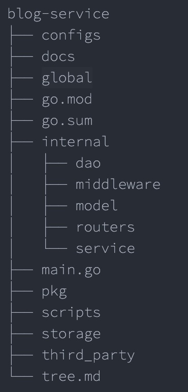

# 用 Gin 编写一个完整的博客后端应用（二）

本章节做项目设计，主要对项目的目录结构、接口方案、路由注册、数据库等内容进行设计和开发。

## 目录结构

创建项目的标准目录结构，以便后续的开发



- `configs`: 配置文件
- `docs`: 文档
- `global`: 全局变量
- `internal`: 内部模块
  - `dao`: 数据访问层（`Database Access Object`）所有与数据相关的操作都会在 `dao` 层进行，如：`MySQL`等
  - `middleware`: `HTTP` 中间件
  - `modle`: 模型层，存放 `model` 对象
  - `routers`: 路由相关逻辑
  - `service`: 项目核心业务逻辑
- `pkg`: 项目相关的模块包
- `storage`: 项目生成的临时文件
- `scripts`: 各类构建、安装、分析等操作的脚本
- `third_party`: 第三方的资源工具，如：`Swagger UI`

## 数据库

本次开发的主要两个业务功能：

- 标签管理：文章的分类，也就是标签，一对多
- 文章管理，对文章进行管理，并与标签进行关联

接着我们设计三个表，一个文章表(`blog_article`)，一个标签表(`blog_tag`)，另一个文章标签关联表(`blog_article_tag`)

### 准备数据库

执行以下 `SQL` 语句

```sql
CREATE DATABASE
IF NOT EXISTS blog_service DEFAULT CHARACTER
SET utf8mb4 DEFAULT COLLATE utf8mb4_general_ci;
```
