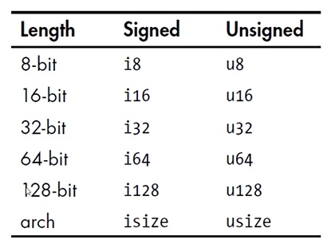
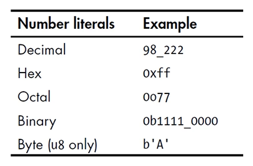
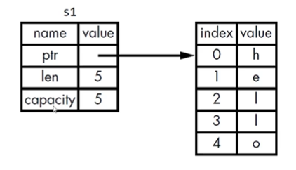
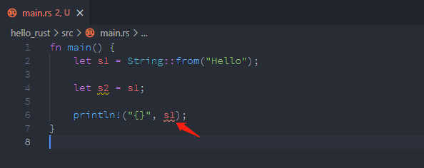
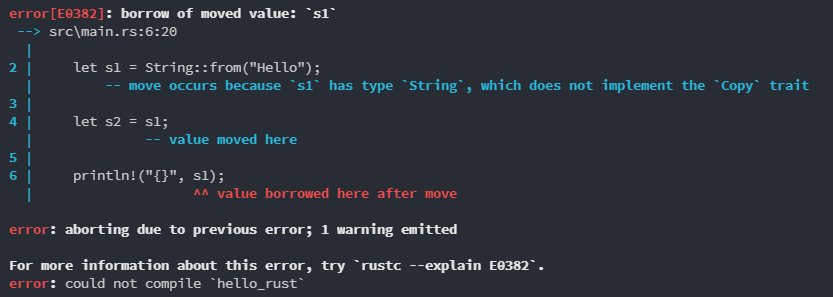
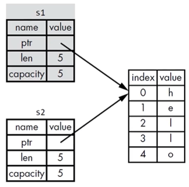
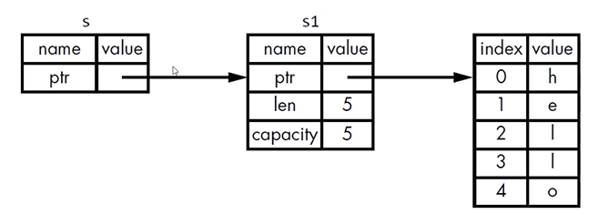
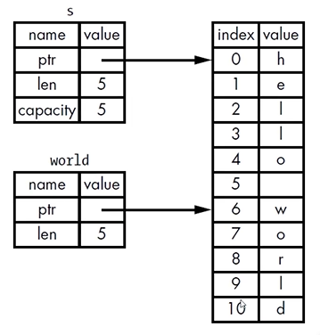

<!-- START doctoc generated TOC please keep comment here to allow auto update -->
<!-- DON'T EDIT THIS SECTION, INSTEAD RE-RUN doctoc TO UPDATE -->

- [Rust 编程语言入门](#rust-%E7%BC%96%E7%A8%8B%E8%AF%AD%E8%A8%80%E5%85%A5%E9%97%A8)
  - [Rust 简介](#rust-%E7%AE%80%E4%BB%8B)
    - [为什么要使用 Rust](#%E4%B8%BA%E4%BB%80%E4%B9%88%E8%A6%81%E4%BD%BF%E7%94%A8-rust)
    - [Hello World](#hello-world)
    - [Hello Cargo](#hello-cargo)
  - [基础概念](#%E5%9F%BA%E7%A1%80%E6%A6%82%E5%BF%B5)
    - [变量与可变性](#%E5%8F%98%E9%87%8F%E4%B8%8E%E5%8F%AF%E5%8F%98%E6%80%A7)
    - [变量与常量](#%E5%8F%98%E9%87%8F%E4%B8%8E%E5%B8%B8%E9%87%8F)
    - [Shadowing(隐藏)](#shadowing%E9%9A%90%E8%97%8F)
    - [数据类型](#%E6%95%B0%E6%8D%AE%E7%B1%BB%E5%9E%8B)
      - [标量类型](#%E6%A0%87%E9%87%8F%E7%B1%BB%E5%9E%8B)
        - [整数类型](#%E6%95%B4%E6%95%B0%E7%B1%BB%E5%9E%8B)
        - [整数字面量](#%E6%95%B4%E6%95%B0%E5%AD%97%E9%9D%A2%E9%87%8F)
        - [整数溢出](#%E6%95%B4%E6%95%B0%E6%BA%A2%E5%87%BA)
        - [浮点类型](#%E6%B5%AE%E7%82%B9%E7%B1%BB%E5%9E%8B)
        - [数值操作](#%E6%95%B0%E5%80%BC%E6%93%8D%E4%BD%9C)
        - [布尔类型](#%E5%B8%83%E5%B0%94%E7%B1%BB%E5%9E%8B)
        - [字符类型](#%E5%AD%97%E7%AC%A6%E7%B1%BB%E5%9E%8B)
      - [复合类型](#%E5%A4%8D%E5%90%88%E7%B1%BB%E5%9E%8B)
        - [Tuple](#tuple)
        - [获取 Tuple 的元素值](#%E8%8E%B7%E5%8F%96-tuple-%E7%9A%84%E5%85%83%E7%B4%A0%E5%80%BC)
        - [访问 Tuple 的元素](#%E8%AE%BF%E9%97%AE-tuple-%E7%9A%84%E5%85%83%E7%B4%A0)
        - [数组](#%E6%95%B0%E7%BB%84)
        - [声明数组](#%E5%A3%B0%E6%98%8E%E6%95%B0%E7%BB%84)
        - [数组的用处](#%E6%95%B0%E7%BB%84%E7%9A%84%E7%94%A8%E5%A4%84)
        - [数组的类型](#%E6%95%B0%E7%BB%84%E7%9A%84%E7%B1%BB%E5%9E%8B)
        - [访问数组的元素](#%E8%AE%BF%E9%97%AE%E6%95%B0%E7%BB%84%E7%9A%84%E5%85%83%E7%B4%A0)
    - [函数](#%E5%87%BD%E6%95%B0)
      - [函数的参数](#%E5%87%BD%E6%95%B0%E7%9A%84%E5%8F%82%E6%95%B0)
      - [函数体重的语句与表达式](#%E5%87%BD%E6%95%B0%E4%BD%93%E9%87%8D%E7%9A%84%E8%AF%AD%E5%8F%A5%E4%B8%8E%E8%A1%A8%E8%BE%BE%E5%BC%8F)
      - [函数的返回值](#%E5%87%BD%E6%95%B0%E7%9A%84%E8%BF%94%E5%9B%9E%E5%80%BC)
    - [注释](#%E6%B3%A8%E9%87%8A)
    - [控制流](#%E6%8E%A7%E5%88%B6%E6%B5%81)
      - [if 表达式](#if-%E8%A1%A8%E8%BE%BE%E5%BC%8F)
        - [在 let 语句中使用 if](#%E5%9C%A8-let-%E8%AF%AD%E5%8F%A5%E4%B8%AD%E4%BD%BF%E7%94%A8-if)
      - [循环](#%E5%BE%AA%E7%8E%AF)
        - [loop](#loop)
        - [while 条件循环](#while-%E6%9D%A1%E4%BB%B6%E5%BE%AA%E7%8E%AF)
        - [使用 for 循环遍历集合](#%E4%BD%BF%E7%94%A8-for-%E5%BE%AA%E7%8E%AF%E9%81%8D%E5%8E%86%E9%9B%86%E5%90%88)
        - [Range](#range)
  - [所有权](#%E6%89%80%E6%9C%89%E6%9D%83)
    - [什么是所有权](#%E4%BB%80%E4%B9%88%E6%98%AF%E6%89%80%E6%9C%89%E6%9D%83)
    - [Stack & Heap](#stack--heap)
      - [存储数据](#%E5%AD%98%E5%82%A8%E6%95%B0%E6%8D%AE)
      - [访问数据](#%E8%AE%BF%E9%97%AE%E6%95%B0%E6%8D%AE)
      - [函数调用](#%E5%87%BD%E6%95%B0%E8%B0%83%E7%94%A8)
      - [所有权存在的原因](#%E6%89%80%E6%9C%89%E6%9D%83%E5%AD%98%E5%9C%A8%E7%9A%84%E5%8E%9F%E5%9B%A0)
    - [所有权规则](#%E6%89%80%E6%9C%89%E6%9D%83%E8%A7%84%E5%88%99)
      - [变量作用域](#%E5%8F%98%E9%87%8F%E4%BD%9C%E7%94%A8%E5%9F%9F)
      - [String 类型](#string-%E7%B1%BB%E5%9E%8B)
      - [创建 String 类型的值](#%E5%88%9B%E5%BB%BA-string-%E7%B1%BB%E5%9E%8B%E7%9A%84%E5%80%BC)
      - [内存和分配](#%E5%86%85%E5%AD%98%E5%92%8C%E5%88%86%E9%85%8D)
      - [变量和数据交互的方式：移动(Move)](#%E5%8F%98%E9%87%8F%E5%92%8C%E6%95%B0%E6%8D%AE%E4%BA%A4%E4%BA%92%E7%9A%84%E6%96%B9%E5%BC%8F%E7%A7%BB%E5%8A%A8move)
      - [String 版本的 Move](#string-%E7%89%88%E6%9C%AC%E7%9A%84-move)
      - [克隆（Clone）](#%E5%85%8B%E9%9A%86clone)
      - [复制](#%E5%A4%8D%E5%88%B6)
    - [所有权与函数](#%E6%89%80%E6%9C%89%E6%9D%83%E4%B8%8E%E5%87%BD%E6%95%B0)
      - [返回值与作用域](#%E8%BF%94%E5%9B%9E%E5%80%BC%E4%B8%8E%E4%BD%9C%E7%94%A8%E5%9F%9F)
    - [引用和借用](#%E5%BC%95%E7%94%A8%E5%92%8C%E5%80%9F%E7%94%A8)
      - [悬空引用 Dangling References](#%E6%82%AC%E7%A9%BA%E5%BC%95%E7%94%A8-dangling-references)
      - [引用的规则](#%E5%BC%95%E7%94%A8%E7%9A%84%E8%A7%84%E5%88%99)
    - [切片](#%E5%88%87%E7%89%87)
  - [struct](#struct)
    - [定义和实例化 struct](#%E5%AE%9A%E4%B9%89%E5%92%8C%E5%AE%9E%E4%BE%8B%E5%8C%96-struct)
      - [什么是 struct](#%E4%BB%80%E4%B9%88%E6%98%AF-struct)
      - [定义 struct](#%E5%AE%9A%E4%B9%89-struct)
      - [实例化 struct](#%E5%AE%9E%E4%BE%8B%E5%8C%96-struct)
      - [在 struct 中取值](#%E5%9C%A8-struct-%E4%B8%AD%E5%8F%96%E5%80%BC)
      - [struct 作为函数返回值](#struct-%E4%BD%9C%E4%B8%BA%E5%87%BD%E6%95%B0%E8%BF%94%E5%9B%9E%E5%80%BC)
      - [字段名简写](#%E5%AD%97%E6%AE%B5%E5%90%8D%E7%AE%80%E5%86%99)
      - [struct 的更新语法](#struct-%E7%9A%84%E6%9B%B4%E6%96%B0%E8%AF%AD%E6%B3%95)
      - [Tuple struct](#tuple-struct)
      - [Unit-Link Struct（空结构体）](#unit-link-struct%E7%A9%BA%E7%BB%93%E6%9E%84%E4%BD%93)
      - [struct 数据的所有权](#struct-%E6%95%B0%E6%8D%AE%E7%9A%84%E6%89%80%E6%9C%89%E6%9D%83)
    - [一个 struct 的例子](#%E4%B8%80%E4%B8%AA-struct-%E7%9A%84%E4%BE%8B%E5%AD%90)
    - [struct 的方法](#struct-%E7%9A%84%E6%96%B9%E6%B3%95)
      - [其他参数](#%E5%85%B6%E4%BB%96%E5%8F%82%E6%95%B0)
      - [关联函数](#%E5%85%B3%E8%81%94%E5%87%BD%E6%95%B0)
      - [多个 impl 块](#%E5%A4%9A%E4%B8%AA-impl-%E5%9D%97)
  - [枚举](#%E6%9E%9A%E4%B8%BE)
    - [定义枚举](#%E5%AE%9A%E4%B9%89%E6%9E%9A%E4%B8%BE)
    - [Option 枚举](#option-%E6%9E%9A%E4%B8%BE)

<!-- END doctoc generated TOC please keep comment here to allow auto update -->

# Rust 编程语言入门

## Rust 简介

### 为什么要使用 Rust

`Rust` 是一门令人兴奋的编程语言，它可以让每个人编写可靠且高效的软件，它可以用来替换 `C/C++`，且具有同样的性能，很多常见的 `Bug` 在编译时就可以被消灭

`Rust` 是一门通用的编程语言，但它更善于以下场景：

- 需要运行时的速度
- 需要内存安全
- 更好的利用多处理器

### Hello World

按照惯例，下面是 `Rust` 版的 `Hello World`

```rust
fn main() {
    println!("Hello World!");
}
```

### Hello Cargo

`Cargo` 是 `Rust` 的构建系统和包惯例工具，构建代码、下载依赖库，构建库等等...

安装 `Rust` 时 `Cargo` 就会被自动安装，使用 `cargo --version` 命令在命令行来查看 `Cargo` 是否被正确安装

我们可以使用 Cargo 来创建项目，执行下面的命令：

```bash
cargo new hello_cargo
```

编译时可以使用 `cargo build`，运行可以使用 `cargo run`

## 基础概念

### 变量与可变性

在 `Rust` 中声明变量使用 `let` 关键字，默认情况下，变量是不可变的（`Immutable`）

```rust
let x = 5;   // 声明一个不可变变量 x
println!("The value of x is {}", x);  // {} 是占位符

x = 6;  // 编译报错
```

那如何才能让声明的变量可变呢？ 答案就是使用 `mut` 关键字

```rust
let mut x = 5;
println!("The value of x is {}", x);  // 5

x = 6;
println!("The value of x is {}", x);  // 6
```

### 变量与常量

常量（`constant`），常量在绑定值以后是不可变的，但它与不可变的变量有很多区别：

- 不可以使用 `mut` 关键字，因为常量永远都是不可变的
- 声明常量使用 `const` 关键字，它的类型必须被标注
- 常量可以在任何作用域进行声明，包括全局作用域
- 常量只可以绑定到常量表达式，无法绑定到函数的调用结果或只能在运行时才能计算出的值

在程序运行期间，常量在其声明的作用域内一直有效

`Rust` 中，常量的命名规范是使用全大写字母，每个单词之间用下划线分隔，例如：`MAX_POINTS`，下面是一个常量声明的例子：

```rust
const MAX_POINTS: u32 = 100_000;
```

### Shadowing(隐藏)

在 `Rust` 中，可以使用相同的名字来声明新的变量，新的变量就会 `shadow` (隐藏) 之前声明的同名变量，看下面的例子：

```rust
let x = 5;  // 声明不可变变量 x
x = x + 1;  // 报错

let x = x + 1;  // 编译通过，第一个x覆盖了前面声明的x， 表达式右边的x就是上面的x
```

`shadow` 和把变量标记为 `mut` 是不一样的：

- 如果不使用 `let` 关键字，那么重新给非 `mut` 的变量赋值会导致编译时错误
- 而使用 `let` 声明的同名新变量，也是不可变的
- 使用 `let` 声明的同名新变量，它的类型可以与之前不同

```rust
let spaces = "    ";  // &str类型
let spaces = spaces.len();  // usize类型
```

### 数据类型

`Rust` 的数据类型分为标量类型和符合类型，`Rust` 是静态编译语言，在编译时必须知道所有变量的类型

在通常情况下，基于使用的值，`Rust` 编译器能够推断出它的具体类型，但如果可能的类型比较多（例如把 `String` 转换为整数的 `parse` 方法），就必须添加类型的标注，否则编译就会报错

```rust
let guess: u32 = "42".parse().expect("Not a number");
// 如果不为guess变量指定变量类型 u32，程序就会报错
```

#### 标量类型

一个标量类型代表一个单个的值，`Rust` 有四个主要的标量类型：

- 整数类型
- 浮点类型
- 布尔类型
- 字符类型

##### 整数类型

整数类型没有小数部分，例如 `u32` 就是一个无符号的整数类型，占据 `32` 位的空间，无符号整数类型以 `u` 开头，有符号整数类型以 `i` 开头，`Rust` 的整数类型列表如下图：



每种整数类型都分 `i` 和 `u`，以及固定的位数，有符号的范围是：`-(2^n - 1)` 到 `2^n - 1`，无符号的范围是：`0` 到 `2^n - 1`

下面的 `arch` 表示系统的架构，`isize` 和 `usize` 类型的位数是由程序运行的计算机的架构所决定的，如果是 `64` 位计算机，那就是 `64` 位，分别是 `i64` 和 `u64`

这两种数据类型使用的并不多，最主要的场景是对某种集合进行索引操作

##### 整数字面量

在 `Rust` 中，整数字面量有十进制、十六进制、八进制、二进制和 `Byte`



在上面的整数字面量中，除了 `byte` 类型外，所有的字面值都允许使用类型后缀，如：`57u8`，它表示值是 `57`，类型是 `u8`

如果你不太清楚应该使用哪种类型，可以使用 `Rust` 提供的默认类型

整数的默认类型是 `i32`，总体来说速度很快，即使是在 `64` 位系统中

##### 整数溢出

例子：`u8` 的范围是 `0` ~ `255`，如果你把一个 `u8` 变量的值设为 `256`，那么会有两种情况发生：

- 在调式模式下编译，`Rust` 会检查整数溢出，如果发生溢出，程序会在运行时 `panic`
- 在发布模式下，（`build --release`）编译，`Rust` 不会检查可能导致 `panic` 的整数溢出

如果溢出发生，`Rust` 就会执行"环绕"操作，如 `256` 设置为 `0`，`257` 设置为 `1` ...

##### 浮点类型

`Rust` 有两种基础的浮点类型，也就是含有小数部分的类型

- `f32`， `32` 位，单精度
- `f64`， `64` 位，双精度

`Rust` 的浮点类型使用 `IEEE-754` 标准来表述，`f64` 是默认类型，在现代 `CPU` 上 `f64` 和 `f32` 的速度差不多，而且精度更高

```rust
let x = 2.0;  // 没有显式指定类型，编译器给x设置了默认的类型f64
let y: f32 = 3.0;  // 显式指定类型f32
```

##### 数值操作

Rust 支持数值的基本操作，如：加减乘除余

```rust
let sum = 5 + 10;
let difference = 95.5 - 4.3;
let product = 4 * 30;
let quotient = 56.7 / 32.2;
let reminder = 54 % 5
```

##### 布尔类型

`Rust` 的布尔类型有两个值： `true` 和 `false`，它们占据一个字节大小，符号是 `bool`

```rust
let t = true;  // 自动推断t的类型是bool
let f: bool = false;  // 显式的指定类型为bool
```

##### 字符类型

`Rust` 中 `char` 类型被用来描述语言中最基础的单个字符，字符类型的字面量使用单引号，占用 `4` 个字节大小，是 `Unicode` 标量值，可以表示比 `ASCII` 多的多的字符内容，如：拼音、中日韩文、零长度空白字符、`emoji` 表情等

```rust
let x = 'z';
let y: char = '∈'
```

#### 复合类型

复合类型可以将多个值放在一个类型里，`Rust` 提供了两种基础的复合类型：元组（`Tuple`）和数组

##### Tuple

`Tuple` 可以将多个类型的多个值放在一个类型里，它的长度是固定的，一旦声明就无法改变。创建 `Tuple`，在小括号中创建，将值用逗号分开，`Tuple` 中的每个位置都对应一个类型，`Tuple` 中个的各元素的类型不必相同

```rust
let tup: (i32, f64, u8) = (500, 6.4, 1)
```

##### 获取 Tuple 的元素值

我们可以使用模式匹配来解构(`destructure`)一个 `Tuple` 来获取元素的值

```rust
let tup: (i32, f64, u8) = (500, 6.4, 1);

let (x, y, z) = tup;

println!("{}, {}, {}", x, y, z);
```

##### 访问 Tuple 的元素

在 `tuple` 变量使用点标记法，后接元素的索引号

```rust
let tup: (i32, f64, u8) = (500, 6.4, 1)
println!("{}, {}, {}", tup.0, tup.1, tup.2)
```

##### 数组

- 数组也可以将多个值放在一个类型里
- 数组中每个元素的类型必须相同
- 数组的长度也是固定的

##### 声明数组

使用中括号将每个元素包裹，并使用逗号隔开

```rust
let a = [1, 2, 3, 4, 5];
```

##### 数组的用处

如果你想让数据存储在 `stack`（栈）上而不是 `heap`（堆）上，或者想保证有固定数量的元素，这时可以使用数组

还有一种数据结构叫 `Vector`，它与数组类似

- `Vector` 和数组类似，它由标准库提供
- `Vector` 的长度是可以改变的
- 如果你不确定应该使用数组还是 `Vector`，那么你就应该使用 `Vector`

##### 数组的类型

数组的类型可以以这种形式表示：[类型; 长度]，例如：

```rust
let a: [i32; 5] = [1, 2, 3, 4, 5];
```

另外一种声明数组的方式：如果数组的每个元素值都相同，那么可以在中括号里指定初始值，然后跟一个"; "，最后是数组的长度，如：

```rust
let a [3; 5]
// 它相同与 let a = [3, 3, 3, 3, 3]
```

##### 访问数组的元素

数组元素的访问跟其他语言是一致的，数组是 Stack 上分配的单个块的内存，可以使用索引来访问数组的元素

```rust
let colors = ["red", "blue", "yellow"];
let c1 = colors[0];
let c2 = colors[1];
```

如果访问的元素索引超出了数组的范围，那么：

- 编译会通过
- 运行会报错（`runtime` 时会 `panic`）

### 函数

声明函数使用 fn 关键字，依照惯例，针对函数和变量名，Rust 使用 snake case 命名规范：所有的字母都是小写，单词之间使用下划线分开

```rust
fn main() {
    println!("Hello World");
    another_function()
}

fn another_function() {
    // ...
}
```

#### 函数的参数

函数的参数分为两个部分，即 `parameters`（形参）和 `arguments`（实参），需要注意的是，函数的参数里，必须声明每个参数的类型

```rust
fn main() {
    another_function(5);  // arguments
}

fn another_function(x: i32) {
    println!("the value of x is: {}", x);
}
```

#### 函数体重的语句与表达式

函数体由一系列语句组成，可选的由一个表达式结束

`Rust` 是一个基于表达式的语言，语句是执行一些动作的指令，表达式会计算产生一个值

函数的定义也是语句，语句不返回值，所以不可以使用 let 将一个语句负值给一个变量

#### 函数的返回值

在 `->` 符号后边声明函数返回值的类型，但是不可以为返回值命名。

在 `Rust` 中，返回值就是函数体里面最后一个表达式的值，若想提前返回，需要使用 `return` 关键字，并指定一个值，大多数函数都是默认使用最后一个表达式作为返回值

```rust
fn five() -> i32 {
    5  // 5是一个表达式，表示 five 函数的返回值，不能加上分号
}

fn main() {
    let x = five();
    println!("The value of x is {}", x);
}
```

```rust
// 函数也可以加上参数
fn plus_five(x: i32) -> i32 {
    x + 5
}

fn main() {
    let x = five(6);
    println!("The value of x is {}", x);
}
```

### 注释

Rust 的注释和其他语言基本相同

```rust
// This is a function
fn five(x: i32) -> i32 {
    x + 5
}

/**
 * 我是多行注释中的第一行
 * 我是第二行
 */
// 也可以使用多个单行注释
// The entry point
fn main() {
    // ...
}
```

### 控制流

#### if 表达式

`if` 表达式允许你根据条件来执行不同的代码分支，这个条件必须是 `bool` 类型

`if` 表达式中，与条件相关联的代码块叫做分支（`arm`），可选的，在后边加上一个 `else` 表达式

```rust
fn main() {
    let number = 3;

    if number < 5 {
        println!("condition was true");
    } else {
        println!("condition was false");
    }
}
```

除此之外，`Rust` 里也可以使用 `else if` 语句来处理多重条件

但如果使用了多于一个 `else if`，那么最好使用 `match` 来重构代码

##### 在 let 语句中使用 if

因为 `if` 是一个表达式，所以可以将它放在 let 语句中等号的右边

```rust
let condition = true;

let number = if condition { 5 } else { 6 };

println!("The value of number is: {}", number);
```

#### 循环

`Rust` 提供了 3 种循环： `loop`、`while` 和 `for`

##### loop

`loop` 关键字告诉 `Rust` 需要反复的执行一块代码，直到你喊停为止

```rust
fn main() {
    loop {
        println!("again")
    }
}
```

上面的代码实际是一段死循环，我们可以在 `loop` 循环中使用 `break` 关键字来告诉程序何时停止

```rust
fn main() {
  let mut counter = 0;

  let result = loop {
      counter += 1;

      if counter == 10 {
          break counter * 2 // 停止循环，并将当前结果乘以2，没有加分号，直接返回结果给result
      }
  };

  println!("The result is: {}", result);
}
```

##### while 条件循环

另外一种常见的循环模式是每次执行循环体之前都判断一次条件，`while` 条件循环就是位这种模式而生的。

```rust
fn main() {
    let mut number = 3;

    while number != 0 {
        println!("{}!", number);
        number -= 1;
    };

    println!("LIFTOFF!!");
}
```

##### 使用 for 循环遍历集合

我们可以使用 `while` 或 `loop` 来遍历集合，但是易错且低效

```rust
fn main() {
    let a = [10, 20, 30, 40, 50];
    let mut index = 0;

    while index < 5 {  // 此处的索引范围容易出错，数组越界会造成panic
        println!("the value is: {}", a[index]);
        index += 1;
    }
}
```

使用 `for` 循环会更加的简洁紧凑，它可以针对集合中的每个元素来执行一些代码

```rust
fn main() {
    let a = [10, 20, 30, 40, 50];
    for element in a.iter() {
        println!("The value is: {}", element);
    }
}
```

由于 `for` 循环的安全、简洁性，所以它在 `Rust` 里用的最多

##### Range

`Range` 是由标准库提供的，它指定一个开始数字和一个结束数字，`Range` 可以生成它们之间的数字（不含结束），此外，还有一个 `rev` 方法，它可以反转 `Range`

```rust
// 使用 for 来实现上面倒计时的例子
fn main() {
    for number in (1..4).rev() {
        println!("{}!", number);
    }

    println!("LIFEOFF!!");
}
```

## 所有权

所有权是 `Rust` 最独特的特性，它让 `Rust` 无需 `GC` 就可以保证内存的安全

### 什么是所有权

`Rust` 的核心特性就是所有权，所有程序在运行时都必须管理它们使用计算机内存的方式，有些语言，如 `C#`、`Java` 有垃圾收集机制，在程序运行时，它们会不断的寻找不再使用的内存，而像 `C`、`C++`则必须由程序员显式的分配和释放内存

`Rust` 没有采用以上两种方式管理内存，而是采用了第三种方式，内存是通过一个所有权系统来管理的，其中包含一组编译器在编译时检查的规则，而且当程序运行时，所有权特性不会减慢程序的运行速度，因为检查是在编译时进行

### Stack & Heap

`Stack` 是栈内存，`Heap` 是堆内存，在像 `Rust` 这样的系统级编程语言里，一个值是在 `Stack` 上还是在 `Heap` 上，对语言的行为和你为什么要做某些决定是由巨大的影响的。

#### 存储数据

在存储数据上，它们是有着明显区别的。

`Stack` 按值的接收顺序来存储，按相反的顺序将它们移除（后进先出，`LIFO`），往 `Stack` 中添加数据叫做压入栈，而移除数据叫做弹出栈

所有存储在 `Heap` 上的数据必须拥有已知的固定的大小，编译时大小未知的数据或运行时大小可能发生变化的数据都必须存放在 `Heap` 上

`Heap` 内存组织性差一些，当你把数据放入 `Heap` 时，会请求一定数量的空间，操作系统在 `Heap` 里找到一块足够大的空间，把它标记为在用，并返回一个指针，也就是这个空间的地址，这个过程叫做在 `Heap` 上进行分配

而把值圧入 `Stack` 上就不叫分配了，指针是已知固定大小的，可以把指针存放在 `Stack` 上，如果想要实际的数据，你必须使用指针来定位。

把数据圧入 `Stack` 要比放在 `Heap` 上分配快很多，因为操作系统不需要寻找用来存储新数据的空间，那个位置永远都在 `Stack` 的顶端，而在 `Heap` 上分配空间需要做更多的工作，操作系统首先需要找到一块足够大的空间来存放数据，然后要做好记录方便下次分配

#### 访问数据

访问 `Heap` 中的数据要比访问 `Stack` 中的数据慢，因为需要通过指针才能找到 `Heap` 中的数据，对于现代处理器来说，由于缓存的缘故，如果指令在内存中跳转的次数越少，那么速度就越快

- 如果数据存放的距离比较近，那么处理器的处理速度就会更快一些（`Stack` 上）
- 如果数据之间的距离比较远，那么处理速度就会慢一些（`Heap` 上）

另外，在 `Heap` 上分配大量的空间也是需要时间的。

#### 函数调用

当你的代码调用函数时，值被传入到函数(也包括指向 `Heap` 的指针)，函数本地的变量被压到 `Stack` 上，当函数结束后，这些值会从 `Stack` 上弹出

#### 所有权存在的原因

所有权解决的问题：

- 跟踪代码的哪些部分正在使用 `Heap` 中的哪些数据
- 最小化 `Heap` 上的重复数据量
- 清理 `Heap` 上未使用的数据以避免空间不足

一旦你理解了所有权，那么久不需要经常去关注 `Stack` 和 `Heap` 了，但知道管理 `Heap` 数据是所有权存在的原因，这有助于解释它为什么会这样工作

### 所有权规则

- 每个值都有一个变量，这个变量是该值的所有者
- 每个值同时只能有一个所有者
- 当所有者超出作用域（`scope`）时，该值将被删除

#### 变量作用域

`Scope` 就是程序中一个项目的有效范围

```rust
fn main() {
    // 本行 s 不可用，未声明
    let s = "Hello";  // 本行开始 s 可用，已声明
    // ...
} // 本行开始 s 不可用，其作用域到此结束
```

#### String 类型

`String` 类型比其他基础标量类型更加复杂，标量类型存放在栈上，当离开作用域时，它们就会被弹出栈，我们需要一个存放在 `Heap` 上的数据类型， `String` 类型就比较合适

字符串字面值（非 `String` 类型），在程序中手写的那些字符串值，它们是不可变的。`Rust` 还有第二种字符串类型：`String`，它在 `Heap` 上分配，能存储在编译时未知数量的文本

#### 创建 String 类型的值

我们可以使用 `from` 函数从字符串字面值创建出 `String` 类型

```rust
let s = String::from("Hello");
```

`::` 表示 `from` 函数是 `String` 类型下的函数，而返回的变量 `s` 就是可以被修改的

```rust
fn main() {
    let mut s = String::from("Hello");

    s.push_str(", World");

    println!("{}", s);
}
```

为什么 `String` 类型的值可以被修改，而字符串字面值却不能被修改? 这是因为它们处理内存的方式不同

#### 内存和分配

对于字符串字面值，在编译时就知道它的内容了，其文本内容直接被硬编码到最终的可执行文件里，它的特点就是速度快、高效，是因为其不可变性

而 `String` 类型，为了支持可变性，需要在 `Heap` 上分配内存来保存编译时未知的文本内容，也就是说，操作系统必须在运行时来请求内存，这步是通过调用 String::from 函数来实现的。

当调用完 `String` 之后，需要使用某种方式将内存返回给操作系统，针对这个步骤，在拥有 `GC` 的语言中，`GC` 会跟踪并清理不再使用的内存，而在没有 `GC` 的语言里，就需要我们去识别内存何时不再使用，并调用代码将它返回。

如果忘了上述操作，那就是浪费内存了，如果提前做了，变量就会非法，如果做了两次，也就是非常严重的 `BUG` 了，所以必须一次分配对应一次释放。

而 `Rust` 采用了不通的方式，对于某个值来说，当拥有它的变量走出作用域时，内存就会立即自动的交还给操作系统，也就是释放。

在 `Rust` 中，当变量走出作用域时，会自动调用一个叫 `drop` 的函数来处理释放内存的操作

#### 变量和数据交互的方式：移动(Move)

多个变量可以与同一个数据使用一种独特的方式来交互

```rust
let x = 5;  // 将值 5 绑定到变量 x 上
let y = x;  // 创建 x 的副本，并绑定到变量 y 上
// 此时，存在两个变量 x、y，它们绑定的值都是 5
```

整数类型是已知且固定大小的值，这两个 `5` 都背压到了 `Stack` 中

#### String 版本的 Move

我们将上面的例子换成 String

```rust
let s1 = String::from("Hello");  // 使用 String 的 from 函数从字符串字面量中创建 String s1
let s2 = s1;  // 与上面例子中的赋值完全不一样
```

看下图：



一个 `String` 由 3 部分构成：

- 一个指向存放字符串内容的内存的指针，上图 `s1` 中的 `ptr`
- 一个长度，`len`
- 一个容量，`capacity`

上面的 `s1` 放在 `Stack` 上，而存放字符串内容的部分在 `Heap` 上，长度 `len`，就是存放字符串内容所需的字节数，容量 `capacity` 是指 `String` 从操作系统总共或的内存的总字节数

上面例子的代码中，当 `s1` 赋值给 `s2` 时，`String` 的数据被复制了一份，如下图：


这个被拷贝的副本数据，也就是 `s2` 存放在 `Stack` 上，包括指针、长度和容量，但并没有复制指针所指向的 `Heap` 中的数据

当变量离开作用域时，`Rust` 会自动调用 `drop` 函数，并将变量使用的 `Heap` 中的内存释放，而当 `s1`、`s2` 都离开作用域时，它们都会尝试释放相同的内存，这时就会引起二次释放（`double free`）的 `BUG`

为了保证内存使用安全，`Rust` 没有尝试复制被分配的内存，它会让 `s1` 失效，当 `s1` 离开作用域时，`Rust` 不需要释放任何东西，还是上面的例子，我们来看看当 `s2` 被创建以后，再使用 `s1` 的结果是什么



已经提示报错了， 我们来看看编译时的错误信息



在编程语言中，都存在浅拷贝（`shallow copy`）和深拷贝（`deep copy`），你也许会将复制指针、长度和容量视为浅拷贝，但由于 `Rust` 让 `s1` 失效了，所以我们用一个新的术语：移动(`Move`)



这里还隐含了一个设计原则，`Rust` 不会自动创建数据的深拷贝，就运行时性能而言，任何自动赋值的操作都是廉价的。

#### 克隆（Clone）

如果想对 `Heap` 上的 `String` 数据进行深度拷贝，而不仅仅是 `Stack` 上的数据，我们可以使用 `clone` 方法，还是上面的例子，看下面的代码

```rust
fn main() {
    let s1 = String::from("Hello");
    let s2 = s1.clone();

    println!("{}, {}", s1, s2);
}
```

#### 复制

`Copy trait`，`trait` 可以理解为接口，它可以用于像整数这样完全存放在 `Stack` 上的类型，如果一个类型实现了 `Copy` 这个 `trait`，那么旧的变量在赋值后仍然可用

如果一个类型或者该类型的一部分实现了 `Drop trait`，那么 `Rust` 就不允许让它再去实现 `Copy trait` 了。

那么那些类型拥有 `Copy trait` 呢

- 任何简单标量的组合类型都可以是 `Copy` 的
- 任何需要分配内存或某种资源的都不是 `Copy` 的
- 一些拥有 `Copy trait` 的类型：
  - 所有的整数类型，例如：`i32`
  - `bool`
  - `char`
  - 所有的浮点类型，例如 `f64`
  - `Tuple`（元组类型），如果其所有的字段都是 `Copy` 的，如：`(i32, i32)`，而`(i32, String)`则不是

### 所有权与函数

在语义上，将值传递给函数和把值赋给变量是类似的，将值传递给函数，要么发生移动，要么发生复制

```rust
fn main() {
    let s = String::from("Hello World");

    take_ownership(s); // 传递引用

    let x = 5;

    makes_copy(x); // i32类型是基本类型，传递的是副本

    println!("x: {}", x);
}

fn take_ownership(some_string: String) {
    println!("{}", some_string);
}

fn makes_copy(some_number: i32) {
    println!("{}", some_number);
}
```

#### 返回值与作用域

函数在返回值的过程中同样也会发生所有权的转移

```rust
fn main() {
    let s1 = gives_ownership();

    let s2 = String::from("Hello");

    let s3 = takes_and_gives_back(s2);  // 发生了所有权转移
}

fn gives_ownership() -> String {
    let some_string = String::from("Hello");
    some_string
}

fn takes_and_gives_back(a_string: String) -> String {
    a_string
}
```

一个变量的所有权总是遵循同样的模式：

- 把一个值赋给其他变量时就会发生移动
- 当一个包含 `Heap` 数据的变量离开作用域时，它的值就会被 `drop` 函数清理，除非数据的所有权移动到另一个变量上

### 引用和借用

先来看下面的例子：

```rust
fn main() {
    let s1 = String::from("Hello");
    let len = calculate_length(&s1);  // 参数传递引用

    println!("The length of '{}' is {}.", s1, len);
}

fn calculate_length(s: &String) -> usize {
    s.len()
}
```

上面的列子中，`calculate_length` 函数接收的是一个引用，类型是 `&String`，而不是 `String`，`&`符号表示引用，它允许你引用某些值而无需取得其所有权



除了引用，还有一个解引用，其他语言都是用的 `*`，`Rust` 中也使用这个

我们把引用作为函数参数的这种行为叫做借用。

并且不可以修改借用的变量，和变量一样，引用默认也是不可变的

```rust
s.push_str(", World");  // Error
```

我们知道，如果给变量加上 mut 关键字，它就是可变的，那引用可以使用 mut 吗？ 答案是可以的

```rust
fn main() {
    let mut s1 = String::from("Hello");    // 加上mut关键字，使变量可变
    let len = calculate_length(&mut s1);  // 引用变量s1，加上mut关键字

    println!("The length of '{}' is {}.", s1, len);
}

fn calculate_length(s: &mut String) -> usize {  // 函数参数也要加上mut关键字
    s.len()
}
```

对于这种可变引用，有一个重要的限制，在特定作用域内，对某一块数据，只能有一个可变的引用。

```rust
fn main() {
    let mut s = String::from("Hello");
    let s1 = &mut s;
    let s2 = &mut s;  // Error

    println!("The length of '{}' is {}.", s1, s2);
}
```

`Rust` 这样设计的好处在于，可以在编译时防止数据竞争，以下三种行为下会发生数据竞争：

- 两个或多个指针同时访问同一个数据
- 至少有一个指针用于写入数据
- 没有使用任何机制来同步对数据的访问

同时，我们也可以通过创建新的作用域，来允许非同时的创建多个可变引用

```rust
fn main() {
    let mut s = String::from("Hello");

    {
        let s1 = &mut s;
    }

    let s2 = &mut s;
}
```

实际上还有另外一个限制，在 `Rust` 中，不可以同时拥有一个可变引用和一个不变引用，多个不可变引用是允许的。

```rust
fn main() {
    let mut s = String::from("Hello");
    let r1 = &s;
    let r2 = &s;
    let s1 = &mut s;    // Error

    println!("{}, {}, {}", r1, r2, s1);
}
```

#### 悬空引用 Dangling References

悬空指针（`Dangling Pointer`）：一个指针引用了内存中的某个地址，而这块内存可能已经释放并分配给其他变量使用了。

在 `Rust` 中，编译器可以保证引用永远都不是悬空引用，如果你引用了某些数据，编译器将保证在引用离开作用域之前数据不会离开作用域。

```rust
fn main() {
    let r = dangle();
}

fn dangle() -> &String {
    let s = String::from("Hello");
    &s
}
// 编译就会报错，悬空指针
```

#### 引用的规则

- 在任何给定的时刻，只能满足以下条件之一：
  - 一个可变的引用
  - 任意数量不可变的引用
- 引用必须一直有效

### 切片

在 `Rust` 中，还有一种不持有所有权的数据类型：切片（`Slice`）

我们先从一到题目开始，编写一个函数，它具备以下功能：

- 它接收字符串作为参数
- 返回它在这个字符串里找到的第一个单词
- 如果函数没有找到任何空格，那么整个字符串就被返回

```rust
fn main() {
    let mut s = String::from("Hello World");
    let wordIndex = first_word(&s);

    println!("{}", wordIndex);
}

fn first_word(s: &String) -> usize {
    let bytes = s.as_bytes();

    for (i, &item) in bytes.iter().enumerate() {
        if item == b' ' {
            return i;
        }
    }
    s.len()
}
```

好像上面的代码没有什么问题，但如果我们在 `main` 函数中调用 `s.clear()`，那么获取其长度就没有任何意义了，并且如果想要使用索引获取第一个单词，就会引发 `BUG`

为了解决这个问题，`Rust` 引入了字符串切片（`Slice`），它是指向字符串中一部分内容的引用

```rust
fn main() {
    let s = String::from("Hello World");

    let hello = &s[0..5];   // 字符串切片，索引从0-4，不包含最后的5
    let world = &s[6..11];  // 字符串切片，索引从6-10，不包含最后的11
}
```

切片的表示形式：[开始索引..结束索引]，开始索引就是切片起始位置的索引值，结束索引是切片终止位置的下一个索引值



切片的写法与 Golang 中是基本一致的，而且我们可以使用省略的语法糖

```rust
...
let hello = &s[..5];  // 表示从第一个字符开始
let world = &s[6..];  // 表示结束的字符是最后一个
...
```

同样的，我们也可以使用语法糖来表示整个字符串

```rust
let whole = &s[0..s.len()];  // 这是第一种写法
let whole2 = &s[..];  // 这是第二种
```

注意点：

- 字符串切片的范围索引必须发生在有效的 `UTF-8` 字符边界内。
- 如果尝试从一个多字节的字符中创建字符串切片，程序就会报错并退出

OK，现在我们使用字符串切片来重写最开始的那个函数

```rust
fn first_word(s: &String) -> &str {   // &str 表示返回一个字符串切片
    let bytes = s.as_bytes();

    for (i, &item) in bytes.iter().enumerate() {
        if item == b' ' {
            return &s[..i];
        }
    }
    &s[..]
}
```

其实，字符串字面值就是切片，字符串字面值被直接存储在二进制程序中。

如：`let s = "Hello World"`;

变量 `s` 的类型是 `&str`，它是一个指向二进制程序特定位置的切片，`&str` 是不可变引用，所以字符串字面值也是不可变的。

那么，我们如何将字符串切片作为参数传递呢?

```rust
fn first_word(s: &String) -> &str {    // 参数使用 &String
    // ...
}
```

其实，函数 `first_word` 的参数也可以是字符串切片，采用 `&str` 作为参数类型，这样，参数就可以同时接收 `String` 类型和 `&str` 类型的参数了

```rust
fn first_word(s: &str) -> &str {    // 参数使用 &str
    // ...
}
```

使用字符串切片，可以直接调用该函数，如果使用 `String`，可以创建一个完整的 `String` 切片来调用该函数。定义函数时使用字符串切片来代替字符串引用会使我们的 `API` 更加通用，且不会损失任何功能。

## struct

`struct` 数据结构是结构体的意思，这个在 `C`、`C++`和 `Golang` 中都有

### 定义和实例化 struct

#### 什么是 struct

`struct` 就是结构体，它是 一种自定义的数据类型，它允许我们为相关联的值命名，打包，然后输出一个有意义的组合

#### 定义 struct

定义结构体使用 `struct` 关键字，并为整个 `struct` 命名，后面跟上花括号，并在其中为所有字段（`Field`）定义名称和类型，如：

```rust
struct User {
    uername: String,
    email: String,
    sign_in_count: u64,
    active: bool,
}
```

#### 实例化 struct

想要使用 `struct`，我们需要创建 `struct` 的实例，并为每个字段制定具体值，这时无需按声明的顺序进行指定，如实例化上面的例子：

```rust
let user1 = User {
    email: String::from("someone@example.com"),
    uesrname: String::from("someusername123"),
    active: true,
    sign_in_count: 1,
}
```

注意：实例化某个 `struct` 时，必须为所有定义的字段指定值，否则将会报错

#### 在 struct 中取值

与其他语言一样，我们可以使用点标记法，来访问 `struct` 中的字段值

```rust
let mut user1 = User {
    email: String::from("someone@example.com"),
    uesrname: String::from("someusername123"),
    active: true,
    sign_in_count: 1,
}

user1.email = String::from("anotheremail@example.com");  // 为email附上其他的值，实例必须是可变的
```

注意：一旦 `struct` 的实例被定义为可变的，那么实例中的所有字段都是可变的

#### struct 作为函数返回值

`struct` 是可以作为函数的返回值的

```rust
fn build_user(email: String, username: String) -> User {
    User {
        email: String::from("someone@example.com"),
        uesrname: String::from("someusername123"),
        active: true,
        sign_in_count: 1,
    }
}
```

#### 字段名简写

当字段名与字段值赌赢的变量名相同时，我们就可以使用字段初始化简写的方式：

```rust
fn build_user(email: String, username: String) -> User {
    User {
        email,        // 简写
        username,     // 简写
        active: true,
        sign_in_count: 1,
    }
}
```

#### struct 的更新语法

当你想基于某个 `struct` 的实例来创建一个新的实例的时候，可以使用 `struct` 的更新语法，如我们要创建一个新的 `user2` 实例

```rust
let user2 = User {
    email: String::from("another@example.com"),   // email发生改变
    uesrname: String::from("someusername567"),    // username发生改变
    active: true,                                 // 未发生改变
    sign_in_count: 1,                             // 未发生改变
}
```

如果使用更新语法，可以这样写：

```rust
let user2 = User {
    email: String::from("another@example.com"),   // email发生改变
    uesrname: String::from("someusername567"),    // username发生改变
    ..user1
}
```

#### Tuple struct

在 `Rust` 中，我们可以定义类似 `tuple` 的 `struct`，叫做 `tuple struct`，这个 `tuple struct` 整体是有名称的，但里面的元素没有名称，这个结构适用于想给整个 `tuple` 起一个名字，且并不同于其他的 `tuple`，而且又不需要给每个元素起名

如何定义 `tuple struct`， 使用 `struct` 关键字，后面是名字，以及里面元素的类型

```rust
struct Color(i32, i32, i32);
struct Point(i32, i32, i32);
let black = Color(0, 0, 0);   // 实例
let origin = Point(0, 0, 0);  // 实例
```

需要注意的是，上面的 `black` 和 `origin` 是不同的类型，因为它们是不同的 `tuple struct` 的实例

#### Unit-Link Struct（空结构体）

`Unit-Link Struct` 就是空结构体，没有任何字段的 `struct`，与 `()`，单元类型相似。它适用于需要在某个类型上实现某个 `trait`（与接口相似），但在里面有没有想要存储的数据

#### struct 数据的所有权

还是上面的例子：

```rust
struct User {
    uername: String,
    email: String,
    sign_in_count: u64,
    active: bool,
}
```

`username` 和 `email` 两个字段使用了 `String`，而非 `&str` 切片，下面两个是标量类型，所以这个 `struct` 拥有所有数据的的所有权。只要 `struct` 实例是有效的，那么里面的字段数据也是有效的。

另外 `struct` 中的字段也可以存放引用，需要使用生命周期。生命周期保证只要 `struct` 实例是有效的，那么里面的引用也是有效的，如果 `struct` 里存储引用，而不使用生命周期，那么就会报错。

### 一个 struct 的例子

我们来做一个 `struct` 的例子，这个例子是计算一个长方体的面积，其实一开始很简单，看下面的代码：

```rust
fn main() {
    let w = 30;
    let l = 50;

    println!("{}", area(w, l));  // 1500
}

// 计算长方体面积的函数 area
fn area(width: u32, height: u32) -> u32 {
    width * height
}
```

可以看出，这个需求很简单，但是函数 area 的参数不是很直观，而且需要传入两个参数，这时我们想到了用 `Tuple` 来表示长方体的长和宽

```rust
fn main() {
    let rect = (30, 50);

    println!("{}", area(rect));  // 1500
}

fn area(rect: (u32, u32)) -> u32 {
    rect.0 * rect.1
}
```

这样，我们用了一个元组来解决参数的问题，但是元组没有键来表示字段属性，所以，我们再使用 `struct` 来表示长方体的属性

```rust
// 定义struct
struct Rectangle {
    width: u32,
    height: u32,
}

fn main() {
    // 实例化struct
    let rect = Rectangle {
        width: 30,
        height: 50,
    }

    println!("{}", area(&rect));  // 传入引用
}

fn area(rect: &Rectangle) -> u32 {
    rect.width * rect.height
}
```

这样看上去就很不错了，如果我们想要打印这个 `struct`，需要在定义 `struct` 时加上注解

```rust
#[derive(Debug)]   // 注解
struct Rectangle {
    width: u32,
    height: u32,
}

fn main() {
    let rect = Rectangle {
        width: 30,
        height: 50,
    };

    println!("{}", area(&rect));

    println!("{:#?}", rect);  // 正确打印struct，不会报错
}

fn area(rect: &Rectangle) -> u32 {
    rect.width * rect.height
}

```

### struct 的方法

方法与函数类似：由 `fn` 关键字定义、有名称、参数和返回值

它们的不同之处在于：方法是在 `struct`（或 `enum`、`trait`）的上下文中定义，第一个参数是 `self`，表示方法被调用的 `struct` 实例

如何为 `struct` 定义方法呢? 还是上面的计算长方体面积的例子

```rust
struct Rectangle {
    width: u32,
    height: u32,
}

// 需要使用 impl 关键字来为 Rectangle 这个 struct 声明方法 area
// 相当于将 area 计算面积的方法与 struct 关联起来
impl Rectangle {
    fn area(&self) => u32 {
        self.width * self.height
    }
}

fn main() {
    let rect = Rectangle {
        width: 30,
        height: 50,
    }

    println!("{}", rect.area());  // 直接使用struct实例来调用area方法，且无需传入参数
}
```

为 `struct` 定义方法，需要在 `impl` 块里定义方法，方法的第一个参数可以是 `&self`，也可以获得其所有权或可变借用，和其他参数一样，这样可以获得更良好的代码组织。

`Rust` 会自动引用或解引用，在调用方法时就会发生这种行为，在调用方法时，`Rust` 根据情况自动添加 `&`、`&mut` 或 `*`，以便 `object` 可以匹配方法的签名。

#### 其他参数

在 `struct` 的方法中，除了 `&self` 参数外，也可以带其他的一个或多个参数。还是上面的例子，我们增加一个方法，该方法用来判断一个长方形是否能容纳另一个长方形

```rust
struct Rectangle {
    width: u32,
    height: u32,
}

impl Rectangle {
    fn area(&self) -> u32 {
        self.width * self.height
    }

    // 判断一个长方形是否能容纳另一个长方形
    // 只需要比较长和宽即可
    fn can_hold(&self, other: &Rectangle) -> bool {
        self.width > other.width && self.height > other.height
    }
}
```

#### 关联函数

我们可以在 `impl` 块里定义不把 `self` 作为第一个参数的函数，它们叫关联函数（不是方法），例如：`String::from()`

关联函数通常用于构造器，也就是初始化时使用的函数，例如我们可以构造一个正方形，同样是上面的例子

```rust
struct Rectangle {
    width: u32,
    height: u32,
}

impl Rectangle {
    // 返回面积
    fn area(&self) -> u32 {
        self.width * self.height
    }

    // 判断大小
    fn can_hold(&self, other: Rectangle) -> bool {
        self.width > other.width && self.height > other.height
    }

    // 关联函数，用于构造一个正方形
    // 它的参数可以不以 self 开始
    fn square(size: u32) -> Rectangle {
        Rectangle {
            width: size,
            height: size,
        }
    }
}

fn main() {
    // 调用关联函数，创建正方形
    let s = Rectangle::square(20);
}
```

#### 多个 impl 块

每个 `struct` 允许拥有多个 `impl` 块

## 枚举

### 定义枚举

枚举就是允许我们列举所有可能的值来定义的一个类型

比如 `IP` 地址，它可能是两种不同类型的，一个是 `IPv4`、一个是 `IPv6`

```rust
// 定义的数据类型，其中v4和v6都是变体
enum IpAddrKind {
    V4,
    V6,
}
```

那么如何创建枚举值呢? 枚举值 = 枚举名::变体名 , 如：

```rust
let four = IpAddrKind::V4;
let six = IpAddrKind::V6;
```

下面是使用枚举的例子：

```rust
enum IpAddrKind {
    V4,
    V6,
}

fn main() {
    let four = IpAddrKind::V4;
    let six = IpAddrKind::V6;

    route(four);    // 直接使用枚举值
    route(six);     // 直接使用枚举值
    route(IpAddrKind::V6);   // 也可以直接创建枚举
}

fn route(ip_kind: IpAddrKind) {
    println!("{}", ip_kind);
}
```

枚举是自定义的数据类型，它可以作为 `struct` 中任意属性值的类型

```rust
enum IpAddrKind {
    V4,
    V6,
}

// 使用struct来存储IP地址相关的信息
struct IpAddr {
    kind: IpAddrKind, // 使用枚举作为 struct 中属性的值类型
    address: String,
}

fn main() {
    let home = IpAddr {
        kind: IpAddrKind::V4, // 直接创建枚举值
        address: String::from("127.0.0.1"),
    };

    let loopback = IpAddr {
        kind: IpAddrKind::V6, // 直接创建枚举值
        address: String::from("::1"),
    };
}
```

在 `Rust` 中，允许将数据直接附加到枚举的变体中。

```rust
enum IpAddr {
    V4(String),   // 直接指定枚举值的类型为 String
    V6(String),   // 直接指定枚举值的类型为 String
}
```

这样做的优点在于，它不需要额外的 `struct`，每个变体可以拥有不同 的类型以及关联的数据量，例如：

```rust
enum IpAddr {
    V4(u8, u8, u8, u8),   // 用4个u8类型的值表示IPv4的数据
    V6(String),
}
```

改写上面的例子：

```rust
enum IpAddrKind {
    V4(u8, u8, u8, u8),
    V6(String),
}

fn main() {
    let home = IpAddrKind::V4(127, 0, 0, 1);
    let loopback = IpAddrKind::V6(String::from("::1"));
}
```

标准库中有个 IpAddr，我们来看下它的结构：

```rust
struct Ipv4Addr {
    // --snip--
}

struct Ipv6Addr {
    // --snip--
}

enum IpAddr {
    V4(Ipv4Addr),  // 我们可以在变体的类型中嵌入任意的类型
    V6(Ipv6Addr),
}
```

枚举的变体可以嵌入任意的类型，甚至是另一个枚举，看下面的例子：

```rust
enum Message {
    Quit,                           // 没有关联任何类型的数据
    Move { x: i32, y: i32 },        // 关联了一个匿名的结构体
    Write(String),                  // 关联了一个字符串
    ChangeColor(i32, i32, i32),     // 关联了一个元组
}

fn main() {
    let q = Message::Quit;
    let m = Message::Move { x: 12, y: 24 };
    let w = Message::Write(String::from("Hello"));
    let c = Message::ChangeColor(0, 255, 255);
}
```

枚举也可以定义方法，与 `struct` 一样，我们可以使用 `impl` 关键字来定义方法

```rust
enum Message {
    Quit,
    Move { x: i32, y: i32 },
    Write(String),
    ChangeColor(i32, i32, i32),
}

// 在 Message 枚举上定义方法 call
impl Message {
    fn call(&self) {}
}

fn main() {
    let q = Message::Quit;
    let m = Message::Move { x: 12, y: 24 };
    let w = Message::Write(String::from("Hello"));
    let c = Message::ChangeColor(0, 255, 255);

    m.call();  // 使用枚举的实例m调用call方法
}
```

### Option 枚举

`Option` 枚举是定义在标准库中的，在 `Prelude`（预导入模块）中，它描述了某个值可能存在（某种类型）或可能不存在的情况。

在其他语言中，都有一个 `Null` 类型，`Null` 是一个值，它表示"没有值"或空值，一个变量可以处于两种状态：空值（`null`）或者非空

`Null` 的创造者曾经表示，`Null` 引用就是一个 `Billion Dollar Mistake`，也就是价值十亿美元的错误。举个例子，如果你有一个字符串类型的值和一个可能为 `Null` 的值连接（相加），这时就会引发错误，也就是说当你尝试想使用非 `Null` 值那样使用 `Null` 值时可能就会引发某种错误。

因此，在 `Rust` 中，没有 `Null`，但 `Null` 的这个概念还有有用的，它可以表示因某种原因而变为无效或缺失的值。

所以，`Rust` 提供了一个类似 `Null` 概念的枚举：`Option<T>`，它在标准库中的定义是这样的：

```rust
enum Option<T> {
    Some(T),
    None,     // 这个就表示Null
}
```

它包含在 Prelude（预导入模块）中，可以直接使用

- `Option<T>`
- `Some<T>`
- `None`

```rust
fn main() {
    let some_number = Some(5);  // Rust自动推断为 i32 类型
    let some_string = Some("A String");   // 自动推断为 String 类型
    let absent_number: Option<i32> = None;  // Null类型，无法推断，需要显式的声明T类型，当前为i32
}
```

那么，`Option<T>` 比 `Null` 好在哪呢?

`Option<T>` 和 `T` 是不同的类型，我们不可以把 `Option<T>` 直接当成 `T` 来使用，看下面的例子：

```rust
fn main() {
    let x: i8 = 5;
    let y: Option<i8> = Some(5);

    let sum = x + y;    // 这行会报错
}
```

上面例子中最后的计算会报错，`Rust` 认为 `Option<i8>` 和 `i8` 不是同一种类型，所以它们无法进行加法运算，那如何让它们能计算呢? 那就是将 `Option<i8>` 转换为 `i8` 类型即可。

所以，若想使用 `Option<T>` 中的 `T`，就必须将它转换为 `T`

这就避免了像在其他语言里的情况，在无法确定一个值是否为 `Null` 的情况下使用它，就有可能会出错，而 `Rust` 这种处理避免了这种错误的出现
