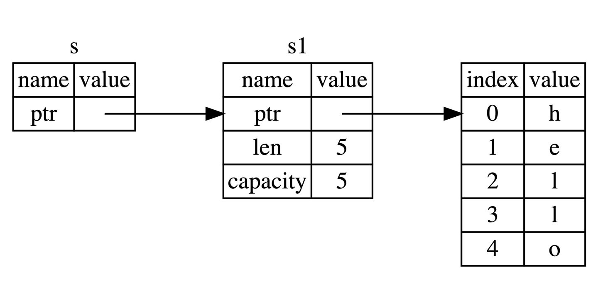

<!-- START doctoc generated TOC please keep comment here to allow auto update -->
<!-- DON'T EDIT THIS SECTION, INSTEAD RE-RUN doctoc TO UPDATE -->
**Table of Contents**  *generated with [DocToc](https://github.com/thlorenz/doctoc)*

- [Rust语言圣经(读书笔记)](#rust%E8%AF%AD%E8%A8%80%E5%9C%A3%E7%BB%8F%E8%AF%BB%E4%B9%A6%E7%AC%94%E8%AE%B0)
  - [基础入门](#%E5%9F%BA%E7%A1%80%E5%85%A5%E9%97%A8)
    - [变量绑定与解构](#%E5%8F%98%E9%87%8F%E7%BB%91%E5%AE%9A%E4%B8%8E%E8%A7%A3%E6%9E%84)
      - [变量命名](#%E5%8F%98%E9%87%8F%E5%91%BD%E5%90%8D)
      - [变量绑定](#%E5%8F%98%E9%87%8F%E7%BB%91%E5%AE%9A)
      - [变量可变性](#%E5%8F%98%E9%87%8F%E5%8F%AF%E5%8F%98%E6%80%A7)
      - [下划线开头的变量](#%E4%B8%8B%E5%88%92%E7%BA%BF%E5%BC%80%E5%A4%B4%E7%9A%84%E5%8F%98%E9%87%8F)
      - [变量解构](#%E5%8F%98%E9%87%8F%E8%A7%A3%E6%9E%84)
      - [常量](#%E5%B8%B8%E9%87%8F)
      - [变量遮蔽(shadowing)](#%E5%8F%98%E9%87%8F%E9%81%AE%E8%94%BDshadowing)
    - [基本类型](#%E5%9F%BA%E6%9C%AC%E7%B1%BB%E5%9E%8B)
      - [类型推导与标注](#%E7%B1%BB%E5%9E%8B%E6%8E%A8%E5%AF%BC%E4%B8%8E%E6%A0%87%E6%B3%A8)
      - [数值类型](#%E6%95%B0%E5%80%BC%E7%B1%BB%E5%9E%8B)
        - [整数类型](#%E6%95%B4%E6%95%B0%E7%B1%BB%E5%9E%8B)
        - [浮点类型](#%E6%B5%AE%E7%82%B9%E7%B1%BB%E5%9E%8B)
        - [NaN](#nan)
        - [数字运算](#%E6%95%B0%E5%AD%97%E8%BF%90%E7%AE%97)
        - [位运算](#%E4%BD%8D%E8%BF%90%E7%AE%97)
        - [序列(Range)](#%E5%BA%8F%E5%88%97range)
        - [有理数和复数](#%E6%9C%89%E7%90%86%E6%95%B0%E5%92%8C%E5%A4%8D%E6%95%B0)
      - [字符、布尔、单元类型](#%E5%AD%97%E7%AC%A6%E5%B8%83%E5%B0%94%E5%8D%95%E5%85%83%E7%B1%BB%E5%9E%8B)
        - [字符类型(char)](#%E5%AD%97%E7%AC%A6%E7%B1%BB%E5%9E%8Bchar)
        - [布尔(bool)](#%E5%B8%83%E5%B0%94bool)
        - [单元类型](#%E5%8D%95%E5%85%83%E7%B1%BB%E5%9E%8B)
      - [语句与表达式](#%E8%AF%AD%E5%8F%A5%E4%B8%8E%E8%A1%A8%E8%BE%BE%E5%BC%8F)
        - [语句](#%E8%AF%AD%E5%8F%A5)
        - [表达式](#%E8%A1%A8%E8%BE%BE%E5%BC%8F)
      - [函数](#%E5%87%BD%E6%95%B0)
        - [要点](#%E8%A6%81%E7%82%B9)
        - [函数参数](#%E5%87%BD%E6%95%B0%E5%8F%82%E6%95%B0)
        - [函数返回](#%E5%87%BD%E6%95%B0%E8%BF%94%E5%9B%9E)
        - [无返回值](#%E6%97%A0%E8%BF%94%E5%9B%9E%E5%80%BC)
        - [发散函数](#%E5%8F%91%E6%95%A3%E5%87%BD%E6%95%B0)
    - [所有权和借用](#%E6%89%80%E6%9C%89%E6%9D%83%E5%92%8C%E5%80%9F%E7%94%A8)
      - [所有权](#%E6%89%80%E6%9C%89%E6%9D%83)
        - [栈(Stack)与堆(Heap)](#%E6%A0%88stack%E4%B8%8E%E5%A0%86heap)
        - [所有权原则](#%E6%89%80%E6%9C%89%E6%9D%83%E5%8E%9F%E5%88%99)
        - [变量绑定的数据交互](#%E5%8F%98%E9%87%8F%E7%BB%91%E5%AE%9A%E7%9A%84%E6%95%B0%E6%8D%AE%E4%BA%A4%E4%BA%92)
        - [函数传值与返回](#%E5%87%BD%E6%95%B0%E4%BC%A0%E5%80%BC%E4%B8%8E%E8%BF%94%E5%9B%9E)
      - [引用和借用](#%E5%BC%95%E7%94%A8%E5%92%8C%E5%80%9F%E7%94%A8)
        - [引用与解引用](#%E5%BC%95%E7%94%A8%E4%B8%8E%E8%A7%A3%E5%BC%95%E7%94%A8)
        - [不可变引用](#%E4%B8%8D%E5%8F%AF%E5%8F%98%E5%BC%95%E7%94%A8)
        - [可变引用](#%E5%8F%AF%E5%8F%98%E5%BC%95%E7%94%A8)
        - [悬垂引用(Dangling References)](#%E6%82%AC%E5%9E%82%E5%BC%95%E7%94%A8dangling-references)
      - [借用规则总结](#%E5%80%9F%E7%94%A8%E8%A7%84%E5%88%99%E6%80%BB%E7%BB%93)
    - [复合类型](#%E5%A4%8D%E5%90%88%E7%B1%BB%E5%9E%8B)
      - [字符串与切片](#%E5%AD%97%E7%AC%A6%E4%B8%B2%E4%B8%8E%E5%88%87%E7%89%87)
        - [切片(slice)](#%E5%88%87%E7%89%87slice)
        - [字符串字面量是切片](#%E5%AD%97%E7%AC%A6%E4%B8%B2%E5%AD%97%E9%9D%A2%E9%87%8F%E6%98%AF%E5%88%87%E7%89%87)
        - [什么是字符串](#%E4%BB%80%E4%B9%88%E6%98%AF%E5%AD%97%E7%AC%A6%E4%B8%B2)
        - [String 与 &str 的转换](#string-%E4%B8%8E-str-%E7%9A%84%E8%BD%AC%E6%8D%A2)
        - [字符串索引](#%E5%AD%97%E7%AC%A6%E4%B8%B2%E7%B4%A2%E5%BC%95)
        - [字符串切片](#%E5%AD%97%E7%AC%A6%E4%B8%B2%E5%88%87%E7%89%87)
        - [操作字符串](#%E6%93%8D%E4%BD%9C%E5%AD%97%E7%AC%A6%E4%B8%B2)
        - [字符串转义](#%E5%AD%97%E7%AC%A6%E4%B8%B2%E8%BD%AC%E4%B9%89)
        - [操作 UTF-8 字符串](#%E6%93%8D%E4%BD%9C-utf-8-%E5%AD%97%E7%AC%A6%E4%B8%B2)
        - [字符串深度剖析](#%E5%AD%97%E7%AC%A6%E4%B8%B2%E6%B7%B1%E5%BA%A6%E5%89%96%E6%9E%90)
      - [元组](#%E5%85%83%E7%BB%84)
        - [用模式匹配解构元组](#%E7%94%A8%E6%A8%A1%E5%BC%8F%E5%8C%B9%E9%85%8D%E8%A7%A3%E6%9E%84%E5%85%83%E7%BB%84)
        - [用 `.` 来访问元组](#%E7%94%A8--%E6%9D%A5%E8%AE%BF%E9%97%AE%E5%85%83%E7%BB%84)
        - [元组的使用示例](#%E5%85%83%E7%BB%84%E7%9A%84%E4%BD%BF%E7%94%A8%E7%A4%BA%E4%BE%8B)
      - [结构体](#%E7%BB%93%E6%9E%84%E4%BD%93)
        - [结构体语法](#%E7%BB%93%E6%9E%84%E4%BD%93%E8%AF%AD%E6%B3%95)
        - [元组结构体(Tuple Struct)](#%E5%85%83%E7%BB%84%E7%BB%93%E6%9E%84%E4%BD%93tuple-struct)
        - [单元结构体(Unit-like Struct)](#%E5%8D%95%E5%85%83%E7%BB%93%E6%9E%84%E4%BD%93unit-like-struct)
        - [结构体数据的所有权](#%E7%BB%93%E6%9E%84%E4%BD%93%E6%95%B0%E6%8D%AE%E7%9A%84%E6%89%80%E6%9C%89%E6%9D%83)
        - [使用 `#[derive(Debug)]` 来打印结构体的信息](#%E4%BD%BF%E7%94%A8-derivedebug-%E6%9D%A5%E6%89%93%E5%8D%B0%E7%BB%93%E6%9E%84%E4%BD%93%E7%9A%84%E4%BF%A1%E6%81%AF)
      - [枚举](#%E6%9E%9A%E4%B8%BE)
        - [枚举值](#%E6%9E%9A%E4%B8%BE%E5%80%BC)
        - [同一化类型](#%E5%90%8C%E4%B8%80%E5%8C%96%E7%B1%BB%E5%9E%8B)
        - [Option 枚举用于处理空值](#option-%E6%9E%9A%E4%B8%BE%E7%94%A8%E4%BA%8E%E5%A4%84%E7%90%86%E7%A9%BA%E5%80%BC)
      - [数组](#%E6%95%B0%E7%BB%84)
        - [创建数组](#%E5%88%9B%E5%BB%BA%E6%95%B0%E7%BB%84)
        - [访问数组元素](#%E8%AE%BF%E9%97%AE%E6%95%B0%E7%BB%84%E5%85%83%E7%B4%A0)
        - [数组切片](#%E6%95%B0%E7%BB%84%E5%88%87%E7%89%87)
    - [流程控制](#%E6%B5%81%E7%A8%8B%E6%8E%A7%E5%88%B6)
      - [使用 if 来做分支控制](#%E4%BD%BF%E7%94%A8-if-%E6%9D%A5%E5%81%9A%E5%88%86%E6%94%AF%E6%8E%A7%E5%88%B6)
      - [使用 else if 来处理多重条件](#%E4%BD%BF%E7%94%A8-else-if-%E6%9D%A5%E5%A4%84%E7%90%86%E5%A4%9A%E9%87%8D%E6%9D%A1%E4%BB%B6)
      - [循环控制](#%E5%BE%AA%E7%8E%AF%E6%8E%A7%E5%88%B6)
        - [for 循环](#for-%E5%BE%AA%E7%8E%AF)
        - [continue](#continue)
        - [break](#break)
        - [while 循环](#while-%E5%BE%AA%E7%8E%AF)
        - [loop 循环](#loop-%E5%BE%AA%E7%8E%AF)
    - [模式匹配](#%E6%A8%A1%E5%BC%8F%E5%8C%B9%E9%85%8D)
      - [match 和 if let](#match-%E5%92%8C-if-let)
        - [match](#match)
        - [if let 匹配](#if-let-%E5%8C%B9%E9%85%8D)
        - [matches!宏](#matches%E5%AE%8F)
      - [解构 Option](#%E8%A7%A3%E6%9E%84-option)
      - [模式适用场景](#%E6%A8%A1%E5%BC%8F%E9%80%82%E7%94%A8%E5%9C%BA%E6%99%AF)
      - [全模式列表](#%E5%85%A8%E6%A8%A1%E5%BC%8F%E5%88%97%E8%A1%A8)
    - [方法 Method](#%E6%96%B9%E6%B3%95-method)
      - [定义方法](#%E5%AE%9A%E4%B9%89%E6%96%B9%E6%B3%95)
      - [带有多个参数的方法](#%E5%B8%A6%E6%9C%89%E5%A4%9A%E4%B8%AA%E5%8F%82%E6%95%B0%E7%9A%84%E6%96%B9%E6%B3%95)
      - [关联函数](#%E5%85%B3%E8%81%94%E5%87%BD%E6%95%B0)
      - [多个 impl 定义](#%E5%A4%9A%E4%B8%AA-impl-%E5%AE%9A%E4%B9%89)
      - [为枚举实现方法](#%E4%B8%BA%E6%9E%9A%E4%B8%BE%E5%AE%9E%E7%8E%B0%E6%96%B9%E6%B3%95)
    - [泛型和特征](#%E6%B3%9B%E5%9E%8B%E5%92%8C%E7%89%B9%E5%BE%81)
      - [泛型](#%E6%B3%9B%E5%9E%8B)
        - [泛型详解](#%E6%B3%9B%E5%9E%8B%E8%AF%A6%E8%A7%A3)
        - [结构体中使用泛型](#%E7%BB%93%E6%9E%84%E4%BD%93%E4%B8%AD%E4%BD%BF%E7%94%A8%E6%B3%9B%E5%9E%8B)
        - [枚举中使用泛型](#%E6%9E%9A%E4%B8%BE%E4%B8%AD%E4%BD%BF%E7%94%A8%E6%B3%9B%E5%9E%8B)
        - [方法中使用泛型](#%E6%96%B9%E6%B3%95%E4%B8%AD%E4%BD%BF%E7%94%A8%E6%B3%9B%E5%9E%8B)
        - [const泛型](#const%E6%B3%9B%E5%9E%8B)
        - [泛型的性能](#%E6%B3%9B%E5%9E%8B%E7%9A%84%E6%80%A7%E8%83%BD)
      - [特征 Trait](#%E7%89%B9%E5%BE%81-trait)
        - [定义特征](#%E5%AE%9A%E4%B9%89%E7%89%B9%E5%BE%81)
        - [为类型实现特征](#%E4%B8%BA%E7%B1%BB%E5%9E%8B%E5%AE%9E%E7%8E%B0%E7%89%B9%E5%BE%81)
        - [特征定义与实现的位置(孤儿规则)](#%E7%89%B9%E5%BE%81%E5%AE%9A%E4%B9%89%E4%B8%8E%E5%AE%9E%E7%8E%B0%E7%9A%84%E4%BD%8D%E7%BD%AE%E5%AD%A4%E5%84%BF%E8%A7%84%E5%88%99)
        - [默认实现](#%E9%BB%98%E8%AE%A4%E5%AE%9E%E7%8E%B0)
        - [使用特征作为函数参数](#%E4%BD%BF%E7%94%A8%E7%89%B9%E5%BE%81%E4%BD%9C%E4%B8%BA%E5%87%BD%E6%95%B0%E5%8F%82%E6%95%B0)
        - [特征约束(trait bound)](#%E7%89%B9%E5%BE%81%E7%BA%A6%E6%9D%9Ftrait-bound)
        - [函数返回中的 impl Trait](#%E5%87%BD%E6%95%B0%E8%BF%94%E5%9B%9E%E4%B8%AD%E7%9A%84-impl-trait)
        - [通过 derive 派生特征](#%E9%80%9A%E8%BF%87-derive-%E6%B4%BE%E7%94%9F%E7%89%B9%E5%BE%81)
      - [特征对象](#%E7%89%B9%E5%BE%81%E5%AF%B9%E8%B1%A1)
      - [深入特征](#%E6%B7%B1%E5%85%A5%E7%89%B9%E5%BE%81)
        - [关联类型](#%E5%85%B3%E8%81%94%E7%B1%BB%E5%9E%8B)
        - [默认泛型类型参数](#%E9%BB%98%E8%AE%A4%E6%B3%9B%E5%9E%8B%E7%B1%BB%E5%9E%8B%E5%8F%82%E6%95%B0)
        - [调用同名的方法](#%E8%B0%83%E7%94%A8%E5%90%8C%E5%90%8D%E7%9A%84%E6%96%B9%E6%B3%95)
    - [集合类型](#%E9%9B%86%E5%90%88%E7%B1%BB%E5%9E%8B)
      - [动态数组 Vector](#%E5%8A%A8%E6%80%81%E6%95%B0%E7%BB%84-vector)
        - [创建动态数组](#%E5%88%9B%E5%BB%BA%E5%8A%A8%E6%80%81%E6%95%B0%E7%BB%84)
        - [更新 Vector](#%E6%9B%B4%E6%96%B0-vector)
        - [Vector 与其元素共存亡](#vector-%E4%B8%8E%E5%85%B6%E5%85%83%E7%B4%A0%E5%85%B1%E5%AD%98%E4%BA%A1)
        - [从 Vector 中读取元素](#%E4%BB%8E-vector-%E4%B8%AD%E8%AF%BB%E5%8F%96%E5%85%83%E7%B4%A0)
        - [迭代遍历 Vector 中的元素](#%E8%BF%AD%E4%BB%A3%E9%81%8D%E5%8E%86-vector-%E4%B8%AD%E7%9A%84%E5%85%83%E7%B4%A0)
      - [KV 存储 HashMap](#kv-%E5%AD%98%E5%82%A8-hashmap)
        - [创建 HashMap](#%E5%88%9B%E5%BB%BA-hashmap)
        - [所有权转移](#%E6%89%80%E6%9C%89%E6%9D%83%E8%BD%AC%E7%A7%BB)
        - [查询 HashMap](#%E6%9F%A5%E8%AF%A2-hashmap)
        - [更新 HashMap 中的值](#%E6%9B%B4%E6%96%B0-hashmap-%E4%B8%AD%E7%9A%84%E5%80%BC)
    - [生命周期](#%E7%94%9F%E5%91%BD%E5%91%A8%E6%9C%9F)
      - [悬垂指针和生命周期](#%E6%82%AC%E5%9E%82%E6%8C%87%E9%92%88%E5%92%8C%E7%94%9F%E5%91%BD%E5%91%A8%E6%9C%9F)
      - [借用检查](#%E5%80%9F%E7%94%A8%E6%A3%80%E6%9F%A5)
      - [函数中的生命周期](#%E5%87%BD%E6%95%B0%E4%B8%AD%E7%9A%84%E7%94%9F%E5%91%BD%E5%91%A8%E6%9C%9F)
      - [生命周期标注语法](#%E7%94%9F%E5%91%BD%E5%91%A8%E6%9C%9F%E6%A0%87%E6%B3%A8%E8%AF%AD%E6%B3%95)
      - [结构体中的生命周期](#%E7%BB%93%E6%9E%84%E4%BD%93%E4%B8%AD%E7%9A%84%E7%94%9F%E5%91%BD%E5%91%A8%E6%9C%9F)
      - [生命周期消除](#%E7%94%9F%E5%91%BD%E5%91%A8%E6%9C%9F%E6%B6%88%E9%99%A4)
      - [方法中的生命周期](#%E6%96%B9%E6%B3%95%E4%B8%AD%E7%9A%84%E7%94%9F%E5%91%BD%E5%91%A8%E6%9C%9F)
      - [静态生命周期](#%E9%9D%99%E6%80%81%E7%94%9F%E5%91%BD%E5%91%A8%E6%9C%9F)
    - [返回值和错误处理](#%E8%BF%94%E5%9B%9E%E5%80%BC%E5%92%8C%E9%94%99%E8%AF%AF%E5%A4%84%E7%90%86)
      - [panic 深入剖析](#panic-%E6%B7%B1%E5%85%A5%E5%89%96%E6%9E%90)
        - [backtrace 栈展开](#backtrace-%E6%A0%88%E5%B1%95%E5%BC%80)
        - [panic 时的两种终止方式](#panic-%E6%97%B6%E7%9A%84%E4%B8%A4%E7%A7%8D%E7%BB%88%E6%AD%A2%E6%96%B9%E5%BC%8F)
      - [可恢复的错误 Result](#%E5%8F%AF%E6%81%A2%E5%A4%8D%E7%9A%84%E9%94%99%E8%AF%AF-result)
    - [包和模块](#%E5%8C%85%E5%92%8C%E6%A8%A1%E5%9D%97)
      - [包和 Package](#%E5%8C%85%E5%92%8C-package)
        - [定义](#%E5%AE%9A%E4%B9%89)
        - [项目 Package](#%E9%A1%B9%E7%9B%AE-package)
      - [模块 Module](#%E6%A8%A1%E5%9D%97-module)
        - [创建嵌套模块](#%E5%88%9B%E5%BB%BA%E5%B5%8C%E5%A5%97%E6%A8%A1%E5%9D%97)
        - [用路径引用模块](#%E7%94%A8%E8%B7%AF%E5%BE%84%E5%BC%95%E7%94%A8%E6%A8%A1%E5%9D%97)
        - [代码可见性](#%E4%BB%A3%E7%A0%81%E5%8F%AF%E8%A7%81%E6%80%A7)
        - [使用 super 引用模块](#%E4%BD%BF%E7%94%A8-super-%E5%BC%95%E7%94%A8%E6%A8%A1%E5%9D%97)
        - [使用 self 引用模块](#%E4%BD%BF%E7%94%A8-self-%E5%BC%95%E7%94%A8%E6%A8%A1%E5%9D%97)
        - [结构体和枚举的可见性](#%E7%BB%93%E6%9E%84%E4%BD%93%E5%92%8C%E6%9E%9A%E4%B8%BE%E7%9A%84%E5%8F%AF%E8%A7%81%E6%80%A7)
      - [使用 use 及受限可见性](#%E4%BD%BF%E7%94%A8-use-%E5%8F%8A%E5%8F%97%E9%99%90%E5%8F%AF%E8%A7%81%E6%80%A7)
        - [基本引入方式](#%E5%9F%BA%E6%9C%AC%E5%BC%95%E5%85%A5%E6%96%B9%E5%BC%8F)
        - [使用 {} 简化引入方式](#%E4%BD%BF%E7%94%A8--%E7%AE%80%E5%8C%96%E5%BC%95%E5%85%A5%E6%96%B9%E5%BC%8F)
        - [使用 * 引入模块下的所有项](#%E4%BD%BF%E7%94%A8--%E5%BC%95%E5%85%A5%E6%A8%A1%E5%9D%97%E4%B8%8B%E7%9A%84%E6%89%80%E6%9C%89%E9%A1%B9)
    - [注释和文档](#%E6%B3%A8%E9%87%8A%E5%92%8C%E6%96%87%E6%A1%A3)
      - [注释的种类](#%E6%B3%A8%E9%87%8A%E7%9A%84%E7%A7%8D%E7%B1%BB)
      - [代码注释](#%E4%BB%A3%E7%A0%81%E6%B3%A8%E9%87%8A)
      - [文档注释](#%E6%96%87%E6%A1%A3%E6%B3%A8%E9%87%8A)
      - [包和模块级别的注释](#%E5%8C%85%E5%92%8C%E6%A8%A1%E5%9D%97%E7%BA%A7%E5%88%AB%E7%9A%84%E6%B3%A8%E9%87%8A)
      - [文档测试(Doc Test)](#%E6%96%87%E6%A1%A3%E6%B5%8B%E8%AF%95doc-test)
      - [文档注释中的代码跳转](#%E6%96%87%E6%A1%A3%E6%B3%A8%E9%87%8A%E4%B8%AD%E7%9A%84%E4%BB%A3%E7%A0%81%E8%B7%B3%E8%BD%AC)
      - [文档搜索别名](#%E6%96%87%E6%A1%A3%E6%90%9C%E7%B4%A2%E5%88%AB%E5%90%8D)
    - [格式化输出](#%E6%A0%BC%E5%BC%8F%E5%8C%96%E8%BE%93%E5%87%BA)
      - [print!，println!，format](#printprintlnformat)
      - [{} 与 {:?}](#-%E4%B8%8E-)
      - [位置参数](#%E4%BD%8D%E7%BD%AE%E5%8F%82%E6%95%B0)
      - [具名参数](#%E5%85%B7%E5%90%8D%E5%8F%82%E6%95%B0)
      - [格式化参数](#%E6%A0%BC%E5%BC%8F%E5%8C%96%E5%8F%82%E6%95%B0)
      - [宽度](#%E5%AE%BD%E5%BA%A6)
      - [在格式化字符串时捕获环境中的值](#%E5%9C%A8%E6%A0%BC%E5%BC%8F%E5%8C%96%E5%AD%97%E7%AC%A6%E4%B8%B2%E6%97%B6%E6%8D%95%E8%8E%B7%E7%8E%AF%E5%A2%83%E4%B8%AD%E7%9A%84%E5%80%BC)
  - [高级进阶](#%E9%AB%98%E7%BA%A7%E8%BF%9B%E9%98%B6)
  - [异步编程](#%E5%BC%82%E6%AD%A5%E7%BC%96%E7%A8%8B)
  - [疑难点](#%E7%96%91%E9%9A%BE%E7%82%B9)
  - [自动化测试](#%E8%87%AA%E5%8A%A8%E5%8C%96%E6%B5%8B%E8%AF%95)
  - [Cargo使用指南](#cargo%E4%BD%BF%E7%94%A8%E6%8C%87%E5%8D%97)
  - [日志监控](#%E6%97%A5%E5%BF%97%E7%9B%91%E6%8E%A7)
  - [最佳实践](#%E6%9C%80%E4%BD%B3%E5%AE%9E%E8%B7%B5)
  - [实现链表](#%E5%AE%9E%E7%8E%B0%E9%93%BE%E8%A1%A8)
  - [编译错误](#%E7%BC%96%E8%AF%91%E9%94%99%E8%AF%AF)
  - [性能优化](#%E6%80%A7%E8%83%BD%E4%BC%98%E5%8C%96)
  - [标准库](#%E6%A0%87%E5%87%86%E5%BA%93)
  - [附录](#%E9%99%84%E5%BD%95)

<!-- END doctoc generated TOC please keep comment here to allow auto update -->

# Rust语言圣经(读书笔记)

## 基础入门

### 变量绑定与解构

#### 变量命名

`Rust` 跟其他语言在命名上没有太大的区别，在变量命名时，需要遵循 `Rust` 命名规范，请参考最佳实践中的命名规范

#### 变量绑定

在其它语言中，我们用 `var a = "hello world"` 的方式给 `a` 赋值, 而在 `Rust` 中，我们这样写： `let a = "hello world"` ，同时给这个过程起了另一个名字：变量绑定。

#### 变量可变性

`Rust` 的变量在默认情况下是不可变的, 你可以通过 `mut` 关键字让变量变为可变的

```rs
fn main() {
    let x = 5;
    println!("The value of x is: {}", x);
    x = 6;
    println!("The value of x is: {}", x); // 报错
}
```

在 `Rust` 中，可变性很简单，只要在变量名前加一个 `mut` 即可

```rs
fn main() {
    let mut x = 5; // 变量 x 是可变的
    println!("The value of x is: {}", x);
    x = 6;
    println!("The value of x is: {}", x);
}
```

选择可变还是不可变，更多的还是取决于你的使用场景，例如不可变可以带来安全性，但是丧失了灵活性和性能（如果你要改变，就要重新创建一个新的变量，这里涉及到内存对象的再分配）。而可变变量最大的好处就是使用上的灵活性和性能上的提升

#### 下划线开头的变量

如果你创建了一个变量却不在任何地方使用它，`Rust` 通常会给你一个警告, 如果你希望 `Rust` 不要警告未使用的变量，可以用下划线作为变量名的开头

```rs
fn main() {
    let _x = 5;
    let y = 10;
}
```

#### 变量解构

`let` 表达式不仅仅用于变量的绑定，还能进行复杂变量的解构：从一个相对复杂的变量中，匹配出该变量的一部分内容：

```rs
fn main() {
    let (a, mut b): (bool,bool) = (true, false);
    // a = true,不可变; b = false，可变
    println!("a = {:?}, b = {:?}", a, b);

    b = true;
    assert_eq!(a, b);
}
```

#### 常量

常量(`constant`), 与不可变变量一样，常量也是绑定到一个常量名且不允许更改的值，但是常量和变量之间存在一些差异：

- 常量不允许使用 `mut`
- 常量使用 `const` 关键字而不是 `let` 关键字来声明，并且值的类型必须标注

#### 变量遮蔽(shadowing)

`Rust` 允许声明相同的变量名，在后面声明的变量会遮蔽掉前面声明的(相当于覆盖,或者替换)

```rs
fn main() {
    let x = 5;
    // 在main函数的作用域内对之前的x进行遮蔽
    let x = x + 1;

    {
        // 在当前的花括号作用域内，对之前的x进行遮蔽
        let x = x * 2;
        println!("The value of x in the inner scope is: {}", x);  // 12
    }

    println!("The value of x is: {}", x); // 6
}
```

**理解：** 使用 `mut` 关键字的性能更好，它不会发生内存对象再分配，而遮蔽会生成完全不同的新变量，只是变量名相同而已。

### 基本类型

`Rust` 每个值都有其确切的数据类型，总的来说可以分为两类：基本类型和复合类型, 基本类型由以下组成：

- 数值类型: 有符号整数 (`i8`, `i16`, `i32`, `i64`, `isize`)、 无符号整数 (`u8`, `u16`, `u32`, `u64`, `usize`) 、浮点数 (`f32`, `f64`)、以及有理数、复数
- 字符串：字符串字面量和字符串切片 `&str`
- 布尔类型： `true` 和 `false`
- 字符类型: 表示单个 `Unicode` 字符，存储为 4 个字节
- 单元类型: 即 `()` ，其唯一的值也是 `()`

#### 类型推导与标注

`Rust` 是一门静态类型语言，也就是编译器必须在编译期知道我们所有变量的类型，它可以根据变量的值和上下文中的使用方式来自动推导出变量的类型

#### 数值类型

`Rust` 使用一个相对传统的语法来创建整数（1，2，...）和浮点数（1.0，1.1，...）。整数、浮点数的运算和你在其它语言上见过的一致，都是通过常见的运算符来完成

##### 整数类型

整数是没有小数部分的数字。之前使用过的 `i32` 类型，表示有符号的 32 位整数（ `i` 是英文单词 `integer` 的首字母，与之相反的是 `u`，代表无符号 `unsigned` 类型）。下表显示了 `Rust` 中的内置的整数类型：

|长度|有符号类型|无符号类型|
|--|--|--|
|8位|i8|u8|
|16位|i16|u16|
|32位|i32|u32|
|64位|i64|u64|
|128位|i128|u128|
|视架构而定|isize|usize|

`Rust` 整型默认使用 `i32`，例如 `let i = 1`，那 `i` 就是 `i32` 类型，因此你可以首选它，同时该类型也往往是性能最好的

整型溢出问题，如果操作使得目标数据超出定义的整型类型范围，比如：给一个 `u8` 类型的变量绑定 256，则会发生整型溢出，在 `debug` 模式编译时，`Rust` 会检查整型溢出，若存在这些问题，则使程序在编译时 `panic`。当使用 `--release` 参数进行 `release` 模式构建时，`Rust` 不检测溢出，它会按照补码循环溢出的规则处理，比如上面的例子，则会返回 0。

要显式处理可能的溢出，可以使用标准库针对原始数字类型提供的这些方法：

- 使用 `wrapping_*` 方法在所有模式下都按照补码循环溢出规则处理，例如 `wrapping_add`
- 如果使用 `checked_*` 方法时发生溢出，则返回 `None` 值
- 使用 `overflowing_*` 方法返回该值和一个指示是否存在溢出的布尔值
- 使用 `saturating_*` 方法使值达到最小值或最大值

```rs
fn main() {
    let a : u8 = 255;
    let b = a.wrapping_add(20);
    println!("{}", b);  // 19
}
```

##### 浮点类型

浮点类型数字 是带有小数点的数字，在 `Rust` 中浮点类型数字也有两种基本类型： `f32` 和 `f64`，分别为 `32` 位和 `64` 位大小。默认浮点类型是 `f64`

```rs
fn main() {
    let x = 2.0; // f64
    let y: f32 = 3.0; // f32
}
```

浮点数根据 `IEEE-754` 标准实现。`f32`类型是单精度浮点型，`f64` 为双精度。

浮点数运算应避免测试相等性，且当结果在数学上可能存在未定义时，要格外小心。

##### NaN

对于数学上未定义的结果，例如对负数取平方根 `-42.1.sqrt()` ，会产生一个特殊的结果：`Rust` 的浮点数类型使用 `NaN` (not a number)来处理这些情况。

所有跟 `NaN` 交互的操作，都会返回一个 `NaN`，而且 `NaN` 不能用来比较

```rs
fn main() {
  let x = (-42.0_f32).sqrt();
  assert_eq!(x, x); // panic
}
```

我们可以使用 `is_nan()` 等方法，可以用来判断一个数值是否是 `NaN`

```rs
fn main() {
    let x = (-42.0_f32).sqrt();
    if x.is_nan() {
        println!("未定义的数学行为")
    }
}
```

##### 数字运算

`Rust` 支持所有数字类型的基本数学运算：加法、减法、乘法、除法和取模运算。下面代码各使用一条 `let` 语句来说明相应运算的用法：

```rs
fn main() {
    // 加法
    let sum = 5 + 10;

    // 减法
    let difference = 95.5 - 4.3;

    // 乘法
    let product = 4 * 30;

    // 除法
    let quotient = 56.7 / 32.2;

    // 求余
    let remainder = 43 % 5;
}
```

综合示例：

```rs
fn main() {
  // 编译器会进行自动推导，给予twenty i32的类型
  let twenty = 20;
  // 类型标注
  let twenty_one: i32 = 21;
  // 通过类型后缀的方式进行类型标注：22是i32类型
  let twenty_two = 22i32;

  // 只有同样类型，才能运算
  let addition = twenty + twenty_one + twenty_two;
  println!("{} + {} + {} = {}", twenty, twenty_one, twenty_two, addition);

  // 对于较长的数字，可以用_进行分割，提升可读性
  let one_million: i64 = 1_000_000;
  println!("{}", one_million.pow(2));

  // 定义一个f32数组，其中42.0会自动被推导为f32类型
  let forty_twos = [
    42.0,
    42f32,
    42.0_f32,
  ];

  // 打印数组中第一个值，并控制小数位为2位
  println!("{:.2}", forty_twos[0]);
}
```

##### 位运算

`Rust` 的运算基本上和其他语言一样


```rs
fn main() {
    // 二进制为00000010
    let a:i32 = 2;
    // 二进制为00000011
    let b:i32 = 3;

    println!("(a & b) value is {}", a & b);

    println!("(a | b) value is {}", a | b);

    println!("(a ^ b) value is {}", a ^ b);

    println!("(!b) value is {} ", !b);

    println!("(a << b) value is {}", a << b);

    println!("(a >> b) value is {}", a >> b);

    let mut a = a;
    // 注意这些计算符除了!之外都可以加上=进行赋值 (因为!=要用来判断不等于)
    a <<= b;
    println!("(a << b) value is {}", a);
}
```

##### 序列(Range)

`Rust` 提供了一个非常简洁的方式，用来生成连续的数值，例如 `1..5`，生成从 1 到 4 的连续数字，不包含 5 ；`1..=5`，生成从 1 到 5 的连续数字，包含 5，它的用途很简单，常常用于循环中：

```rs
for i in 1..=5 {
    println!("{}",i);
}
```

序列只允许用于数字或字符类型

```rs
for i in 'a'..='z' {
    println!("{}",i);
}
```

##### 有理数和复数

有理数和复数并未包含在标准库中，社区已开发出高质量的数值库： `num`。 在 `Cargo.toml` 中的 `[dependencies]` 下添加一行 `num = "0.4.0"`

```rs
use num::complex::Complex;

fn main() {
  let a = Complex { re: 2.1, im: -1.2 };
  let b = Complex::new(11.1, 22.2);
  let result = a + b;

  println!("{} + {}i", result.re, result.im)
}
```

#### 字符、布尔、单元类型

##### 字符类型(char)

字符，你可以把它理解为英文中的字母，中文中的汉字

```rs
fn main() {
    let c = 'z';
    let z = 'ℤ';
    let g = '国';
    let heart_eyed_cat = '😻';
}
```

`Rust` 的字符不仅仅是 `ASCII`，所有的 `Unicode` 值都可以作为 `Rust` 字符，包括单个的中文、日文、韩文、emoji 表情符号等等

由于 `Unicode` 都是 4 个字节编码，因此字符类型也是占用 4 个字节

```rs
fn main() {
    let x = '中';
    println!("字符'中'占用了{}字节的内存大小",std::mem::size_of_val(&x));
}
```

`Rust` 的字符只能用 `''` 来表示， `""` 是留给字符串的

##### 布尔(bool)

`Rust` 中的布尔类型有两个可能的值：`true` 和 `false`，布尔值占用内存的大小为 1 个字节：

```rs
fn main() {
    let t = true;

    let f: bool = false; // 使用类型标注,显式指定f的类型

    if f {
        println!("这是段毫无意义的代码");
    }
}
```

##### 单元类型

单元类型就是 `()`  ，唯一的值也是 `()`。上面经常用到的 `main` 函数就返回这个单元类型 `()`, 在 `Rust` 中，没有返回值的函数是有单独的定义的：发散函数( `diverge function` )，顾名思义，无法收敛的函数

`println!()` 的返回值也是单元类型 `()`

#### 语句与表达式

Rust 的函数体是由一系列语句组成，最后由一个表达式来返回值

```rs
fn add_with_extra(x: i32, y: i32) -> i32 {
    let x = x + 1; // 语句
    let y = y + 5; // 语句
    x + y // 表达式
}
```

##### 语句

语句完成一个具体的操作，但是并没有返回值

```rs
let a = 8;
let b: Vec<f64> = Vec::new();
let (a, c) = ("hi", false);
```

##### 表达式

表达式会进行求值，然后返回一个值。例如 `5 + 6`，在求值后，返回值 `11`，因此它就是一条表达式

调用一个函数是表达式，因为会返回一个值，调用宏也是表达式，用花括号包裹最终返回一个值的语句块也是表达式，总之，能返回值，它就是表达式:

```rs
fn main() {
    let y = {
        let x = 3;
        x + 1
    };

    println!("The value of y is: {}", y);
}
```

表达式不能包含分号。这一点非常重要，一旦你在表达式后加上分号，它就会变成一条语句，再也不会返回一个值

表达式如果不返回任何值，会隐式地返回一个 `()`

```rs
fn main() {
    assert_eq!(ret_unit_type(), ())
}

fn ret_unit_type() {
    let x = 1;
    // if 语句块也是一个表达式，因此可以用于赋值，也可以直接返回
    // 类似三元运算符，在Rust里我们可以这样写
    let y = if x % 2 == 1 {
        "odd"
    } else {
        "even"
    };
    // 或者写成一行
    let z = if x % 2 == 1 { "odd" } else { "even" };
}
```

#### 函数

先看下面的函数声明：

```rs
fn add(i: i32, j: i32) -> i32 {
   i + j
}
```

声明函数的关键字 `fn` ,函数名 `add()`，参数 `i` 和 `j`，参数类型和返回值类型都是 `i32`

##### 要点

- 函数名和变量名使用蛇形命名法(`snake case`)，例如 `fn add_two() -> {}`
- 函数的位置可以随便放，`Rust` 不关心我们在哪里定义了函数，只要有定义即可
- 每个函数参数都需要标注类型

##### 函数参数

`Rust` 是强类型语言，因此需要你为每一个函数参数都标识出它的具体类型

```rs
fn main() {
    another_function(5, 6.1);
}

fn another_function(x: i32, y: f32) {
    println!("The value of x is: {}", x);
    println!("The value of y is: {}", y);
}
```

##### 函数返回

在 `Rust` 中函数就是表达式，因此我们可以把函数的返回值直接赋给调用者。

函数的返回值就是函数体最后一条表达式的返回值，当然我们也可以使用 `return` 提前返回，下面的函数使用最后一条表达式来返回一个值：

```rs
fn plus_five(x:i32) -> i32 {
    x + 5
}

fn main() {
    let x = plus_five(5);

    println!("The value of x is: {}", x);
}
```

##### 无返回值

单元类型 `()`，是一个零长度的元组。它没啥作用，但是可以用来表达一个函数没有返回值：

- 函数没有返回值，那么返回一个 `()`
- 通过 `;` 结尾的表达式返回一个 `()`

下面的 `report` 函数会隐式返回一个 `()`：

```rs
use std::fmt::Debug;

fn report<T: Debug>(item: T) {
  println!("{:?}", item);

}
```

##### 发散函数

当用 `!` 作函数返回类型的时候，表示该函数永不返回( `diverge function` )，特别的，这种语法往往用做会导致程序崩溃的函数：

```rs
fn dead_end() -> ! {
  panic!("你已经到了穷途末路，崩溃吧！");
}
```

### 所有权和借用

#### 所有权

##### 栈(Stack)与堆(Heap)

栈和堆的核心目标就是为程序在运行时提供可供使用的内存空间

栈按照顺序存储值并以相反顺序取出值，这也被称作后进先出，增加数据叫做进栈，移出数据则叫做出栈，栈中的所有数据都必须占用已知且固定大小的内存空间

对于大小未知或者可能变化的数据，我们需要将它存储在堆上。当向堆上放入数据时，需要请求一定大小的内存空间。操作系统在堆的某处找到一块足够大的空位，把它标记为已使用，并返回一个表示该位置地址的指针, 该过程被称为在堆上分配内存。接着，该指针会被推入栈中，因为指针的大小是已知且固定的，在后续使用过程中，你将通过栈中的指针，来获取数据在堆上的实际内存位置，进而访问该数据

##### 所有权原则

关于所有权的规则，首先请谨记以下规则：

1. Rust 中每一个值都被一个变量所拥有，该变量被称为值的所有者
2. 一个值同时只能被一个变量所拥有，或者说一个值只能拥有一个所有者
3. 当所有者(变量)离开作用域范围时，这个值将被丢弃(drop)

作用域是一个变量在程序中有效的范围

```rs
{                      // s 在这里无效，它尚未声明
    let s = "hello";   // 从此处起，s 是有效的

    // 使用 s
}                      // 此作用域已结束，s不再有效
```

`String` 类型，我们通过 `let s = "Hello"` 来声明一个字符串字面值，类型为 `&str`，字符串字面值是不可变的，且并非所有字符串的值都能在编码时得知。为此，`Rust` 为我们提供动态字符串类型: `String`, 该类型被分配到堆上，因此可以动态伸缩，也就能存储在编译时大小未知的文本

用下面的方法基于字符串字面量来创建 `String` 类型:

```rs
let s = String::from("hello");
```

`::` 是一种调用操作符，这里表示调用 `String` 中的 `from` 方法。`String` 存储在堆上是动态的，你可以这样修改它：

```rs
let mut s = String::from("hello");

s.push_str(", world!"); // push_str() 在字符串后追加字面值

println!("{}", s); // 将打印 `hello, world!`
```

##### 变量绑定的数据交互

```rs
let x = 5;
let y = x;
```

上面的代码中，`Rust` 会直接在栈中拷贝一份，`x` 和 `y` 都在栈中，并且都绑定了值 `5`。在 `Rust` 中，基本数据类型都是通过自动拷贝的方式来赋值。再看下面的代码：

```rs
let s1 = String::from("hello");
let s2 = s1;
```

`String` 类型是一个复杂类型，由存储在栈中的堆指针、字符串长度、字符串容量共同组成。堆指针指向了真实存储字符串内容的堆内存，容量是堆内存分配空间的大小，长度是目前已经使用的大小。

那么问题来了，`s1` 和 `s2` 都指向了堆内存中的字符串数据，那它的所有者到底是谁呢？当变量离开作用域，它们释放的同一个堆地址上的值，会引发二次释放的错误，`Rust` 这样来解决这个问题，当 `s1` 赋予 `s2` 之后，`s1` 就会马上失效，或者说，`s1` 把 `String` 的所有权转移到了 `s2`

```rs
let s1 = String::from("hello");
let s2 = s1;

println!("{}, world!", s1); // 报错
```

如果想要在堆内存上创建值的副本，`Rust` 提供了一个 `clone` 方法

```rs
let s1 = String::from("hello");
let s2 = s1.clone();

println!("s1 = {}, s2 = {}", s1, s2);
```

`Rust` 有一个叫做 `Copy` 的特征，可以用在类似整型这样在栈中存储的类型。如果一个类型拥有 `Copy` 特征，一个旧的变量在被赋值给其他变量后仍然可用

任何基本类型的组合可以 `Copy` ，不需要分配内存或某种形式资源的类型是可以 `Copy` 的

##### 函数传值与返回

将值传递给函数，一样会发生 移动 或者 复制

```rs
fn main() {
    let s = String::from("hello");  // s 进入作用域

    takes_ownership(s);             // s 的值移动到函数里 ...
                                    // ... 所以到这里不再有效

    let x = 5;                      // x 进入作用域

    makes_copy(x);                  // x 应该移动函数里，
                                    // 但 i32 是 Copy 的，所以在后面可继续使用 x

} // 这里, x 先移出了作用域，然后是 s。但因为 s 的值已被移走，
  // 所以不会有特殊操作

fn takes_ownership(some_string: String) { // some_string 进入作用域
    println!("{}", some_string);
} // 这里，some_string 移出作用域并调用 `drop` 方法。占用的内存被释放

fn makes_copy(some_integer: i32) { // some_integer 进入作用域
    println!("{}", some_integer);
} // 这里，some_integer 移出作用域。不会有特殊操作
```

函数返回值也有所有权

```rs
fn main() {
    let s1 = gives_ownership();         // gives_ownership 将返回值
                                        // 移给 s1

    let s2 = String::from("hello");     // s2 进入作用域

    let s3 = takes_and_gives_back(s2);  // s2 被移动到
                                        // takes_and_gives_back 中,
                                        // 它也将返回值移给 s3
} // 这里, s3 移出作用域并被丢弃。s2 也移出作用域，但已被移走，
  // 所以什么也不会发生。s1 移出作用域并被丢弃

fn gives_ownership() -> String {             // gives_ownership 将返回值移动给
                                             // 调用它的函数

    let some_string = String::from("hello"); // some_string 进入作用域.

    some_string                              // 返回 some_string 并移出给调用的函数
}

// takes_and_gives_back 将传入字符串并返回该值
fn takes_and_gives_back(a_string: String) -> String { // a_string 进入作用域

    a_string  // 返回 a_string 并移出给调用的函数
}
```

#### 引用和借用

在 `Rust` 中，获取变量的引用，称之为借用(`borrowing`)

##### 引用与解引用

常规引用是一个指针类型，指向了对象存储的内存地址

```rs
fn main() {
    let x = 5;
    let y = &x; // y 是 x 的一个引用

    assert_eq!(5, x);
    assert_eq!(5, *y);
}
```

如果希望对 `y` 的值做出断言，必须使用 `*y` 来解出引用所指向的值（也就是解引用）

##### 不可变引用

```rs
fn main() {
    let s1 = String::from("hello");

    let len = calculate_length(&s1); // 通过引用，不传递所有权

    println!("The length of '{}' is {}.", s1, len);
}

fn calculate_length(s: &String) -> usize {
    s.len()
}
```

这里，`&` 符号即是引用，它们允许你使用值，但是不获取所有权



上图中，通过 `&s1` 语法，我们创建了一个指向 `s1` 的引用，但是并不拥有它。因为并不拥有这个值，当引用离开作用域后，其指向的值也不会被丢弃

```rs
fn calculate_length(s: &String) -> usize { // s 是对 String 的引用
    s.len()
} // 这里，s 离开了作用域。但因为它并不拥有引用值的所有权，
  // 所以什么也不会发生
```

引用是不可变的，看下面的例子：

```rs
fn main() {
    let s = String::from("hello");
    change(&s);
}

fn change(some_string: &String) {
    some_string.push_str(", world");  // 报错
    //////////////////////////
    // cannot borrow `*some_string` as mutable, as it is behind a `&` reference
// `some_string` is a `&` reference, so the data it refers to cannot be borrowed as mutablerustcClick for full ////compiler diagnostic
//main.rs(6, 24): consider changing this to be a mutable reference: `&mut String`
}
```

##### 可变引用

如何修复上面的例子：

```rs
fn main() {
    let mut s = String::from("hello"); // 可变类型

    change(&mut s); // 参数为可变引用
}

fn change(some_string: &mut String) {  // 声明可变引用参数
    some_string.push_str(", world");
}
```

可变引用有限制：同一作用域，特定数据只能有一个可变引用，同时，可变引用与不可变引用不能同时存在

##### 悬垂引用(Dangling References)

悬垂引用也叫做悬垂指针，意思为指针指向某个值后，这个值被释放掉了，而指针仍然存在，其指向的内存可能不存在任何值或已被其它变量重新使用

#### 借用规则总结

总的来说，借用规则如下：

- 同一时刻，你只能拥有要么一个可变引用, 要么任意多个不可变引用
- 引用必须总是有效的

### 复合类型

复合类型是由其它类型组合而成的，最典型的就是结构体 `struct` 和枚举 `enum`

#### 字符串与切片

##### 切片(slice)

切片( `slice` ) 允许你引用集合中部分连续的元素序列，而不是引用整个集合，对于字符串而言，切片就是对 `String` 类型中某一部分的引用

```rs
let s = String::from("hello world");

let hello = &s[0..5];
let world = &s[6..11];
```

这就是创建切片的语法，使用方括号包括的一个序列：[开始索引..终止索引]，其中开始索引是切片中第一个元素的索引位置，而终止索引是最后一个元素后面的索引位置，也就是这是一个 右半开区间。在切片数据结构内部会保存开始的位置和切片的长度，其中长度是通过 终止索引 - 开始索引 的方式计算得来的

在使用 `Rust` 的 `.. range` 序列语法时，如果你想从索引 `0` 开始，可以省略 `0`

```rs
let s = String::from("hello");

let slice = &s[0..2];
let slice = &s[..2];  // 与上面的代码效果一样
```

同样的，如果你的切片想要包含 `String` 的最后一个字节，则可以这样使用：

```rs
let s = String::from("hello");

let len = s.len();

let slice = &s[4..len];
let slice = &s[4..];
```

你也可以截取完整的 `String` 切片：

```rs
let s = String::from("hello");

let len = s.len();

let slice = &s[0..len];
let slice = &s[..];
```

**注意：** 切片的索引必须落在字符之间的边界位置，否则可能会引起程序崩溃

因为切片是对集合的部分引用，因此不仅仅字符串有切片，其它集合类型也有，例如数组：

```rs
let a = [1, 2, 3, 4, 5];

let slice = &a[1..3];

assert_eq!(slice, &[2, 3]);
```

##### 字符串字面量是切片

字符串字面量的类型其实就是 `&str`

```rs
let s = "Hello, world!"; // s -> &str
```

该切片指向了程序可执行文件中的某个点，这也是为什么字符串字面量是不可变的，因为 `&str` 是一个不可变引用

##### 什么是字符串

字符串是由字符组成的连续集合，`Rust` 中的字符是 `Unicode` 类型，因此每个字符占据 `4` 个字节内存空间，但是在字符串中不一样，字符串是 `UTF-8` 编码，也就是字符串中的字符所占的字节数是变化的(`1` - `4`)

当 `Rust` 用户提到字符串时，往往指的就是 `String` 类型和 `&str` 字符串切片类型，这两个类型都是 `UTF-8` 编码

除了 `String` 类型的字符串，`Rust` 的标准库还提供了其他类型的字符串，例如 `OsString`， `OsStr`， `CsString` 和 `CsStr` 等，注意到这些名字都以 `String` 或者 `Str` 结尾了吗？它们分别对应的是具有所有权和被借用的变量

##### String 与 &str 的转换

从 `&str` 类型生成 `String` 类型的操作：

- `String::from("hello,world")`
- `"hello,world".to_string()`

将 `String` 类型转为 `&str` 类型，可以直接取引用

```rs
fn main() {
    let s = String::from("hello,world!");
    say_hello(&s);
    say_hello(&s[..]);
    say_hello(s.as_str());
}

fn say_hello(s: &str) {
    println!("{}",s);
}
```

##### 字符串索引

在 `Rust` 中，不能使用索引的方式访问字符串的某个字符或者子串，字符串的底层的数据存储格式实际上是 `[ u8 ]`，一个字节数组，每个英文字母在 `UTF-8` 编码中仅占用 `1` 个字节，但大部分中文占 `3` 个字节，这样的访问就会报错。

##### 字符串切片

字符串切片是非常危险的操作，因为切片的索引是通过字节来进行，遇到中文，或其他非英文字符，很容易报错导致程序 `panic`

##### 操作字符串

- 追加 (`Push`)

  在字符串尾部可以使用 `push()` 方法追加字符 `char`，也可以使用 `push_str()` 方法追加字符串字面量。这两个方法都是在原有的字符串上追加，并不会返回新的字符串。由于字符串追加操作要修改原来的字符串，则该字符串必须是可变的，即字符串变量必须由 `mut` 关键字修饰。

  ```rs
  fn main() {
      let mut s = String::from("Hello ");

      s.push_str("rust");
      println!("追加字符串 push_str() -> {}", s);

      s.push('!');
      println!("追加字符 push() -> {}", s);
  }
  ```

- 插入 (`Insert`)

  可以使用 `insert()` 方法插入单个字符 `char`，也可以使用 `insert_str()` 方法插入字符串字面量, 它们需要传入两个参数，第一个参数是字符（串）插入位置的索引，第二个参数是要插入的字符（串），索引从 `0` 开始计数。该字符串必须是可变的，即字符串变量必须由 `mut` 关键字修饰

  ```rs
  fn main() {
      let mut s = String::from("Hello rust!");
      s.insert(5, ',');
      println!("插入字符 insert() -> {}", s);
      s.insert_str(6, " I like");
      println!("插入字符串 insert_str() -> {}", s);
  }
  ```

- 替换 (`Replace`)

  把字符串中的某个字符串替换成其它的字符串，使用 `replace()` 方法，替换相关的操作有三个方法：

  - `replace`

    该方法可适用于 `String` 和 `&str` 类型。`replace()` 方法接收两个参数，第一个参数是要被替换的字符串，第二个参数是新的字符串。该方法会替换所有匹配到的字符串。该方法是返回一个新的字符串，而不是操作原来的字符串。

    ```rs
    fn main() {
        let string_replace = String::from("I like rust. Learning rust is my favorite!");
        let new_string_replace = string_replace.replace("rust", "RUST");
        dbg!(new_string_replace);
    }
    ```

  - `replacen`

      该方法可适用于 `String` 和 `&str` 类型。`replacen()` 方法接收三个参数，前两个参数与 `replace()` 方法一样，第三个参数则表示替换的个数。该方法是返回一个新的字符串，而不是操作原来的字符串

      ```rs
      fn main() {
          let string_replace = "I like rust. Learning rust is my favorite!";
          let new_string_replacen = string_replace.replacen("rust", "RUST", 1);
          dbg!(new_string_replacen);
      }
      ```

  - `replace_range`

      该方法仅适用于 `String` 类型。`replace_range` 接收两个参数，第一个参数是要替换字符串的范围（`Range`），第二个参数是新的字符串。该方法是直接操作原来的字符串，不会返回新的字符串。该方法需要使用 `mut` 关键字修饰。

      ```rs
      fn main() {
          let mut string_replace_range = String::from("I like rust!");
          string_replace_range.replace_range(7..8, "R");
          dbg!(string_replace_range);
      }
      ```

- 删除 (`Delete`)

  与字符串删除相关的方法有 `4` 个，他们分别是 `pop()`，`remove()`，`truncate()`，`clear()`。这四个方法仅适用于 `String` 类型

  - `pop` —— 删除并返回字符串的最后一个字符

    该方法是直接操作原来的字符串。但是存在返回值，其返回值是一个 `Option` 类型，如果字符串为空，则返回 `None`

    ```rs
    fn main() {
        let mut string_pop = String::from("rust pop 中文!");
        let p1 = string_pop.pop();
        let p2 = string_pop.pop();
        dbg!(p1);
        dbg!(p2);
        dbg!(string_pop);
    }
    ```

  - `remove` —— 删除并返回字符串中指定位置的字符

    该方法是直接操作原来的字符串。但是存在返回值，其返回值是删除位置的字符串，只接收一个参数，表示该字符起始索引位置。`remove()` 方法是按照字节来处理字符串的，如果参数所给的位置不是合法的字符边界，则会发生错误。

    ```rs
        fn main() {
        let mut string_remove = String::from("测试remove方法");
        println!(
            "string_remove 占 {} 个字节",
            std::mem::size_of_val(string_remove.as_str())
        );
        // 删除第一个汉字
        string_remove.remove(0);
        // 下面代码会发生错误
        // string_remove.remove(1);
        // 直接删除第二个汉字
        // string_remove.remove(3);
        dbg!(string_remove);
    }
    ```

  - `truncate` —— 删除字符串中从指定位置开始到结尾的全部字符

    该方法是直接操作原来的字符串。无返回值。 `truncate()` 方法是按照字节来处理字符串的，如果参数所给的位置不是合法的字符边界，则会发生错误。

    ```rs
    fn main() {
        let mut string_truncate = String::from("测试truncate");
        string_truncate.truncate(3);
        dbg!(string_truncate);
    }
    ```

  - `clear` —— 清空字符串

    该方法是直接操作原来的字符串。调用后，删除字符串中的所有字符，相当于 `truncate()` 方法参数为 `0` 的时候

    ```rs
    fn main() {
        let mut string_clear = String::from("string clear");
        string_clear.clear();
        dbg!(string_clear);
    }
    ```

- 连接 (`Concatenate`)

  - 使用 `+` 或者 `+=` 连接字符串

    使用 `+` 或者 `+=` 连接字符串，要求右边的参数必须为字符串的切片引用（`Slice`）类型，`+` 和 `+=` 都是返回一个新的字符串。所以变量声明可以不需要 `mut` 关键字修饰。

    ```rs
    fn main() {
        let string_append = String::from("hello ");
        let string_rust = String::from("rust");
        // &string_rust会自动解引用为&str
        let result = string_append + &string_rust;
        let mut result = result + "!";
        result += "!!!";

        println!("连接字符串 + -> {}", result);
    }
    ```

  - 使用 `format!` 连接字符串

    `format!` 这种方式适用于 `String` 和 `&str`

    ```rs
    fn main() {
        let s1 = "hello";
        let s2 = String::from("rust");
        let s = format!("{} {}!", s1, s2);
        println!("{}", s);
    }
    ```

##### 字符串转义

我们可以通过转义的方式 `\` 输出 `ASCII` 和 `Unicode` 字符

```rs
fn main() {
    // 通过 \ + 字符的十六进制表示，转义输出一个字符
    let byte_escape = "I'm writing \x52\x75\x73\x74!";
    println!("What are you doing\x3F (\\x3F means ?) {}", byte_escape);

    // \u 可以输出一个 unicode 字符
    let unicode_codepoint = "\u{211D}";
    let character_name = "\"DOUBLE-STRUCK CAPITAL R\"";

    println!(
        "Unicode character {} (U+211D) is called {}",
        unicode_codepoint, character_name
    );

    // 换行了也会保持之前的字符串格式
    let long_string = "String literals
                        can span multiple lines.
                        The linebreak and indentation here ->\
                        <- can be escaped too!";
    println!("{}", long_string);
}
```

希望保持字符串的原样，不要转义:

```rs
fn main() {
    println!("{}", "hello \\x52\\x75\\x73\\x74");
    let raw_str = r"Escapes don't work here: \x3F \u{211D}";
    println!("{}", raw_str);

    // 如果字符串包含双引号，可以在开头和结尾加 #
    let quotes = r#"And then I said: "There is no escape!""#;
    println!("{}", quotes);

    // 如果还是有歧义，可以继续增加，没有限制
    let longer_delimiter = r###"A string with "# in it. And even "##!"###;
    println!("{}", longer_delimiter);
}
```

##### 操作 UTF-8 字符串

- 字符

  如果你想要以 `Unicode` 字符的方式遍历字符串，最好的办法是使用 `chars` 方法

  ```rs
  for c in "中国人".chars() {
      println!("{}", c);
  }
  /**
    中
    国
    人
  */
  ```

- 字节

  字节返回字符串的底层字节数组表现形式

  ```rs
  for b in "中国人".bytes() {
      println!("{}", b);
  }
  /**
    228
    184
    173
    229
    155
    189
    228
    186
    186
   */

  ```

- 获取子串

  从 `UTF-8` 字符串中获取子串是较为复杂的事情，使用标准库你是做不到的。 你需要在 `crates.io` 上搜索 `utf8` 来寻找想要的功能。可以考虑尝试下这个库：`utf8_slice`。

##### 字符串深度剖析

我们来思考一下，为什么 `String` 可变，而字符串字面值 `&str` 不可变。

就字符串字面值来说，我们在编译时就知道其内容，最终字面值文本被直接硬编码进可执行文件中，这使得字符串字面值快速且高效，这主要得益于字符串字面值的不可变性。不幸的是，我们不能为了获得这种性能，而把每一个在编译时大小未知的文本都放进内存中（你也做不到！），因为有的字符串是在程序运行得过程中动态生成的。

对于 `String` 类型，为了支持一个可变、可增长的文本片段，需要在堆上分配一块在编译时未知大小的内存来存放内容，这些都是在程序运行时完成的：

- 首先向操作系统请求内存来存放 `String` 对象
- 在使用完成后，将内存释放，归还给操作系统

其中第一部分由 `String::from` 完成，它创建了一个全新的 `String`。

到了第二部分，在有垃圾回收 `GC` 的语言中，`GC` 来负责标记并清除这些不再使用的内存对象，这个过程都是自动完成，无需开发者关心；但是在无 `GC` 的语言中，需要开发者手动去释放这些内存对象，就像创建对象需要通过编写代码来完成一样，未能正确释放对象造成的后果简直不可估量。

而在 Rust 中，变量在离开作用域后，就自动释放其占用的内存：

```rs
{
    let s = String::from("hello"); // 从此处起，s 是有效的

    // 使用 s
}                                  // 此作用域已结束，
                                   // s 不再有效，调用 drop函数， 内存被释放
```

与其它系统编程语言的 `free` 函数相同，`Rust` 也提供了一个释放内存的函数： `drop`，但是不同的是，其它语言要手动调用 `free` 来释放每一个变量占用的内存，而 `Rust` 则在变量离开作用域时，自动调用 `drop` 函数: 上面代码中，`Rust` 在结尾的 `}` 处自动调用 `drop`。

#### 元组

元组是由多种类型组合到一起形成的，因此它是复合类型，元组的长度是固定的，元组中元素的顺序也是固定的。

```rs
fn main() {
    let tup: (i32, f64, u8) = (500, 6.4, 1);
}
```

##### 用模式匹配解构元组

```rs
fn main() {
    let tup = (500, 6.4, 1);

    let (x, y, z) = tup;

    println!("The value of y is: {}", y);
}
```

##### 用 `.` 来访问元组

如果只想要访问某个特定元素，`Rust` 提供了 `.` 的访问方式：

```rs
fn main() {
    let x: (i32, f64, u8) = (500, 6.4, 1);

    let five_hundred = x.0;

    let six_point_four = x.1;

    let one = x.2;
}
```

元组的索引从 `0` 开始

##### 元组的使用示例

元组在函数返回值场景很常用，可以使用元组返回多个值：

```rs
fn main() {
    let s1 = String::from("hello");

    let (s2, len) = calculate_length(s1);

    println!("The length of '{}' is {}.", s2, len);
}

fn calculate_length(s: String) -> (String, usize) {
    let length = s.len(); // len() 返回字符串的长度

    (s, length)
}
```

#### 结构体

结构体 `struct` 是一种更高级的数据结构，它由其它数据类型组合而来，帮助我们更好的抽象问题

##### 结构体语法

- 定义结构体

  一个结构体由几部分组成：
  
  - 通过关键字 `struct` 定义
  - 一个清晰明确的结构体 名称
  - 几个有名字的结构体 字段

  ```rs
  struct User {
      active: bool,
      username: String,
      email: String,
      sign_in_count: u64,
  }
  ```

- 创建结构体实例

  创建 User 结构体的实例:

  ```rs
  let user1 = User {
      email: String::from("someone@example.com"),
      username: String::from("someusername123"),
      active: true,
      sign_in_count: 1,
  };
  ```

  **注意：**

  - 初始化实例时，每个字段都需要进行初始化
  - 初始化时的字段顺序不需要和结构体定义时的顺序一致

- 访问结构体字段

  通过 `.` 操作符即可访问结构体实例内部的字段值，也可以修改它们：

  ```rs
  let mut user1 = User {
      email: String::from("someone@example.com"),
      username: String::from("someusername123"),
      active: true,
      sign_in_count: 1,
  };

  user1.email = String::from("anotheremail@example.com");
  ```

  `Rust` 不支持将某个结构体某个字段标记为可变。

- 简化结构体创建

  ```rs
  fn build_user(email: String, username: String) -> User {
      User {
          email: email,
          username: username,
          active: true,
          sign_in_count: 1,
      }
  }
  ```

  通过上面的函数我们可以简化结构体实例的创建，另外，参数也可以简化，类似于 `TypeScript`

  ```rs
  fn build_user(email: String, username: String) -> User {
      User {
          email,
          username,
          active: true,
          sign_in_count: 1,
      }
  }
  ```

- 结构体更新语法

  在实际开发场景中，我们如何通过一个结构体实例来创建另外一个实例呢?  `Rust` 为我们提供了结构体更新语法：

  ```rs
  let user2 = User {
      email: String::from("another@example.com"),
      ..user1
  };
  ```

  需要注意的是 `..user1` 必须在结构体的尾部使用。

  上面的操作会导致 `user1` 中的 `username` 无法使用，因为它已经发生了所有权转移，其他字段仍然可以使用，因为具有 `Copy` 特性而发生了值拷贝。所以，把结构体中具有所有权的字段转移出去后，将无法再访问该字段，但是可以正常访问其它的字段。

##### 元组结构体(Tuple Struct)

结构体必须要有名称，但是结构体的字段可以没有名称，这种结构体长得很像元组，因此被称为元组结构体，例如：

```rs
    struct Color(i32, i32, i32);
    struct Point(i32, i32, i32);

    let black = Color(0, 0, 0);
    let origin = Point(0, 0, 0);
```

##### 单元结构体(Unit-like Struct)

之前讲过的啥也没有用的单元类型，单元结构体就跟它很像，没有任何字段和属性

如果你定义一个类型，且并不关心该类型的内容, 只关心它的行为时，就可以使用 单元结构体：

```rs
struct AlwaysEqual;

let subject = AlwaysEqual;

// 我们不关心 AlwaysEqual 的字段数据，只关心它的行为，因此将它声明为单元结构体，然后再为它实现某个特征
impl SomeTrait for AlwaysEqual {

}
```

##### 结构体数据的所有权

上面的示例中，我们使用了自身拥有所有权的 String 类型而非基于引用的 &str 类型，当然，结构体属性可以向其他数据源借用数据，但需要标记生命周期。

##### 使用 `#[derive(Debug)]` 来打印结构体的信息

在使用 `println!()` 方法进行打印时，占位符使用 `{}` 只能打印简单类型，如果想要打印类似结构体这种类型，需要使用 `{:?}` 这样的占位符，否则就会报错，结构体没有实现 `Display` 特征，而基本类型，都默认实现了该特征。

手动实现 `Display` 特征明显不明智，而我们可以使用 `#[derive(Debug)]` 这样的派生实现

```rs
#[derive(Debug)]
struct Rectangle {
    width: u32,
    height: u32,
}

fn main() {
    let rect1 = Rectangle {
        width: 30,
        height: 50,
    };

    println!("rect1 is {:?}", rect1);
}
```

如果结构体足够复杂，我们希望有更好的输出，可以使用 `{:#?}` 来替代 `{:?}`

还有一个简单的输出 `debug` 信息的方法，那就是使用 `dbg!` 宏，它会拿走表达式的所有权，然后打印出相应的文件名、行号等 `debug` 信息，当然还有我们需要的表达式的求值结果。除此之外，它最终还会把表达式值的所有权返回！

```rs
#[derive(Debug)]
struct Rectangle {
    width: u32,
    height: u32,
}

fn main() {
    let scale = 2;
    let rect1 = Rectangle {
        width: dbg!(30 * scale),
        height: 50,
    };

    dbg!(&rect1);
}

/**
    $ cargo run
    [src/main.rs:10] 30 * scale = 60
    [src/main.rs:14] &rect1 = Rectangle {
        width: 60,
        height: 50,
    }
  */
```

#### 枚举

枚举(`enum` 或 `enumeration`)允许你通过列举可能的成员来定义一个枚举类型，枚举类型是一个类型，它会包含所有可能的枚举成员, 而枚举值是该类型中的具体某个成员的实例。

```rs
enum PokerSuit {
  Clubs,
  Spades,
  Diamonds,
  Hearts,
}
```

##### 枚举值

我们来创建枚举类型的成员实例：

```rs
let heart = PokerSuit::Hearts;
let diamond = PokerSuit::Diamonds;
```

通过 `::` 操作符来访问 `PokerSuit` 下的具体成员

```rs
fn main() {
    let heart = PokerSuit::Hearts;
    let diamond = PokerSuit::Diamonds;

    print_suit(heart);
    print_suit(diamond);
}

fn print_suit(card: PokerSuit) {
    println!("{:?}",card);
}
```

那如何为枚举添加枚举值呢？我们可以使用 `struct` 来表示，但 `Rust` 提供了更优雅的方式

```rs
enum PokerCard {
    Clubs(u8),
    Spades(u8),
    Diamonds(u8),
    Hearts(u8),
}

fn main() {
   let c1 = PokerCard::Spades(5);
   let c2 = PokerCard::Diamonds(13);
}
```

我们可以直接将数据信息关联到枚举成员上，不仅如此，同一个枚举类型下的不同成员还能持有不同的数据类型

```rs
enum PokerCard {
    Clubs(u8),
    Spades(u8),
    Diamonds(char),
    Hearts(char),
}

fn main() {
   let c1 = PokerCard::Spades(5);
   let c2 = PokerCard::Diamonds('A');
}
```

Rust 标准库中表示 IP 地址的枚举这样定义：

```rs
struct Ipv4Addr {
    // --snip--
}

struct Ipv6Addr {
    // --snip--
}

enum IpAddr {
    V4(Ipv4Addr),
    V6(Ipv6Addr),
}
```

可以看出，任何类型的数据都可以放入枚举成员中: 例如字符串、数值、结构体甚至另一个枚举。

##### 同一化类型

```rs
enum Websocket {
  Tcp(Websocket<TcpStream>),
  Tls(Websocket<native_tls::TlsStream<TcpStream>>),
}
```

使用枚举定义了两种不同的长连接方式

##### Option 枚举用于处理空值

在 `Rust` 中，没有其他语言中的 `null` 值，而改为使用 `Option` 枚举变量来表述这种结果

`Option` 枚举包含两个成员，一个成员表示含有值：`Some(T)`, 另一个表示没有值：`None`

```rs
enum Option<T> {
    Some(T),
    None,
}
```

#### 数组

在 `Rust` 中，最常用的数组有两种，第一种是速度很快但是长度固定的 `array`(数组)，第二种是可动态增长的但是有性能损耗的 `Vector`(动态数组)。

`String` 和 `Vector` 在 `Rust` 中都是高级类型：集合类型。

数组的具体定义是：将多个类型相同的元素依次组合在一起，就是一个数组

- 长度固定
- 元素必须有相同的类型
- 依次线性排列

**注意：** 这里说的数组是 `Rust` 的基本类型，是固定长度的，这点与其他编程语言不同，其它编程语言的数组往往是可变长度的，与 `Rust` 中的动态数组 `Vector` 类似。

##### 创建数组

在 `Rust` 中，数组是这样定义的：

```rs
fn main() {
    let a = [1, 2, 3, 4, 5];
}
```

数组 `Array` 元素类型大小固定，且长度也是固定，因此存储在栈上，性能也会非常优秀。动态数组 `Vector` 是存储在堆上，因此长度可以动态改变。当你不确定是使用数组还是动态数组时，那就应该使用后者

```rs
// 月份是固定的，这里使用 Array
let months = ["January", "February", "March", "April", "May", "June", "July",
              "August", "September", "October", "November", "December"];
```

为数组声明类型：

```rs
let a: [i32; 5] = [1, 2, 3, 4, 5];
```

还可以使用下面的语法初始化一个某个值重复出现 `N` 次的数组：

```rs
let a = [3; 5];
```

##### 访问数组元素

可以通过索引的方式来访问存放其中的元素：

```rs
fn main() {
    let a = [9, 8, 7, 6, 5];

    let first = a[0]; // 获取a数组第一个元素
    let second = a[1]; // 获取第二个元素
}
```

如果使用超出数组范围的索引访问数组元素, 则会访问到不存在的数组元素，最终程序会崩溃退出：

```rs
use std::io;

fn main() {
    let a = [1, 2, 3, 4, 5];

    println!("Please enter an array index.");

    let mut index = String::new();
    // 读取控制台的输出
    io::stdin()
        .read_line(&mut index)
        .expect("Failed to read line");

    let index: usize = index
        .trim()
        .parse()
        .expect("Index entered was not a number");

    let element = a[index];

    println!(
        "The value of the element at index {} is: {}",
        index, element
    );
}
```

当你尝试使用索引访问元素时，`Rust` 将检查你指定的索引是否小于数组长度。如果索引大于或等于数组长度，`Rust` 会出现 `panic`。这种检查只能在运行时进行

在实际开发中，如果数组元素是非基本类型，比如：

```rs
let array = [String::from("rust is good!"); 8];

println!("{:#?}", array);
```

此时你会得到一段错误，因为复杂类型没有实现 Copy 特征，所以在数组元素是复杂类型时，正确的写法，应该调用 `std::array::from_fn`

```rs
let array: [String; 8] = core::array::from_fn(|i| String::from("rust is good!"));

println!("{:#?}", array);
```

##### 数组切片

切片允许你引用集合中的部分连续片段，而不是整个集合，对于数组也是，数组切片允许我们引用数组的一部分

```rs
let a: [i32; 5] = [1, 2, 3, 4, 5];

let slice: &[i32] = &a[1..3];

assert_eq!(slice, &[2, 3]);
```

### 流程控制

#### 使用 if 来做分支控制

`if else` 表达式根据条件执行不同的代码分支：

```rs
if condition == true {
    // A...
} else {
    // B...
}
```

- `if` 语句块是表达式
- 用 `if` 来赋值时，要保证每个分支返回的类型一样

```rs
fn main() {
    let condition = true;
    let number = if condition {
        5
    } else {
        6
    };

    println!("The value of number is: {}", number);
}
```

#### 使用 else if 来处理多重条件

```rs
fn main() {
    let n = 6;

    if n % 4 == 0 {
        println!("number is divisible by 4");
    } else if n % 3 == 0 {
        println!("number is divisible by 3");
    } else if n % 2 == 0 {
        println!("number is divisible by 2");
    } else {
        println!("number is not divisible by 4, 3, or 2");
    }
}
```

我们可以使用 `match` 专门用以解决多分支模式匹配的问题

#### 循环控制

在 `Rust` 语言中有三种循环方式：`for`、`while` 和 `loop`

##### for 循环

```rs
fn main() {
    for i in 1..=5 {
        println!("{}", i);
    }
}
```

**注意**，使用 `for` 时我们往往使用集合的引用形式，除非你不想在后面的代码中继续使用该集合。对于实现了 `copy` 特征的数组，循环体的所有权并不会转移

```rs
for item in &container {
  // ...
}
```

如果想在循环中，修改该元素，可以使用 `mut` 关键字：

```rs
for item in &mut collection {
  // ...
}
```

总结：

|使用方法|等价使用方式|所有权|
|--|--|--|
|`for item in collection`|`for item in IntoIterator::into_iter(collection)`|转移所有权|
|`for item in &collection`|`for item in collection.iter()`|不可变借用|
|`for item in &mut collection`|`for item in collection.iter_mut()`|可变借用|

如果想在循环中获取元素的索引，可以使用 `iter()`：

```rs
fn main() {
    let a = [4, 3, 2, 1];
    // `.iter()` 方法把 `a` 数组变成一个迭代器
    for (i, v) in a.iter().enumerate() {
        println!("第{}个元素是{}", i + 1, v);
    }
}
```

仅仅循环多次，我们可以使用 `_`

```rs
for _ in 0..10 {
  // ...
}
```

在 `Rust` 中 `_` 的含义是忽略该值或者类型的意思，如果不使用 `_`，那么编译器会给你一个变量未使用的警告

来看下面这两种循环的方式：

```rs
// 第一种
let collection = [1, 2, 3, 4, 5];
for i in 0..collection.len() {
  let item = collection[i];
  // ...
}

// 第二种
for item in collection {

}
```

第一种方式因为需要数组长度，所有存在便捷检查所带来的性能损耗，且访问可能是不连续的，循环体发生变化则会产生脏数据，而第二种不存在这些问题。

由于 `for` 循环无需任何条件限制，也不需要通过索引来访问，因此是最安全也是最常用的

##### continue

使用 `continue` 可以跳过当前当次的循环，开始下次的循环：

```rs
for i in 1..4 {
    if i == 2 {
        continue;
    }
    println!("{}", i);
}
```

##### break

使用 `break` 可以直接跳出当前整个循环：

```rs
 for i in 1..4 {
     if i == 2 {
         break;
     }
     println!("{}", i);
 }
 ```

##### while 循环

```rs
fn main() {
    let mut n = 0;

    while n <= 5  {
        println!("{}!", n);

        n = n + 1;
    }

    println!("我出来了！");
}
```

使用 `wihle` 循环同样能模拟 `for` 循环， 但 `for` 循环并不会使用索引去访问数组，因此更安全也更简洁，同时避免运行时的边界检查，性能更高。

##### loop 循环

```rs
fn main() {
    loop {
        println!("again!");
    }
}
// 死循环...
```

当使用 `loop` 时，必不可少的伙伴是 `break` 关键字，它能让循环在满足某个条件时跳出：

```rs
fn main() {
    let mut counter = 0;

    let result = loop {
        counter += 1;

        if counter == 10 {
            break counter * 2;
        }
    };

    println!("The result is {}", result);
}
```

### 模式匹配

模式匹配经常出现在函数式编程里，用于为复杂的类型系统提供一个轻松的解构能力。

#### match 和 if let

在 `Rust` 中，模式匹配最常用的就是 `match` 和 `if let`

##### match

先来看一个关于 `match` 的简单例子：

```rs
enum Direction {
    East,
    West,
    North,
    South,
}

fn main() {
    let dire = Direction::South;
    match dire {
        Direction::East => println!("East"),
        Direction::North | Direction::South => {
            println!("South or North");
        },
        _ => println!("West"),
    };
}
```

- `match` 的匹配必须要穷举出所有可能，因此这里用 `_` 来代表未列出的所有可能性
- `match` 的每一个分支都必须是一个表达式，且所有分支的表达式最终返回值的类型必须相同
- `X | Y`，类似逻辑运算符 或，代表该分支可以匹配 `X` 也可以匹配 `Y`，只要满足一个即可

match 的通用形式:

```rs
match target {
    模式1 => 表达式1,
    模式2 => {
        语句1;
        语句2;
        表达式2
    },
    _ => 表达式3
}
```

`match` 允许我们将一个值与一系列的模式相比较，并根据相匹配的模式执行对应的代码

`match` 本身也是一个表达式，因此可以用它来赋值：

```rs
enum IpAddr {
   Ipv4,
   Ipv6
}

fn main() {
    let ip1 = IpAddr::Ipv6;
    let ip_str = match ip1 {
        IpAddr::Ipv4 => "127.0.0.1",
        _ => "::1",
    };

    println!("{}", ip_str);
}
```

模式匹配的另外一个重要功能是从模式中取出绑定的值，例如：

```rs
#[derive(Debug)]
enum UsState {
    Alabama,
    Alaska,
    // --snip--
}

enum Coin {
    Penny,
    Nickel,
    Dime,
    Quarter(UsState), // 25美分硬币
}

fn value_in_cents(coin: Coin) -> u8 {
    match coin {
        Coin::Penny => 1,
        Coin::Nickel => 5,
        Coin::Dime => 10,
        Coin::Quarter(state) => {
            println!("State quarter from {:?}!", state);
            25
        },
    }
}
```

`match` 的匹配必须穷尽所有情况，否则编译器会报错

```rs
enum Direction {
    East,
    West,
    North,
    South,
}

fn main() {
    let dire = Direction::South;
    match dire {
        Direction::East => println!("East"),
        Direction::North | Direction::South => {
            println!("South or North");
        },
    };
}
// 报错...
```

当我们不想在匹配时列出所有值的时候，可以使用 `Rust` 提供的一个特殊模式 `_` 替代

```rs
let some_u8_value = 0u8;
match some_u8_value {
    1 => println!("one"),
    3 => println!("three"),
    5 => println!("five"),
    7 => println!("seven"),
    _ => (),
}
```

##### if let 匹配

如果只有一个模式的值需要被处理，其它值直接忽略，我们可以用 `if let` 的方式来实现：

```rs
if let Some(3) = v {
    println!("three");
}
```

当你只要匹配一个条件，且忽略其他条件时就用 `if let` ，否则都用 `match`

##### matches!宏

`Rust` 标准库中提供了一个非常实用的宏：`matches!`，它可以将一个表达式跟模式进行匹配，然后返回匹配的结果

```rs
enum MyEnum {
    Foo,
    Bar
}

fn main() {
    let v = vec![MyEnum::Foo,MyEnum::Bar,MyEnum::Foo];
}
```

使用 `matches!` 宏匹配 `MyEnum::Foo`

```rs
v.iter().filter(|x| matches!(x, MyEnum::Foo));
```

#### 解构 Option

`Option` 枚举用来解决 `Rust` 中变量是否有值的问题，定义如下：

```rs
enum Option<T> {
    Some(T),
    None,
}
```

一个变量要么有值：`Some(T)`, 要么为空：`None`

```rs
fn plus_one(x: Option<i32>) -> Option<i32> {
    match x {
        None => None,
        Some(i) => Some(i + 1),
    }
}

let five = Some(5);
let six = plus_one(five);
let none = plus_one(None);
```

#### 模式适用场景

模式是 `Rust` 中的特殊语法，它用来匹配类型中的结构和数据，它往往和 `match` 表达式联用，以实现强大的模式匹配能力。模式一般由以下内容组合而成：字面值、解构的数组、枚举、结构体或者元组、变量、通配符、占位符。

- `match` 分支

  ```rs
  match VALUE {
      PATTERN => EXPRESSION,
      PATTERN => EXPRESSION,
      _ => EXPRESSION,
  }
  ```

- `if let` 分支

  `if let` 往往用于匹配一个模式，而忽略剩下的所有模式的场景：

  ```rs
  if let PATTERN = SOME_VALUE {

  }
  ```

- `while let` 条件循环

  `while let` 允许只要模式匹配就一直进行 `while` 循环

  ```rs
    // Vec是动态数组
  let mut stack = Vec::new();

  // 向数组尾部插入元素
  stack.push(1);
  stack.push(2);
  stack.push(3);

  // stack.pop从数组尾部弹出元素
  while let Some(top) = stack.pop() {
      println!("{}", top);
  }
  ```

- `for` 循环

  ```rs
  let v = vec!['a', 'b', 'c'];

  for (index, value) in v.iter().enumerate() {
      println!("{} is at index {}", value, index);
  }
  ```

- `let` 语句

  是的， 该语句我们已经用了无数次了，它也是一种模式匹配：

  ```rs
  let PATTERN = EXPRESSION;
  ```

- 函数参数

  函数参数也是模式：

  ```rs
  fn foo(x: i32) {
      // 代码
  }
  ```

#### 全模式列表

- 匹配字面值

  ```rs
  let x = 1;

  match x {
      1 => println!("one"),
      2 => println!("two"),
      3 => println!("three"),
      _ => println!("anything"),
  }
  ```

- 匹配命名变量

  匹配命名变量时会遇到变量覆盖的问题

  ```rs
  fn main() {
      let x = Some(5);
      let y = 10;

      match x {
          Some(50) => println!("Got 50"),
          Some(y) => println!("Matched, y = {:?}", y), // 这个新的 y 绑定会匹配任何 Some 中的值，在这里是 x 中的值
          _ => println!("Default case, x = {:?}", x),
      }

      println!("at the end: x = {:?}, y = {:?}", x, y);
  }
  ```

- 单分支多模式

  在 `match` 表达式中，可以使用 `|` 语法匹配多个模式，它代表 或的意思

  ```rs
  let x = 1;

  match x {
      1 | 2 => println!("one or two"),
      3 => println!("three"),
      _ => println!("anything"),
  }
  ```

- 通过序列 `..=` 匹配值的范围

  `..=` 语法允许你匹配一个闭区间序列内的值

  ```rs
  let x = 5;

  match x {
      1..=5 => println!("one through five"),
      _ => println!("something else"),
  }
  ```

- 解构并分解值

  使用模式来解构结构体、枚举、元组、数组和引用

  ```rs
  // 解构结构体
  struct Point {
    x: i32,
    y: i32,
  }

  fn main() {
      let p = Point { x: 0, y: 7 };

      let Point { x: a, y: b } = p;
      assert_eq!(0, a);
      assert_eq!(7, b);
  }
  ```

  ```rs
  // 解构枚举
  enum Message {
    Quit,
    Move { x: i32, y: i32 },
    Write(String),
    ChangeColor(i32, i32, i32),
  }

  fn main() {
      let msg = Message::ChangeColor(0, 160, 255);

      match msg {
          Message::Quit => {
              println!("The Quit variant has no data to destructure.")
          }
          Message::Move { x, y } => {
              println!(
                  "Move in the x direction {} and in the y direction {}",
                  x,
                  y
              );
          }
          Message::Write(text) => println!("Text message: {}", text),
          Message::ChangeColor(r, g, b) => {
              println!(
                  "Change the color to red {}, green {}, and blue {}",
                  r,
                  g,
                  b
              )
          }
      }
  }
  ```

  ```rs
  // 解构嵌套的结构体和枚举
  enum Color {
    Rgb(i32, i32, i32),
    Hsv(i32, i32, i32),
  }

  enum Message {
      Quit,
      Move { x: i32, y: i32 },
      Write(String),
      ChangeColor(Color),
  }

  fn main() {
      let msg = Message::ChangeColor(Color::Hsv(0, 160, 255));

      match msg {
          Message::ChangeColor(Color::Rgb(r, g, b)) => {
              println!(
                  "Change the color to red {}, green {}, and blue {}",
                  r,
                  g,
                  b
              )
          }
          Message::ChangeColor(Color::Hsv(h, s, v)) => {
              println!(
                  "Change the color to hue {}, saturation {}, and value {}",
                  h,
                  s,
                  v
              )
          }
          _ => ()
      }
  }
  ```

  ```rs
  // 解构结构体和元组
  struct Point {
     x: i32,
     y: i32,
  }

  let ((feet, inches), Point {x, y}) = ((3, 10), Point { x: 3, y: -10 });
  ```

  ```rs
  // 解构定长数组
  let arr: [u16; 2] = [114, 514];
  let [x, y] = arr;

  assert_eq!(x, 114);
  assert_eq!(y, 514);

  // 解构不定长数组
  let arr: &[u16] = &[114, 514];

  if let [x, ..] = arr {
      assert_eq!(x, &114);
  }

  if let &[.., y] = arr {
      assert_eq!(y, 514);
  }

  let arr: &[u16] = &[];

  assert!(matches!(arr, [..]));
  assert!(!matches!(arr, [x, ..]));
  ```

  ```rs
  // 使用 _ 忽略整个值
  fn foo(_: i32, y: i32) {
    println!("This code only uses the y parameter: {}", y);
  }

  fn main() {
      foo(3, 4);
  }

  // 使用下划线开头忽略未使用的变量
  fn main() {
    let _x = 5;
    let y = 10;
  }

  // 用 .. 忽略剩余值
  struct Point {
      x: i32,
      y: i32,
      z: i32,
  }

  let origin = Point { x: 0, y: 0, z: 0 };

  match origin {
      Point { x, .. } => println!("x is {}", x),
  }

  // 匹配守卫提供的额外条件
  let num = Some(4);

  match num {
      Some(x) if x < 5 => println!("less than five: {}", x),
      Some(x) => println!("{}", x),
      None => (),
  }
  ```

- @绑定

  `@`（读作 `at`）运算符允许为一个字段绑定另外一个变量

  ```rs
  enum Message {
      Hello { id: i32 },
  }

  let msg = Message::Hello { id: 5 };

  match msg {
      Message::Hello { id: id_variable @ 3..=7 } => {
          println!("Found an id in range: {}", id_variable)
      },
      Message::Hello { id: 10..=12 } => {
          println!("Found an id in another range")
      },
      Message::Hello { id } => {
          println!("Found some other id: {}", id)
      },
  }
  ```

### 方法 Method

`Rust` 的方法往往跟结构体、枚举、特征(`Trait`)一起使用

#### 定义方法

`Rust` 使用 `impl` 来定义方法

```rs
struct Circle {
    x: f64,
    y: f64,
    radius: f64,
}

impl Circle {
    // new是Circle的关联函数，因为它的第一个参数不是self，且new并不是关键字
    // 这种方法往往用于初始化当前结构体的实例
    fn new(x: f64, y: f64, radius: f64) -> Circle {
        Circle {
            x: x,
            y: y,
            radius: radius,
        }
    }

    // Circle的方法，&self表示借用当前的Circle结构体
    fn area(&self) -> f64 {
        std::f64::consts::PI * (self.radius * self.radius)
    }
}
```

其它语言中所有定义都在 `class` 中，`Rust` 的对象定义和方法定义是分离的

```rs
#[derive(Debug)]
struct Rectangle {
    width: u32,
    height: u32,
}

impl Rectangle {
    fn area(&self) -> u32 {
        self.width * self.height
    }
}

fn main() {
    let rect1 = Rectangle { width: 30, height: 50 };

    println!(
        "The area of the rectangle is {} square pixels.",
        rect1.area()
    );
}
```

在一个 `impl` 块内，`Self` 指代被实现方法的结构体类型，`self` 指代此类型的实例。 `self` 依然有所有权的概念：

- `self` 表示 `Rectangle` 的所有权转移到该方法中，这种形式用的较少
- `&self` 表示该方法对 `Rectangle` 的不可变借用
- `&mut self` 表示可变借用

在 `Rust` 中，允许方法名跟结构体的字段名相同：

```rs
impl Rectangle {
    fn width(&self) -> bool {
        self.width > 0
    }
}

fn main() {
    let rect1 = Rectangle {
        width: 30,
        height: 50,
    };

    if rect1.width() {
        println!("The rectangle has a nonzero width; it is {}", rect1.width);
    }
}
```

一般来说，方法跟字段同名，往往适用于实现 `getter` 访问器

```rs
pub struct Rectangle {
    width: u32,
    height: u32,
}

impl Rectangle {
    pub fn new(width: u32, height: u32) -> Self {
        Rectangle { width, height }
    }
    pub fn width(&self) -> u32 {
        return self.width;
    }
}

fn main() {
    let rect1 = Rectangle::new(30, 50);

    println!("{}", rect1.width());
}
```

#### 带有多个参数的方法

方法和函数一样，可以使用多个参数：

```rs
impl Rectangle {
    fn area(&self) -> u32 {
        self.width * self.height
    }

    fn can_hold(&self, other: &Rectangle) -> bool {
        self.width > other.width && self.height > other.height
    }
}

fn main() {
    let rect1 = Rectangle { width: 30, height: 50 };
    let rect2 = Rectangle { width: 10, height: 40 };
    let rect3 = Rectangle { width: 60, height: 45 };

    println!("Can rect1 hold rect2? {}", rect1.can_hold(&rect2));
    println!("Can rect1 hold rect3? {}", rect1.can_hold(&rect3));
}
```

#### 关联函数

定义在 `impl` 中且没有 `self` 的函数被称之为关联函数： 因为它没有 self，因此它是一个函数而不是方法，它又在 `impl` 中，与结构体紧密关联，因此称为关联函数

```rs
impl Rectangle {
    fn new(w: u32, h: u32) -> Rectangle {
        Rectangle { width: w, height: h }
    }
}
```

`Rust` 中有一个约定俗成的规则，使用 `new` 来作为构造器的名称，所以 `new` 在 `Rust` 中不是关键词。

我们需要用 `::` 来调用这个函数，`Rectangle::new(3, 3)`，这个方法位于结构体的命名空间中：`::` 语法用于关联函数和模块创建的命名空间

#### 多个 impl 定义

`Rust` 允许我们为一个结构体定义多个 `impl` 块，目的是提供更多的灵活性和代码组织性，例如当方法多了后，可以把相关的方法组织在同一个 `impl` 块中

```rs
impl Rectangle {
    fn area(&self) -> u32 {
        self.width * self.height
    }
}

impl Rectangle {
    fn can_hold(&self, other: &Rectangle) -> bool {
        self.width > other.width && self.height > other.height
    }
}
```

#### 为枚举实现方法

枚举也可以实现其方式：

```rs
#![allow(unused)]
enum Message {
    Quit,
    Move { x: i32, y: i32 },
    Write(String),
    ChangeColor(i32, i32, i32),
}

impl Message {
    fn call(&self) {
        // 在这里定义方法体
    }
}

fn main() {
    let m = Message::Write(String::from("hello"));
    m.call();
}
```

除了结构体和枚举，我们还能为特征(`trait`)实现方法

### 泛型和特征

#### 泛型

##### 泛型详解

先来看一段代码：

```rs
fn add<T>(a:T, b:T) -> T {
    a + b
}

fn main() {
    println!("add i8: {}", add(2i8, 3i8));
    println!("add i32: {}", add(20, 30));
    println!("add f64: {}", add(1.23, 1.23));
}
```

上面代码的 `T` 就是泛型参数，实际上在 `Rust` 中，泛型参数的名称出于惯例，我们都用 `T` ( `T` 是 `type` 的首字母)来作为首选，对上面代码的理解就是函数 `largest` 有泛型类型 `T`，它有个参数 `list`，其类型是元素为 `T` 的数组切片，最后，该函数返回值的类型也是 `T`

```rs
fn largest<T>(list: &[T]) -> T {
    let mut largest = list[0];

    for &item in list.iter() {
        if item > largest {
            largest = item;
        }
    }

    largest
}

fn main() {
    let number_list = vec![34, 50, 25, 100, 65];

    let result = largest(&number_list);
    println!("The largest number is {}", result);

    let char_list = vec!['y', 'm', 'a', 'q'];

    let result = largest(&char_list);
    println!("The largest char is {}", result);
}
```

上面的代码编译会报错，是因为泛型 T 没有做类型限制，不是所有的类型都可以做比较，编译器建议我们给 T 添加一个类型限制：使用 `std::cmp::PartialOrd` 特征（`Trait`）对 `T` 进行限制

##### 结构体中使用泛型

结构体中的字段类型也可以用泛型来定义

```rs
struct Point<T> {
    x: T,
    y: T,
}

fn main() {
    let integer = Point { x: 5, y: 10 };
    let float = Point { x: 1.0, y: 4.0 };
}
```

**注意：**

- 提前声明，跟泛型函数定义类似，首先我们在使用泛型参数之前必需要进行声明 `Point<T>`，接着就可以在结构体的字段类型中使用 `T` 来替代具体的类型
- `x` 和 `y` 是相同的类型

我们也可以使用不同的泛型参数

```rs
struct Point<T,U> {
    x: T,
    y: U,
}
fn main() {
    let p = Point{x: 1, y :1.1};
}
```

##### 枚举中使用泛型

前面讲的 `Option` 就是一个带泛型的枚举

```rs
enum Option<T> {
    Some(T),
    None,
}
```

还有一种主要用于函数返回值的枚举 `Result`

```rs
enum Result<T, E> {
    Ok(T),
    Err(E),
}
```

##### 方法中使用泛型

```rs
struct Point<T> {
    x: T,
    y: T,
}

impl<T> Point<T> {
    fn x(&self) -> &T {
        &self.x
    }
}

fn main() {
    let p = Point { x: 5, y: 10 };

    println!("p.x = {}", p.x());
}
```

使用泛型参数前，依然需要提前声明：`impl<T>`，这样 `Rust` 就知道 `Point` 的尖括号中的类型是泛型而不是具体类型

除了结构体中的泛型参数，我们还能在该结构体的方法中定义额外的泛型参数

```rs
struct Point<T, U> {
    x: T,
    y: U,
}

impl<T, U> Point<T, U> {
    fn mixup<V, W>(self, other: Point<V, W>) -> Point<T, W> {
        Point {
            x: self.x,
            y: other.y,
        }
    }
}

fn main() {
    let p1 = Point { x: 5, y: 10.4 };
    let p2 = Point { x: "Hello", y: 'c'};

    let p3 = p1.mixup(p2);

    println!("p3.x = {}, p3.y = {}", p3.x, p3.y);
}
```

##### const泛型

之前讲的泛型是针对类型的，而 `const` 泛型，是针对值的泛型，正好可以用于处理数组长度的问题

```rs
fn display_array<T: std::fmt::Debug, const N: usize>(arr: [T; N]) {
    println!("{:?}", arr);
}
fn main() {
    let arr: [i32; 3] = [1, 2, 3];
    display_array(arr);

    let arr: [i32; 2] = [1, 2];
    display_array(arr);
}
```

我们定义了一个类型为 `[T; N]` 的数组，其中 `T` 是一个基于类型的泛型参数，`N` 这个泛型参数，它是一个基于值的泛型参数！因为它用来替代的是数组的长度。

`N` 就是 `const` 泛型，定义的语法是 `const N: usize`，表示 `const` 泛型 `N` ，它基于的值类型是 `usize`

##### 泛型的性能

在 `Rust` 中泛型是零成本的抽象，虽然我们获得了高性能，但 `Rust` 是在编译期为泛型对应的多个类型，生成各自的代码，因此损失了编译速度和增大了最终生成文件的大小。

`Rust` 通过在编译时进行泛型代码的 单态化(`monomorphization`)来保证效率。单态化是一个通过填充编译时使用的具体类型，将通用代码转换为特定代码的过程。

#### 特征 Trait

如果我们想要实现一个文件系统的操作，包含 `open`、 `write`、 `read` 和 `close`，就需要把这些行为抽象出来，这就是 `Rust` 中的 特征 `trait`，它类似于其他语言中的接口 `interface`

```rs
fn add<T: std::ops::Add<Output = T>>(a:T, b:T) -> T {
    a + b
}
```

上面的代码中，通过 `std::ops::Add` 特征来限制 `T`，只有 `T` 实现了 `std::ops::Add` 才能进行合法的加法操作。

特征定义了一个可以被共享的行为，只要实现了特征，你就能使用该行为。

##### 定义特征

如果不同的类型具有相同的行为，那么我们就可以定义一个特征，然后为这些类型实现该特征。定义特征是把一些方法组合在一起，目的是定义一个实现某些目标所必需的行为的集合。

```rs
pub trait Summary {
    fn summarize(&self) -> String;
}
```

使用 `trait` 关键字来声明一个特征，`Summary` 是特征名。在大括号中定义了该特征的所有方法。特征只定义方法签名，而不进行实现

##### 为类型实现特征

为 `Post` 和 `Weibo` 实现 `Summary` 特征：

```rs
pub trait Summary {
    fn summarize(&self) -> String;
}
pub struct Post {
    pub title: String, // 标题
    pub author: String, // 作者
    pub content: String, // 内容
}

impl Summary for Post {
    fn summarize(&self) -> String {
        format!("文章{}, 作者是{}", self.title, self.author)
    }
}

pub struct Weibo {
    pub username: String,
    pub content: String
}

impl Summary for Weibo {
    fn summarize(&self) -> String {
        format!("{}发表了微博{}", self.username, self.content)
    }
}
```

实现特征的语法与为结构体、枚举实现方法很像：`impl Summary for Post`，读作“为 `Post` 类型实现 `Summary` 特征”，然后在 `impl` 的花括号中实现该特征的具体方法

##### 特征定义与实现的位置(孤儿规则)

关于特征实现与定义的位置，有一条非常重要的原则：如果你想要为类型 `A` 实现特征 `T`，那么 `A` 或者 `T` 至少有一个是在当前作用域中定义的！

##### 默认实现

我们可以在特征中定义具有默认实现的方法，这样其它类型无需再实现该方法，或者也可以选择重载该方法：

```rs
pub trait Summary {
    fn summarize(&self) -> String {
        String::from("(Read more...)")
    }
}

/// Post 使用了默认实现
impl Summary for Post {}

/// Weibo 重载了该方法
impl Summary for Weibo {
    fn summarize(&self) -> String {
        format!("{}发表了微博{}", self.username, self.content)
    }
}
```

##### 使用特征作为函数参数

```rs
pub fn notify(item: &impl Summary) {
    println!("Breaking news! {}", item.summarize());
}
```

上面的函数定义中，`item` 就是实现了 `Summary` 特征参数

##### 特征约束(trait bound)

`impl Trait` 这种语法实际上只是一个语法糖：

```rs
pub fn notify<T: Summary>(item: &T) {
    println!("Breaking news! {}", item.summarize());
}
```

`T: Summary` 被称为特征约束，比如我们需要约束多个参数都必须是同一类型:

```rs
pub fn notify<T: Summary>(item1: &T, item2: &T) {}
```

泛型类型 `T` 说明了 `item1` 和 `item2` 必须拥有同样的类型，同时 `T: Summary` 说明了 `T` 必须实现 `Summary` 特征。

同时，我们还可以让参数实现多种约束，即实现多个不同的特征：

```rs
pub fn notify(item: &(impl Summary + Display)) {}
```

使用特征约束表示上面的代码：

```rs
pub fn notify<T: Summary + Display>(item: &T) {}
```

当特征约束变得很多时，我们可以使用 where 约束：

```rs
fn some_function<T, U>(t: &T, u: &U) -> i32
    where T: Display + Clone,
          U: Clone + Debug
{}
```

##### 函数返回中的 impl Trait

可以通过 `impl Trait` 来说明一个函数返回了一个类型，该类型实现了某个特征：

```rs
fn returns_summarizable() -> impl Summary {
    Weibo {
        username: String::from("sunface"),
        content: String::from(
            "m1 max太厉害了，电脑再也不会卡",
        )
    }
}
```

##### 通过 derive 派生特征

我们上面的代码中已经出现了多次形如 `#[derive(Debug)]` 的代码，这种是一种特征派生语法，被 `derive` 标记的对象会自动实现对应的默认特征代码，继承相应的功能

#### 特征对象

先看下面的实现代码：

```rs
pub trait Draw {
    fn draw(&self);
}

pub struct Button {
    pub width: u32,
    pub height: u32,
    pub label: String,
}

impl Draw for Button {
    fn draw(&self) {
        // 绘制按钮的代码
    }
}

struct SelectBox {
    width: u32,
    height: u32,
    options: Vec<String>,
}

impl Draw for SelectBox {
    fn draw(&self) {
        // 绘制SelectBox的代码
    }
}

// 这里使用动态数组存储这些需要绘制的组件
pub struct Screen {
    pub components: Vec<?>,
}
```

特征对象指向实现了 `Draw` 特征的类型的实例，也就是指向了 `Button` 或者 `SelectBox` 的实例，这种映射关系是存储在一张表中，可以在运行时通过特征对象找到具体调用的类型方法。

可以通过 `&` 引用或者 `Box<T>` 智能指针的方式来创建特征对象。

```rs
trait Draw {
    fn draw(&self) -> String;
}

impl Draw for u8 {
    fn draw(&self) -> String {
        format!("u8: {}", *self)
    }
}

impl Draw for f64 {
    fn draw(&self) -> String {
        format!("f64: {}", *self)
    }
}

// 若 T 实现了 Draw 特征， 则调用该函数时传入的 Box<T> 可以被隐式转换成函数参数签名中的 Box<dyn Draw>
fn draw1(x: Box<dyn Draw>) {
    // 由于实现了 Deref 特征，Box 智能指针会自动解引用为它所包裹的值，然后调用该值对应的类型上定义的 `draw` 方法
    x.draw();
}

fn draw2(x: &dyn Draw) {
    x.draw();
}

fn main() {
    let x = 1.1f64;
    // do_something(&x);
    let y = 8u8;

    // x 和 y 的类型 T 都实现了 `Draw` 特征，因为 Box<T> 可以在函数调用时隐式地被转换为特征对象 Box<dyn Draw> 
    // 基于 x 的值创建一个 Box<f64> 类型的智能指针，指针指向的数据被放置在了堆上
    draw1(Box::new(x));
    // 基于 y 的值创建一个 Box<u8> 类型的智能指针
    draw1(Box::new(y));
    draw2(&x);
    draw2(&y);
}
```

那么上面的 Screen 结构体中的类型就可以这样写：

```rs
pub struct Screen {
    pub components: Vec<Box<dyn Draw>>,
}
```

#### 深入特征

##### 关联类型

关联类型是在特征定义的语句块中，申明一个自定义类型，这样就可以在特征的方法签名中使用该类型：

```rs
pub trait Iterator {
    type Item;

    fn next(&mut self) -> Option<Self::Item>;
}
```

`Self` 用来指代当前调用者的具体类型

##### 默认泛型类型参数

当使用泛型类型参数时，可以为其指定一个默认的具体类型，例如标准库中的 `std::ops::Add` 特征：

```rs
trait Add<RHS=Self> {
    type Output;

    fn add(self, rhs: RHS) -> Self::Output;
}
```

##### 调用同名的方法

### 集合类型

#### 动态数组 Vector

动态数组类型用 `Vec<T>` 表示， 它允许你存储多个值，这些值在内存中一个紧挨着另一个排列，因此访问其中某个元素的成本非常低。动态数组只能存储相同类型的元素，如果你想存储不同类型的元素，可以使用之前讲过的枚举类型或者特征对象。

##### 创建动态数组

在 `Rust` 中，有多种方式可以创建动态数组:

- `Vec::new`

  使用 `Vec::new` 创建动态数组是最 `rusty` 的方式，它调用了 `Vec` 中的 `new` 关联函数：

  ```rs
  let v: Vec<i32> = Vec::new();
  ```

  如果预先知道要存储的元素个数，可以使用 `Vec::with_capacity(capacity)` 创建动态数组，这样可以避免因为插入大量新数据导致频繁的内存分配和拷贝，提升性能

- `vec![]`

  我们还可以使用宏 `vec!` 来创建数组

  ```rs
  let v = vec![1, 2, 3];
  ```

  此处的 `v` 也无需标注类型，编译器只需检查它内部的元素即可自动推导出 `v` 的类型是 `Vec<i32>`

##### 更新 Vector

向数组尾部添加元素，可以使用 `push` 方法

```rs
let mut v = Vec::new();
v.push(1);
```

与其它类型一样，必须将 `v` 声明为 `mut` 后，才能进行修改

##### Vector 与其元素共存亡

跟结构体一样，`Vector` 类型在超出作用域范围后，会被自动删除：

```rs
{
    let v = vec![1, 2, 3];

    // ...
} // <- v超出作用域并在此处被删除
```

当 `Vector` 被删除后，它内部存储的所有内容也会随之被删除

##### 从 Vector 中读取元素

读取指定位置的元素有两种方式可选：

- 通过下标索引访问。
- 使用 `get` 方法。

```rs
let v = vec![1, 2, 3, 4, 5];

let third: &i32 = &v[2];
println!("第三个元素是 {}", third);

match v.get(2) {
    Some(third) => println!("第三个元素是 {third}"),
    None => println!("去你的第三个元素，根本没有！"),
}
```

和其它语言一样，集合类型的索引下标都是从 `0` 开始，`&v[2]` 表示借用 `v` 中的第三个元素，最终会获得该元素的引用。而 `v.get(2)` 也是访问第三个元素，但是有所不同的是，它返回了 `Option<&T>`，因此还需要额外的 `match` 来匹配解构出具体的值。

上述两种访问方式的区别在于，通过 `.get` 访问返回 `Option<T>`，如果发生下标越界，索引方式会报错退出，而 `.get` 方式会输出 `None`，比较安全。

所以，当你确认下标访问不会越界时，使用索引访问，反之则使用 `.get` 方式

##### 迭代遍历 Vector 中的元素

如果想要依次访问数组中的元素，可以使用迭代的方式去遍历数组，这种方式比用下标的方式去遍历数组更安全也更高效（每次下标访问都会触发数组边界检查）：

```rs
let v = vec![1, 2, 3];
for i in &v {
    println!("{i}");
}
```

也可以在迭代过程中，修改 `Vector` 中的元素：

```rs
let mut v = vec![1, 2, 3];
for i in &mut v {
    *i += 10
}
```

#### KV 存储 HashMap

`HashMap` 是 `Rust` 标准库中提供的集合类型，但是又与动态数组不同，`HashMap` 中存储的是一一映射的 `KV` 键值对，并提供了平均复杂度为 `O(1)` 的查询方法，当我们希望通过一个 `Key` 去查询值时，该类型非常有用

##### 创建 HashMap

我们可以使用 `new` 方法来创建 `HashMap`，然后通过 `insert` 方法插入键值对。

```rs
use std::collections::HashMap;

// 创建一个HashMap，用于存储宝石种类和对应的数量
let mut my_gems = HashMap::new();

// 将宝石类型和对应的数量写入表中
my_gems.insert("红宝石", 1);
my_gems.insert("蓝宝石", 2);
my_gems.insert("河边捡的误以为是宝石的破石头", 18);
```

所有的集合类型都是动态的，意味着它们没有固定的内存大小，因此它们底层的数据都存储在内存堆上，然后通过一个存储在栈中的引用类型来访问。同时，跟其它集合类型一致，`HashMap` 也是内聚性的，即所有的 `K` 必须拥有同样的类型，`V` 也是如此。

如果预先知道要存储的 `KV` 对个数，可以使用 `HashMap::with_capacity(capacity)` 创建指定大小的 `HashMap`，避免频繁的内存分配和拷贝，提升性能

如果我们想将一个动态数组转换成 `HashMap`，可以先将 `Vec` 转为迭代器，然后通过 `collect` 方法，将迭代器中的元素收集后转成 `HashMap`。

```rs
fn main() {
    use std::collections::HashMap;

    let teams_list = vec![
        ("中国队".to_string(), 100),
        ("美国队".to_string(), 10),
        ("日本队".to_string(), 50),
    ];

    let teams_map: HashMap<_,_> = teams_list.into_iter().collect();
    
    println!("{:?}",teams_map)
}
```

##### 所有权转移

`HashMap` 的所有权规则与其它 `Rust` 类型没有区别：

- 若类型实现 `Copy` 特征，该类型会被复制进 `HashMap`，因此无所谓所有权
- 若没实现 `Copy` 特征，所有权将被转移给 `HashMap` 中

```rs
fn main() {
    use std::collections::HashMap;

    let name = String::from("Sunface");
    let age = 18;

    let mut handsome_boys = HashMap::new();
    handsome_boys.insert(&name, age);

    std::mem::drop(name);
    println!("因为过于无耻，{:?}已经被除名", handsome_boys);
    println!("还有，他的真实年龄远远不止{}岁", age);
}
```

##### 查询 HashMap

我们通过 `get` 方法可以获取元素：

```rs
use std::collections::HashMap;

let mut scores = HashMap::new();

scores.insert(String::from("Blue"), 10);
scores.insert(String::from("Yellow"), 50);

let team_name = String::from("Blue");
let score: Option<&i32> = scores.get(&team_name);
```

- `get` 方法返回一个 `Option<&i32>` 类型：当查询不到时，会返回一个 `None`，查询到时返回 `Some(&i32)`
- `&i32` 是对 `HashMap` 中值的借用，如果不使用借用，可能会发生所有权的转移

如果想直接获取 `score` 中的值，可以这样：

```rs
let score: i32 = scores.get(&team_name).copied().unwrap_or(0);
```

我们还可以通过 `for` 循环遍历 `HashMap`

```rs
use std::collections::HashMap;

let mut scores = HashMap::new();

scores.insert(String::from("Blue"), 10);
scores.insert(String::from("Yellow"), 50);

for (key, value) in &scores {
    println!("{}: {}", key, value);
}
```

##### 更新 HashMap 中的值

```rs
fn main() {
    use std::collections::HashMap;

    let mut scores = HashMap::new();

    scores.insert("Blue", 10);

    // 覆盖已有的值
    let old = scores.insert("Blue", 20);
    assert_eq!(old, Some(10));

    // 查询新插入的值
    let new = scores.get("Blue");
    assert_eq!(new, Some(&20));

    // 查询Yellow对应的值，若不存在则插入新值
    let v = scores.entry("Yellow").or_insert(5);
    assert_eq!(*v, 5); // 不存在，插入5

    // 查询Yellow对应的值，若不存在则插入新值
    let v = scores.entry("Yellow").or_insert(50);
    assert_eq!(*v, 5); // 已经存在，因此50没有插入
}
```

### 生命周期

生命周期，简而言之就是引用的有效作用域。在大多数时候，我们无需手动的声明生命周期，因为编译器可以自动进行推导，用类型来类比下：

- 就像编译器大部分时候可以自动推导类型 `<->` 一样，编译器大多数时候也可以自动推导生命周期
- 在多种类型存在时，编译器往往要求我们手动标明类型 `<->` 当多个生命周期存在，且编译器无法推导出某个引用的生命周期时，就需要我们手动标明生命周期

#### 悬垂指针和生命周期

生命周期的主要作用是避免悬垂引用，它会导致程序引用了本不该引用的数据：

```rs
{
    let r;

    {
        let x = 5;
        r = &x;
    } // 此处 x 已被释放，导致外层作用域调用可能失败

    println!("r: {}", r);
}
```

上面代码中，`r` 就是一个悬垂指针，它引用了提前被释放的变量 `x`, `r` 拥有更大的作用域，或者说活得更久。如果 `Rust` 不阻止该悬垂引用的发生，那么当 `x` 被释放后，`r` 所引用的值就不再是合法的，会导致我们程序发生异常行为。

#### 借用检查

为了保证所有权和借用的正确性，`Rust` 使用了一个借用检查器(`Borrow checker`)，来检查我们程序的借用正确性：

```rs
{
    let r;                // ---------+-- 'a
                          //          |
    {                     //          |
        let x = 5;        // -+-- 'b  |
        r = &x;           //  |       |
    }                     // -+       |
                          //          |
    println!("r: {}", r); //          |
}                         // ---------+   
```

#### 函数中的生命周期

在存在多个引用时，编译器有时会无法自动推导生命周期，此时就需要我们手动去标注，通过为参数标注合适的生命周期来帮助编译器进行借用检查的分析。

#### 生命周期标注语法

标记的生命周期只是为了取悦编译器，让编译器不要难为我们。

生命周期的语法也颇为与众不同，以 `'` 开头，名称往往是一个单独的小写字母，大多数人都用 `'a` 来作为生命周期的名称。 如果是引用类型的参数，那么生命周期会位于引用符号 `&` 之后，并用一个空格来将生命周期和引用参数分隔开:

```rs
&i32        // 一个引用
&'a i32     // 具有显式生命周期的引用
&'a mut i32 // 具有显式生命周期的可变引用
```

一个生命周期标注，它自身并不具有什么意义，因为生命周期的作用就是告诉编译器多个引用之间的关系

```rs
// 这两个参数 first 和 second 至少活得和'a 一样久，至于到底活多久或者哪个活得更久，抱歉我们都无法得知：
fn useless<'a>(first: &'a i32, second: &'a i32) {}
```

```rs
fn longest<'a>(x: &'a str, y: &'a str) -> &'a str {
    if x.len() > y.len() {
        x
    } else {
        y
    }
}
```

使用生命周期需要注意：

- 和泛型一样，使用生命周期参数，需要先声明 `<'a>`
- `x`、`y` 和返回值至少活得和 `'a` 一样久(因为返回值要么是 `x`，要么是 `y`)

在通过函数签名指定生命周期参数时，我们并没有改变传入引用或者返回引用的真实生命周期，而是告诉编译器当不满足此约束条件时，就拒绝编译通过。

显式的使用生命周期，可以让编译器正确的认识到多个引用之间的关系，最终帮我们提前规避可能存在的代码风险。

#### 结构体中的生命周期

在之前的结构体章节中，没有引用类型，现在，我们可以在结构体中使用引用：只要为结构体中的每一个引用标注上生命周期即可：

```rs
struct ImportantExcerpt<'a> {
    part: &'a str,
}

fn main() {
    let novel = String::from("Call me Ishmael. Some years ago...");
    let first_sentence = novel.split('.').next().expect("Could not find a '.'");
    let i = ImportantExcerpt {
        part: first_sentence,
    };
}
```

`ImportantExcerpt` 结构体中有一个引用类型的字段 `part`，因此需要为它标注上生命周期。结构体的生命周期标注语法跟泛型参数语法很像，需要对生命周期参数进行声明 `<'a>`。该生命周期标注说明，结构体 `ImportantExcerpt` 所引用的字符串 `str` 必须比该结构体活得更久。

#### 生命周期消除

实际上，对于编译器来说，每一个引用类型都有一个生命周期，尽管没有显式的为其标注生命周期，编译依然可以通过。其实原因不复杂，编译器为了简化用户的使用，消除了生命周期

#### 方法中的生命周期

为具有生命周期的结构体实现方法时，我们使用的语法跟泛型参数语法很相似：

```rs
struct ImportantExcerpt<'a> {
    part: &'a str,
}

impl<'a> ImportantExcerpt<'a> {
    fn level(&self) -> i32 {
        3
    }
}
```

其中有几点需要注意的：

- `impl` 中必须使用结构体的完整名称，包括 `<'a>`，因为生命周期标注也是结构体类型的一部分！
-= 方法签名中，往往不需要标注生命周期，得益于生命周期消除的第一和第三规则

#### 静态生命周期

在 `Rust` 中有一个非常特殊的生命周期，那就是 `'static`，拥有该生命周期的引用可以和整个程序活得一样久。比如字符串字面量，它是被硬编码进 `Rust` 的二进制文件中，因此这些字符串变量全部具有 `'static` 的生命周期：

```rs
let s: &'static str = "我没啥优点，就是活得久，嘿嘿";
```

### 返回值和错误处理

Rust 中的错误主要分为两类：

- 可恢复错误，通常用于从系统全局角度来看可以接受的错误，例如处理用户的访问、操作等错误，这些错误只会影响某个用户自身的操作进程，而不会对系统的全局稳定性产生影响
- 不可恢复错误，刚好相反，该错误通常是全局性或者系统性的错误，例如数组越界访问，系统启动时发生了影响启动流程的错误等等，这些错误的影响往往对于系统来说是致命的

`Rust` 没有异常，但是 `Rust` 也会把错误分为两类：`Result<T, E>` 用于可恢复错误，`panic!` 用于不可恢复错误。

#### panic 深入剖析

对于严重到影响程序运行的错误，触发 `panic` 是很好的解决方式。在 `Rust` 中触发 `panic` 有两种方式：被动触发和主动调用

```rs
fn main() {
    let v = vec![1, 2, 3];

    v[99];
}
```

上面的代码一看就知道：数组访问越界，在其它编程语言中无一例外，都会报出严重的异常，甚至导致程序直接崩溃关闭。类似的 `panic` 还有很多，而被动触发的 `panic` 是我们日常开发中最常遇到的。

如果开发者想要主动抛出一个异常，`Rust` 为我们提供了 `panic!` 宏，当调用执行该宏时，程序会打印出一个错误信息，展开报错点往前的函数调用堆栈，最后退出程序

```rs
fn main() {
    panic!("crash and burn");
}
// thread 'main' panicked at 'crash and burn', src/main.rs:2:5
// note: run with `RUST_BACKTRACE=1` environment variable to display a backtrace
```

上面输入的结果信息包含了两条重要信息：

- `main` 函数所在的线程崩溃了，发生的代码位置是 `src/main.rs` 中的第 `2` 行第 `5` 个字符（去除该行前面的空字符）
- 在使用时加上一个环境变量可以获取更详细的栈展开信息：
  - `Linux/macOS` 等 `UNIX` 系统： `RUST_BACKTRACE=1 cargo run`
  - `Windows` 系统（`PowerShell`）： `$env:RUST_BACKTRACE=1 ; cargo run`

##### backtrace 栈展开

对于上面的数组越界访问的问题，如果使用栈展开，将会得到下面的信息：

```bash
thread 'main' panicked at 'index out of bounds: the len is 3 but the index is 99', src/main.rs:4:5
stack backtrace:
   0: rust_begin_unwind
             at /rustc/59eed8a2aac0230a8b53e89d4e99d55912ba6b35/library/std/src/panicking.rs:517:5
   1: core::panicking::panic_fmt
             at /rustc/59eed8a2aac0230a8b53e89d4e99d55912ba6b35/library/core/src/panicking.rs:101:14
   2: core::panicking::panic_bounds_check
             at /rustc/59eed8a2aac0230a8b53e89d4e99d55912ba6b35/library/core/src/panicking.rs:77:5
   3: <usize as core::slice::index::SliceIndex<[T]>>::index
             at /rustc/59eed8a2aac0230a8b53e89d4e99d55912ba6b35/library/core/src/slice/index.rs:184:10
   4: core::slice::index::<impl core::ops::index::Index<I> for [T]>::index
             at /rustc/59eed8a2aac0230a8b53e89d4e99d55912ba6b35/library/core/src/slice/index.rs:15:9
   5: <alloc::vec::Vec<T,A> as core::ops::index::Index<I>>::index
             at /rustc/59eed8a2aac0230a8b53e89d4e99d55912ba6b35/library/alloc/src/vec/mod.rs:2465:9
   6: world_hello::main
             at ./src/main.rs:4:5
   7: core::ops::function::FnOnce::call_once
             at /rustc/59eed8a2aac0230a8b53e89d4e99d55912ba6b35/library/core/src/ops/function.rs:227:5
note: Some details are omitted, run with `RUST_BACKTRACE=full` for a verbose backtrace.
```

上面的代码就是一次栈展开(也称栈回溯)，它包含了函数调用的顺序，当然按照逆序排列：最近调用的函数排在列表的最上方

##### panic 时的两种终止方式

当出现 `panic!` 时，程序提供了两种方式来处理终止流程：栈展开和直接终止。

其中，默认的方式就是 栈展开，这意味着 `Rust` 会回溯栈上数据和函数调用，因此也意味着更多的善后工作，好处是可以给出充分的报错信息和栈调用信息，便于事后的问题复盘。直接终止，顾名思义，不清理数据就直接退出程序，善后工作交与操作系统来负责

#### 可恢复的错误 Result

当发生错误时，有时我们不能直接 `panic`， 而是需要一种比较温和的处理方式，`Result<T, E>`

`Result<T, E>` 是一个枚举类型，定义如下：

```rs
enum Result<T, E> {
    Ok(T),
    Err(E),
}
```

泛型参数 `T` 代表成功时存入的正确值的类型，存放方式是 `Ok(T)`，`E` 代表错误时存入的错误值，存放方式是 `Err(E)`

```rs
use std::fs::File;

fn main() {
    let f = File::open("hello.txt");
}
```

上面的代码编译时编译器会告诉你，返回值类型是：`std::result::Result<std::fs::File, std::io::Error>`, 也就是一个 `Result<T, E>`, `File::open` 调用如果成功则返回一个可以进行读写的文件句柄，如果失败，则返回一个 `IO` 错误：文件不存在或者没有访问文件的权限等

```rs
use std::fs::File;

fn main() {
    let f = File::open("hello.txt");

    let f = match f {
        Ok(file) => file,
        Err(error) => {
            panic!("Problem opening the file: {:?}", error)
        },
    };
}
```

`unwrap` 和 `expect` 两个方法针对 `Result<T, E>`, 如果返回成功，就将 `Ok(T)` 中的值取出来，如果失败，就直接 `panic`

```rs
use std::fs::File;

fn main() {
    let f = File::open("hello.txt").unwrap();
}
```

`expect` 跟 `unwrap` 很像，也是遇到错误直接 `panic`, 但是会带上自定义的错误提示信息，相当于重载了错误打印的函数：

```rs
use std::fs::File;

fn main() {
    let f = File::open("hello.txt").expect("Failed to open hello.txt");
}
```

### 包和模块

跟其它语言一样，Rust 也提供了包和模块用于代码的组织管理：

- 项目(`Packages`)：一个 `Cargo` 提供的 `feature`，可以用来构建、测试和分享包
- 包(`Crate`)：一个由多个模块组成的树形结构，可以作为三方库进行分发，也可以生成可执行文件进行运行
- 模块(`Module`)：可以一个文件多个模块，也可以一个文件一个模块，模块可以被认为是真实项目中的代码组织单元

#### 包和 Package

`Rust` 为我们提供了强大的包管理工具：

- 项目(`Package`)：可以用来构建、测试和分享包
- 工作空间(`WorkSpace`)：对于大型项目，可以进一步将多个包联合在一起，组织成工作空间
- 包(`Crate`)：一个由多个模块组成的树形结构，可以作为三方库进行分发，也可以生成可执行文件进行运行
- 模块(`Module`)：可以一个文件多个模块，也可以一个文件一个模块，模块可以被认为是真实项目中的代码组织单元

##### 定义

对于 `Rust` 而言，包是一个独立的可编译单元，它编译后会生成一个可执行文件或者一个库。例如标准库中没有提供但是在三方库中提供的 `rand` 包，它提供了随机数生成的功能。

同一个包中不能有同名的类型，但是在不同包中就可以

##### 项目 Package

由于 `Package` 就是一个项目，因此它包含有独立的 `Cargo.toml` 文件，以及因为功能性被组织在一起的一个或多个包。一个 `Package` 只能包含一个库(`library`)类型的包，但是可以包含多个二进制可执行类型的包。

#### 模块 Module

使用模块可以将包中的代码按照功能性进行重组，最终实现更好的可读性及易用性。

##### 创建嵌套模块

使用 `cargo new --lib restaurant` 创建一个库类型的 `Package`

```rs
mod front_of_house {
    mod hosting {
        fn add_to_waitlist() {}

        fn seat_at_table() {}
    }

    mod serving {
        fn take_order() {}

        fn serve_order() {}

        fn take_payment() {}
    }
}
```

以上的代码创建了三个模块，有几点需要注意的：

- 使用 `mod` 关键字来创建新模块，后面紧跟着模块名称
- 模块可以嵌套
- 模块中可以定义各种 `Rust` 类型，例如函数、结构体、枚举、特征等
- 所有模块均定义在同一个文件中

##### 用路径引用模块

想要调用一个函数，就需要知道它的路径，在 `Rust` 中，这种路径有两种形式：

- 绝对路径，从 `crate root` 开始，路径名以包名或者 `crate` 作为开头
- 相对路径，从当前模块开始，以 `self`，`super` 或当前模块的标识符作为开头

```rs
mod front_of_house {
    mod hosting {
        fn add_to_waitlist() {}
    }
}

pub fn eat_at_restaurant() {
    // 绝对路径
    crate::front_of_house::hosting::add_to_waitlist();

    // 相对路径
    front_of_house::hosting::add_to_waitlist();
}
```

##### 代码可见性

模块不仅仅对于组织代码很有用，它还能定义代码的私有化边界：在这个边界内，什么内容能让外界看到，什么内容不能，都有很明确的定义。因此，如果希望让函数或者结构体等类型变成私有化的，可以使用模块。

`Rust` 出于安全的考虑，默认情况下，所有的类型都是私有化的，包括函数、方法、结构体、枚举、常量，是的，就连模块本身也是私有化的。父模块完全无法访问子模块中的私有项，但是子模块却可以访问父模块、父父..模块的私有项。

`Rust` 提供了 `pub` 关键字，通过它你可以控制模块和模块中指定项的可见性。

```rs
mod front_of_house {
    pub mod hosting {
        pub fn add_to_waitlist() {}
    }
}
```

##### 使用 super 引用模块

`super` 代表的是父模块为开始的引用方式

```rs
fn serve_order() {}

// 厨房模块
mod back_of_house {
    fn fix_incorrect_order() {
        cook_order();
        super::serve_order();
    }

    fn cook_order() {}
}
```

上面的代码中，使用 `super::serve_order` 语法，调用了父模块(`crate root`)中的 `serve_order` 函数。

##### 使用 self 引用模块

`self` 其实就是引用自身模块中的项，看上去是多此一举，但却有大用处。

```rs
fn serve_order() {
    self::back_of_house::cook_order()
}

mod back_of_house {
    fn fix_incorrect_order() {
        cook_order();
        crate::serve_order();
    }

    pub fn cook_order() {}
}
```

##### 结构体和枚举的可见性

- 将结构体设置为 `pub`，但它的所有字段依然是私有的
- 将枚举设置为 `pub`，它的所有字段也将对外可见

#### 使用 use 及受限可见性

在 `Rust` 中，可以使用 `use` 关键字把路径提前引入到当前作用域中，随后的调用就可以省略该路径，极大地简化了代码

##### 基本引入方式

在 `Rust` 中，引入模块中的项有两种方式：绝对路径和相对路径

```rs
/// 绝对路径引入
mod front_of_house {
    pub mod hosting {
        pub fn add_to_waitlist() {}
    }
}

use crate::front_of_house::hosting;

pub fn eat_at_restaurant() {
    hosting::add_to_waitlist();
    hosting::add_to_waitlist();
    hosting::add_to_waitlist();
}
```

下面的代码我们直接引用了函数来使用：

```rs
mod front_of_house {
    pub mod hosting {
        pub fn add_to_waitlist() {}
    }
}

use front_of_house::hosting::add_to_waitlist;

pub fn eat_at_restaurant() {
    add_to_waitlist();
    add_to_waitlist();
    add_to_waitlist();
}
```

某些时候，引入模块会比直接引入函数更好：

- 需要引入同一个模块的多个函数
- 作用域中存在同名函数

对于同名冲突问题，还可以使用 `as` 关键字来解决，它可以赋予引入项一个全新的名称:

```rs
use std::fmt::Result;
use std::io::Result as IoResult;

fn function1() -> Result {
    // --snip--
}

fn function2() -> IoResult<()> {
    // --snip--
}
```

##### 使用 {} 简化引入方式

```rs
use std::collections::HashMap;
use std::collections::BTreeMap;
use std::collections::HashSet;

use std::cmp::Ordering;
use std::io;
```

对于上面的引用代码，可以使用 `{}` 来一起引入进来，在大型项目中，使用这种方式来引入，可以减少大量 use 的使用：

```rs
use std::collections::{HashMap,BTreeMap,HashSet};
use std::{cmp::Ordering, io};
```

##### 使用 * 引入模块下的所有项

对于之前一行一行引入 `std::collections` 的方式，我们还可以使用

```rs
use std::collections::*;
```

### 注释和文档

#### 注释的种类

在 `Rust` 中，注释分为三类：

- 代码注释，用于说明某一块代码的功能，读者往往是同一个项目的协作开发者
- 文档注释，支持 `Markdown`，对项目描述、公共 `API` 等用户关心的功能进行介绍，同时还能提供示例代码，目标读者往往是想要了解你项目的人
- 包和模块注释，严格来说这也是文档注释中的一种，它主要用于说明当前包和模块的功能，方便用户迅速了解一个项目

#### 代码注释

代码注释方式有两种：

- 行注释 `//`

  ```rs
  fn main() {
      // 我是Sun...
      // face
      let name = "sunface";
      let age = 18; // 今年好像是18岁
  }
  ```

- 块注释 `/* ..... */`

  ```rs
  fn main() {
      /*
          我
          是
          S
          u
          n
          ... 哎，好长!
      */
      let name = "sunface";
      let age = "???"; // 今年其实。。。挺大了
  }
  ```

#### 文档注释

当查看一个 `crates.io` 上的包时，往往需要通过它提供的文档来浏览相关的功能特性、使用方式，这种文档就是通过文档注释实现的。

`Rust` 提供了 `cargo doc` 的命令，可以用于把这些文档注释转换成 `HTML` 网页文件，最终展示给用户浏览，这样用户就知道这个包是做什么的以及该如何使用

- 文档行注释 `///`

  ```rs
  /// `add_one` 将指定值加1
  ///
  /// # Examples
  ///
  /// ```
  /// let arg = 5;
  /// let answer = my_crate::add_one(arg);
  ///
  /// assert_eq!(6, answer);
  /// ```
  pub fn add_one(x: i32) -> i32 {
      x + 1
  }
  ```

  以上代码有几点需要注意：

  - 文档注释需要位于 `lib` 类型的包中，例如 `src/lib.rs` 中
  - 文档注释可以使用 `markdown` 语法！例如 `# Examples` 的标题，以及代码块高亮
  - 被注释的对象需要使用 `pub` 对外可见，记住：文档注释是给用户看的，内部实现细节不应该被暴露出去

- 文档块注释 `/** ... */`

  与代码注释一样，文档也有块注释，当注释内容多时，使用块注释可以减少 `///` 的使用：

  ```rs
  /** `add_two` 将指定值加2

    let arg = 5;
    let answer = my_crate::add_two(arg);

    assert_eq!(7, answer);
 
  */
  pub fn add_two(x: i32) -> i32 {
      x + 2
  }
  ```

我们使用 `cargo doc --open` 命令，可以在生成文档后，自动在浏览器中打开网页

在文档注释中可以使用 `markdown`，其中包括 `# Examples` 标题。除了这个标题，还有一些常用的，你可以在项目中酌情使用：

- `Panics`：函数可能会出现的异常状况，这样调用函数的人就可以提前规避
- `Errors`：描述可能出现的错误及什么情况会导致错误，有助于调用者针对不同的错误采取不同的处理方式
- `Safety`：如果函数使用 `unsafe` 代码，那么调用者就需要注意一些使用条件，以确保 `unsafe` 代码块的正常工作

#### 包和模块级别的注释

我们可以给包和模块添加注释，需要注意的是，这些注释要添加到包、模块的最上方！

与之前的任何注释一样，包级别的注释也分为两种：行注释 `//!` 和块注释 `/*! ... */`。

现在，为我们的包增加注释，在 `src/lib.rs` 包根的最上方，添加：

```rs
/*! lib包是world_hello二进制包的依赖包，
 里面包含了compute等有用模块 */

pub mod compute;
```

然后再为该包根的子模块 `src/compute.rs` 添加注释：

```rs
//! 计算一些你口算算不出来的复杂算术题


/// `add_one`将指定值加1
///
```

#### 文档测试(Doc Test)

`Rust` 允许我们在文档注释中写单元测试用例

```rs
/// `add_one` 将指定值加1
///
/// # Examples11
///
/// ```
/// let arg = 5;
/// let answer = world_hello::compute::add_one(arg);
///
/// assert_eq!(6, answer);
/// ```
pub fn add_one(x: i32) -> i32 {
    x + 1
}
```

以上的注释不仅仅是文档，还可以作为单元测试的用例运行，使用 `cargo test` 运行测试

文档测试中的用例还可以造成 `panic`：

```rs
/// # Panics
///
/// The function panics if the second argument is zero.
///
/// ```rust
/// // panics on division by zero
/// world_hello::compute::div(10, 0);
/// ```
pub fn div(a: i32, b: i32) -> i32 {
    if b == 0 {
        panic!("Divide-by-zero error");
    }

    a / b
}
```

在某些时候，我们希望保留文档测试的功能，但是又要将某些测试用例的内容从文档中隐藏起来：

```rs
/// ```
/// # // 使用#开头的行会在文档中被隐藏起来，但是依然会在文档测试中运行
/// # fn try_main() -> Result<(), String> {
/// let res = world_hello::compute::try_div(10, 0)?;
/// # Ok(()) // returning from try_main
/// # }
/// # fn main() {
/// #    try_main().unwrap();
/// #
/// # }
/// ```
pub fn try_div(a: i32, b: i32) -> Result<i32, String> {
    if b == 0 {
        Err(String::from("Divide-by-zero"))
    } else {
        Ok(a / b)
    }
}
```

#### 文档注释中的代码跳转

`Rust` 在文档注释中还提供了一个非常强大的功能，那就是可以实现对外部项的链接：

跳转到标准库

```rs
/// `add_one` 返回一个[`Option`]类型
pub fn add_one(x: i32) -> Option<i32> {
    Some(x + 1)
}
```

#### 文档搜索别名

`Rust` 文档支持搜索功能，我们可以为自己的类型定义几个别名，以实现更好的搜索展现，当别名命中时，搜索结果会被放在第一位：

```rs
#[doc(alias = "x")]
#[doc(alias = "big")]
pub struct BigX;

#[doc(alias("y", "big"))]
pub struct BigY;
```

在 `Rust` 中，注释分为三个主要类型：代码注释、文档注释、包和模块注释，每个注释类型都拥有两种形式：行注释和块注释，熟练掌握包模块和注释的知识，非常有助于我们创建工程性更强的项目

### 格式化输出

格式化输出，`Rust` 提供 `println!` 宏接受的是可变参数，第一个参数是一个字符串常量，它表示最终输出字符串的格式，包含其中形如 `{}` 的符号是占位符，会被 `println!` 后面的参数依次替换

#### print!，println!，format

它们是 `Rust` 中用来格式化输出的三大金刚，用途如下：

- `print!` 将格式化文本输出到标准输出，不带换行符
- `println!` 同上，但是在行的末尾添加换行符
- `format!` 将格式化文本输出到 `String` 字符串

在实际项目中，最常用的是 `println!` 及 `format!`，前者常用来调试输出，后者常用来生成格式化的字符串：

```rs
fn main() {
    let s = "hello";
    println!("{}, world", s);
    let s1 = format!("{}, world", s);
    print!("{}", s1);
    print!("{}\n", "!");
}
```

除了上述三种输出方式外，Rust 还提供了 `eprint!`，`eprintln!`，它们输出到标准错误输出：

```rs
eprintln!("Error: Could not complete task")
```

#### {} 与 {:?}

在 `Rust` 中，`{}` 作为格式化占位符，我们无需再为特定的类型选择特定的占位符，统一用 `{}` 来替代即可。

与 `{}` 类似，`{:?}` 也是占位符：

- `{}` 适用于实现了 `std::fmt::Display` 特征的类型，用于格式化文本
- `{:?}` 适用于实现了 `std::fmt::Debug` 特征的类型，用于调试场景

```rs
#[derive(Debug)]
struct Person {
    name: String,
    age: u8
}

fn main() {
    let i = 3.1415926;
    let s = String::from("hello");
    let v = vec![1, 2, 3];
    let p = Person{name: "sunface".to_string(), age: 18};
    println!("{:?}, {:?}, {:?}, {:?}", i, s, v, p);
}
```

对于数值、字符串、数组，可以直接使用 `{:?}` 进行输出，但是对于结构体，需要派生 `Debug` 特征后，才能进行输出

`{:#?}` 与 `{:?}` 几乎一样，唯一的区别在于它能更优美地输出内容：

```rs
// {:?}
[1, 2, 3], Person { name: "sunface", age: 18 }

// {:#?}
[
    1,
    2,
    3,
], Person {
    name: "sunface",
}
```

因此对于 `Display` 不支持的类型，可以考虑使用 `{:#?}` 进行格式化

#### 位置参数

除了按照依次顺序使用值去替换占位符之外，还能让指定位置的参数去替换某个占位符

```rs
fn main() {
    println!("{}{}", 1, 2); // =>"12"
    println!("{1}{0}", 1, 2); // =>"21"
    // => Alice, this is Bob. Bob, this is Alice
    println!("{0}, this is {1}. {1}, this is {0}", "Alice", "Bob");
    println!("{1}{}{0}{}", 1, 2); // => 2112
}
```

#### 具名参数

除了像上面那样指定位置外，我们还可以为参数指定名称：

```rs
fn main() {
    println!("{argument}", argument = "test"); // => "test"
    println!("{name} {}", 1, name = 2); // => "2 1"
    println!("{a} {c} {b}", a = "a", b = 'b', c = 3); // => "a 3 b"
}
```

#### 格式化参数

格式化输出，意味着对输出格式会有更多的要求，例如只输出浮点数的小数点后两位：

```rs
fn main() {
    let v = 3.1415926;
    // Display => 3.14
    println!("{:.2}", v);
    // Debug => 3.14
    println!("{:.2?}", v);
}
```

#### 宽度

宽度用来指示输出目标的长度，如果长度不够，则进行填充和对齐：

字符串填充，字符串格式化默认使用空格进行填充，并且进行左对齐。

```rs
fn main() {
    //-----------------------------------
    // 以下全部输出 "Hello x    !"
    // 为"x"后面填充空格，补齐宽度5
    println!("Hello {:5}!", "x");
    // 使用参数5来指定宽度
    println!("Hello {:1$}!", "x", 5);
    // 使用x作为占位符输出内容，同时使用5作为宽度
    println!("Hello {1:0$}!", 5, "x");
    // 使用有名称的参数作为宽度
    println!("Hello {:width$}!", "x", width = 5);
    //-----------------------------------

    // 使用参数5为参数x指定宽度，同时在结尾输出参数5 => Hello x    !5
    println!("Hello {:1$}!{}", "x", 5);
}
```

数字填充:符号和 `0`, 数字格式化默认也是使用空格进行填充，但与字符串左对齐不同的是，数字是右对齐。

```rs
fn main() {
    // 宽度是5 => Hello     5!
    println!("Hello {:5}!", 5);
    // 显式的输出正号 => Hello +5!
    println!("Hello {:+}!", 5);
    // 宽度5，使用0进行填充 => Hello 00005!
    println!("Hello {:05}!", 5);
    // 负号也要占用一位宽度 => Hello -0005!
    println!("Hello {:05}!", -5);
}
```

对齐

```rs
fn main() {
    // 以下全部都会补齐5个字符的长度
    // 左对齐 => Hello x    !
    println!("Hello {:<5}!", "x");
    // 右对齐 => Hello     x!
    println!("Hello {:>5}!", "x");
    // 居中对齐 => Hello   x  !
    println!("Hello {:^5}!", "x");

    // 对齐并使用指定符号填充 => Hello x&&&&!
    // 指定符号填充的前提条件是必须有对齐字符
    println!("Hello {:&<5}!", "x");
}
```

精度, 精度可以用于控制浮点数的精度或者字符串的长度

```rs
fn main() {
    let v = 3.1415926;
    // 保留小数点后两位 => 3.14
    println!("{:.2}", v);
    // 带符号保留小数点后两位 => +3.14
    println!("{:+.2}", v);
    // 不带小数 => 3
    println!("{:.0}", v);
    // 通过参数来设定精度 => 3.1416，相当于{:.4}
    println!("{:.1$}", v, 4);

    let s = "hi我是Sunface孙飞";
    // 保留字符串前三个字符 => hi我
    println!("{:.3}", s);
    // {:.*}接收两个参数，第一个是精度，第二个是被格式化的值 => Hello abc!
    println!("Hello {:.*}!", 3, "abcdefg");
}
```

进制, 可以使用 `#`号来控制数字的进制输出：

- `#b`, 二进制
- `#o`, 八进制
- `#x`, 小写十六进制
- `#X`, 大写十六进制
- `x`, 不带前缀的小写十六进制

```rs
fn main() {
    // 二进制 => 0b11011!
    println!("{:#b}!", 27);
    // 八进制 => 0o33!
    println!("{:#o}!", 27);
    // 十进制 => 27!
    println!("{}!", 27);
    // 小写十六进制 => 0x1b!
    println!("{:#x}!", 27);
    // 大写十六进制 => 0x1B!
    println!("{:#X}!", 27);

    // 不带前缀的十六进制 => 1b!
    println!("{:x}!", 27);

    // 使用0填充二进制，宽度为10 => 0b00011011!
    println!("{:#010b}!", 27);
}
```

指数

```rs
fn main() {
    println!("{:2e}", 1000000000); // => 1e9
    println!("{:2E}", 1000000000); // => 1E9
}
```

指针地址

```rs
let v= vec![1, 2, 3];
println!("{:p}", v.as_ptr()) // => 0x600002324050
```

转义, 有时需要输出 `{` 和 `}`，但这两个字符是特殊字符，需要进行转义：

```rs
fn main() {
    // "{{" 转义为 '{'   "}}" 转义为 '}'   "\"" 转义为 '"'
    // => Hello "{World}" 
    println!(" Hello \"{{World}}\" ");

    // 下面代码会报错，因为占位符{}只有一个右括号}，左括号被转义成字符串的内容
    // println!(" {{ Hello } ");
    // 也不可使用 '\' 来转义 "{}"
    // println!(" \{ Hello \} ")
}
```

#### 在格式化字符串时捕获环境中的值

```rs
fn get_person() -> String {
    String::from("sunface")
}
fn main() {
    let person = get_person();
    println!("Hello, {person}!");
}
```

可以将环境中的值用于格式化参数:

```rs
let (width, precision) = get_format();
for (name, score) in get_scores() {
  println!("{name}: {score:width$.precision$}");
}
```

## 高级进阶

## 异步编程

## 疑难点

## 自动化测试

## Cargo使用指南

## 日志监控

## 最佳实践

## 实现链表

## 编译错误

## 性能优化

## 标准库

## 附录
